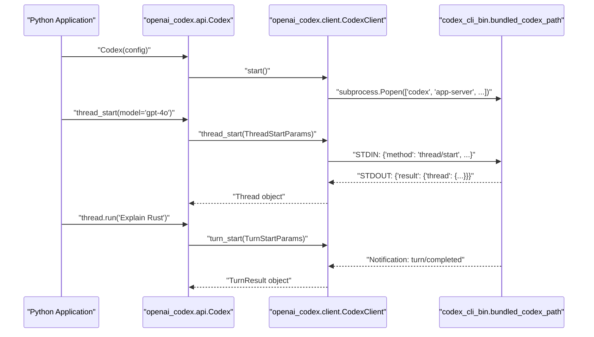
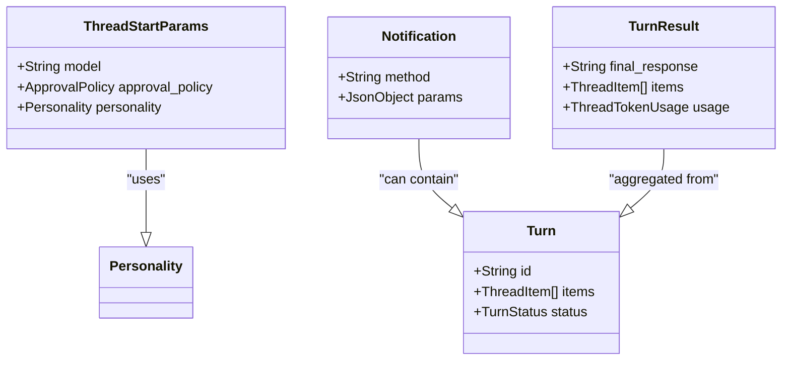

# Python SDK

관련 소스 파일

다음 파일들은 이 위키 페이지를 생성하기 위한 컨텍스트로 사용되었습니다.

- [.github/workflows/python-runtime-build.yml](.github/workflows/python-runtime-build.yml)
- [.github/workflows/python-runtime-release.yml](.github/workflows/python-runtime-release.yml)
- [.github/workflows/python-sdk-release.yml](.github/workflows/python-sdk-release.yml)
- [sdk/python-runtime/README.md](sdk/python-runtime/README.md)
- [sdk/python/README.md](sdk/python/README.md)
- [sdk/python/_runtime_setup.py](sdk/python/_runtime_setup.py)
- [sdk/python/docs/api-reference.md](sdk/python/docs/api-reference.md)
- [sdk/python/docs/faq.md](sdk/python/docs/faq.md)
- [sdk/python/docs/getting-started.md](sdk/python/docs/getting-started.md)
- [sdk/python/examples/README.md](sdk/python/examples/README.md)
- [sdk/python/notebooks/sdk_walkthrough.ipynb](sdk/python/notebooks/sdk_walkthrough.ipynb)
- [sdk/python/pyproject.toml](sdk/python/pyproject.toml)
- [sdk/python/scripts/update_sdk_artifacts.py](sdk/python/scripts/update_sdk_artifacts.py)
- [sdk/python/src/openai_codex/__init__.py](sdk/python/src/openai_codex/__init__.py)
- [sdk/python/src/openai_codex/api.py](sdk/python/src/openai_codex/api.py)
- [sdk/python/src/openai_codex/generated/notification_registry.py](sdk/python/src/openai_codex/generated/notification_registry.py)
- [sdk/python/src/openai_codex/generated/v2_all.py](sdk/python/src/openai_codex/generated/v2_all.py)
- [sdk/python/src/openai_codex/types.py](sdk/python/src/openai_codex/types.py)
- [sdk/python/tests/test_artifact_workflow_and_binaries.py](sdk/python/tests/test_artifact_workflow_and_binaries.py)
- [sdk/python/tests/test_contract_generation.py](sdk/python/tests/test_contract_generation.py)
- [sdk/python/tests/test_public_api_signatures.py](sdk/python/tests/test_public_api_signatures.py)
- [sdk/python/tests/test_real_app_server_integration.py](sdk/python/tests/test_real_app_server_integration.py)
- [sdk/python/uv.lock](sdk/python/uv.lock)

Python SDK(`openai-codex`)는 Codex 에이전트를 Python 애플리케이션에 임베드하기 위한 고수준 타입 안전 인터페이스를 제공합니다. 이 SDK는 Codex CLI와 App Server JSON-RPC v2 프로토콜을 감싸는 래퍼로 동작하며, thread 관리, turn 실행, 구조화된 데이터 교환을 지원합니다.

## 개요

SDK는 개발자가 동기 또는 비동기 클라이언트를 사용해 Codex와 상호작용할 수 있게 합니다. 기본 `codex` 프로세스의 수명 주기를 관리하고, stdio를 통한 JSON-RPC 통신을 처리하며, 프로토콜의 wire format과 타입 안전하게 상호작용하기 위한 Pydantic 모델을 제공합니다 [sdk/python/src/openai_codex/api.py:76-77](), [sdk/python/src/openai_codex/api.py:381](), [sdk/python/README.md:3-5]().

### 주요 구성 요소
*   **Codex Client**: 기본 진입점이며, `Codex`(동기)와 `AsyncCodex`(비동기)로 제공됩니다 [sdk/python/src/openai_codex/api.py:75](), [sdk/python/src/openai_codex/api.py:381]().
*   **Thread**: 지속적인 대화 세션을 나타내며, turn 제출과 상태 조회를 관리합니다 [sdk/python/src/openai_codex/api.py:277]().
*   **TurnHandle**: 활성 turn에 대한 저수준 제어를 제공하며, 스트리밍, steering, interruption을 포함합니다 [sdk/python/src/openai_codex/api.py:381]().
*   **Pydantic Models**: 검증과 IDE 자동 완성을 위해 Rust에 정의된 프로토콜을 반영하며, `v2_all.py`로 생성됩니다 [sdk/python/src/openai_codex/generated/v2_all.py:1-10]().
*   **런타임 패키징**: SDK는 플랫폼별 `codex` 바이너리를 포함하는 `openai-codex-cli-bin` 패키지에 의존합니다 [sdk/python/pyproject.toml:19-19](), [sdk/python/README.md:19-20]().

**출처:** [sdk/python/src/openai_codex/api.py:75-381](), [sdk/python/src/openai_codex/generated/v2_all.py:1-10](), [sdk/python/README.md:3-20](), [sdk/python/pyproject.toml:19-19]()

---

## 아키텍처와 데이터 흐름

Python SDK는 `app-server` 프로토콜을 통해 Codex core와 통신합니다. 백그라운드에서 Codex 프로세스를 생성하고 표준 입출력(stdio)을 사용해 JSON-RPC 메시지를 교환합니다 [sdk/python/src/openai_codex/client.py:137-154](), [sdk/python/src/openai_codex/client.py:162-190]().

### 프로세스 수명 주기와 통신
SDK는 프로세스 관리와 프로토콜 협상을 추상화합니다.

| 구성 요소 | 책임 |
| :--- | :--- |
| `Codex` Client | 생성자에서 프로세스 생성과 `initialize` 핸드셰이크를 관리합니다 [sdk/python/src/openai_codex/api.py:82-86](). |
| `CodexClient` | `subprocess.Popen` 위에서 저수준 JSON-RPC 전송과 메시지 프레이밍을 구현합니다 [sdk/python/src/openai_codex/client.py:137-154](). |
| `Pydantic Models` | `snake_case` 필드를 사용하되 wire format으로는 `camelCase`로 직렬화되는 생성된 wire model입니다 [sdk/python/src/openai_codex/generated/v2_all.py:10-20](). |
| `codex-cli-bin` | 실제 실행 파일(`codex` 또는 `codex.exe`)을 제공합니다 [sdk/python/scripts/update_sdk_artifacts.py:52-53](). |

### SDK-to-Core 상호작용 다이어그램
이 다이어그램은 Python SDK 엔티티가 기본 시스템 프로세스 및 프로토콜 구조에 매핑되는 방식을 보여줍니다.

**SDK to Code Entity Mapping**

**출처:** [sdk/python/src/openai_codex/api.py:75-170](), [sdk/python/src/openai_codex/client.py:137-191](), [sdk/python/scripts/update_sdk_artifacts.py:123-126](), [sdk/python/README.md:22-29]()

---

## 클라이언트와 Thread 관리

### Thread 수명 주기
`Thread`는 새 세션을 시작하거나 `thread_id`를 통해 기존 세션을 재개하여 초기화됩니다.

*   **시작**: `thread_start`는 선택적 `base_instructions`, `model`, `approval_mode`와 함께 새 세션을 생성합니다 [sdk/python/src/openai_codex/api.py:132-170]().
*   **재개**: `thread_resume`은 특정 thread를 다시 로드하며, `cwd` 또는 `model` 재정의를 허용합니다 [sdk/python/src/openai_codex/api.py:201-234]().
*   **포크**: `thread_fork`는 기존 thread 상태에서 새 thread를 생성합니다 [sdk/python/src/openai_codex/api.py:236-267]().
*   **실행**: `run()` 메서드는 turn을 시작하고 모든 이벤트를 `TurnResult`로 수집하는 편의 래퍼입니다 [sdk/python/src/openai_codex/api.py:333-356]().

### 샌드박스와 접근 제어
SDK는 workspace 접근을 제어하기 위해 `Sandbox` enum을 노출합니다 [sdk/python/src/openai_codex/api.py:40](). 이러한 preset은 내부 샌드박스 정책에 매핑됩니다.
*   `Sandbox.read_only`: 파일 읽기로 제한됩니다 [sdk/python/docs/getting-started.md:90]().
*   `Sandbox.workspace_write`: workspace 수정을 위한 표준 접근입니다 [sdk/python/docs/getting-started.md:91-92]().
*   `Sandbox.full_access`: 제한 없는 파일 시스템 접근입니다 [sdk/python/docs/getting-started.md:93-94]().

### 구성과 환경
SDK는 런타임 호출 방식을 정의하기 위해 `CodexConfig`를 사용합니다 [sdk/python/src/openai_codex/client.py:125-135]().

| 매개변수 | 코드 엔티티 / 모델 | 설명 |
| :--- | :--- | :--- |
| `codex_bin` | `CodexConfig.codex_bin` | 특정 codex 바이너리의 경로입니다 [sdk/python/src/openai_codex/client.py:126](). |
| `env` | `CodexConfig.env` | 하위 프로세스의 환경 변수입니다 [sdk/python/src/openai_codex/client.py:130](). |
| `cwd` | `CodexConfig.cwd` | 하위 프로세스의 작업 디렉터리입니다 [sdk/python/src/openai_codex/client.py:129](). |

**출처:** [sdk/python/src/openai_codex/api.py:132-267](), [sdk/python/src/openai_codex/client.py:125-135](), [sdk/python/docs/getting-started.md:88-94]()

---

## 프로토콜과 Wire Models

SDK는 Rust 프로토콜 스키마에서 생성된 Pydantic 모델에 의존합니다. 이 모델들은 Python에서는 `snake_case`를 사용하지만 Pydantic alias를 사용해 wire에서는 `camelCase`로 직렬화됩니다 [sdk/python/src/openai_codex/generated/v2_all.py:10-20]().

### JSON-RPC 메시지 구조
모든 통신은 JSON-RPC 2.0 명세를 따릅니다. `CodexClient`는 `model_dump(by_alias=True)`를 사용해 직렬화를 처리합니다 [sdk/python/src/openai_codex/client.py:68-72]().

**프로토콜 엔티티 매핑**

**출처:** [sdk/python/src/openai_codex/generated/v2_all.py:10-252](), [sdk/python/src/openai_codex/api.py:333-356](), [sdk/python/src/openai_codex/client.py:67-75]()

### 인증 흐름
SDK는 전용 helper를 통해 여러 인증 모드를 지원합니다.
*   **API Key**: `login_api_key(api_key)`는 동기 로그인을 수행합니다 [sdk/python/src/openai_codex/api.py:104-113]().
*   **ChatGPT Browser**: `login_chatgpt()`는 `auth_url`을 포함하는 `ChatgptLoginHandle`을 반환합니다 [sdk/python/src/openai_codex/api.py:115-117]().
*   **Device Code**: `login_chatgpt_device_code()`는 `verification_url`과 `user_code`를 포함하는 `DeviceCodeLoginHandle`을 반환합니다 [sdk/python/src/openai_codex/api.py:119-121]().

**출처:** [sdk/python/src/openai_codex/api.py:104-121](), [sdk/python/README.md:31-59]()

---

## 런타임 패키징

SDK repo에는 `codex` 바이너리를 `openai-codex-cli-bin`이라는 별도 Python 패키지로 패키징하기 위한 스크립트가 포함되어 있습니다 [sdk/python/scripts/update_sdk_artifacts.py:21-22]().

*   **플랫폼 Wheels**: 런타임은 대상 아키텍처용 바이너리를 담은 플랫폼별 wheel(예: `manylinux_2_17_x86_64`, `win_amd64`)로 게시됩니다 [.github/workflows/python-sdk-release.yml:117-122]().
*   **바이너리 해석**: SDK는 `bundled_codex_path()`를 찾기 위해 `codex_cli_bin` import를 시도합니다 [sdk/python/scripts/update_sdk_artifacts.py:117-126]().
*   **버전 고정**: SDK `pyproject.toml`은 호환되는 `openai-codex-cli-bin` 버전을 엄격히 고정합니다 [sdk/python/pyproject.toml:19-19]().
*   **유지보수 스크립트**: `update_sdk_artifacts.py` 스크립트는 스키마에서 타입 생성, `pyproject.toml`의 버전 고정, 런타임 바이너리 해석을 오케스트레이션합니다 [sdk/python/scripts/update_sdk_artifacts.py:79-126]().
*   **CI 릴리스**: 릴리스 워크플로는 SDK 자체가 빌드되기 전에 바이너리를 스테이징하고 PyPI에 게시하여 wheel 빌드를 자동화합니다 [.github/workflows/python-sdk-release.yml:76-100]().

**출처:** [sdk/python/scripts/update_sdk_artifacts.py:21-126](), [sdk/python/pyproject.toml:19-19](), [.github/workflows/python-sdk-release.yml:76-122]()
