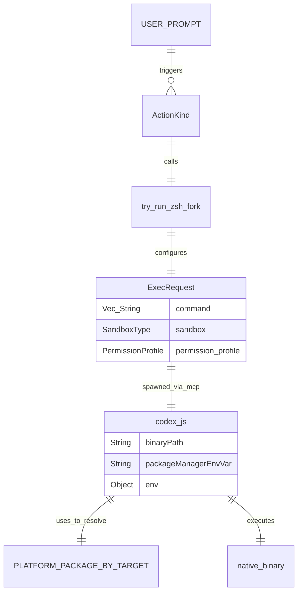

# Shell Tool MCP Package

<details>
<summary>관련 소스 파일</summary>

다음 파일들은 이 위키 페이지를 생성하기 위한 컨텍스트로 사용되었습니다.

- [.github/actions/linux-code-sign/action.yml](.github/actions/linux-code-sign/action.yml)
- [.github/actions/windows-code-sign/action.yml](.github/actions/windows-code-sign/action.yml)
- [.github/scripts/archive-release-symbols-and-strip-binaries.sh](.github/scripts/archive-release-symbols-and-strip-binaries.sh)
- [.github/workflows/ci.yml](.github/workflows/ci.yml)
- [.github/workflows/rust-ci-full.yml](.github/workflows/rust-ci-full.yml)
- [.github/workflows/rust-ci.yml](.github/workflows/rust-ci.yml)
- [.github/workflows/rust-release-argument-comment-lint.yml](.github/workflows/rust-release-argument-comment-lint.yml)
- [.github/workflows/rust-release-windows.yml](.github/workflows/rust-release-windows.yml)
- [.github/workflows/rust-release.yml](.github/workflows/rust-release.yml)
- [.github/workflows/sdk.yml](.github/workflows/sdk.yml)
- [codex-cli/.gitignore](codex-cli/.gitignore)
- [codex-cli/bin/codex.js](codex-cli/bin/codex.js)
- [codex-cli/scripts/README.md](codex-cli/scripts/README.md)
- [codex-cli/scripts/build_npm_package.py](codex-cli/scripts/build_npm_package.py)
- [codex-rs/core/src/exec_policy.rs](codex-rs/core/src/exec_policy.rs)
- [codex-rs/core/src/exec_policy_tests.rs](codex-rs/core/src/exec_policy_tests.rs)
- [codex-rs/core/src/exec_policy_windows_tests.rs](codex-rs/core/src/exec_policy_windows_tests.rs)
- [codex-rs/core/src/tools/runtimes/shell/unix_escalation.rs](codex-rs/core/src/tools/runtimes/shell/unix_escalation.rs)
- [codex-rs/core/src/tools/runtimes/shell/unix_escalation_tests.rs](codex-rs/core/src/tools/runtimes/shell/unix_escalation_tests.rs)
- [codex-rs/core/tests/common/zsh_fork.rs](codex-rs/core/tests/common/zsh_fork.rs)
- [codex-rs/core/tests/suite/approvals.rs](codex-rs/core/tests/suite/approvals.rs)
- [codex-rs/core/tests/suite/exec_policy.rs](codex-rs/core/tests/suite/exec_policy.rs)
- [codex-rs/core/tests/suite/skill_approval.rs](codex-rs/core/tests/suite/skill_approval.rs)
- [codex-rs/core/tests/suite/unified_exec_zsh_fork_approvals.rs](codex-rs/core/tests/suite/unified_exec_zsh_fork_approvals.rs)
- [scripts/stage_npm_packages.py](scripts/stage_npm_packages.py)

</details>


`@openai/codex-shell-tool-mcp` 패키지는 Codex에 고충실도 터미널 접근을 제공하도록 설계된 특수 Model Context Protocol(MCP) 서버입니다. 표준 셸 실행 도구와 달리, 이 패키지는 일반적인 셸(Bash 및 Zsh)의 패치된 버전을 사용해 Codex 샌드박스 및 보안 정책 엔진과 깊게 통합됩니다.

## 개요와 목적

Shell Tool MCP 패키지의 주된 목표는 엄격한 안전 경계와 상태 인식을 유지하면서 AI 에이전트가 로컬 터미널 환경과 상호작용할 수 있게 하는 것입니다. 이 패키지는 여러 고급 기능을 구현합니다.

*   **패치된 바이너리**: 명령 가로채기와 정책 적용을 위한 `EXEC_WRAPPER`를 지원하는 사용자 지정 컴파일 Bash 및 Zsh 바이너리입니다.
*   **샌드박스 동기화**: MCP 프로토콜을 통해 샌드박스 상태 업데이트를 수신하고 적용하여 셸 프로세스가 `SandboxMode`와 플랫폼별 샌드박스 수준을 준수하도록 보장하는 기능입니다.
*   **규칙 적용**: `codex-execpolicy` 통합을 통해 workspace 규칙을 적용하여 셸 동작을 제한합니다 [codex-rs/core/src/exec_policy.rs:49-51]().
*   **통합 실행**: 장시간 실행되는 셸 프로세스와 signal 관리를 처리하기 위해 `UnifiedExecProcessManager`와 통합됩니다.

이러한 네이티브 기능의 배포는 통합 진입점 역할을 하는 `@openai/codex` npm 패키지를 통해 처리되며, 호스트의 `targetTriple`을 기반으로 올바른 플랫폼별 바이너리를 동적으로 해석합니다 [codex-cli/bin/codex.js:15-22]().

출처: [codex-cli/bin/codex.js:15-22](), [codex-rs/core/src/exec_policy.rs:49-51]()

## 패치된 셸 구현

이 패키지는 에이전트가 실행하는 모든 명령이 내장 도구와 동일한 보안 제약을 받도록 패치된 셸 환경을 활용합니다.

### EXEC_WRAPPER와 권한 상승
셸 통합은 명령 실행을 래퍼로 라우팅하기 위해 셸 소스 코드에 적용된 패치를 사용합니다. `codex-rs` core에서는 `PreparedUnifiedExecZshFork` 백엔드가 이를 지원합니다 [codex-rs/core/src/tools/runtimes/shell/unix_escalation.rs:75-78](). 패치된 셸이 실행을 시도하면, 현재 정책에서 명령이 허용되는지 판단하기 위해 escalation server [codex-rs/core/src/tools/runtimes/shell/unix_escalation.rs:54-59]()와 상호작용합니다.

`try_run_zsh_fork` 함수는 샌드박스 명령을 구성하고 capture policy가 `ExecCapturePolicy::ShellTool`인 `ExecOptions`를 설정하여 이를 오케스트레이션합니다 [codex-rs/core/src/tools/runtimes/shell/unix_escalation.rs:134-137]().

### 셸 감지와 선택
시스템은 환경에 적합한 셸을 동적으로 감지합니다. npm 래퍼는 올바른 네이티브 payload를 선택하기 위해 플랫폼과 아키텍처를 식별합니다 [codex-cli/bin/codex.js:26-67]().

| 구성 요소 | 역할 | 출처 |
| :--- | :--- | :--- |
| `codex-cli/bin/codex.js` | 네이티브 바이너리를 생성하는 Node.js 진입점 | [codex-cli/bin/codex.js:150-153]() |
| `PLATFORM_PACKAGE_BY_TARGET` | OS/Arch를 특수 npm 패키지에 매핑 | [codex-cli/bin/codex.js:15-22]() |
| `findCodexExecutable` | 실행을 위한 바이너리와 경로 디렉터리를 찾음 | [codex-cli/bin/codex.js:78-105]() |

출처: [codex-cli/bin/codex.js:15-153](), [codex-rs/core/src/tools/runtimes/shell/unix_escalation.rs:54-137]()

## 빌드와 배포

이 패키지는 Codex monorepo의 일부로 관리되며, 지원되는 모든 플랫폼에서 패치된 바이너리를 사용할 수 있도록 엄격한 빌드 및 staging 프로세스를 따릅니다.

### 컴파일과 패키징
네이티브 구성 요소는 Linux, macOS, Windows를 포함한 여러 OS variant를 지원하도록 컴파일됩니다.
*   **Target Triples**: 지원되는 target에는 `x86_64-unknown-linux-musl`, `aarch64-apple-darwin`, `x86_64-pc-windows-msvc`가 포함됩니다 [codex-cli/bin/codex.js:16-21]().
*   **Staging Logic**: `scripts/stage_npm_packages.py` 스크립트는 npm 패키지 레이아웃을 위한 출력 디렉터리에 네이티브 바이너리를 stage합니다 [scripts/stage_npm_packages.py:58-62]().
*   **Release Pipeline**: `rust-release.yml` 워크플로는 macOS signing [ .github/workflows/rust-release.yml:79-102]()과 Windows 바이너리 빌드 [ .github/workflows/rust-release-windows.yml:27-68]()를 포함해 이러한 artifacts 생성을 자동화합니다.

### 배포 전략
Codex는 기본 `@openai/codex` 패키지가 선택적 플랫폼별 패키지(예: `@openai/codex-linux-x64`)를 해석하는 "thin wrapper" 패턴을 사용합니다 [codex-cli/bin/codex.js:16-21](). 이 방식은 사용자 시스템과 관련된 바이너리만 가져오므로 다운로드 크기를 최소화합니다.

출처: [codex-cli/bin/codex.js:15-22](), [scripts/stage_npm_packages.py:58-62](), [.github/workflows/rust-release.yml:79-102](), [.github/workflows/rust-release-windows.yml:27-68]()

## MCP 통합과 데이터 흐름

이 패키지는 Codex core와 통신하는 MCP 서버로 동작합니다. 래퍼 스크립트는 Node.js 부모 프로세스가 종료될 때 네이티브 셸 프로세스가 정상적으로 종료되도록 signal forwarding(`SIGINT`, `SIGTERM`, `SIGHUP`)이 올바르게 처리되게 합니다 [codex-cli/bin/codex.js:179-181]().

### 데이터 흐름 다이어그램: 셸 실행
이 다이어그램은 셸 명령에 대한 자연어 요청이 시스템을 거쳐 패치된 바이너리로 흐르는 방식을 보여줍니다.

```mermaid
graph TD
    "User_Prompt" -- "Natural Language" --> "Codex_Core"
    "Codex_Core" -- "ToolCall" --> "Mcp_Connection_Manager"
    "Mcp_Connection_Manager" -- "Spawn" --> "Node_Wrapper (codex.js)"
    
    subgraph "NPM_Package_Logic"
        "Node_Wrapper (codex.js)" -- "findCodexExecutable" --> "Native_Binary_Path"
        "Native_Binary_Path" -- "spawn" --> "Patched_Shell (Bash/Zsh)"
    end
    
    subgraph "Patched_Shell_Logic"
        "Patched_Shell (Bash/Zsh)" -- "execve_intercept" --> "EXEC_WRAPPER"
        "EXEC_WRAPPER" -- "EscalateServer" --> "EscalationDecision"
        "EscalationDecision" -- "Allow/Deny" --> "Patched_Shell (Bash/Zsh)"
    end
    
    "Patched_Shell (Bash/Zsh)" -- "StreamOutput" --> "Codex_Core"
```

출처: [codex-cli/bin/codex.js:78-181](), [codex-rs/core/src/tools/runtimes/shell/unix_escalation.rs:54-64]()

## 보안과 샌드박싱

셸 도구의 무결성을 보장하기 위해 모든 실행은 Codex 샌드박싱 엔진의 관리를 받습니다.

*   **규칙 적용**: `ExecPolicy`는 prefix rules와 heuristics를 기준으로 명령을 평가합니다 [codex-rs/core/src/exec_policy.rs:161-166]().
*   **경로 주입**: `prepend_zsh_fork_bin_to_path` 함수는 실행 중 패치된 바이너리가 우선되도록 보장합니다 [codex-rs/core/src/tools/runtimes/shell/unix_escalation.rs:131]().
*   **환경 격리**: 래퍼는 환경을 정리하고 확장하며, 네이티브 바이너리가 리소스를 찾을 수 있도록 `CODEX_MANAGED_PACKAGE_ROOT`를 설정하는 것도 포함합니다 [codex-cli/bin/codex.js:147]().
*   **승인 거부**: `rules` 또는 `sandbox_approval`에 대한 세분화된 설정이 비활성화된 경우 정책은 프롬프트를 거부할 수 있습니다 [codex-rs/core/src/exec_policy.rs:183-196]().

### 엔티티 관계 다이어그램: 명령 실행
이 다이어그램은 자연어 의도를 셸 실행을 담당하는 코드 엔티티와 연결합니다.



출처: [codex-cli/bin/codex.js:15-153](), [codex-rs/core/src/tools/runtimes/shell/unix_escalation.rs:102-163](), [codex-rs/core/tests/suite/approvals.rs:94-130]()

## 개발과 테스트

빌드 시스템에는 게시 전 npm 패키지를 stage하고 검증하기 위한 스크립트가 포함되어 있습니다.

*   **CI 검증**: `rust-ci.yml` 워크플로는 `codex-rs` workspace의 변경 사항을 감지하고 일반 formatting 및 linting 검사를 실행하는 단계를 포함합니다 [ .github/workflows/rust-ci.yml:12-59]().
*   **전체 CI 검사**: `rust-ci-full.yml` 워크플로는 Linux, macOS, Windows 전반의 빌드를 실행하여 바이너리 호환성과 `argument-comment-lint`를 통한 linting을 보장합니다 [ .github/workflows/rust-ci-full.yml:97-154]().
*   **Staging 검증**: `ci.yml` 워크플로에는 검증을 위해 `scripts/stage_npm_packages.py`를 사용해 npm 패키지를 stage하는 단계가 포함되어 있습니다 [ .github/workflows/ci.yml:45-62]().

출처: [ .github/workflows/rust-ci.yml:12-59](), [ .github/workflows/rust-ci-full.yml:97-154](), [ .github/workflows/ci.yml:45-62]()
