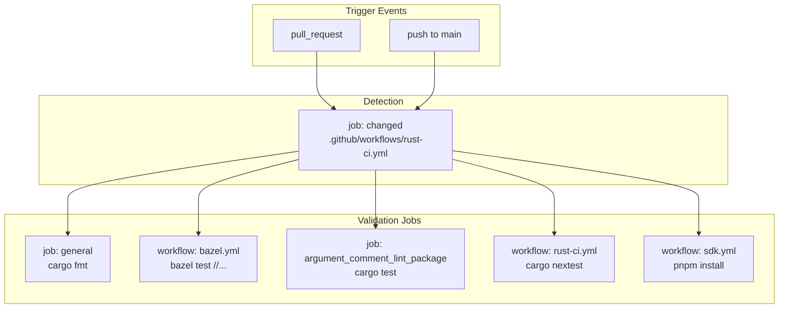
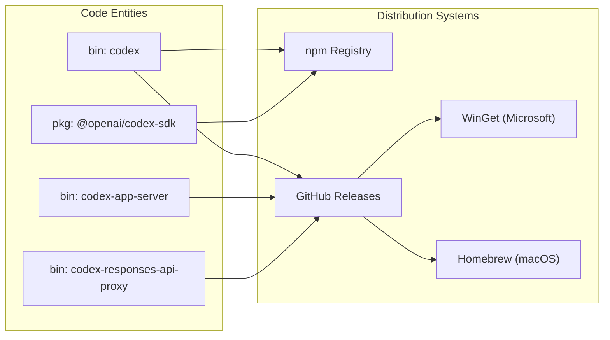

# 빌드와 배포

관련 소스 파일

다음 파일들은 이 위키 페이지를 생성하기 위한 컨텍스트로 사용되었습니다.

- [.bazelrc](.bazelrc)
- [.github/actions/linux-code-sign/action.yml](.github/actions/linux-code-sign/action.yml)
- [.github/actions/windows-code-sign/action.yml](.github/actions/windows-code-sign/action.yml)
- [.github/scripts/archive-release-symbols-and-strip-binaries.sh](.github/scripts/archive-release-symbols-and-strip-binaries.sh)
- [.github/scripts/run-bazel-ci.sh](.github/scripts/run-bazel-ci.sh)
- [.github/scripts/run-bazel-query-ci.sh](.github/scripts/run-bazel-query-ci.sh)
- [.github/scripts/run_bazel_with_buildbuddy.py](.github/scripts/run_bazel_with_buildbuddy.py)
- [.github/scripts/rusty_v8_bazel.py](.github/scripts/rusty_v8_bazel.py)
- [.github/scripts/test_run_bazel_with_buildbuddy.py](.github/scripts/test_run_bazel_with_buildbuddy.py)
- [.github/scripts/test_rusty_v8_bazel.py](.github/scripts/test_rusty_v8_bazel.py)
- [.github/workflows/bazel.yml](.github/workflows/bazel.yml)
- [.github/workflows/ci.yml](.github/workflows/ci.yml)
- [.github/workflows/rust-ci-full.yml](.github/workflows/rust-ci-full.yml)
- [.github/workflows/rust-ci.yml](.github/workflows/rust-ci.yml)
- [.github/workflows/rust-release-argument-comment-lint.yml](.github/workflows/rust-release-argument-comment-lint.yml)
- [.github/workflows/rust-release-windows.yml](.github/workflows/rust-release-windows.yml)
- [.github/workflows/rust-release.yml](.github/workflows/rust-release.yml)
- [.github/workflows/rusty-v8-release.yml](.github/workflows/rusty-v8-release.yml)
- [.github/workflows/sdk.yml](.github/workflows/sdk.yml)
- [.github/workflows/v8-canary.yml](.github/workflows/v8-canary.yml)
- [AGENTS.md](AGENTS.md)
- [codex-cli/.gitignore](codex-cli/.gitignore)
- [codex-cli/bin/codex.js](codex-cli/bin/codex.js)
- [codex-cli/scripts/README.md](codex-cli/scripts/README.md)
- [codex-cli/scripts/build_npm_package.py](codex-cli/scripts/build_npm_package.py)
- [codex-rs/docs/bazel.md](codex-rs/docs/bazel.md)
- [docs/authentication.md](docs/authentication.md)
- [docs/contributing.md](docs/contributing.md)
- [docs/install.md](docs/install.md)
- [justfile](justfile)
- [scripts/list-bazel-clippy-targets.sh](scripts/list-bazel-clippy-targets.sh)
- [scripts/stage_npm_packages.py](scripts/stage_npm_packages.py)

이 문서는 Codex의 빌드 시스템, CI/CD 파이프라인, 배포 인프라를 설명합니다. Cargo workspace 구조, Bazel 빌드 구성, 플랫폼 빌드 매트릭스, 코드 서명 절차, artifact 패키징, 배포 채널(npm, Homebrew, WinGet, GitHub Releases)을 다룹니다.

개발 환경 설정과 로컬 도구에 대한 정보는 [Development Setup](#9.1)을 참조하세요. workspace 구성과 crate 관계에 대해서는 [Repository Structure](#1.2)를 참조하세요.

---

## 개요

Codex 빌드 및 배포 시스템은 계층화된 파이프라인을 통해 여러 실행 모드와 플랫폼을 지원합니다.

1.  **CI 파이프라인**(`rust-ci.yml`, `bazel.yml`): 모든 pull request와 `main` push에서 실행되며, Cargo와 Bazel을 모두 사용해 지원되는 모든 플랫폼에서 lint/test 검사를 수행합니다.
2.  **릴리스 파이프라인**(`rust-release.yml`, `rust-release-windows.yml`): `rust-v*.*.*`와 일치하는 git tag로 트리거되며, 플랫폼별 코드 서명과 thin LTO 최적화를 적용한 릴리스 바이너리를 빌드합니다.
3.  **Shell Tool MCP 파이프라인**: `@openai/codex-shell-tool-mcp` 패키지를 위해 여러 OS/distribution variant에서 패치된 Bash 및 Zsh 셸을 빌드합니다.
4.  **배포 채널**: npm(default 및 alpha tag), Homebrew cask(macOS), WinGet(Windows), GitHub Releases로 게시합니다.

**빌드 대상**: 릴리스 파이프라인은 다음을 포함한 platform triple용으로 빌드합니다.
*   **macOS**: `aarch64-apple-darwin`, `x86_64-apple-darwin` [[.github/workflows/rust-release.yml:79-102]()]
*   **Linux**: `x86_64-unknown-linux-musl`, `aarch64-unknown-linux-musl` [[.github/workflows/rust-release.yml:104-127]()]
*   **Windows**: `x86_64-pc-windows-msvc`, `aarch64-pc-windows-msvc` [[.github/workflows/rust-release-windows.yml:27-68]()]

**출처**: [[.github/workflows/rust-release.yml:11-128]()], [[.github/workflows/rust-ci.yml:1-10]()], [[.github/workflows/bazel.yml:20-53]()]

---

## Cargo Workspace와 Bazel 구조

Codex는 하이브리드 빌드 접근 방식을 사용합니다. Cargo가 기본 개발자 인터페이스인 반면, Bazel은 hermetic build, BuildBuddy를 통한 remote caching, cross-compilation toolchain을 제공합니다. 자세한 내용은 [Cargo Workspace Structure](#8.1)를 참조하세요.

| 구성 요소 | 빌드 도구 | 주요 출력 / 대상 |
| :--- | :--- | :--- |
| `codex` | Cargo / Bazel | `//codex-rs/cli:codex` [[justfile:103-104]()] |
| `codex-app-server` | Cargo / Bazel | `codex-app-server` [[.github/workflows/rust-release.yml:89]()] |
| `argument-comment-lint` | Dylint / Bazel | `tools/argument-comment-lint` [[.github/workflows/rust-ci.yml:106-107]()] |
| `sdk/typescript` | pnpm | `@openai/codex-sdk` [[.github/workflows/sdk.yml:147-148]()] |

**Toolchain 관리**: workspace는 Rust toolchain 버전을 `1.95.0`으로 고정하고 [[.github/workflows/rust-ci.yml:75]()] 작업 자동화에 `just`를 사용합니다 [[justfile:1-12]()] .

**Bazel 통합**: Bazel은 빌드 속도를 높이기 위해 `disk_cache`와 `repository_cache`를 사용합니다 [[.bazelrc:6-8]()]. Linux와 Windows에 대해 플랫폼별 host 설정을 구성합니다 [[.bazelrc:18-19]()]. Windows 바이너리는 큰 async test future에서 stack overflow를 방지하기 위해 특정 `RUST_MIN_STACK`(8 MiB)으로 구성됩니다 [[.bazelrc:38]()] 및 [[justfile:7]()] .

**출처**: [[.bazelrc:1-100]()], [[justfile:1-180]()], [[.github/workflows/rust-ci.yml:70-80]()]

---

## CI 파이프라인

CI 파이프라인은 모든 변경에 대해 코드 품질과 정확성을 검증합니다. 자세한 내용은 [CI Pipeline](#8.2)를 참조하세요.

### 워크플로 트리거와 감지
`rust-ci.yml` 워크플로는 `changed` job을 사용해 path 변경을 분석하며, 문서나 관련 없는 도구만 수정된 경우 비용이 큰 빌드 단계를 건너뜁니다. `codex-rs/*`, `.github/*`, `tools/argument-comment-lint/*`의 변경을 감지합니다 [[.github/workflows/rust-ci.yml:13-60]()] .

### 빌드와 테스트 매트릭스
CI는 Linux, macOS, Windows 전반에 걸쳐 포괄적인 매트릭스를 실행합니다.
*   **Cargo Native**: `cargo fmt` [[.github/workflows/rust-ci.yml:82]()]와 사용하지 않는 의존성을 찾기 위한 `cargo shear` [[.github/workflows/rust-ci.yml:104]()]를 실행합니다.
*   **Bazel**: remote caching [[.github/workflows/bazel.yml:87-121]()] 및 BuildBuddy 통합 [[.bazelrc:53-73]()]과 함께 `bazel test //...`를 실행합니다.
*   **Linting**: 함수 인수에 대한 문서화 표준을 강제하기 위해 Dylint를 사용하는 사용자 지정 `argument-comment-lint`를 실행합니다 [[.github/workflows/rust-ci.yml:106-156]()] .

**출처**: [[.github/workflows/rust-ci.yml:13-160]()], [[.github/workflows/bazel.yml:87-121]()], [[.bazelrc:53-140]()]

### CI 워크플로 다이어그램

**출처**: [[.github/workflows/rust-ci.yml:1-160]()], [[.github/workflows/bazel.yml:1-150]()], [[.github/workflows/sdk.yml:1-164]()]

---

## 릴리스 파이프라인

릴리스 파이프라인은 production-ready artifact 생성을 자동화합니다. 자세한 내용은 [Release Pipeline](#8.3)을 참조하세요.

### 태그 기반 워크플로
릴리스는 `rust-v*.*.*`와 일치하는 tag가 push될 때 트리거됩니다 [[.github/workflows/rust-release.yml:12-15]()]. `tag-check` job은 tag가 `codex-rs/Cargo.toml`의 버전과 일치하는지 검증합니다 [[.github/workflows/rust-release.yml:22-52]()] .

### 코드 서명과 Notarization
*   **macOS**: 빌드 매트릭스에는 macOS target용 `build_dmg` flag가 포함됩니다 [[.github/workflows/rust-release.yml:84-96]()] .
*   **Windows**: `codex.exe`와 `codex-windows-sandbox-setup`, `codex-command-runner` 같은 helper binary에 Azure Trusted Signing을 사용합니다 [[.github/workflows/rust-release-windows.yml:150-161]()] .
*   **Linux**: 릴리스 artifact는 distribution 간 최대 이식성을 위해 MUSL-linked Linux 바이너리를 제공합니다 [[.github/workflows/rust-release.yml:103-127]()] .

**출처**: [[.github/workflows/rust-release.yml:1-200]()], [[.github/workflows/rust-release-windows.yml:1-180]()]

---

## 배포 채널

Codex는 다양한 사용자 워크플로를 지원하기 위해 여러 채널로 배포됩니다. 자세한 내용은 [Distribution Channels](#8.4)를 참조하세요.

*   **npm Registry**: `@openai/codex` 패키지입니다. `scripts/stage_npm_packages.py`를 사용해 네이티브 바이너리를 npm 패키지 레이아웃으로 번들링합니다 [[.github/workflows/ci.yml:58-62]()]. `codex-cli/bin/codex.js` 진입점은 `PLATFORM_PACKAGE_BY_TARGET` map을 기반으로 올바른 네이티브 바이너리를 동적으로 해석합니다 [[codex-cli/bin/codex.js:15-22]()] .
*   **GitHub Releases**: 모든 matrix target에 걸친 `codex`, `codex-app-server` 같은 바이너리의 기본 소스입니다 [[.github/workflows/rust-release.yml:83-126]()] .
*   **Homebrew/WinGet**: GitHub Release artifact를 가리키는 표준 package manifest를 통해 지원됩니다.

### 배포 매핑

**출처**: [[.github/workflows/ci.yml:45-70]()], [[codex-cli/bin/codex.js:15-120]()], [[.github/workflows/rust-release.yml:83-126]()]

---

## Shell Tool MCP 빌드 시스템

Codex에는 패치된 Bash 및 Zsh 버전을 위한 특수 빌드 시스템이 포함되어 있습니다. 자세한 내용은 [Shell Tool MCP Build System](#8.5)을 참조하세요.

빌드 프로세스는 `EXEC_WRAPPER` 샌드박스 요구 사항과의 호환성을 보장하기 위해 여러 OS variant 전반에서 셸을 컴파일하는 과정을 포함합니다. 이는 배포용 `@openai/codex-shell-tool-mcp` 패키지를 준비하는 `shell-tool-mcp` 워크플로의 일부로 관리됩니다.

**출처**: [[.github/workflows/rust-ci.yml:1-60]()] (범위는 repository 구조와 `shell-tool-mcp` 배포 패키지 참조를 바탕으로 파악됨).
