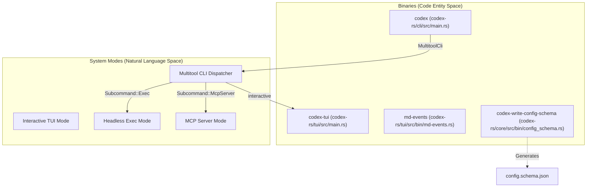
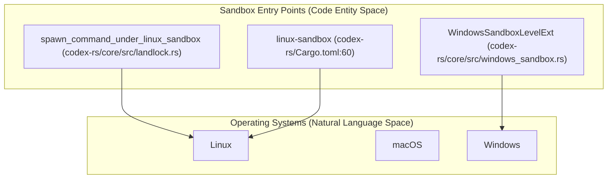
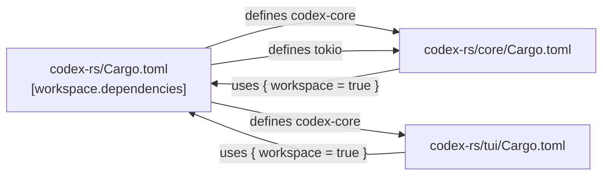

# Cargo Workspace 구조

관련 소스 파일

다음 파일들은 이 위키 페이지를 생성하기 위한 컨텍스트로 사용되었습니다.

- [.bazelrc](.bazelrc)
- [.github/scripts/run-bazel-ci.sh](.github/scripts/run-bazel-ci.sh)
- [.github/scripts/run-bazel-query-ci.sh](.github/scripts/run-bazel-query-ci.sh)
- [.github/scripts/run_bazel_with_buildbuddy.py](.github/scripts/run_bazel_with_buildbuddy.py)
- [.github/scripts/rusty_v8_bazel.py](.github/scripts/rusty_v8_bazel.py)
- [.github/scripts/test_run_bazel_with_buildbuddy.py](.github/scripts/test_run_bazel_with_buildbuddy.py)
- [.github/scripts/test_rusty_v8_bazel.py](.github/scripts/test_rusty_v8_bazel.py)
- [.github/workflows/bazel.yml](.github/workflows/bazel.yml)
- [.github/workflows/rusty-v8-release.yml](.github/workflows/rusty-v8-release.yml)
- [.github/workflows/v8-canary.yml](.github/workflows/v8-canary.yml)
- [AGENTS.md](AGENTS.md)
- [codex-rs/Cargo.lock](codex-rs/Cargo.lock)
- [codex-rs/Cargo.toml](codex-rs/Cargo.toml)
- [codex-rs/cli/Cargo.toml](codex-rs/cli/Cargo.toml)
- [codex-rs/cli/src/lib.rs](codex-rs/cli/src/lib.rs)
- [codex-rs/cli/src/main.rs](codex-rs/cli/src/main.rs)
- [codex-rs/core/Cargo.toml](codex-rs/core/Cargo.toml)
- [codex-rs/core/src/lib.rs](codex-rs/core/src/lib.rs)
- [codex-rs/docs/bazel.md](codex-rs/docs/bazel.md)
- [codex-rs/exec/Cargo.toml](codex-rs/exec/Cargo.toml)
- [codex-rs/exec/src/cli.rs](codex-rs/exec/src/cli.rs)
- [codex-rs/exec/src/event_processor.rs](codex-rs/exec/src/event_processor.rs)
- [codex-rs/exec/src/lib.rs](codex-rs/exec/src/lib.rs)
- [codex-rs/tui/Cargo.toml](codex-rs/tui/Cargo.toml)
- [codex-rs/tui/src/cli.rs](codex-rs/tui/src/cli.rs)
- [codex-rs/tui/src/lib.rs](codex-rs/tui/src/lib.rs)
- [docs/authentication.md](docs/authentication.md)
- [docs/contributing.md](docs/contributing.md)
- [docs/install.md](docs/install.md)
- [justfile](justfile)
- [scripts/list-bazel-clippy-targets.sh](scripts/list-bazel-clippy-targets.sh)

이 페이지는 `codex-rs/`에 위치한 Rust Cargo workspace의 레이아웃을 다루며, crate 멤버십, 공유 의존성 관리, Bazel 같은 특수 빌드 도구 통합을 포함합니다.

---

## Workspace 루트

workspace는 `codex-rs/Cargo.toml` [codex-rs/Cargo.toml:1-121]()에 정의되어 있습니다. feature resolution에는 Cargo의 `resolver = "2"` [codex-rs/Cargo.toml:122-122]()를 사용하고, 멤버 crate가 상속하는 공유 `[workspace.package]` 블록 [codex-rs/Cargo.toml:124-132]()을 설정합니다. 이 중앙 집중식 구성은 120개가 넘는 모든 crate에서 Rust edition과 license가 일관되게 유지되도록 보장합니다.

| 필드 | 값 |
|---|---|
| `resolver` | `"2"` [codex-rs/Cargo.toml:122-122]() |
| `version` | `"0.0.0"`(모든 crate가 동일한 개발 중 버전을 공유) [codex-rs/Cargo.toml:125-125]() |
| `edition` | `"2024"` [codex-rs/Cargo.toml:130-130]() |
| `license` | `"Apache-2.0"` [codex-rs/Cargo.toml:131-131]() |

출처: [codex-rs/Cargo.toml:1-132]()

---

## Crate 멤버십

workspace에는 120개가 넘는 멤버 crate가 포함되어 있습니다 [codex-rs/Cargo.toml:2-121](). 이들은 core agent 로직부터 플랫폼별 유틸리티까지 여러 기능 그룹으로 구성됩니다.

### 주요 Crate

**Core Logic and Engine**

| Workspace 내 경로 | Crate 이름 | 역할 |
|---|---|---|
| `core` | `codex-core` | 중앙 agent engine, thread 관리, session 로직 [codex-rs/core/src/lib.rs:1-198]() |
| `protocol` | `codex-protocol` | 공유 Op/Event protocol 타입 [codex-rs/Cargo.toml:72-72]() |
| `config` | `codex-config` | 구성 로드와 검증 [codex-rs/Cargo.toml:31-31]() |
| `rollout` | `codex-rollout` | Session 지속성과 event replay [codex-rs/core/src/lib.rs:147-170]() |
| `models-manager` | `codex-models-manager` | Model discovery와 info resolution [codex-rs/Cargo.toml:68-68]() |

**User Interfaces**

| Workspace 내 경로 | Crate 이름 | 역할 |
|---|---|---|
| `cli` | `codex-cli` | 기본 `codex` multitool binary [codex-rs/cli/src/main.rs:103-118]() |
| `tui` | `codex-tui` | 대화형 Terminal User Interface [codex-rs/tui/src/lib.rs:1-215]() |
| `exec` | `codex-exec` | 자동화를 위한 headless execution mode [codex-rs/exec/src/lib.rs:1-158]() |
| `app-server` | `codex-app-server` | IDE 통합을 위한 JSON-RPC 서버 [codex-rs/Cargo.toml:11-11]() |

**Tooling and Infrastructure**

| Workspace 내 경로 | Crate 이름 | 역할 |
|---|---|---|
| `codex-mcp` | `codex-mcp` | Model Context Protocol(MCP) client 로직 [codex-rs/Cargo.toml:63-63]() |
| `mcp-server` | `codex-mcp-server` | Codex를 MCP 서버로 구현 [codex-rs/Cargo.toml:64-64]() |
| `sandboxing` | `codex-sandboxing` | Cross-platform sandbox 추상화 [codex-rs/Cargo.toml:80-80]() |
| `shell-command` | `codex-shell-command` | Shell execution backend [codex-rs/Cargo.toml:33-33]() |
| `otel` | `codex-otel` | OpenTelemetry 통합 [codex-rs/Cargo.toml:82-82]() |

출처: [codex-rs/Cargo.toml:2-121](), [codex-rs/core/src/lib.rs:1-198](), [codex-rs/cli/src/main.rs:103-209](), [codex-rs/tui/src/lib.rs:1-215](), [codex-rs/exec/src/lib.rs:1-173]()

---

## 시스템 아키텍처: 코드 엔티티 매핑

다음 다이어그램은 고수준 시스템 구성 요소를 구현 crate 및 진입점에 연결합니다.

**Crate-to-Binary Mapping**

**Sandbox Dispatch Mapping**

출처: [codex-rs/cli/src/main.rs:91-209](), [codex-rs/tui/Cargo.toml:8-15](), [codex-rs/core/Cargo.toml:11-14](), [codex-rs/core/src/lib.rs:47-48](), [codex-rs/core/src/lib.rs:103-103]()

---

## 의존성 관리

workspace는 의존성에 대해 "single source of truth"를 사용합니다. 모든 공유 외부 및 내부 의존성은 루트 `Cargo.toml` [codex-rs/Cargo.toml:133-220]()에 정의되고 멤버 crate가 이를 상속합니다.

**Dependency Flow**

내부 의존성은 루트 manifest에서 상대 경로로 매핑됩니다.
- `codex-core = { path = "core" }` [codex-rs/Cargo.toml:163-163]()
- `codex-protocol = { path = "protocol" }` [codex-rs/Cargo.toml:205-205]()

멤버 crate는 `workspace = true` 구문을 사용해 이를 참조합니다.
- `codex-core = { workspace = true }` [codex-rs/core/Cargo.toml:4-4]()
- `codex-protocol = { workspace = true }` [codex-rs/core/Cargo.toml:56-56]()

출처: [codex-rs/Cargo.toml:133-220](), [codex-rs/core/Cargo.toml:1-120]()

---

## 공유 도구와 다중 빌드 시스템

### Bazel 통합
Cargo 외에도 이 프로젝트는 hermetic build, cross-compilation, 고급 linting을 위해 Bazel을 사용합니다.

- **MODULE.bazel**: 외부 의존성 그래프와 build target을 정의합니다.
- **CI/CD Pipelines**: 프로젝트는 GitHub Actions에서 macOS, Linux(GNU/MUSL), Windows shard 전반에 걸쳐 Bazel test를 실행합니다 [.github/workflows/bazel.yml:27-48]().
- **Argument Comment Lint**: positional literal argument에 주석이 달리도록 강제하는 사용자 지정 dylint 기반 검사이며, Bazel을 통해 적용됩니다 [AGENTS.md:15-19](), [justfile:157-164]().

### 개발 유틸리티
- **Justfile**: 기본 task runner입니다. 일반적인 명령에는 `just test` [justfile:77-83](), `just fmt` [justfile:40-42](), `just write-config-schema` [justfile:144-145]()가 포함됩니다.
- **Config Schema**: `codex-write-config-schema` [codex-rs/core/Cargo.toml:12-13]()는 `config.toml` 검증을 위한 JSON schema를 생성합니다.
- **Sccache**: workspace 전반의 incremental build 속도를 높이기 위해 공유 컴파일 캐싱을 지원합니다.

출처: [codex-rs/core/Cargo.toml:11-14](), [justfile:1-177](), [.github/workflows/bazel.yml:1-121](), [AGENTS.md:1-66]()
