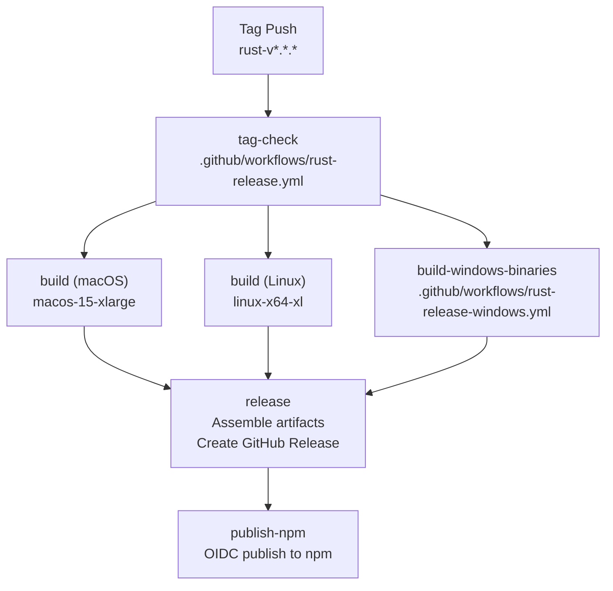
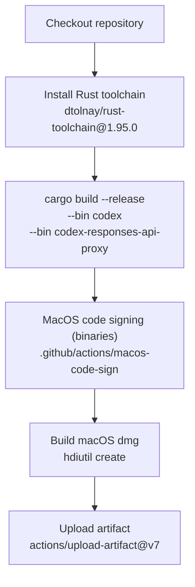
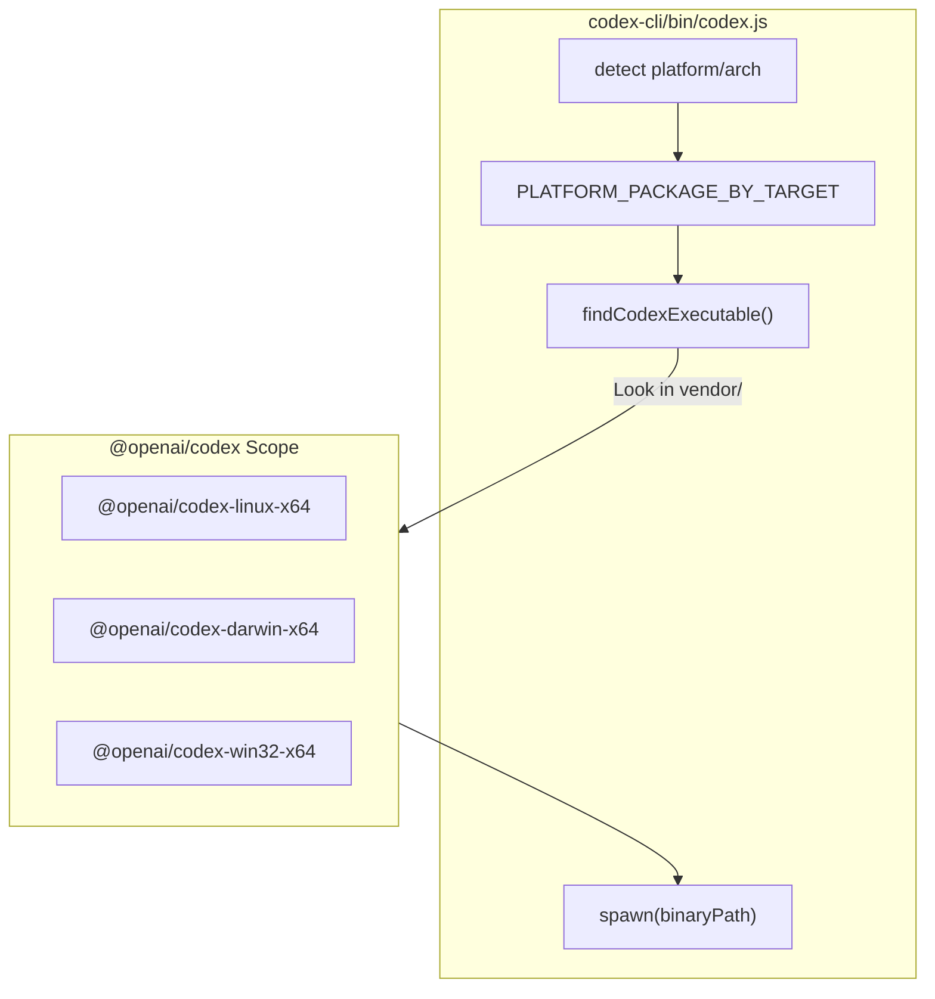

# 릴리스 파이프라인

<details>
<summary>관련 소스 파일</summary>

다음 파일들은 이 위키 페이지를 생성하기 위한 컨텍스트로 사용되었습니다.

- [.github/actions/linux-code-sign/action.yml](.github/actions/linux-code-sign/action.yml)
- [.github/actions/windows-code-sign/action.yml](.github/actions/windows-code-sign/action.yml)
- [.github/scripts/archive-release-symbols-and-strip-binaries.sh](.github/scripts/archive-release-symbols-and-strip-binaries.sh)
- [.github/workflows/Dockerfile.bazel](.github/workflows/Dockerfile.bazel)
- [.github/workflows/ci.yml](.github/workflows/ci.yml)
- [.github/workflows/rust-ci-full.yml](.github/workflows/rust-ci-full.yml)
- [.github/workflows/rust-ci.yml](.github/workflows/rust-ci.yml)
- [.github/workflows/rust-release-argument-comment-lint.yml](.github/workflows/rust-release-argument-comment-lint.yml)
- [.github/workflows/rust-release-windows.yml](.github/workflows/rust-release-windows.yml)
- [.github/workflows/rust-release.yml](.github/workflows/rust-release.yml)
- [.github/workflows/sdk.yml](.github/workflows/sdk.yml)
- [BUILD.bazel](BUILD.bazel)
- [MODULE.bazel](MODULE.bazel)
- [MODULE.bazel.lock](MODULE.bazel.lock)
- [SECURITY.md](SECURITY.md)
- [codex-cli/.gitignore](codex-cli/.gitignore)
- [codex-cli/bin/codex.js](codex-cli/bin/codex.js)
- [codex-cli/scripts/README.md](codex-cli/scripts/README.md)
- [codex-cli/scripts/build_npm_package.py](codex-cli/scripts/build_npm_package.py)
- [codex-rs/app-server/BUILD.bazel](codex-rs/app-server/BUILD.bazel)
- [codex-rs/core/BUILD.bazel](codex-rs/core/BUILD.bazel)
- [codex-rs/mcp-server/BUILD.bazel](codex-rs/mcp-server/BUILD.bazel)
- [codex-rs/tui/BUILD.bazel](codex-rs/tui/BUILD.bazel)
- [codex-rs/utils/cargo-bin/BUILD.bazel](codex-rs/utils/cargo-bin/BUILD.bazel)
- [defs.bzl](defs.bzl)
- [patches/BUILD.bazel](patches/BUILD.bazel)
- [patches/rules_rs_build_script_deps_annotation.patch](patches/rules_rs_build_script_deps_annotation.patch)
- [patches/v8_bazel_rules.patch](patches/v8_bazel_rules.patch)
- [patches/v8_module_deps.patch](patches/v8_module_deps.patch)
- [patches/v8_source_portability.patch](patches/v8_source_portability.patch)
- [rbe.bzl](rbe.bzl)
- [scripts/stage_npm_packages.py](scripts/stage_npm_packages.py)
- [third_party/v8/BUILD.bazel](third_party/v8/BUILD.bazel)
- [third_party/v8/README.md](third_party/v8/README.md)
- [workspace_root_test_launcher.bat.tpl](workspace_root_test_launcher.bat.tpl)
- [workspace_root_test_launcher.sh.tpl](workspace_root_test_launcher.sh.tpl)

</details>


## 목적과 범위

이 문서는 지원되는 모든 플랫폼용 Codex 바이너리를 빌드, 서명, 게시하는 [.github/workflows/rust-release.yml]()에 정의된 릴리스 파이프라인을 설명합니다. 이 파이프라인은 버전 tag push로 트리거되며, multi-platform build, 플랫폼별 코드 서명(Apple, Cosign, Azure), artifact 압축, GitHub release 생성, npm package 게시를 오케스트레이션합니다.

파이프라인은 핵심 `codex` CLI, `codex-responses-api-proxy`, `codex-app-server`를 다룹니다. 또한 Cargo와 Bazel 기반 workflow를 모두 사용하여 Windows와 Linux(musl)의 복잡한 cross-compilation 요구 사항을 처리합니다.

---

## 릴리스 트리거와 태그 검증

릴리스 파이프라인은 `rust-v*.*.*` 패턴과 일치하는 Git tag가 push될 때 트리거됩니다 [[.github/workflows/rust-release.yml:13-15]]().

```bash
git tag -a rust-v0.1.0 -m "Release 0.1.0"
git push origin rust-v0.1.0
```

`tag-check` job은 tag 형식이 올바르고 `codex-rs/Cargo.toml`에 선언된 버전과 일치하는지 검증합니다 [[.github/workflows/rust-release.yml:22-29]](). 허용되는 tag 형식에는 stable release(예: `rust-v1.2.3`)와 alpha/beta pre-release(예: `rust-v1.2.3-alpha.1`)가 포함됩니다 [[.github/workflows/rust-release.yml:40-41]]().

검증 로직 [[.github/workflows/rust-release.yml:31-51]]()은 tag에서 버전을 추출하고, `grep`과 `sed`를 사용해 `Cargo.toml`의 버전을 읽은 뒤, 둘이 일치하지 않으면 workflow를 실패시킵니다. 이를 통해 버전이 맞지 않는 실수 릴리스를 방지합니다.

**출처:** [[.github/workflows/rust-release.yml:1-52]]()

---

## Workflow Job 의존성

파이프라인은 모든 플랫폼 빌드를 동시에 실행한 다음, 모든 빌드가 성공적으로 완료된 뒤 최종 릴리스 조립 단계를 진행합니다.

**다이어그램: 릴리스 파이프라인 Job 그래프**



**출처:** [[.github/workflows/rust-release.yml:21-615]](), [[.github/workflows/rust-release-windows.yml:12-145]]()

---

## 빌드 매트릭스 전략

### 플랫폼 커버리지

`build` job은 matrix strategy를 사용해 여러 platform/libc 조합용 바이너리를 병렬로 빌드합니다 [[.github/workflows/rust-release.yml:75-127]]().

| Runner | Target | libc | Artifact Name | Binaries |
|--------|--------|------|---------------|----------|
| `macos-15-xlarge` | `aarch64-apple-darwin` | system | `aarch64-apple-darwin` | `codex`, `proxy` |
| `macos-15-xlarge` | `x86_64-apple-darwin` | system | `x86_64-apple-darwin` | `codex`, `proxy` |
| `linux-x64-xl` | `x86_64-unknown-linux-musl` | musl | `x86_64-unknown-linux-musl` | `codex`, `proxy`, `bwrap` |
| `linux-arm64` | `aarch64-unknown-linux-musl` | musl | `aarch64-unknown-linux-musl` | `codex`, `proxy`, `bwrap` |

Windows 빌드는 `x86_64-pc-windows-msvc` 및 `aarch64-pc-windows-msvc`를 포함한 target을 빌드하는 별도의 reusable workflow [[.github/workflows/rust-release-windows.yml]]()에서 처리됩니다 [[.github/workflows/rust-release-windows.yml:26-68]]().

### 빌드 구성
파이프라인은 네트워크 안정성과 디버그 정보에 최적화되어 있습니다.
*   **Git CLI**: 중첩 submodule(예: `libwebrtc`)에서 `libgit2` 불안정성을 피하기 위해 `CARGO_NET_GIT_FETCH_WITH_CLI: "true"`를 설정합니다 [[.github/workflows/rust-release.yml:69-73]]().
*   **dSYMs**: macOS 릴리스 패키지는 stripping 전에 packed dSYM bundle을 archive합니다 [[.github/workflows/rust-release.yml:67-68]]().

**출처:** [[.github/workflows/rust-release.yml:53-128]](), [[.github/workflows/rust-release-windows.yml:8-69]]()

---

## macOS 빌드와 코드 서명

**다이어그램: macOS 릴리스 빌드 흐름**



macOS 빌드 프로세스에는 통합 서명이 포함됩니다.
1.  **Binary Signing**: Apple signing certificate에 접근하기 위해 전용 environment `codesigning`을 사용합니다 [[.github/workflows/rust-release.yml:8-9]]().
2.  **Architecture**: `macos-15-xlarge` runner를 사용해 `aarch64`와 `x86_64` 모두에 대해 빌드합니다 [[.github/workflows/rust-release.yml:79-102]]().

**출처:** [[.github/workflows/rust-release.yml:79-102]](), [[.github/workflows/rust-release.yml:147-161]]()

---

## Linux 빌드와 musl Cross-Compilation

### musl Toolchain 설정
Linux 빌드는 여러 Linux distribution 전반의 이식성을 위해 musl-linked 바이너리를 생성합니다.
*   **빌드 의존성**: `bwrap`와 다른 저수준 구성 요소를 지원하기 위해 runner에 `binutils`, `pkg-config`, `libcap-dev`를 설치합니다 [[.github/workflows/rust-release.yml:162-168]]().
*   **Hermetic Cargo Home**: 빌드 재현성을 보장하기 위해 workspace 내부에 격리된 `.cargo-home`을 생성합니다 [[.github/workflows/rust-release.yml:174-180]]().

### Linux 코드 서명
Linux 바이너리는 **Cosign**을 사용해 서명됩니다 [[.github/workflows/rust-release.yml:8-9]](). 이는 `x86_64` 및 `aarch64` musl 바이너리에 대해 검증 가능한 서명을 제공합니다.

**출처:** [[.github/workflows/rust-release.yml:103-127]](), [[.github/workflows/rust-release.yml:162-180]]()

---

## Windows 빌드와 Azure Trusted Signing

Windows 빌드는 `rust-release-windows.yml` [[.github/workflows/rust-release-windows.yml:1]]()에 위임됩니다.

1.  **Bundle Splitting**: 세 가지 bundle로 바이너리를 컴파일합니다. `primary`(`codex`, `proxy`), `helpers`(`codex-windows-sandbox-setup`, `codex-command-runner`), `app-server`(`codex-app-server`) [[.github/workflows/rust-release-windows.yml:26-68]]().
2.  **LLVM Linker**: Windows 빌드에 LLVM linker를 사용하도록 MSVC 환경을 구성합니다 [[.github/workflows/rust-release-windows.yml:92-95]]().
3.  **Azure Trusted Signing**: `.exe` 파일에 서명을 적용하기 위해 `azure-artifact-signing` environment [[.github/workflows/rust-release-windows.yml:150-151]]()를 사용합니다.
4.  **PDB Staging**: 디버깅을 위해 `.exe`와 `.pdb` symbol file을 모두 패키징합니다 [[.github/workflows/rust-release-windows.yml:117-136]]().

**출처:** [[.github/workflows/rust-release-windows.yml:23-144]](), [[.github/workflows/rust-release-windows.yml:145-218]]()

---

## Bazel 의존성 패치와 Windows 지원

repository는 특히 `v8` 또는 `llvm`처럼 특정 C++ toolchain이 필요한 구성 요소의 복잡한 cross-platform build를 위해 Bazel을 사용합니다.

### Cross-Compilation을 위한 패치
`patches/` 디렉터리에는 Bazel 의존성에 대한 중요한 수정 사항이 포함되어 있습니다 [[MODULE.bazel:12-15]]().
*   **LLVM**: Windows symlink extraction과 `rusty_v8` custom libc++를 위한 패치 [[MODULE.bazel:13-14]]().
*   **Abseil**: `windows-gnullvm` 호환성을 위한 portable C++11 thread-local path 강제 [[MODULE.bazel:22-24]]().
*   **Rules Rust**: `windows-gnullvm` 실행, build script environment 처리, linker argument에 대한 광범위한 패치 [[MODULE.bazel:108-119]]().

### Linker Flag 정렬
Cargo와 Bazel 빌드 간 일관성을 보장하기 위해 `defs.bzl`은 8 MiB stack reserve와 UCRT import를 설정하는 `WINDOWS_RUSTC_LINK_FLAGS`를 정의합니다 [[defs.bzl:8-22]]().

**출처:** [[MODULE.bazel:1-122]](), [[defs.bzl:6-22]]()

---

## 릴리스 조립과 npm 게시

파이프라인의 마지막 단계는 배포 artifact를 조립하고 npm package를 게시합니다.

**다이어그램: npm Package Resolution Logic**



### npm Multi-Package Layout
Codex CLI는 여러 npm package 집합으로 배포됩니다.
*   **Wrapper Package**: `@openai/codex`는 host platform을 감지하는 `codex.js` 진입점을 포함합니다 [[codex-cli/bin/codex.js:15-67]]().
*   **Platform Packages**: 여섯 개의 optional dependency(예: `@openai/codex-linux-x64`, `@openai/codex-darwin-arm64`)는 실제 native binary를 `vendor/` 디렉터리에 포함합니다 [[codex-cli/bin/codex.js:15-22]]().
*   **Resolution**: `findCodexExecutable` 함수는 `require.resolve`를 사용해 설치된 platform package를 찾고 `codex` 바이너리 위치를 찾습니다 [[codex-cli/bin/codex.js:78-105]]().

### Staging과 패키징
`build_npm_package.py` 스크립트는 다음을 통해 이러한 package 생성을 오케스트레이션합니다.
1.  target을 npm tag에 매핑합니다(예: `x86_64-apple-darwin` -> `darwin-x64`) [[codex-cli/scripts/build_npm_package.py:23-66]]().
2.  `bin/codex.js` wrapper와 native binary를 올바른 layout에 stage합니다 [[codex-cli/scripts/build_npm_package.py:153-174]]().

**출처:** [[codex-cli/bin/codex.js:1-105]](), [[codex-cli/scripts/build_npm_package.py:23-174]](), [[.github/workflows/ci.yml:45-64]]()
