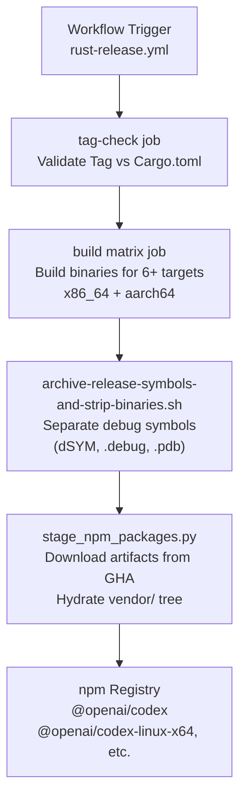
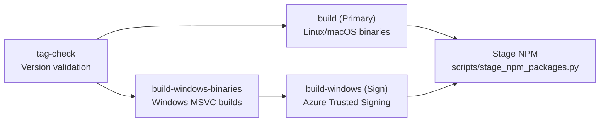
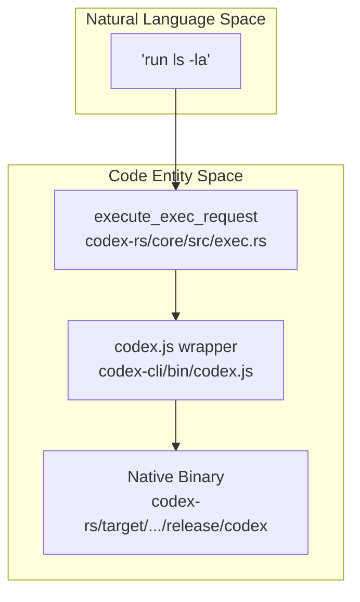
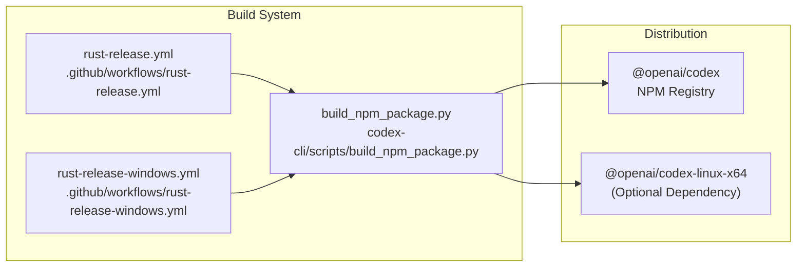

# Shell Tool MCP 빌드 시스템

관련 소스 파일

다음 파일들은 이 위키 페이지를 생성하기 위한 컨텍스트로 사용되었습니다.

- [.github/actions/linux-code-sign/action.yml](.github/actions/linux-code-sign/action.yml)
- [.github/actions/windows-code-sign/action.yml](.github/actions/windows-code-sign/action.yml)
- [.github/scripts/archive-release-symbols-and-strip-binaries.sh](.github/scripts/archive-release-symbols-and-strip-binaries.sh)
- [.github/workflows/ci.yml](.github/workflows/ci.yml)
- [.github/workflows/rust-ci-full.yml](.github/workflows/rust-ci-full.yml)
- [.github/workflows/rust-ci.yml](.github/workflows/rust-ci.yml)
- [.github/workflows/rust-release-argument-comment-lint.yml](.github/workflows/rust-release-argument-comment-lint.yml)
- [.github/workflows/rust-release-windows.yml](.github/workflows/rust-release-windows.yml)
- [.github/workflows/rust-release.yml](.github/workflows/rust-release.yml)
- [.github/workflows/sdk.yml](.github/workflows/sdk.yml)
- [codex-cli/.gitignore](codex-cli/.gitignore)
- [codex-cli/bin/codex.js](codex-cli/bin/codex.js)
- [codex-cli/scripts/README.md](codex-cli/scripts/README.md)
- [codex-cli/scripts/build_npm_package.py](codex-cli/scripts/build_npm_package.py)
- [scripts/stage_npm_packages.py](scripts/stage_npm_packages.py)

## 목적과 범위

Shell Tool MCP Build System은 Codex의 shell tool을 위한 실행 가로채기를 지원하는 패치된 Bash 및 Zsh 버전을 빌드하고 배포하는 역할을 합니다. 이 시스템은 `x86_64`와 `aarch64` 아키텍처 모두에 대해 11개의 OS/distribution variant 전반에서 사용자 지정 shell binary를 컴파일하고, 이를 npm 배포물로 패키징하며, npm registry에 게시합니다. 패치된 셸은 Codex의 shell escalation protocol이 샌드박스된 shell session 안에서 명령 실행을 가로채고 제어하는 데 사용하는 `EXEC_WRAPPER` 메커니즘을 가능하게 합니다.

Codex가 런타임에 이러한 패치된 셸을 사용하는 방식에 대한 정보는 [5.2]()를 참조하세요. shell escalation protocol 자체에 대한 자세한 내용은 `codex-rs/shell-escalation/`의 shell-escalation 구현을 참조하세요.

**출처:** [.github/workflows/rust-release.yml:103-127](), [codex-cli/bin/codex.js:15-22]()

---

## 시스템 개요

`shell-tool-mcp` 시스템은 패치된 shell binary를 빌드하고 이를 `@openai/codex` npm ecosystem에 통합하는 release pipeline 구성 요소로 동작합니다. 이 시스템은 target triple과 OS variant별로 구성된 platform-specific binary를 생성하며, CLI 진입점이 이를 소비합니다.

### 빌드와 배포 흐름

**출처:** [.github/workflows/rust-release.yml:11-51](), [.github/workflows/ci.yml:45-66](), [scripts/stage_npm_packages.py:208-223](), [.github/scripts/archive-release-symbols-and-strip-binaries.sh:60-120]()

---

## Workflow 아키텍처

빌드 시스템은 cross-platform compilation과 artifact 관리를 조정하는 GitHub Actions workflow에 의해 구동됩니다.

### 릴리스 검증

`tag-check` job은 release tag가 `rust-v*.*.*` 형식을 따르고 workspace `Cargo.toml`에 정의된 버전과 일치하는지 보장합니다.

| 단계 | 로직 |
|------|-------|
| **Tag Format** | `[[ "${GITHUB_REF_NAME}" =~ ^rust-v[0-9]+\.[0-9]+\.[0-9]+... ]]` [.github/workflows/rust-release.yml:40-41]() |
| **Version Sync** | `cargo_ver="$(grep -m1 '^version' codex-rs/Cargo.toml ...)"` [.github/workflows/rust-release.yml:44-45]() |

### Job 의존성 체인

릴리스 workflow는 Linux, macOS, Windows 전반의 복잡한 build matrix를 관리합니다.

**출처:** [.github/workflows/rust-release.yml:53-127](), [.github/workflows/rust-release-windows.yml:12-68](), [.github/workflows/rust-release-windows.yml:145-177]()

---

## 빌드 매트릭스와 플랫폼

빌드 시스템은 여섯 개의 주요 platform/architecture 조합을 대상으로 하며, 이들은 특정 npm optional dependency에 매핑됩니다.

### Platform Mapping(`PLATFORM_PACKAGE_BY_TARGET`)

| Target Triple | npm Package | OS | CPU |
|---------------|-------------|----|-----|
| `x86_64-unknown-linux-musl` | `@openai/codex-linux-x64` | linux | x64 |
| `aarch64-unknown-linux-musl` | `@openai/codex-linux-arm64` | linux | arm64 |
| `x86_64-apple-darwin` | `@openai/codex-darwin-x64` | darwin | x64 |
| `aarch64-apple-darwin` | `@openai/codex-darwin-arm64` | darwin | arm64 |
| `x86_64-pc-windows-msvc` | `@openai/codex-win32-x64` | win32 | x64 |
| `aarch64-pc-windows-msvc` | `@openai/codex-win32-arm64` | win32 | arm64 |

**출처:** [codex-cli/bin/codex.js:15-22](), [codex-cli/scripts/build_npm_package.py:23-66]()

---

## 패키징과 진입점

이 시스템은 기본 `@openai/codex` package가 현재 플랫폼에 맞는 native binary를 해석하고 실행하는 thin wrapper 역할을 하는 "meta-package" 패턴을 사용합니다.

### CLI 해석 로직(`codex.js`)

진입점 script `codex-cli/bin/codex.js`는 다음 단계를 수행합니다.
1.  **Platform Detection**: `process.platform`과 `process.arch`를 사용해 `targetTriple`을 결정합니다 [codex-cli/bin/codex.js:24-67]().
2.  **Package Resolution**: `require.resolve`를 사용해 대응하는 platform package의 `vendor/` 디렉터리에서 native binary를 찾으려고 시도합니다 [codex-cli/bin/codex.js:78-95]().
3.  **Environment Setup**: package가 `npm` 또는 `bun`으로 관리되는지 감지하고 `CODEX_MANAGED_PACKAGE_ROOT`를 설정합니다 [codex-cli/bin/codex.js:119-148]().
4.  **Process Spawning**: `node:child_process`를 사용해 native binary를 생성하고, 정상 종료를 보장하기 위해 signal(`SIGINT`, `SIGTERM`, `SIGHUP`)을 전달합니다 [codex-cli/bin/codex.js:150-181]().

### Staging과 조립

릴리스 조립은 `scripts/stage_npm_packages.py`가 처리하며, 이 스크립트는 다음을 수행합니다.
- `gh run list`를 사용해 올바른 release workflow run을 해석합니다 [scripts/stage_npm_packages.py:149-172]().
- GitHub Actions에서 artifact를 다운로드합니다 [scripts/stage_npm_packages.py:215]().
- `install_binary_components`를 사용해 `vendor/` tree를 채웁니다 [scripts/stage_npm_packages.py:218-222]().

**출처:** [codex-cli/bin/codex.js:1-205](), [scripts/stage_npm_packages.py:1-223]()

---

## 빌드 프로세스(Symbol 관리)

`archive-release-symbols-and-strip-binaries.sh` 스크립트는 배포 package 크기를 작게 유지하면서도 진단 기능을 보존하기 위해 release binary에서 debug symbol을 분리하는 과정을 캡슐화합니다.

### 플랫폼별 Symbol 처리

| OS | Tooling | Action |
|----|---------|--------|
| **macOS** | `strip -S -x` | `.dSYM` bundle을 추출하고 local symbol을 strip합니다 [.github/scripts/archive-release-symbols-and-strip-binaries.sh:68-84]() |
| **Linux** | `objcopy`, `strip` | `.debug` 파일을 생성하고 `gnu-debuglink`를 추가합니다 [.github/scripts/archive-release-symbols-and-strip-binaries.sh:85-99]() |
| **Windows** | `cp` | MSVC 빌드 중 생성된 `.pdb` 파일을 수집합니다 [.github/scripts/archive-release-symbols-and-strip-binaries.sh:101-111]() |

### Shell 실행과의 통합

`shell-tool-mcp` 바이너리는 최종적으로 Node.js wrapper를 통해 연결된 core execution engine으로 호출됩니다.

**출처:** [codex-cli/bin/codex.js:150-153](), [.github/workflows/rust-release.yml:83](), [.github/workflows/rust-release-windows.yml:108]()

### 빌드와 배포 다이어그램

**출처:** [.github/workflows/rust-release.yml:53-127](), [.github/workflows/rust-release-windows.yml:25-68](), [codex-cli/scripts/build_npm_package.py:23-66]()
