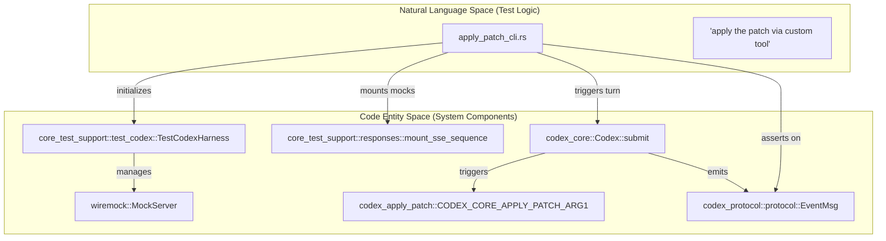
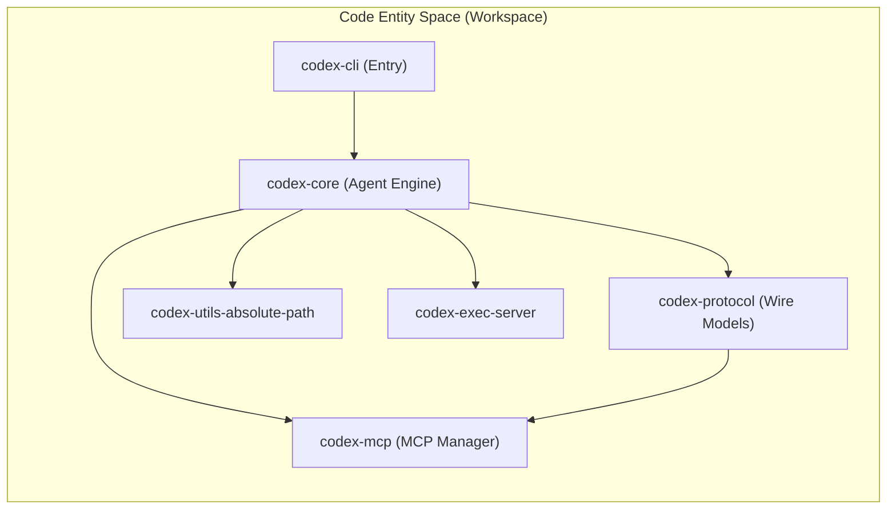

# 개발과 테스트

관련 소스 파일

다음 파일들은 이 위키 페이지를 생성하기 위한 컨텍스트로 사용되었습니다.

- [.bazelrc](.bazelrc)
- [.github/scripts/run-bazel-ci.sh](.github/scripts/run-bazel-ci.sh)
- [.github/scripts/run-bazel-query-ci.sh](.github/scripts/run-bazel-query-ci.sh)
- [.github/scripts/run_bazel_with_buildbuddy.py](.github/scripts/run_bazel_with_buildbuddy.py)
- [.github/scripts/rusty_v8_bazel.py](.github/scripts/rusty_v8_bazel.py)
- [.github/scripts/test_run_bazel_with_buildbuddy.py](.github/scripts/test_run_bazel_with_buildbuddy.py)
- [.github/scripts/test_rusty_v8_bazel.py](.github/scripts/test_rusty_v8_bazel.py)
- [.github/workflows/bazel.yml](.github/workflows/bazel.yml)
- [.github/workflows/rusty-v8-release.yml](.github/workflows/rusty-v8-release.yml)
- [.github/workflows/v8-canary.yml](.github/workflows/v8-canary.yml)
- [AGENTS.md](AGENTS.md)
- [codex-rs/core/tests/common/test_codex.rs](codex-rs/core/tests/common/test_codex.rs)
- [codex-rs/core/tests/suite/apply_patch_cli.rs](codex-rs/core/tests/suite/apply_patch_cli.rs)
- [codex-rs/core/tests/suite/mod.rs](codex-rs/core/tests/suite/mod.rs)
- [codex-rs/core/tests/suite/shell_serialization.rs](codex-rs/core/tests/suite/shell_serialization.rs)
- [codex-rs/core/tests/suite/tool_harness.rs](codex-rs/core/tests/suite/tool_harness.rs)
- [codex-rs/core/tests/suite/tools.rs](codex-rs/core/tests/suite/tools.rs)
- [codex-rs/docs/bazel.md](codex-rs/docs/bazel.md)
- [docs/authentication.md](docs/authentication.md)
- [docs/contributing.md](docs/contributing.md)
- [docs/install.md](docs/install.md)
- [justfile](justfile)
- [scripts/list-bazel-clippy-targets.sh](scripts/list-bazel-clippy-targets.sh)

이 페이지는 Codex codebase에 기여하는 개발자를 위한 고수준 가이드를 제공합니다. 시스템의 신뢰성과 성능을 유지하는 데 필요한 필수 설정, 테스트 철학, 코딩 표준을 다룹니다.

자세한 설정 지침은 [Development Setup](#9.1)을 참조하세요. 테스트 도구에 대한 심층 설명은 [Testing Infrastructure](#9.2)를 참조하세요.

## 핵심 개발 원칙

Codex codebase는 유지보수성을 보장하기 위해 엄격한 Rust idiom과 조직 패턴을 따릅니다. 주요 제약은 다음과 같습니다.

*   **Module Size**: Rust module은 500 LoC 미만을 목표로 합니다. 파일이 대략 800 LoC를 넘으면 기능을 새 module로 추출해야 합니다 [AGENTS.md:45-49](). 이는 특히 `chatwidget.rs`와 `app.rs` 같은 중앙 orchestration module에 적용됩니다 [AGENTS.md:50-57]().
*   **API Design**: 모호한 `bool` 또는 `Option` 매개변수를 피합니다. callsite가 스스로 설명되도록 enum, named method, newtype을 선호합니다 [AGENTS.md:14]().
*   **Crate Naming**: workspace의 모든 crate는 `codex-` 접두사를 사용합니다(예: `core` 폴더에는 `codex-core`가 있음) [AGENTS.md:5]().
*   **Tooling**: 프로젝트는 command runner로 `just`, 빠른 test execution을 위해 `cargo-nextest`, snapshot testing을 위해 `cargo-insta`에 의존합니다 [AGENTS.md:7, 60-64]().
*   **Linting**: codebase는 `/*param_name*/` 주석을 사용해 literal argument의 parameter documentation을 강제하는 사용자 지정 `argument-comment-lint`를 사용합니다 [AGENTS.md:15-19]().

## 개발 설정과 Workflow

개발자는 일반 작업을 관리하기 위해 `codex-rs` 디렉터리에 있는 `justfile`을 사용합니다. 이를 통해 서로 다른 개발 환경과 CI pipeline 전반에서 일관성이 보장됩니다.

| Command | 목적 |
| :--- | :--- |
| `just fmt` | 코드(Rust, Python, Justfiles)를 자동으로 format합니다 [justfile:40-41](); 변경 후 필수입니다 [AGENTS.md:60](). |
| `just fix -p <project>` | 느린 workspace-wide build를 피하기 위해 특정 project에 대해 linter fix를 실행합니다 [AGENTS.md:66](). |
| `just write-config-schema` | `ConfigToml` 수정 후 `codex-rs/core/config.schema.json`을 업데이트합니다 [justfile:144-145](), [AGENTS.md:33](). |
| `just argument-comment-lint` | Bazel을 사용해 opaque literal argument에 문서화가 되어 있는지 확인합니다 [justfile:158-164](). |
| `just bazel-lock-update` | `Cargo.toml` 또는 `Cargo.lock` 변경 후 `MODULE.bazel.lock`을 새로 고칩니다 [justfile:111-112](), [AGENTS.md:36-37](). |

자세한 내용은 [Development Setup](#9.1)을 참조하세요.

출처: [AGENTS.md:1-70](), [justfile:1-177]()

## 테스트 인프라

Codex는 unit test부터 model interaction, shell execution, protocol event를 시뮬레이션하는 복잡한 integration test까지 다층적인 테스트 전략을 사용합니다.

### 통합 및 Model 테스트
테스트 suite에는 mock SSE stream을 mount하고 agent 동작을 검증하기 위한 `TestCodexHarness`를 제공하는 `core_test_support`가 포함됩니다 [codex-rs/core/tests/suite/apply_patch_cli.rs:68-79](). Integration test는 `codex-rs/core/tests/suite/mod.rs`에 집계됩니다 [codex-rs/core/tests/suite/mod.rs:1-130]().

Title: Testing Flow from Prompt to System Verification

출처: [codex-rs/core/tests/suite/apply_patch_cli.rs:68-126](), [codex-rs/core/tests/suite/mod.rs:1-28]()

### 주요 테스트 패턴
*   **Snapshot Testing**: Snapshot test는 UI와 상태 일관성을 보장합니다. 프로젝트는 이러한 검증에 `cargo-insta`를 사용합니다 [AGENTS.md:7]().
*   **Remote Environment Testing**: `TestEnv` 구조체는 local 및 remote testing environment를 모두 지원하며, remote는 `CODEX_TEST_REMOTE_EXEC_SERVER_URL`로 제어됩니다 [codex-rs/core/tests/common/test_codex.rs:86-156]().
*   **Binary Dispatch**: 테스트 suite는 `TestBinaryDispatchGuard`를 사용해 test binary가 `arg0`를 기준으로 `apply_patch` 또는 `codex-linux-sandbox`처럼 동작할 수 있게 합니다 [codex-rs/core/tests/suite/mod.rs:14-28]().
*   **Bazel CI**: 포괄적인 Bazel 기반 CI pipeline은 Linux, macOS, Windows(cross-compilation 경유) 전반에서 테스트를 실행합니다 [ .github/workflows/bazel.yml:20-49]().

자세한 내용은 [Testing Infrastructure](#9.2)를 참조하세요.

출처: [codex-rs/core/tests/suite/mod.rs:1-130](), [codex-rs/core/tests/common/test_codex.rs:1-183](), [AGENTS.md:1-65](), [.github/workflows/bazel.yml:1-140]()

## 코드 구성과 관례

프로젝트는 코드 품질을 유지하기 위해 modularity와 엄격한 linting을 강조합니다.

Title: Workspace Dependency and Logic Flow

### 기여자 관례
*   **Exhaustive Matches**: compile-time safety를 보장하기 위해 `match` 문에서 wildcard(`_`) arm을 피합니다 [AGENTS.md:20]().
*   **Inlining**: 항상 변수를 `format!` 문자열 안에 inline하고, closure보다 method reference를 선호합니다 [AGENTS.md:6, 12-13]().
*   **Async Traits**: `#[async_trait]`는 권장하지 않습니다. 명시적 `Send` bound가 있는 native RPITIT(Return Position Impl Trait In Trait)를 선호합니다 [AGENTS.md:22-27]().
*   **Bazel Synchronization**: `include_str!` 또는 `sqlx::migrate!`를 추가하는 경우 `compile_data` 또는 `build_script_data`를 통해 `BUILD.bazel` 파일을 업데이트해야 합니다 [AGENTS.md:40-43]().

자세한 내용은 [Code Organization Patterns](#9.3)을 참조하세요.

출처: [AGENTS.md:1-68](), [.bazelrc:114-136]()

## Observability와 Telemetry

Codex는 tracing과 metrics에 OpenTelemetry를 사용하며, 주로 `codex-otel` crate를 통해 관리됩니다. 이 시스템은 tool execution duration과 model latency를 포함한 session-level telemetry를 추적합니다.

자세한 내용은 [Observability and Telemetry](#9.4)를 참조하세요.

출처: [codex-rs/core/tests/suite/mod.rs:74]()
