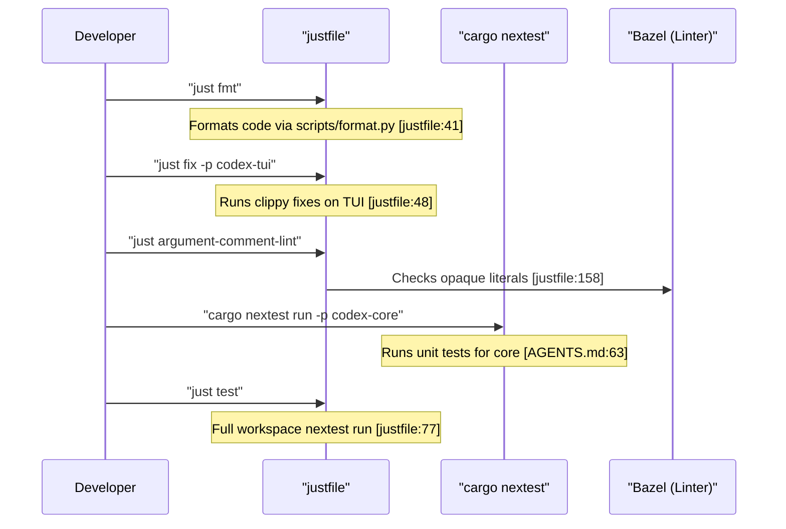

# 개발 설정

<details>
<summary>관련 소스 파일</summary>

다음 파일들은 이 위키 페이지를 생성하기 위한 컨텍스트로 사용되었습니다.

- [.bazelrc](.bazelrc)
- [.github/scripts/run-bazel-ci.sh](.github/scripts/run-bazel-ci.sh)
- [.github/scripts/run-bazel-query-ci.sh](.github/scripts/run-bazel-query-ci.sh)
- [.github/scripts/run_bazel_with_buildbuddy.py](.github/scripts/run_bazel_with_buildbuddy.py)
- [.github/scripts/rusty_v8_bazel.py](.github/scripts/rusty_v8_bazel.py)
- [.github/scripts/test_run_bazel_with_buildbuddy.py](.github/scripts/test_run_bazel_with_buildbuddy.py)
- [.github/scripts/test_rusty_v8_bazel.py](.github/scripts/test_rusty_v8_bazel.py)
- [.github/workflows/bazel.yml](.github/workflows/bazel.yml)
- [.github/workflows/rusty-v8-release.yml](.github/workflows/rusty-v8-release.yml)
- [.github/workflows/v8-canary.yml](.github/workflows/v8-canary.yml)
- [.gitignore](.gitignore)
- [AGENTS.md](AGENTS.md)
- [CHANGELOG.md](CHANGELOG.md)
- [README.md](README.md)
- [cliff.toml](cliff.toml)
- [codex-cli/package.json](codex-cli/package.json)
- [codex-rs/default.nix](codex-rs/default.nix)
- [codex-rs/docs/bazel.md](codex-rs/docs/bazel.md)
- [codex-rs/responses-api-proxy/npm/package.json](codex-rs/responses-api-proxy/npm/package.json)
- [docs/authentication.md](docs/authentication.md)
- [docs/contributing.md](docs/contributing.md)
- [docs/install.md](docs/install.md)
- [flake.lock](flake.lock)
- [flake.nix](flake.nix)
- [justfile](justfile)
- [package.json](package.json)
- [pnpm-lock.yaml](pnpm-lock.yaml)
- [pnpm-workspace.yaml](pnpm-workspace.yaml)
- [scripts/list-bazel-clippy-targets.sh](scripts/list-bazel-clippy-targets.sh)
- [sdk/typescript/jest.config.cjs](sdk/typescript/jest.config.cjs)
- [sdk/typescript/package.json](sdk/typescript/package.json)
- [sdk/typescript/tsconfig.json](sdk/typescript/tsconfig.json)

</details>


## 목적과 범위

이 페이지는 Codex codebase의 개발 환경 설정을 문서화합니다. toolchain 요구 사항, workspace 구성, 빌드 구성, 개발 workflow(formatting, linting, fixing), schema 생성을 다룹니다. 특히 `justfile`, `rust-toolchain.toml`, Nix flakes, devcontainer 구성(contributor 및 secure customer profile 포함)의 사용을 자세히 설명합니다.

---

## 사전 요구 사항과 Toolchain

Codex 프로젝트는 최신 Rust toolchain과 플랫폼별 빌드 의존성이 필요한 Rust 기반 monorepo입니다.

### Rust Toolchain

workspace는 개발 환경 전반의 일관성을 보장하기 위해 특정 Rust 버전을 사용하도록 구성되어 있습니다. 활성 toolchain은 `rustup` [justfile:55-56]()으로 관리됩니다. 프로젝트는 CI workflow에 명시된 Rust version `1.95.0`을 사용합니다 [.github/workflows/rusty-v8-release.yml:175-177]().

| 구성 요소 | 목적 |
|-----------|---------|
| **Components** | `clippy`, `rustfmt`, `llvm-tools-preview`는 linting과 formatting에 필수입니다. |
| **Cargo Tools** | repository 지침을 실행하기 전에 `just`, `rg`(ripgrep), `cargo-insta`를 설치해야 합니다 [AGENTS.md:7](). |

### 시스템 의존성

빌드 시스템은 여러 native library와 도구에 의존합니다.

| 요구 사항 | 세부 정보 | 목적 |
|-------------|---------|---------|
| **Just** | `cargo install just` | 루트 `justfile`에 정의된 개발 작업용 command runner입니다 [justfile:1-179](). |
| **Pnpm** | `pnpm` (>= 10.33.0) [package.json:32-35]() | CLI와 SDK의 Node.js 의존성을 관리합니다 [pnpm-lock.yaml:1-21](). |
| **Nextest** | `cargo install cargo-nextest` | `just test`에서 사용하는 최적화된 test runner입니다 [justfile:73-78](). |
| **Bazel** | `bazel` [justfile:100-111]() | hermetic build, release binary, 사용자 지정 linting 작업에 사용됩니다 [justfile:138-139](). |
| **Python** | `python3` [justfile:8]() | formatting script와 GitHub Action 유틸리티에 사용됩니다 [justfile:41-45](). |

### 재현 가능한 환경

- **Nix**: 프로젝트에는 재현 가능한 development shell을 제공하기 위한 `flake.nix`와 `codex-rs/default.nix`가 포함되어 있습니다.
- **Devcontainer**: `.devcontainer/`에 위치한 구성은 contributor 및 secure customer profile을 위한 표준화된 환경을 제공합니다.
- **Node.js**: 프로젝트는 Node.js >= 22를 요구합니다 [package.json:32]().

**출처:** [AGENTS.md:7](), [justfile:1-179](), [package.json:32-35](), [pnpm-lock.yaml:1-21](), [.github/workflows/rusty-v8-release.yml:175-177]()

---

## Workspace 구조와 빌드 구성

Codex codebase는 Rust 코드용 Cargo workspace와 TypeScript/JavaScript 구성 요소용 pnpm 관리 package를 포함하는 monorepo로 구성되어 있습니다.

### 주요 Workspace 멤버

- **`codex-core`**: 기본 agent engine crate입니다 [AGENTS.md:5, 33]().
- **`codex-tui`**: Terminal User Interface를 구현합니다 [AGENTS.md:51-58, 63]().
- **`codex-cli`**: CLI의 기본 진입점 package입니다 [codex-cli/package.json:1-7]().
- **`codex-mcp-server`**: Codex를 MCP 서버로 구현한 것입니다 [justfile:140-141]().
- **`codex-state`**: SQLite database와 log를 관리합니다 [justfile:171-176]().

### 개발 매핑(NL Space to Code Entity Space)

다음 다이어그램은 고수준 개발 개념을 이를 구현하거나 구성하는 특정 코드 엔티티에 매핑합니다.

**Setup and Configuration Mapping**
```mermaid
graph TD
    subgraph "NaturalLanguageSpace"
        "DevEnvironment"["Dev Environment"]
        "BuildPipeline"["Build Pipeline"]
        "DependencyLocking"["Dependency Locking"]
        "LintingRules"["Linting Rules"]
        "SchemaGeneration"["Schema Generation"]
    end

    subgraph "CodeEntitySpace"
        "flake_nix"["flake.nix"]
        "default_nix"["codex-rs/default.nix"]
        "justfile_entity"["justfile"]
        "pnpm_lock"["pnpm-lock.yaml"]
        "agents_md"["AGENTS.md"]
        "config_schema_gen"["codex-write-config-schema"]
    end

    "DevEnvironment" --> "flake_nix"
    "DevEnvironment" --> "justfile_entity"
    "BuildPipeline" --> "default_nix"
    "BuildPipeline" --> "justfile_entity"
    "DependencyLocking" --> "pnpm_lock"
    "LintingRules" --> "agents_md"
    "SchemaGeneration" --> "config_schema_gen"

    "justfile_entity" -- "invokes" --> "config_schema_gen"
    "justfile_entity" -- "orchestrates" --> "default_nix"
    "flake_nix" -- "provides" --> "default_nix"
```

**출처:** [AGENTS.md:1-58](), [justfile:1-179](), [pnpm-lock.yaml:1-20]()

---

## 개발 Workflow

프로젝트는 일반 개발 작업을 표준화하기 위해 `just`(repository root의 `justfile` 호출)를 사용합니다.

### 핵심 개발 명령

| 작업 | 명령 | 설명 |
|------|---------|-------------|
| **Formatting** | `just fmt` [justfile:40]() | Rust, Python, Justfiles를 format하기 위해 `scripts/format.py` script를 실행합니다 [justfile:41](). |
| **Linting/Fixing** | `just fix -p <project>` [justfile:47]() | `cargo clippy --fix`를 실행합니다. 느린 workspace-wide build를 피하기 위해 `-p`로 범위를 지정하는 것이 권장됩니다 [AGENTS.md:66](). |
| **Testing** | `just test` [justfile:77]() | 8 MiB stack size로 `cargo nextest run`을 실행합니다 [justfile:7, 78](). |
| **Schema Gen** | `just write-config-schema` [justfile:144]() | `codex-write-config-schema`를 통해 `codex-rs/core/config.schema.json`을 업데이트합니다 [justfile:145](), [AGENTS.md:33](). |
| **Protocol Schema** | `just write-app-server-schema` [justfile:148]() | app-server protocol schema fixture를 재생성합니다 [justfile:149](). |
| **Hooks Schema** | `just write-hooks-schema` [justfile:152]() | hooks schema fixture를 재생성합니다 [justfile:153](). |
| **Custom Lint** | `just argument-comment-lint` [justfile:158]() | opaque literal argument를 위한 Bazel 기반 lint를 실행합니다 [justfile:160](). |

### 의존성 관리

Rust 의존성이 수정된 경우:
1. `just bazel-lock-update`를 실행해 `MODULE.bazel.lock`을 새로 고칩니다 [justfile:111-112](), [AGENTS.md:36-37]().
2. CI 전에 `just bazel-lock-check`를 실행해 일관성을 검증합니다 [justfile:116-121](), [AGENTS.md:38-39]().

Node.js 의존성의 경우 관련 디렉터리에서 `pnpm`을 사용합니다.

**출처:** [justfile:40-179](), [AGENTS.md:33-39, 66]()

---

## 코드 관례와 Formatting

### 일반 규칙

- **Variable Inlining**: `format!` macro에서는 항상 변수를 `{}` 안에 inline합니다 [AGENTS.md:6, 12]().
- **Clippy Defaults**: `collapsible_if`와 `redundant_closure_for_method_calls`를 따릅니다 [AGENTS.md:11, 13]().
- **Argument Comment Lint**: `None`, `true`, `false`, 숫자 literal 같은 opaque literal 앞에는 `/*param_name*/` 주석을 사용합니다 [AGENTS.md:15-18]().
- **Module Size**: module은 500 LoC 미만을 목표로 합니다. 파일이 800줄을 넘으면 새 module을 추출합니다 [AGENTS.md:47-50]().
- **Trait Definition**: 새로 추가된 trait에는 doc comment가 있어야 합니다. `#[async_trait]`보다 `Send` bound가 있는 native RPITIT method를 선호합니다 [AGENTS.md:21-25]().

### 통합과 테스트 흐름

개발자는 안정성과 샌드박스 제약 준수를 보장하기 위해 변경 사항을 마무리할 때 특정 순서를 따라야 합니다.

**Development Command Flow**


### 개발 중 샌드박스 제한

도구를 개발하거나 테스트할 때는 환경 기반 샌드박스 flag를 인식해야 합니다.
- `CODEX_SANDBOX_NETWORK_DISABLED=1`: `shell` 도구를 사용할 때 자동으로 설정됩니다 [AGENTS.md:9]().
- `CODEX_SANDBOX=seatbelt`: macOS에서 `/usr/bin/sandbox-exec`를 통해 프로세스를 생성할 때 설정됩니다 [AGENTS.md:10]().
- 테스트는 필요한 권한을 환경이 지원하지 않는 경우 early-exit하기 위해 이러한 변수를 확인합니다 [AGENTS.md:9-10]().

**출처:** [AGENTS.md:8-10, 60-66](), [justfile:40-179](), [AGENTS.md:21-25]()
