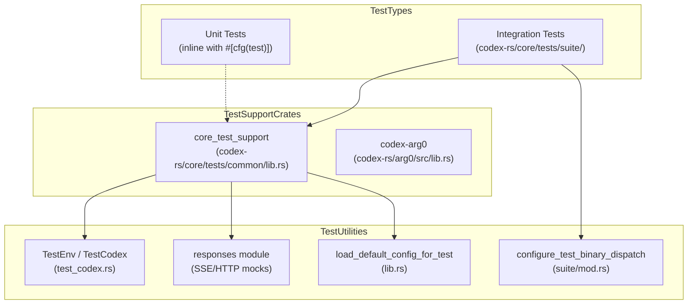
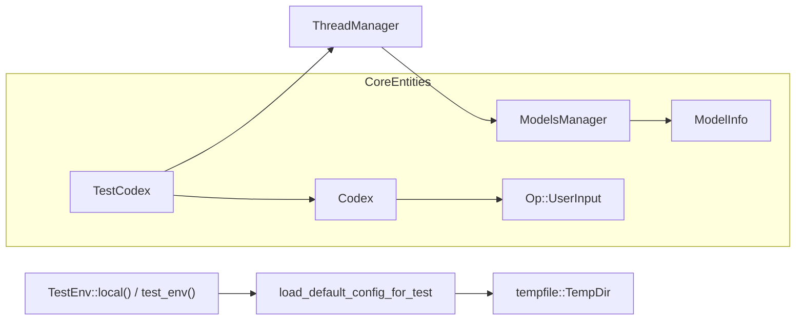

# 테스트 인프라

관련 소스 파일

다음 파일들은 이 위키 페이지를 생성하기 위한 컨텍스트로 사용되었습니다.

- [codex-rs/core/src/context_manager/updates.rs](codex-rs/core/src/context_manager/updates.rs)
- [codex-rs/core/tests/common/Cargo.toml](codex-rs/core/tests/common/Cargo.toml)
- [codex-rs/core/tests/common/lib.rs](codex-rs/core/tests/common/lib.rs)
- [codex-rs/core/tests/common/test_codex.rs](codex-rs/core/tests/common/test_codex.rs)
- [codex-rs/core/tests/suite/apply_patch_cli.rs](codex-rs/core/tests/suite/apply_patch_cli.rs)
- [codex-rs/core/tests/suite/collaboration_instructions.rs](codex-rs/core/tests/suite/collaboration_instructions.rs)
- [codex-rs/core/tests/suite/fork_thread.rs](codex-rs/core/tests/suite/fork_thread.rs)
- [codex-rs/core/tests/suite/mod.rs](codex-rs/core/tests/suite/mod.rs)
- [codex-rs/core/tests/suite/override_updates.rs](codex-rs/core/tests/suite/override_updates.rs)
- [codex-rs/core/tests/suite/permissions_messages.rs](codex-rs/core/tests/suite/permissions_messages.rs)
- [codex-rs/core/tests/suite/prompt_caching.rs](codex-rs/core/tests/suite/prompt_caching.rs)
- [codex-rs/core/tests/suite/shell_serialization.rs](codex-rs/core/tests/suite/shell_serialization.rs)
- [codex-rs/core/tests/suite/stream_error_allows_next_turn.rs](codex-rs/core/tests/suite/stream_error_allows_next_turn.rs)
- [codex-rs/core/tests/suite/stream_no_completed.rs](codex-rs/core/tests/suite/stream_no_completed.rs)
- [codex-rs/core/tests/suite/tool_harness.rs](codex-rs/core/tests/suite/tool_harness.rs)
- [codex-rs/core/tests/suite/tools.rs](codex-rs/core/tests/suite/tools.rs)
- [codex-rs/mcp-server/tests/common/Cargo.toml](codex-rs/mcp-server/tests/common/Cargo.toml)
- [codex-rs/mcp-server/tests/common/lib.rs](codex-rs/mcp-server/tests/common/lib.rs)

이 문서는 Codex Rust codebase의 테스트 인프라를 설명하며, test 구성, 주요 testing tool, support utility, 테스트 작성 패턴을 포함합니다. 개발 환경 설정은 [9.1]()을 참조하세요. 코드 구성 패턴과 관례는 [9.3]()을 참조하세요.

## 개요

Codex 테스트 인프라는 기본 test runner로 **cargo nextest**를 중심에 두고, 출력 검증에는 **snapshot testing**(`insta` 사용), integration test에는 **HTTP mocking**(`wiremock` 사용)을 결합해 구성됩니다. 테스트는 unit test(소스 파일 내 inline), integration test(`tests/` 디렉터리), 재사용 가능한 fixture, mock, utility를 제공하는 test support crate로 구성됩니다.

테스트 접근 방식은 다음을 강조합니다.
- **격리**: 테스트는 외부 의존성을 피하기 위해 임시 디렉터리와 mock server를 사용합니다.
- **재현성**: Snapshot testing은 regression detection을 위해 예상 출력을 캡처합니다.
- **유지보수성**: 공유 test utility는 test suite 전반의 boilerplate를 줄입니다.
- **Binary Dispatch**: 사용자 지정 "arg0" 메커니즘을 통해 test binary가 sub-process testing을 위한 전체 Codex CLI 동작을 시뮬레이션할 수 있습니다.

출처: [codex-rs/core/tests/suite/mod.rs:1-28](), [codex-rs/core/tests/common/test_codex.rs:1-62]()

## 테스트 구성

### 자연어에서 코드 엔티티로의 매핑: Test Suite
다음 다이어그램은 고수준 테스트 개념을 이를 구현하는 특정 Rust module과 struct에 매핑합니다.

Title: Test Infrastructure Mapping

출처: [codex-rs/core/tests/common/test_codex.rs:42-61](), [codex-rs/core/tests/suite/mod.rs:10-28](), [codex-rs/core/tests/common/lib.rs:171-193]()

### Integration Tests
Integration test는 `codex-rs/core/tests/suite/mod.rs`에 집계됩니다 [codex-rs/core/tests/suite/mod.rs:1-131](). 이 테스트들은 model interaction과 tool execution을 포함한 전체 system flow를 실행합니다. suite는 다음과 같은 특수 동작을 다룹니다.
* **`apply_patch_cli`**: `apply_patch` tool, safety check, local 및 remote environment 전반의 동작을 검증합니다 [codex-rs/core/tests/suite/apply_patch_cli.rs:68-126]().
* **`prompt_caching`**: model prefix caching을 최적화하기 위해 연속 turn 전반에서 tool definition과 instruction이 일관되게 유지되는지 보장합니다 [codex-rs/core/tests/suite/prompt_caching.rs:104-181]().
* **`shell_serialization`**: shell output이 plain text로 올바르게 format되고 exit code와 wall time 같은 metadata를 포함하는지 보장합니다 [codex-rs/core/tests/suite/shell_serialization.rs:61-152]().
* **`stream_no_completed`**: SSE stream이 `response.completed` event 없이 조기 종료될 때 agent가 올바르게 retry하는지 검증합니다 [codex-rs/core/tests/suite/stream_no_completed.rs:24-102]().
* **`permissions_messages`**: 구성 또는 profile이 변경될 때만 system permission instruction이 prompt history에 주입되는지 확인합니다 [codex-rs/core/tests/suite/permissions_messages.rs:37-138]().

### Test Support Crates
`core_test_support` module은 공유 인프라의 기본 provider입니다. 여기에는 다음이 포함됩니다.
* **`TestEnv`**: local 또는 remote execution environment의 수명 주기를 관리합니다. container name을 추적하고 `drop` 시 임시 path를 정리하여 Docker 기반 remote testing을 처리합니다 [codex-rs/core/tests/common/test_codex.rs:86-156]().
* **`TestCodex`**: orchestrated testing을 위해 `Codex` 인스턴스와 `Config`, `ThreadManager`, mock server를 묶는 harness입니다 [codex-rs/core/tests/common/test_codex.rs:27-30]().
* **`TestBinaryDispatchGuard`**: `#[ctor]`를 통해 구성되며, test binary가 특정 Codex sub-command를 시뮬레이션할 수 있게 합니다 [codex-rs/core/tests/suite/mod.rs:14-28]().

출처: [codex-rs/core/tests/common/test_codex.rs:72-142](), [codex-rs/core/tests/suite/mod.rs:14-28](), [codex-rs/core/tests/common/lib.rs:185-207]()

## 주요 테스트 의존성

### cargo nextest
프로젝트는 병렬화된 test execution을 위해 `cargo nextest`를 사용합니다. 이는 대규모 integration test suite를 효율적으로 처리하며, 표준 `cargo test`보다 더 나은 격리를 제공합니다.

### Snapshot Testing(insta)
`insta` crate는 snapshot testing에 사용됩니다. 인프라에는 snapshot이 workspace root 기준으로 올바르게 위치하도록 보장하는 `configure_insta_workspace_root_for_snapshot_tests` constructor가 포함되어 있습니다 [codex-rs/core/tests/common/lib.rs:49-67]().

### HTTP Mocking(wiremock)
`wiremock`은 model provider API mocking의 표준입니다. OpenAI-compatible endpoint와 streaming response를 위한 복잡한 SSE stream을 시뮬레이션하는 데 사용됩니다. `responses` module은 이러한 stream을 구성하기 위한 `ev_response_created`, `ev_completed` 같은 helper를 제공합니다 [codex-rs/core/tests/common/test_codex.rs:46-63](), [codex-rs/core/tests/suite/prompt_caching.rs:21-25]().

출처: [codex-rs/core/tests/common/lib.rs:49-67](), [codex-rs/core/tests/common/test_codex.rs:46-63]()

## Test Support 인프라

### Test Environment 초기화
`TestEnv` 구조체는 테스트가 local machine에서 실행되는지 remote Docker container 안에서 실행되는지 추상화합니다.

Title: Test Environment Initialization

출처: [codex-rs/core/tests/common/test_codex.rs:86-156](), [codex-rs/core/tests/common/lib.rs:185-207](), [codex-rs/core/tests/suite/prompt_caching.rs:120-153]()

### Binary Dispatch와 Alias
Codex는 self-invocation(예: `apply_patch`를 sub-process로 호출)에 의존하기 때문에, test suite는 `mod.rs`의 `#[ctor]`를 사용해 `TestBinaryDispatchGuard`를 구성합니다. 이를 통해 test binary 자체가 `CODEX_CORE_APPLY_PATCH_ARG1` 또는 `CODEX_LINUX_SANDBOX_ARG0` 같은 flag에 응답하여 실제 `codex` binary의 동작을 시뮬레이션할 수 있습니다 [codex-rs/core/tests/suite/mod.rs:14-28]().

### Arg0 Dispatch
`codex-arg0` crate는 `arg0_dispatch`를 제공하며, 이는 test process 시작 시 `#[ctor]`를 통해 초기화되어 binary name을 기준으로 내부 helper로 실행을 라우팅합니다 [codex-rs/core/tests/common/lib.rs:44-47]().

출처: [codex-rs/core/tests/suite/mod.rs:14-28](), [codex-rs/core/tests/common/lib.rs:44-47]()

## 일반적인 테스트 패턴

### Tool Invocation Mocking
테스트는 model이 특정 tool을 호출하는 것을 시뮬레이션하기 위해 `mount_sse_sequence` 또는 `mount_sse_once`를 사용합니다.
- `ev_function_call`: tool call event(예: `shell_command`)를 생성합니다 [codex-rs/core/tests/suite/tool_harness.rs:88-93]().
- `ev_custom_tool_call`: `apply_patch` 같은 custom 또는 environment-specific tool 호출을 시뮬레이션합니다 [codex-rs/core/tests/suite/apply_patch_cli.rs:6-7]().
- `call_output`: tool execution 후 model에 반환된 output을 추출하고 검증하는 helper입니다 [codex-rs/core/tests/suite/tool_harness.rs:32-48]().

### 결정적 상태
테스트 신뢰성을 보장하기 위해 전역 toggle이 `#[ctor]` block에서 설정됩니다.
- `set_thread_manager_test_mode(true)`: core의 내부 testing behavior를 활성화합니다.
- `set_deterministic_process_ids(true)`: process management logic이 test run 전반에서 예측 가능한 ID를 생성하도록 보장합니다 [codex-rs/core/tests/common/lib.rs:38-42]().

### Context와 Instruction 검증
Integration test는 올바른 system instruction과 context fragment가 model에 전송되는지 자주 검증합니다.
- `assert_env_context_fragment`: environment context에 `<current_date>`와 `<timezone>` 같은 필수 tag가 있는지 확인합니다 [codex-rs/core/tests/suite/prompt_caching.rs:62-79]().
- `permissions_texts`: model request를 filter하여 `<permissions instructions>`의 존재와 유일성을 검증합니다 [codex-rs/core/tests/suite/permissions_messages.rs:28-34]().

### Prompt Caching 안정성
`prompt_tools_are_consistent_across_requests` 같은 테스트는 명시적으로 수정되지 않는 한 turn 사이에서 tool과 instruction의 순서와 내용이 변경되지 않는지 검증하여 model provider의 높은 cache hit rate를 보장합니다 [codex-rs/core/tests/suite/prompt_caching.rs:104-181]().

출처: [codex-rs/core/tests/suite/tool_harness.rs:32-48](), [codex-rs/core/tests/common/lib.rs:38-42](), [codex-rs/core/tests/suite/prompt_caching.rs:62-79](), [codex-rs/core/tests/suite/permissions_messages.rs:28-34]()
