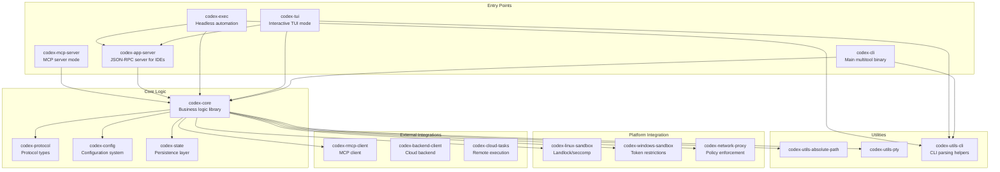
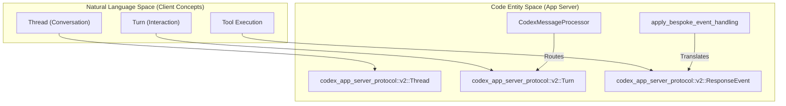
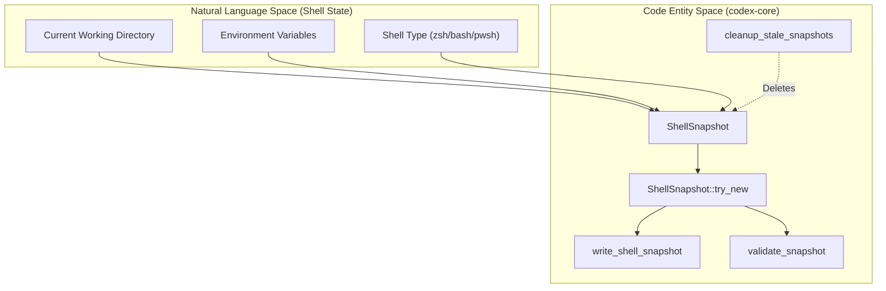

# 코드 구성 패턴

관련 소스 파일

다음 파일들은 이 위키 페이지를 생성하기 위한 컨텍스트로 사용되었습니다.

- [.bazelrc](.bazelrc)
- [.github/scripts/run-bazel-ci.sh](.github/scripts/run-bazel-ci.sh)
- [.github/scripts/run-bazel-query-ci.sh](.github/scripts/run-bazel-query-ci.sh)
- [.github/scripts/run_bazel_with_buildbuddy.py](.github/scripts/run_bazel_with_buildbuddy.py)
- [.github/scripts/rusty_v8_bazel.py](.github/scripts/rusty_v8_bazel.py)
- [.github/scripts/test_run_bazel_with_buildbuddy.py](.github/scripts/test_run_bazel_with_buildbuddy.py)
- [.github/scripts/test_rusty_v8_bazel.py](.github/scripts/test_rusty_v8_bazel.py)
- [.github/workflows/Dockerfile.bazel](.github/workflows/Dockerfile.bazel)
- [.github/workflows/bazel.yml](.github/workflows/bazel.yml)
- [.github/workflows/rusty-v8-release.yml](.github/workflows/rusty-v8-release.yml)
- [.github/workflows/v8-canary.yml](.github/workflows/v8-canary.yml)
- [AGENTS.md](AGENTS.md)
- [BUILD.bazel](BUILD.bazel)
- [MODULE.bazel](MODULE.bazel)
- [MODULE.bazel.lock](MODULE.bazel.lock)
- [SECURITY.md](SECURITY.md)
- [codex-rs/app-server/BUILD.bazel](codex-rs/app-server/BUILD.bazel)
- [codex-rs/core/BUILD.bazel](codex-rs/core/BUILD.bazel)
- [codex-rs/core/src/shell_snapshot.rs](codex-rs/core/src/shell_snapshot.rs)
- [codex-rs/core/src/shell_snapshot_tests.rs](codex-rs/core/src/shell_snapshot_tests.rs)
- [codex-rs/core/tests/suite/models_etag_responses.rs](codex-rs/core/tests/suite/models_etag_responses.rs)
- [codex-rs/core/tests/suite/shell_snapshot.rs](codex-rs/core/tests/suite/shell_snapshot.rs)
- [codex-rs/docs/bazel.md](codex-rs/docs/bazel.md)
- [codex-rs/keyring-store/Cargo.toml](codex-rs/keyring-store/Cargo.toml)
- [codex-rs/keyring-store/src/lib.rs](codex-rs/keyring-store/src/lib.rs)
- [codex-rs/linux-sandbox/src/proxy_routing.rs](codex-rs/linux-sandbox/src/proxy_routing.rs)
- [codex-rs/mcp-server/BUILD.bazel](codex-rs/mcp-server/BUILD.bazel)
- [codex-rs/process-hardening/Cargo.toml](codex-rs/process-hardening/Cargo.toml)
- [codex-rs/process-hardening/README.md](codex-rs/process-hardening/README.md)
- [codex-rs/process-hardening/src/lib.rs](codex-rs/process-hardening/src/lib.rs)
- [codex-rs/responses-api-proxy/npm/README.md](codex-rs/responses-api-proxy/npm/README.md)
- [codex-rs/responses-api-proxy/npm/bin/codex-responses-api-proxy.js](codex-rs/responses-api-proxy/npm/bin/codex-responses-api-proxy.js)
- [codex-rs/tui/BUILD.bazel](codex-rs/tui/BUILD.bazel)
- [codex-rs/utils/cargo-bin/BUILD.bazel](codex-rs/utils/cargo-bin/BUILD.bazel)
- [defs.bzl](defs.bzl)
- [docs/authentication.md](docs/authentication.md)
- [docs/contributing.md](docs/contributing.md)
- [docs/install.md](docs/install.md)
- [justfile](justfile)
- [patches/BUILD.bazel](patches/BUILD.bazel)
- [patches/rules_rs_build_script_deps_annotation.patch](patches/rules_rs_build_script_deps_annotation.patch)
- [patches/v8_bazel_rules.patch](patches/v8_bazel_rules.patch)
- [patches/v8_module_deps.patch](patches/v8_module_deps.patch)
- [patches/v8_source_portability.patch](patches/v8_source_portability.patch)
- [rbe.bzl](rbe.bzl)
- [scripts/list-bazel-clippy-targets.sh](scripts/list-bazel-clippy-targets.sh)
- [third_party/v8/BUILD.bazel](third_party/v8/BUILD.bazel)
- [third_party/v8/README.md](third_party/v8/README.md)
- [tools/argument-comment-lint/README.md](tools/argument-comment-lint/README.md)
- [tools/argument-comment-lint/lint_aspect.bzl](tools/argument-comment-lint/lint_aspect.bzl)
- [tools/argument-comment-lint/src/bin/argument-comment-lint.rs](tools/argument-comment-lint/src/bin/argument-comment-lint.rs)
- [tools/argument-comment-lint/test_wrapper_common.py](tools/argument-comment-lint/test_wrapper_common.py)
- [tools/argument-comment-lint/wrapper_common.py](tools/argument-comment-lint/wrapper_common.py)
- [workspace_root_test_launcher.bat.tpl](workspace_root_test_launcher.bat.tpl)
- [workspace_root_test_launcher.sh.tpl](workspace_root_test_launcher.sh.tpl)

## 목적과 범위

이 페이지는 Codex Rust codebase 전반에서 사용되는 코드 구성 패턴, 관례, 아키텍처 가이드라인을 문서화합니다. workspace 구조, crate 분류, module 구성, 그리고 **argument-comment-lint** 도구와 **Bazel** build target을 포함한 품질 강제 메커니즘을 다룹니다.

주요 아키텍처 동인은 AI-assisted development를 위한 **AGENTS.md** 관례, IDE 통합을 위한 **app-server protocol v2**, workspace 수준의 엄격한 **Clippy** 적용입니다.

---

## Workspace 구조와 Crate 분류

Codex codebase는 Cargo workspace로 구성되어 있습니다. workspace root [codex-rs/Cargo.toml:1-395]()(workspace 구성에서 암시됨)는 공유 의존성, lint, build profile을 정의합니다.

### Crate 범주

**출처:** [AGENTS.md:5-6](), [justfile:14-37](), [codex-rs/core/BUILD.bazel:1-55]()

---

## AGENTS.md 관례

`AGENTS.md` 파일은 human contributor와 AI contributor가 모두 따라야 하는 중요한 개발 패턴과 안전 규칙을 정의합니다.

### 핵심 개발 규칙
*   **Module Size:** Rust module은 500 LoC 미만을 목표로 합니다. 파일이 대략 800 LoC를 넘으면 기능을 새 module로 옮겨야 합니다 [AGENTS.md:43-47](). `codex-rs/tui/src/app.rs`, `codex-rs/tui/src/chatwidget.rs` 같은 중앙 orchestration module은 이 규칙에서 특별히 강조됩니다 [AGENTS.md:48-55]().
*   **Safety Restrictions:** `CODEX_SANDBOX_NETWORK_DISABLED_ENV_VAR` 또는 `CODEX_SANDBOX_ENV_VAR`와 관련된 코드는 절대 수정하지 않습니다. 이들은 실행 환경 보안을 관리합니다 [AGENTS.md:8-10]().
*   **Explicit Arguments:** 가독성을 유지하기 위해 opaque literal argument(예: `None`, `false`, numeric literal) 앞에 `/*param_name*/` 주석을 사용합니다 [AGENTS.md:14-18]().
*   **Dependency Management:** `Cargo.toml` 또는 `Cargo.lock` 변경 시 repo root에서 `just bazel-lock-update`를 실행해 `MODULE.bazel.lock`을 새로 고쳐야 합니다 [AGENTS.md:34-35](), [justfile:113-114]().
*   **Resist codex-core Bloat:** 새 로직이 specialized crate에 위치할 수 있다면 `codex-core`에 추가하지 않습니다 [AGENTS.md:66-69]().
*   **Formatting:** 변경 후 `just fmt`를 자동으로 실행합니다. 이는 Rust, Python SDK code, Python script를 다루는 `scripts/format.py`를 사용합니다 [justfile:40-41](), [AGENTS.md:58]().
*   **Async Traits:** `#[async_trait]`와 `#[allow(async_fn_in_trait)]`는 권장하지 않습니다. 명시적 `Send` bound가 있는 native RPITIT trait method를 선호합니다 [AGENTS.md:22-25]().

**출처:** [AGENTS.md:1-70](), [justfile:1-179]()

---

## App Server Protocol 패턴

`codex-app-server`는 JSON-RPC 2.0 bidirectional protocol을 구현합니다.

### Protocol Layering과 Data Flow
이 protocol은 bespoke event handling을 통해 server가 state change를 client로 다시 전달할 수 있도록 보장합니다.

**출처:** [justfile:149-152](), [AGENTS.md:66-70]()

---

## Bazel 빌드와 Linting 인프라

Codex는 hermetic build와 workspace-wide linting을 제공하기 위해 Cargo와 함께 Bazel을 사용합니다.

### Bazel Build Target
`defs.bzl` 파일은 workspace를 위한 `codex_rust_crate` macro와 custom test rule을 제공합니다 [defs.bzl:167-186]().

*   **Multiplatform Binaries:** Bazel은 Linux(GNU/MUSL), macOS, Windows(MSVC/GNULLVM)를 포함한 10개 platform triple 전반의 빌드를 지원합니다 [MODULE.bazel:178-192]().
*   **Toolchains:** Bazel은 hermetic LLVM toolchain과 특정 Rust version(예: `nightly/2025-09-18`)을 등록합니다 [MODULE.bazel:27](), [MODULE.bazel:127-131]().
*   **Windows Linking:** `-Wl,--stack,8388608` 또는 `/STACK:8388608`를 통한 8 MiB stack reserve를 포함해 Windows에서 Cargo의 linker 동작과 일치하도록 특정 flag가 적용됩니다 [defs.bzl:8-22]().
*   **Compile Data:** Bazel은 `include_str!` 또는 `include_bytes!`를 통해 접근되는 파일에 대해 명시적 `compile_data`를 요구합니다 [AGENTS.md:38-41](), [codex-rs/core/BUILD.bazel:6-14]().

### argument-comment-lint 도구
이 사용자 지정 도구는 opaque literal argument에 주석을 다는 관례를 강제합니다 [AGENTS.md:15-19]().

*   **Local Execution:** `just argument-comment-lint`로 실행합니다 [justfile:159-166]().
*   **Bazel Integration:** `argument_comment_lint_crates` extension을 사용해 지정된 target 전반에서 실행되는 Bazel config로 구현됩니다 [MODULE.bazel:194-209](), [.bazelrc:137-140]().
*   **CI Enforcement:** `bazel-test` target은 `--test_tag_filters=-argument-comment-lint`를 통해 표준 test run에서 이를 제외합니다 [justfile:125-126]().

### Bazel Clippy
Cargo가 local development를 처리하는 반면, Bazel은 workspace 전반에 걸친 통합 Clippy 검사를 제공합니다.
*   **Config:** 공유 `clippy.toml`을 사용합니다 [.bazelrc:116]().
*   **Execution:** `just bazel-clippy`는 `@rules_rust//rust:defs.bzl%rust_clippy_aspect`를 트리거합니다 [.bazelrc:114-115](), [justfile:130-131]().

**출처:** [MODULE.bazel:1-212](), [defs.bzl:1-186](), [.bazelrc:1-140](), [justfile:100-170](), [codex-rs/core/BUILD.bazel:1-55]()

---

## Code Review와 Testing Practices

### Testing Patterns
*   **Nextest:** local run에서는 표준 `cargo test`보다 빠른 `just test`(`cargo nextest` 사용)를 선호합니다 [justfile:77-78](), [AGENTS.md:60]().
*   **Equality Comparison:** 테스트 작성 시 개별 field보다 전체 object 비교를 선호합니다 [AGENTS.md:28]().
*   **Snapshots:** snapshot testing에 `cargo-insta`를 광범위하게 사용합니다 [AGENTS.md:7]().
*   **Workspace Root Tests:** Bazel의 custom `workspace_root_test` rule은 테스트가 올바른 directory context에서 실행되도록 보장합니다 [defs.bzl:153-186]().

### Shell Snapshot System
도구 실행 중 shell state를 캡처하고 복원하기 위한 특수 패턴입니다.
*   **Implementation:** `ShellSnapshot` struct를 통해 관리됩니다 [codex-rs/core/src/shell_snapshot.rs:27-31]().
*   **Lifecycle:** snapshot은 임시 path에 기록되고, 검증된 뒤 rename을 통해 finalize됩니다 [codex-rs/core/src/shell_snapshot.rs:138-178]().
*   **Cleanup:** 오래된 snapshot(3일 초과)은 비동기적으로 정리됩니다 [codex-rs/core/src/shell_snapshot.rs:34-35](), [codex-rs/core/src/shell_snapshot.rs:145-151]().

**출처:** [AGENTS.md:58-63](), [codex-rs/core/src/shell_snapshot.rs:1-210](), [defs.bzl:153-186]()

---

## 패턴 요약

1.  **Crate Prefixes:** 모든 internal crate는 `codex-` prefix를 사용합니다 [AGENTS.md:5]().
2.  **Bazel Parity:** `Cargo.toml`과 `BUILD.bazel` 사이의 parity를 유지합니다. 의존성 변경 후 `just bazel-lock-update`를 사용합니다 [AGENTS.md:34-35]().
3.  **Argument Comments:** `None` 또는 `true` 같은 literal에는 `/*param_name*/`가 필수입니다 [AGENTS.md:15-18]().
4.  **Module Limits:** monolithic file을 방지하기 위해 module당 엄격한 500-800 LoC 제한을 둡니다 [AGENTS.md:43-47]().
5.  **Config Schema:** `ConfigToml`이 변경될 때마다 `just write-config-schema`를 통해 `config.schema.json`을 업데이트합니다 [justfile:146-147](), [AGENTS.md:31]().

**출처:** [AGENTS.md:1-85](), [justfile:1-179](), [.bazelrc:1-140]()
