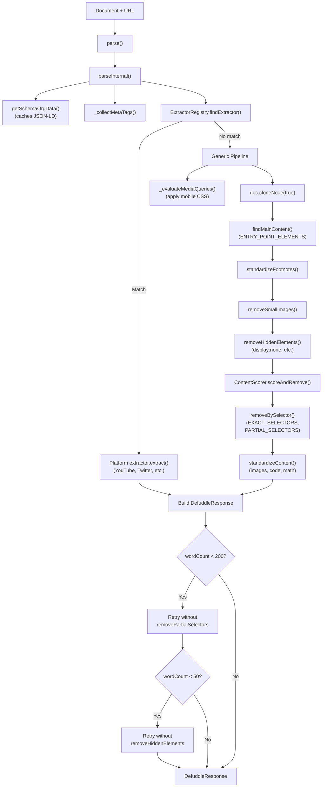
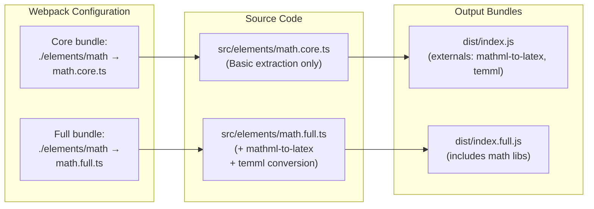

# 개요

관련 소스 파일

다음 파일들은 이 위키 페이지를 생성하는 맥락으로 사용되었습니다.

- [README.md](README.md)
- [package-lock.json](package-lock.json)
- [package.json](package.json)
- [src/constants.ts](src/constants.ts)
- [src/defuddle.ts](src/defuddle.ts)
- [src/metadata.ts](src/metadata.ts)
- [src/types.ts](src/types.ts)
- [tsconfig.node.json](tsconfig.node.json)
- [webpack.config.js](webpack.config.js)

Defuddle은 웹 페이지에서 **주요 콘텐츠를 추출하기 위한 TypeScript 라이브러리**입니다. 잡음 요소(내비게이션, 광고, 사이드바)를 제거하고, Markdown 변환이나 직접 소비에 적합한 일관된 형식으로 HTML을 표준화합니다.

이 라이브러리는 [Obsidian Web Clipper](https://github.com/obsidianmd/obsidian-clipper) 브라우저 확장을 위해 개발되었지만, 브라우저(core/full 번들), Node.js(linkedom/jsdom), 명령줄 등 어떤 환경에서도 실행됩니다.

**핵심 기능:**
- 점수화 알고리즘과 selector 기반 제거를 사용하는 범용 콘텐츠 추출
- YouTube, Twitter/X, Reddit, ChatGPT, GitHub, Hacker News를 위한 플랫폼별 추출기
- 이미지, 코드 블록, 수학 방정식, 각주에 대한 HTML 표준화
- Schema.org, meta 태그, DOM 분석을 통한 포괄적인 메타데이터 추출
- Turndown을 통한 선택적 Markdown 변환

**출처:** [README.md:1-20](), [package.json:1-10]()

## 시스템 아키텍처

Defuddle은 `Defuddle` 클래스가 조율하는 다섯 개의 주요 하위 시스템으로 구성됩니다.

### 상위 수준 아키텍처

```mermaid
graph TB
    subgraph "Core Library (src/)"
        Defuddle["Defuddle class<br/>(defuddle.ts)"]
        Registry["ExtractorRegistry<br/>(extractor-registry.ts)"]
        Metadata["MetadataExtractor<br/>(metadata.ts)"]
        Scorer["ContentScorer<br/>(scoring.ts)"]
        Standardize["standardizeContent()<br/>(standardize.ts)"]
    end
    
    subgraph "Platform Extractors (src/extractors/)"
        YouTube["YouTubeExtractor"]
        Twitter["TwitterExtractor"]
        Reddit["RedditExtractor"]
        ChatGPT["ChatGPTExtractor"]
        GitHub["GitHubExtractor"]
        HackerNews["HackerNewsExtractor"]
    end
    
    subgraph "Element Transformers (src/elements/)"
        Images["imageRules<br/>(images.ts)"]
        Code["codeBlockRules<br/>(code-blocks.ts)"]
        Math["mathRules<br/>(math.ts)"]
        Footnotes["FootnoteHandler<br/>(footnotes.ts)"]
    end
    
    subgraph "Constants (src/constants.ts)"
        EntryPoints["ENTRY_POINT_ELEMENTS<br/>(21 selectors)"]
        ExactSel["EXACT_SELECTORS<br/>(238 selectors)"]
        PartialSel["PARTIAL_SELECTORS<br/>(812 patterns)"]
    end
    
    subgraph "Distribution"
        CoreBundle["dist/index.js<br/>(Core Bundle)"]
        FullBundle["dist/index.full.js<br/>(Full Bundle)"]
        NodeBundle["dist/node.js<br/>(Node.js Bundle)"]
    end
    
    Defuddle --> Registry
    Defuddle --> Metadata
    Defuddle --> Scorer
    Defuddle --> Standardize
    Defuddle --> EntryPoints
    Defuddle --> ExactSel
    Defuddle --> PartialSel
    
    Registry -.selects.-> YouTube
    Registry -.selects.-> Twitter
    Registry -.selects.-> Reddit
    Registry -.selects.-> ChatGPT
    Registry -.selects.-> GitHub
    Registry -.selects.-> HackerNews
    
    Standardize --> Images
    Standardize --> Code
    Standardize --> Math
    Standardize --> Footnotes
    
    Defuddle ==>|packaged| CoreBundle
    Defuddle ==>|packaged| FullBundle
    Defuddle ==>|packaged| NodeBundle
```

`Defuddle` 클래스([src/defuddle.ts:51-1672]())는 주요 오케스트레이터 역할을 합니다. 이 클래스는 다음을 조율합니다.

1. **ExtractorRegistry** - URL/DOM을 패턴 매칭하여 플랫폼별 추출기를 선택합니다
2. **MetadataExtractor** - Schema.org/meta 태그/DOM에서 제목, 작성자, 날짜를 추출합니다
3. **ContentScorer** - 콘텐츠 밀도를 기준으로 블록 요소에 점수를 매겨 주요 콘텐츠를 식별합니다
4. **standardizeContent()** - 요소별 변환 규칙을 통해 HTML을 정규화합니다
5. **Selector constants** - 잡음 요소(광고, 내비게이션, 메타데이터)를 제거하기 위한 1000개 이상의 패턴입니다

**출처:** [src/defuddle.ts:1-30](), [src/constants.ts:1-100]()

### 콘텐츠 추출 파이프라인

`parse()` 메서드는 자동 재시도 로직이 포함된 다단계 파이프라인을 조율합니다.

이 파이프라인에는 초기 추출 결과가 매우 적은 페이지를 위한 세 가지 자동 재시도 전략이 포함됩니다.

| 재시도 전략 | 트리거 | 접근 방식 |
|----------------|---------|----------|
| 부분 selector 재시도 | `wordCount < 200` | 짧은 글을 보존하기 위해 `removePartialSelectors`를 비활성화 |
| 숨김 요소 재시도 | `wordCount < 50` | 클라이언트 렌더링 SPA를 위해 `removeHiddenElements`를 비활성화 |
| 인덱스 페이지 재시도 | `wordCount < 50` | 목록/인덱스 페이지를 위해 `removeLowScoring`을 비활성화 |

**출처:** [src/defuddle.ts:88-184](), [src/defuddle.ts:461-651]()

## 배포 전략

Defuddle은 Webpack과 TypeScript 컴파일을 통해 네 가지 번들을 생성합니다.

### 번들 구성

| 번들 | 엔트리 포인트 | 출력 | 형식 | 수식 처리 |
|--------|-------------|--------|--------|---------------|
| **Core** | [src/index.ts]() | `dist/index.js` | UMD | `mathml-to-latex`, `temml`을 외부화 |
| **Full** | [src/index.full.ts]() | `dist/index.full.js` | UMD | `mathml-to-latex`, `temml`을 번들에 포함 |
| **Node.js** | [src/node.ts]() | `dist/node.js` | CommonJS | 모든 의존성 포함 |
| **CLI** | [src/cli.ts]() | `dist/cli.js` | Binary | 인자 처리를 위해 `commander` 사용 |

### 모듈 alias 전략

Webpack의 `resolve.alias` 설정([webpack.config.js:69-72](), [webpack.config.js:94-97]())을 통해 동일한 import 문 `import { mathRules } from './elements/math'`이 빌드 대상에 따라 서로 다른 구현으로 해석될 수 있습니다.

- **Core bundle**: 기존 MathML/LaTeX를 추출하지만 변환은 수행하지 않는 `math.core.ts`로 alias됩니다
- **Full bundle**: 양방향 변환을 위해 `mathml-to-latex`와 `temml`을 포함하는 `math.full.ts`로 alias됩니다

core 번들은 `externals`([webpack.config.js:52-55]())를 사용해 수식 라이브러리를 제외하므로, 필요한 경우 사용자가 별도로 제공해야 합니다.

**출처:** [webpack.config.js:48-99](), [package.json:24-38]()

## 주요 기능

### 콘텐츠 추출

- **범용 알고리즘**: 콘텐츠 점수화, 요소 제거, 구조 분석을 사용해 임의의 웹 페이지에서 주요 콘텐츠를 식별합니다
- **사이트별 추출기**: Twitter/X, YouTube, GitHub, ChatGPT, Grok, Gemini를 포함한 주요 플랫폼을 위한 특화 핸들러
- **메타데이터 추출**: Schema.org 데이터, meta 태그, DOM 분석에서 포괄적으로 추출합니다

자세한 정보는 [Content Extraction](#3) 및 [Site-Specific Extractors](#5)를 참조하세요.

### 콘텐츠 표준화

- **HTML 정규화**: 다양한 HTML 구조를 일관되고 깔끔한 마크업으로 변환합니다
- **요소별 규칙**: 이미지, 코드 블록, 수학 표현식, 각주에 대한 특화 처리
- **모바일 인식 처리**: 반응형 디자인 스타일을 사용해 모바일에서 숨겨진 요소를 식별하고 제거합니다

자세한 정보는 [Content Standardization](#4)를 참조하세요.

### 다중 형식 출력

- **Clean HTML**: 추가 처리나 직접 표시에 적합한 표준화된 HTML
- **Markdown Conversion**: 의미 구조를 보존하면서 Markdown 형식으로 선택적으로 변환
- **Rich Metadata**: 추출된 작성자, 게시일, 이미지, 구조화된 데이터

자세한 정보는 [Markdown Conversion](#6.1)를 참조하세요.

**출처:** [README.md:10-20](), [src/defuddle.ts:95-118](), [src/types.ts]()
