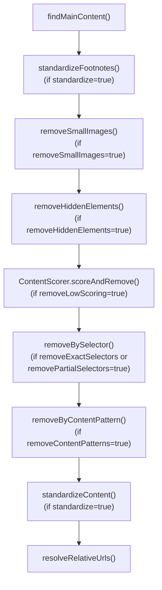
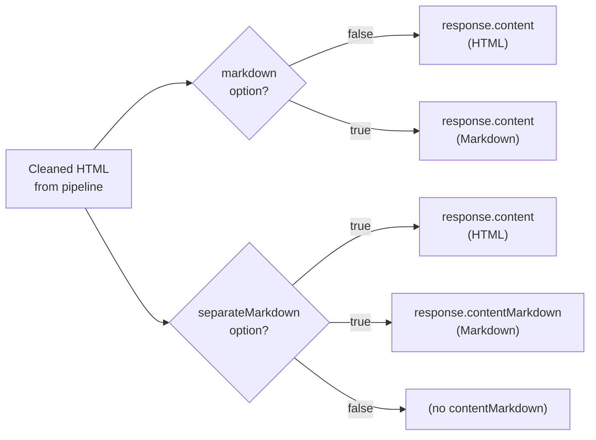
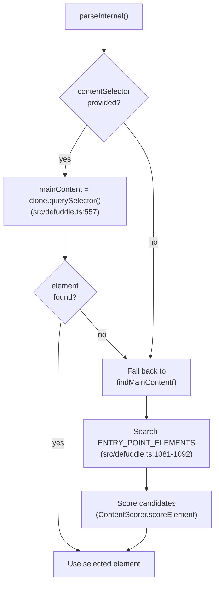
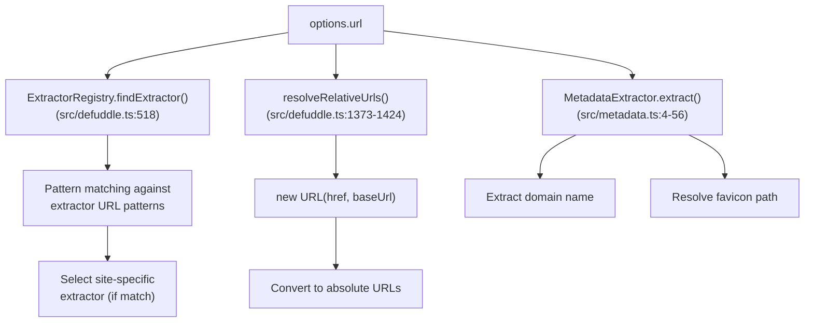
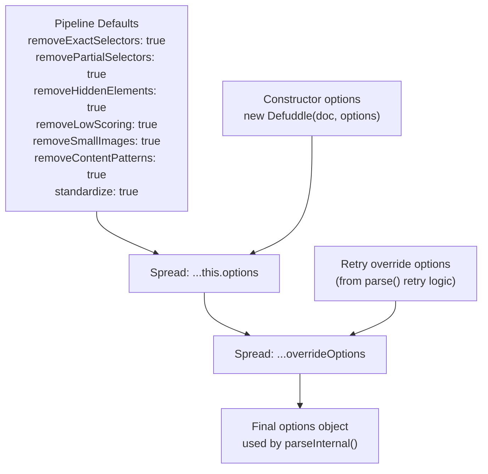
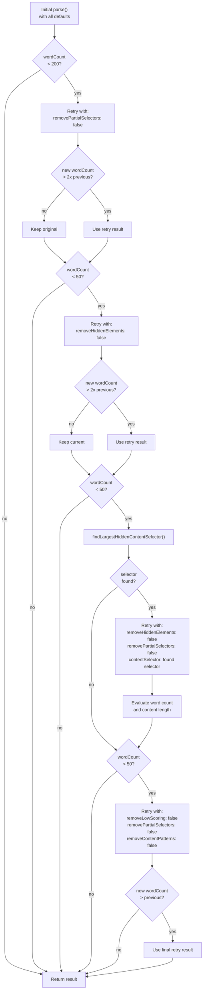

# 구성 및 옵션

<details>
<summary>관련 소스 파일</summary>

다음 파일들은 이 위키 페이지를 생성하는 데 컨텍스트로 사용되었습니다.

- [README.md](README.md)
- [src/constants.ts](src/constants.ts)
- [src/defuddle.ts](src/defuddle.ts)
- [src/metadata.ts](src/metadata.ts)
- [src/types.ts](src/types.ts)

</details>


이 페이지는 Defuddle의 콘텐츠 추출 및 처리 파이프라인의 모든 측면을 제어하는 `DefuddleOptions` 인터페이스에 대한 포괄적인 참조를 제공합니다. 옵션을 통해 클러터 제거 단계, 출력 형식, 콘텐츠 선택 전략, 디버그 기능을 세밀하게 제어할 수 있습니다.

추출 문제를 진단하기 위해 디버그 모드를 사용하는 방법은 [Debugging Features](#11.1)를 참조하세요. 추출 파이프라인 자체에 대한 자세한 내용은 [Core Extraction Pipeline](#3.1)을 참조하세요.

---

## DefuddleOptions 인터페이스

`DefuddleOptions` 인터페이스는 [src/types.ts:43-126]()에 정의되어 있으며, `Defuddle` 클래스 생성자와 `parseInternal()` 메서드의 동작을 모두 제어합니다. 모든 옵션은 선택 사항이며, 일반적인 웹 콘텐츠 추출에 최적화된 합리적인 기본값을 가집니다.

**출처:** [src/types.ts:43-126]()

---

## 옵션 범주

Defuddle 옵션은 추출 파이프라인에서의 역할에 따라 다섯 가지 기능 범주로 구성됩니다.

### 파이프라인 제어 옵션

이 boolean 플래그들은 클러터 제거 파이프라인의 특정 단계를 활성화하거나 비활성화합니다. 모두 기본값은 `true`이며, 이는 해당 정리 단계가 활성 상태임을 의미합니다.

| 옵션 | 타입 | 기본값 | 설명 |
|--------|------|---------|-------------|
| `removeExactSelectors` | `boolean` | `true` | 정확한 CSS 선택자와 일치하는 요소를 제거합니다(광고, 내비게이션, 푸터 등). |
| `removePartialSelectors` | `boolean` | `true` | 속성이 클러터 패턴과 부분적으로 일치하는 요소를 제거합니다. |
| `removeHiddenElements` | `boolean` | `true` | CSS로 숨겨진 요소를 제거합니다(`display:none`, `visibility:hidden`, `opacity:0`). |
| `removeLowScoring` | `boolean` | `true` | `ContentScorer` 알고리즘이 식별한 비콘텐츠 블록을 제거합니다. |
| `removeSmallImages` | `boolean` | `true` | 작은 이미지(아이콘, 추적 픽셀, 버튼)를 제거합니다. |
| `removeContentPatterns` | `boolean` | `false` | 콘텐츠 기반 패턴(읽는 시간, 상용구 텍스트, 기사 카드)과 일치하는 요소를 제거합니다. |
| `standardize` | `boolean` | `true` | HTML 구조(각주, 코드 블록, 수식, 이미지)를 표준화합니다. |

**파이프라인 실행 순서:**



**출처:** [src/defuddle.ts:484-494](), [src/defuddle.ts:575-620](), [src/types.ts:68-120]()

---

### 출력 형식 옵션

이 옵션들은 추출된 콘텐츠가 `DefuddleResponse`에서 어떻게 반환되는지를 제어합니다.

| 옵션 | 타입 | 기본값 | 설명 |
|--------|------|---------|-------------|
| `markdown` | `boolean` | `false` | `content` 필드를 HTML에서 Markdown으로 변환합니다. |
| `separateMarkdown` | `boolean` | `false` | `content`는 HTML로 유지하고 Markdown이 담긴 `contentMarkdown` 필드를 추가합니다. |

`markdown: true`이면 HTML 콘텐츠는 Turndown과 사용자 정의 규칙을 사용해 Markdown으로 변환됩니다. `separateMarkdown: true`이면 HTML 버전과 Markdown 버전이 모두 응답에 반환됩니다.

**응답 필드 매핑:**



**출처:** [src/types.ts:56-65](), [src/node.ts:1-50]()

---

### 콘텐츠 선택 옵션

이 옵션들은 Defuddle이 콘텐츠를 식별하고 추출하는 방식을 수정합니다.

| 옵션 | 타입 | 기본값 | 설명 |
|--------|------|---------|-------------|
| `contentSelector` | `string` | `undefined` | 자동 감지를 우회하고 주요 콘텐츠 요소로 사용할 CSS 선택자입니다. |
| `useAsync` | `boolean` | `true` | 로컬 HTML에 콘텐츠가 없을 때 비동기 추출기가 서드파티 API에서 가져오도록 허용합니다. |
| `removeImages` | `boolean` | `false` | 문서에서 모든 `` 요소를 제거합니다. |

**contentSelector 우회 흐름:**



`contentSelector` 옵션은 디버깅할 때나 특정 사이트에서 콘텐츠의 정확한 위치를 알고 있을 때 특히 유용합니다. 선택자가 어떤 요소와도 일치하지 않으면 Defuddle은 일반적인 자동 감지 로직으로 폴백합니다.

**출처:** [src/defuddle.ts:554-562](), [src/types.ts:122-125](), [src/types.ts:86-90]()

---

### 메타데이터 옵션

| 옵션 | 타입 | 기본값 | 설명 |
|--------|------|---------|-------------|
| `url` | `string` | `undefined` | 파싱 중인 페이지의 URL이며, 상대 URL 해석과 추출기 선택에 사용됩니다. |

`url` 옵션은 세 가지 목적을 가집니다.

1. **추출기 선택**: [src/extractor-registry.ts]()는 URL을 사용해 사이트별 추출기(YouTube, Reddit, Twitter 등)를 매칭합니다.
2. **상대 URL 해석**: `href` 및 `src` 속성의 상대 URL을 절대 URL로 변환합니다.
3. **메타데이터 폴백**: `document.URL`을 사용할 수 없을 때(예: Node.js 환경) 사용됩니다.

**URL 사용 흐름:**



**출처:** [src/types.ts:50-53](), [src/defuddle.ts:517-522](), [src/defuddle.ts:1373-1424]()

---

### 디버그 옵션

| 옵션 | 타입 | 기본값 | 설명 |
|--------|------|---------|-------------|
| `debug` | `boolean` | `false` | 디버그 로깅을 활성화하고 응답에 디버그 정보를 반환합니다. |

`debug: true`이면 Defuddle은 여러 방식으로 동작을 변경합니다.

**디버그 모드 효과:**

| 효과 | 구현 | 위치 |
|--------|---------------|----------|
| 콘솔 로깅 | `this._log()`가 콘솔에 출력합니다. | [src/defuddle.ts:669-673]() |
| 디버그 응답 필드 | `result.debug`에 `contentSelector`와 `removals`가 포함됩니다. | [src/defuddle.ts:632-637]() |
| 속성 보존 | HTML `class`, `id`, `data-*` 속성이 유지됩니다. | [src/standardize.ts]() |
| 제거 추적 | 제거된 각 요소가 단계, 이유, 텍스트 미리보기와 함께 기록됩니다. | [src/defuddle.ts:842-849]() |

**디버그 응답 구조:**

```typescript
interface DebugInfo {
  contentSelector: string;  // CSS selector path of main content element
  removals: DebugRemoval[]; // Array of removal events
}

interface DebugRemoval {
  step: string;      // Pipeline step: 'removeHiddenElements', 'removeLowScoring', etc.
  selector?: string; // Matching selector (for selector-based removal)
  reason?: string;   // Reason for removal: 'score: -20', 'display:none', etc.
  text: string;      // First 200 characters of removed content
}
```

**출처:** [src/types.ts:22-32](), [src/defuddle.ts:632-637](), [src/defuddle.ts:842-849]()

---

## 옵션 적용 및 병합

옵션은 파이프라인에 적용되기 전에 여러 병합 단계를 거쳐 흐릅니다. 이 계층 구조를 이해하는 것은 예상치 못한 동작을 디버깅하는 데 중요합니다.

### 옵션 계층



병합은 [src/defuddle.ts:484-494]()에서 이루어집니다.

```typescript
const options = {
  removeExactSelectors: true,
  removePartialSelectors: true,
  removeHiddenElements: true,
  removeLowScoring: true,
  removeSmallImages: true,
  removeContentPatterns: true,
  standardize: true,
  ...this.options,        // Constructor options
  ...overrideOptions      // Retry-specific overrides
};
```

**출처:** [src/defuddle.ts:484-494]()

---

### 재시도 로직과 동적 옵션 오버라이드

`parse()` 메서드는 초기 추출 결과의 콘텐츠가 충분하지 않을 때 정교한 재시도 전략을 구현하기 위해 동적 옵션 오버라이드를 사용합니다. 이는 Defuddle의 "관대한" 추출 접근 방식에서 핵심적인 부분입니다.

**재시도 전략 흐름:**



이 재시도 로직은 [src/defuddle.ts:88-159]()에 나타납니다.

**출처:** [src/defuddle.ts:88-159](), [src/defuddle.ts:324-347]()

---

## 사용 예시

### 옵션을 사용한 기본 사용법

```typescript
import Defuddle from 'defuddle';

// Minimal parsing with defaults
const result1 = new Defuddle(document).parse();

// Enable debug mode
const result2 = new Defuddle(document, { 
  debug: true 
}).parse();
console.log(result2.debug.contentSelector); // "article.post-content"
console.log(result2.debug.removals.length); // 47

// Convert to markdown
const result3 = new Defuddle(document, { 
  markdown: true 
}).parse();
console.log(typeof result3.content); // string (markdown)
```

**출처:** [README.md:23-34]()

---

### 파이프라인 튜닝

```typescript
// Aggressive cleanup (remove more)
const aggressive = new Defuddle(document, {
  removePartialSelectors: true,   // default
  removeLowScoring: true,         // default
  removeContentPatterns: true     // enable pattern removal
}).parse();

// Conservative cleanup (remove less)
const conservative = new Defuddle(document, {
  removePartialSelectors: false,  // keep elements with ambiguous class names
  removeLowScoring: false,        // keep low-scoring blocks
  removeContentPatterns: false    // keep read-time, dates, etc.
}).parse();

// Minimal cleanup (remove almost nothing)
const minimal = new Defuddle(document, {
  removeExactSelectors: false,    // keep ads, navigation
  removePartialSelectors: false,
  removeHiddenElements: false,
  removeLowScoring: false,
  removeSmallImages: false,
  removeContentPatterns: false
}).parse();
```

**출처:** [README.md:297-322]()

---

### 콘텐츠 선택 오버라이드

```typescript
// Bypass auto-detection with specific selector
const result = new Defuddle(document, {
  contentSelector: 'article.main-content'
}).parse();

// If selector doesn't match, falls back to auto-detection
const fallback = new Defuddle(document, {
  contentSelector: '.does-not-exist'  // Falls back to findMainContent()
}).parse();
```

**출처:** [README.md:312-321](), [src/defuddle.ts:554-562]()

---

### 옵션을 사용하는 Node.js

```typescript
import { parseHTML } from 'linkedom';
import { Defuddle } from 'defuddle/node';

const { document } = parseHTML(html);

// Node.js automatically uses markdown conversion
const result = await Defuddle(document, 'https://example.com', {
  markdown: true,           // Convert to markdown
  debug: true,              // Enable debug mode
  removeImages: false,      // Keep images
  standardize: true         // Standardize HTML before conversion
});
```

**출처:** [README.md:40-52](), [src/node.ts:1-50]()

---

### 비동기 추출기 비활성화

```typescript
// Prevent third-party API calls
const result = await new Defuddle(document, {
  useAsync: false  // Only use local HTML, no external fetches
}).parseAsync();

// Default behavior: allows async extractors
const withAsync = await new Defuddle(document, {
  useAsync: true   // May fetch from FxTwitter API, etc.
}).parseAsync();
```

**출처:** [src/types.ts:86-90](), [src/defuddle.ts:393-409]()

---

## 옵션-코드 매핑

다음 표는 각 옵션을 코드베이스의 구현 위치에 매핑합니다.

| 옵션 | 주요 구현 | 관련 코드 |
|--------|----------------------|--------------|
| `debug` | [src/defuddle.ts:70]() | [src/defuddle.ts:669-673](), [src/defuddle.ts:632-637]() |
| `url` | [src/defuddle.ts:518]() | [src/defuddle.ts:1373-1424](), [src/metadata.ts:8-41]() |
| `markdown` | [src/node.ts:35-44]() | [src/markdown.ts]() |
| `separateMarkdown` | [src/node.ts:35-44]() | [src/markdown.ts]() |
| `removeExactSelectors` | [src/defuddle.ts:597-606]() | [src/defuddle.ts:854-976]() |
| `removePartialSelectors` | [src/defuddle.ts:597-606]() | [src/defuddle.ts:887-935]() |
| `removeHiddenElements` | [src/defuddle.ts:585-588]() | [src/defuddle.ts:777-852]() |
| `removeLowScoring` | [src/defuddle.ts:590-594]() | [src/scoring.ts]() |
| `removeSmallImages` | [src/defuddle.ts:580-583]() | [src/defuddle.ts:1033-1048]() |
| `removeContentPatterns` | [src/defuddle.ts:609-611]() | [src/defuddle.ts:1426-1553]() |
| `standardize` | [src/defuddle.ts:576-578](), [src/defuddle.ts:614-616]() | [src/standardize.ts]() |
| `contentSelector` | [src/defuddle.ts:554-562]() | [src/defuddle.ts:1077-1149]() |
| `useAsync` | [src/defuddle.ts:394](), [src/defuddle.ts:403]() | [src/defuddle.ts:393-434]() |
| `removeImages` | [src/defuddle.ts:511-513]() | [src/defuddle.ts:770-775]() |

**출처:** [src/defuddle.ts:1-2000](), [src/types.ts:43-126]()

---

## 관련 구성 시스템

이 페이지는 `DefuddleOptions` 인터페이스를 다루지만, 몇 가지 관련 구성 시스템도 존재합니다.

- **선택자 상수**: [src/constants.ts]()의 광범위한 선택자 목록(예: `EXACT_SELECTORS`, `PARTIAL_SELECTORS`)은 옵션으로 구성할 수 없지만 [Constants and Selectors](#3.3)를 통해 이해할 수 있습니다.
- **디버그 출력**: 디버그 정보의 구조와 사용법은 [Debugging Features](#11.1)에 자세히 설명되어 있습니다.
- **파이프라인 단계**: 파이프라인 단계의 실행 순서와 내부 로직은 [Clutter Removal Pipeline](#4.3)에 설명되어 있습니다.

**출처:** [src/constants.ts:1-977]()
