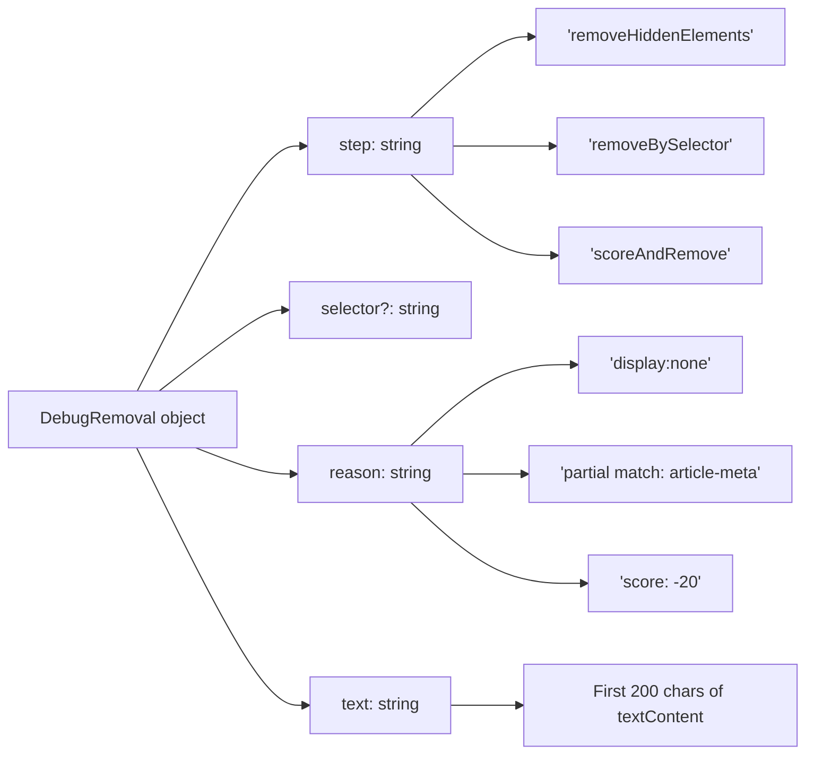
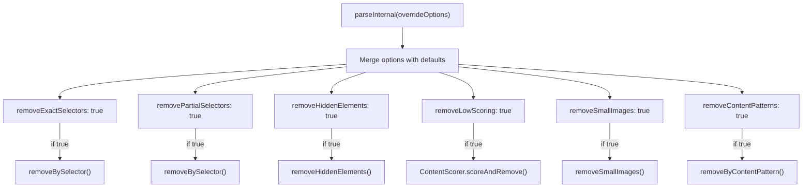
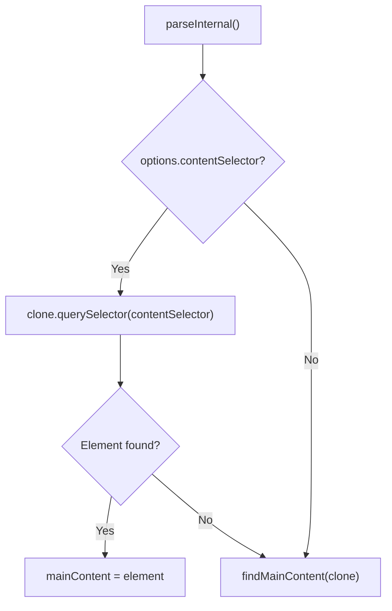
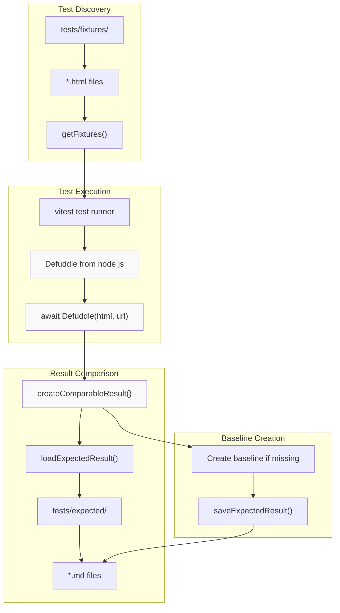
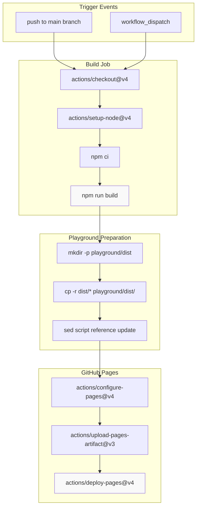

# 개발

<details>
<summary>관련 소스 파일</summary>

다음 파일들은 이 위키 페이지를 생성하는 데 컨텍스트로 사용되었습니다.

- [src/constants.ts](src/constants.ts)
- [src/defuddle.ts](src/defuddle.ts)
- [tests/debug.test.ts](tests/debug.test.ts)
- [website/src/docs.ts](website/src/docs.ts)
- [website/src/landing.ts](website/src/landing.ts)
- [website/src/playground.ts](website/src/playground.ts)

</details>


이 문서는 Defuddle로 작업하고 Defuddle에 기여하기 위한 개발 리소스를 다루며, 추출 동작을 조정하기 위한 디버깅 기능과 변경 사항을 검증하기 위한 테스트 프레임워크를 포함합니다.

## 디버깅 기능

Defuddle은 추출 문제를 진단하고 파싱 동작을 조정하는 데 도움이 되는 포괄적인 디버깅 기능을 제공합니다.

### 디버그 모드

디버그 모드는 Defuddle 인스턴스를 만들 때 `debug` 옵션을 `true`로 설정하여 활성화합니다.

```javascript
const result = new Defuddle(document, { debug: true }).parse();
```

디버그 모드가 활성화되면 다음과 같이 동작합니다.
- 자세한 추출 정보가 포함된 `debug` 필드를 `DefuddleResponse`에 반환합니다.
- `_log()` 메서드를 통해 파싱 과정에 대한 상세한 콘솔 로그를 출력합니다.
- 일반적으로 제거되는 HTML `class` 및 `id` 속성을 보존합니다.
- 검사를 위해 모든 `data-*` 속성을 유지합니다.
- 문서 구조를 보존하기 위해 div 평탄화를 건너뜁니다.

출처: [src/defuddle.ts:67-71](), [src/defuddle.ts:669-673](), [src/defuddle.ts:632-637]()

### 디버그 응답 구조

`DefuddleResponse`의 `debug` 필드에는 두 가지 핵심 속성이 포함됩니다.

| 속성 | 타입 | 설명 |
|----------|------|-------------|
| `contentSelector` | `string` | 선택된 주요 콘텐츠 요소의 CSS 선택자 경로 |
| `removals` | `DebugRemoval[]` | 처리 중 제거된 요소 배열 |

`contentSelector` 필드는 [src/defuddle.ts:634]()의 `getElementSelector()`에 의해 채워지며, 추출된 콘텐츠로 이어지는 정확한 DOM 경로를 보여줍니다. 이는 사용자 정의 `contentSelector` 오버라이드를 만드는 데 유용합니다.

출처: [src/defuddle.ts:632-637](), [src/types.ts]()

#### 제목: Debug Removals 배열 구조



출처: [src/types.ts](), [src/defuddle.ts:842-847](), [src/defuddle.ts:958-964]()

`removals` 배열의 각 항목에는 다음이 포함됩니다.

| 필드 | 설명 |
|-------|-------------|
| `step` | 요소를 제거한 파이프라인 단계(예: `removeHiddenElements`, `removeBySelector`, `scoreAndRemove`) |
| `selector` | 일치한 CSS 선택자 또는 패턴(선택 사항) |
| `reason` | 사람이 읽을 수 있는 설명(예: `display:none`, `partial match: article-meta`, `score: -20`) |
| `text` | 제거된 요소의 텍스트 콘텐츠 중 처음 200자 |

제거 기록은 파이프라인의 세 지점에서 로깅됩니다. [src/defuddle.ts:842-847]()의 `removeHiddenElements()`, [src/defuddle.ts:958-964]()의 `removeBySelector()`, 그리고 `ContentScorer.scoreAndRemove()`입니다.

출처: [src/defuddle.ts:777-851](), [src/defuddle.ts:854-976](), [src/scoring.ts]()

### 파이프라인 토글

Defuddle은 추출 문제를 진단하기 위해 개별 파이프라인 단계를 비활성화할 수 있습니다.

| 옵션 | 기본값 | 목적 |
|--------|---------|---------|
| `removeExactSelectors` | `true` | 정확한 선택자와 일치하는 요소를 제거합니다(광고, 소셜 버튼 등). |
| `removePartialSelectors` | `true` | 부분 속성 패턴과 일치하는 요소를 제거합니다. |
| `removeHiddenElements` | `true` | CSS로 숨겨진 요소를 제거합니다(`display:none`, `visibility:hidden` 등). |
| `removeLowScoring` | `true` | 콘텐츠 점수화로 비콘텐츠 블록을 제거합니다(내비게이션, 링크 목록 등). |
| `removeSmallImages` | `true` | 작은 이미지를 제거합니다(아이콘, 추적 픽셀 등). |
| `removeContentPatterns` | `true` | 콘텐츠 패턴으로 요소를 제거합니다(읽는 시간, 상용구, 기사 카드). |
| `standardize` | `true` | HTML을 표준화합니다(각주, 제목, 코드 블록 등). |

이 옵션들은 [src/defuddle.ts:484-494]()의 `parseInternal()`에서 처리되며, 파싱 중 실행되는 제거 단계를 제어합니다.

출처: [src/defuddle.ts:484-616](), [src/types.ts]()

#### 제목: 파이프라인 토글 사용



사용 예시:

```javascript
// Skip content scoring to preserve more content
const result = new Defuddle(document, { 
  removeLowScoring: false 
}).parse();

// Skip hidden element removal for JavaScript-rendered pages
const result = new Defuddle(document, { 
  removeHiddenElements: false 
}).parse();

// Disable all removal steps
const result = new Defuddle(document, {
  removeLowScoring: false,
  removeHiddenElements: false,
  removeSmallImages: false,
  removeExactSelectors: false,
  removePartialSelectors: false,
  removeContentPatterns: false
}).parse();
```

`parse()`의 재시도 메커니즘은 이러한 토글을 자동으로 사용합니다. 초기 추출 결과가 200단어 미만이면 [src/defuddle.ts:93-106]()에서 `removePartialSelectors: false`로 재시도합니다. 여전히 50단어 미만이면 [src/defuddle.ts:112-143]()에서 `removeHiddenElements: false`로 재시도합니다.

출처: [src/defuddle.ts:88-159](), [tests/debug.test.ts:57-114]()

### 콘텐츠 선택자 오버라이드

`contentSelector` 옵션은 자동 콘텐츠 감지를 우회하고 주요 콘텐츠 요소를 직접 지정합니다.

```javascript
const result = new Defuddle(document, {
  contentSelector: 'article.post-content'
}).parse();
```

선택자가 어떤 요소와도 일치하지 않으면 Defuddle은 `findMainContent()`를 통한 자동 감지로 폴백합니다. 선택자는 [src/defuddle.ts:556-562]()에서 처리됩니다.

출처: [src/defuddle.ts:556-573](), [tests/debug.test.ts:116-154]()

#### 제목: 콘텐츠 선택자 흐름



출처: [src/defuddle.ts:556-573]()

## 테스트 프레임워크

테스트 프레임워크는 HTML 파일을 Defuddle로 처리하고 예상 결과와 비교하는 fixture 기반 접근 방식을 사용합니다. 이 시스템은 포괄적인 회귀 테스트와 추출기 기능 검증을 가능하게 합니다.

### 테스트 아키텍처



출처: [tests/fixtures.test.ts:1-113]()

### 테스트 파일 구성

테스트 시스템은 테스트 데이터를 구성하기 위해 구조화된 접근 방식을 따릅니다.

| 디렉터리 | 목적 | 파일 형식 |
|-----------|---------|-------------|
| `tests/fixtures/` | 입력 HTML 파일 | 도메인별로 이름이 지정된 `.html` 파일 |
| `tests/expected/` | 예상 출력 | JSON 메타데이터 전문이 있는 `.md` 파일 |

[tests/fixtures.test.ts:36-46]()의 `getFixtures()` 함수는 fixtures 디렉터리의 모든 HTML 파일을 발견하고, [tests/fixtures.test.ts:49-51]()의 `getExpectedMarkdownPath()`는 해당 예상 결과 파일의 경로를 구성합니다.

출처: [tests/fixtures.test.ts:36-51]()

### 예상 결과 형식

테스트 프레임워크는 JSON 메타데이터와 Markdown 콘텐츠를 결합한 하이브리드 형식을 사용합니다. [tests/fixtures.test.ts:71-80]()의 `createComparableResult()` 함수가 이 형식을 생성합니다.

```markdown
```json
{
  "title": "Defuddle on Cloudflare Workers · Issue #56 · kepano/defuddle",
  "author": "jmorrell", 
  "site": "GitHub",
  "published": "2025-05-25T20:35:48.000Z"
}
```

**jmorrell** opened this issue on 5/25/2025

Example repo here: [https://github.com/jmorrell/defuddle-cloudflare-example]...
```

이 형식은 개발 중 메타데이터와 콘텐츠 변경 사항을 모두 쉽게 시각적으로 비교할 수 있게 해줍니다.

출처: [tests/fixtures.test.ts:71-80](), [tests/expected/github.com-issue-56.md:1-71]()

### 새 테스트 케이스 추가

새 테스트 fixture를 추가하려면 다음을 수행합니다.

1. HTML 파일을 `tests/fixtures/` 디렉터리에 추가합니다.
2. `npm test`를 실행해 기준 예상 결과를 생성합니다.
3. `tests/expected/`에 생성된 파일을 검토합니다.
4. 테스트 러너는 누락된 예상 결과에 대한 기준선을 자동으로 생성합니다.

[tests/fixtures.test.ts:89-111]()의 테스트 실행 로직은 기준선 생성과 비교를 모두 처리하며, 새 기준선이 생성될 때 로그를 남깁니다.

출처: [tests/fixtures.test.ts:89-111]()

## 지속적 통합 및 배포

이 프로젝트는 GitHub Actions를 사용해 playground를 GitHub Pages에 자동 배포하며, 테스트를 위해 최신 버전을 항상 사용할 수 있도록 합니다.

### 배포 파이프라인



출처: [.github/workflows/deploy-playground.yml:1-53]()

### 빌드 및 배포 프로세스

배포 워크플로는 몇 가지 핵심 단계를 수행합니다.

1. **환경 설정**: Node.js 20을 사용하고 `npm ci`로 의존성을 설치합니다.
2. **빌드 프로세스**: `npm run build`를 실행해 배포 파일을 생성합니다.
3. **애셋 준비**: 빌드된 파일을 `playground/dist/` 디렉터리로 복사합니다.
4. **스크립트 참조 업데이트**: `sed -i 's|\.\.\/dist\/|dist\/|g'`를 사용해 HTML이 로컬 배포 파일을 참조하도록 업데이트합니다.
5. **Pages 배포**: playground 디렉터리를 GitHub Pages artifact로 업로드합니다.

워크플로는 GitHub Pages 배포에 적절한 권한으로 구성되어 있으며 main에 대한 push와 수동 workflow dispatch에서 모두 실행됩니다.

출처: [.github/workflows/deploy-playground.yml:18-42]()

### Playground 배포 구조

배포 후 playground는 다음 구조를 가집니다.

```
playground/
├── index.html          # Main playground interface
├── dist/              # Built Defuddle distribution files
│   ├── index.js       # Core bundle
│   ├── index.full.js  # Full bundle with dependencies
│   └── node.js        # Node.js bundle
└── README.md          # Usage documentation
```

[.github/workflows/deploy-playground.yml:34]()의 스크립트 참조 업데이트는 playground HTML이 개발 중 사용되는 상대 경로가 아니라 로컬 배포 파일을 올바르게 참조하도록 보장합니다.

출처: [.github/workflows/deploy-playground.yml:30-42](), [playground/README.md:1-21]()
