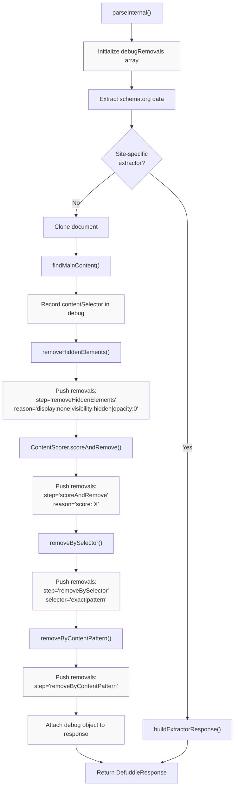
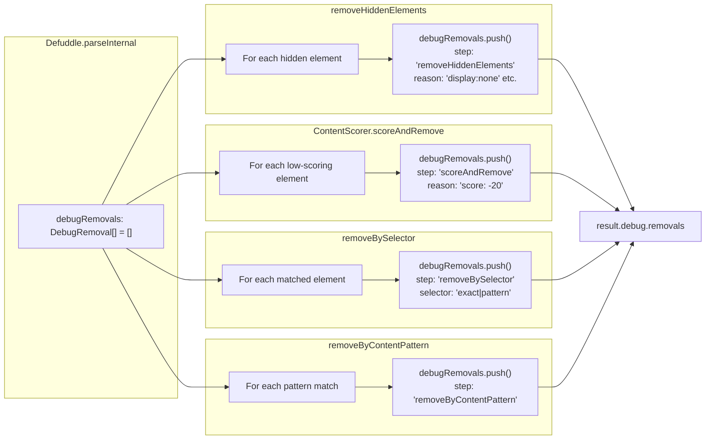
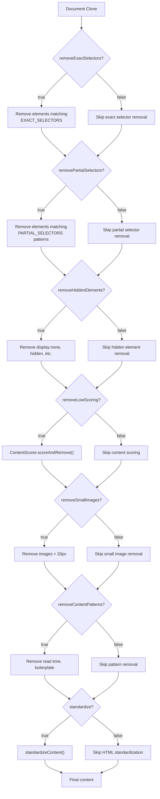
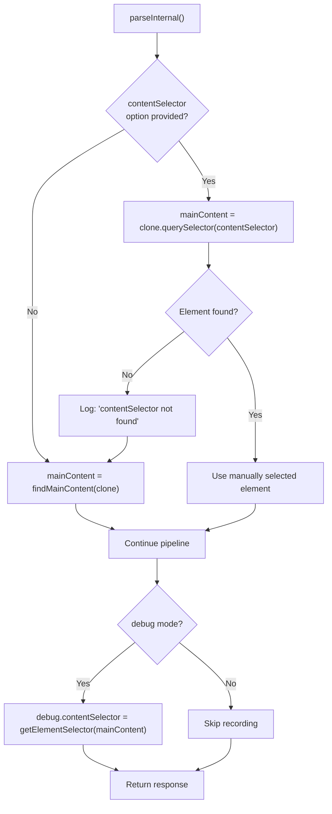

# 디버깅 기능

<details>
<summary>관련 소스 파일</summary>

다음 파일들은 이 위키 페이지를 생성하는 데 컨텍스트로 사용되었습니다.

- [src/constants.ts](src/constants.ts)
- [src/defuddle.ts](src/defuddle.ts)
- [tests/debug.test.ts](tests/debug.test.ts)
- [website/src/docs.ts](website/src/docs.ts)
- [website/src/landing.ts](website/src/landing.ts)
- [website/src/playground.ts](website/src/playground.ts)

</details>


이 페이지는 콘텐츠 추출 문제를 진단하기 위해 Defuddle에 내장된 디버깅 기능을 문서화합니다. 이러한 기능은 개발자가 파싱 파이프라인 중 특정 콘텐츠가 선택되거나 제거된 이유를 이해하는 데 도움이 됩니다.

디버깅에 한정되지 않는 일반 구성 옵션은 [Configuration and Options](#10)를 참조하세요. 추출 파이프라인의 동작 방식을 이해하려면 [Core Extraction Pipeline](#3.1)을 참조하세요.

---

## 디버그 모드 개요

디버그 모드는 Defuddle 생성자에 전달하는 옵션에서 `debug: true`를 설정하여 활성화합니다. 활성화되면 다음을 제공합니다.

- 추출 진단 정보가 포함된 `debug` 필드를 `DefuddleResponse`에 추가
- 파싱 과정 전반에서 `console.log`를 통한 상세한 콘솔 로깅
- 일반적으로 제거되는 HTML 구조 속성(`class`, `id`, `data-*`) 보존
- 원본 문서 구조를 유지하기 위해 래퍼 평탄화 건너뛰기

```javascript
// Browser usage
const result = new Defuddle(document, { debug: true }).parse();
console.log(result.debug.contentSelector);  // CSS selector of main content
console.log(result.debug.removals);         // Array of removed elements

// Node.js usage
const result = await Defuddle(document, url, { debug: true });
```

**출처:** [src/defuddle.ts:54-70](), [src/defuddle.ts:632-637](), [website/src/docs.ts:491-511]()

---

## 디버그 응답 구조

디버그 모드가 활성화되면 `DefuddleResponse`에는 두 가지 핵심 속성이 있는 `debug` 필드가 포함됩니다.

| 속성 | 타입 | 설명 |
|----------|------|-------------|
| `contentSelector` | `string` | 선택된 주요 콘텐츠 요소를 식별하는 CSS 선택자 경로 |
| `removals` | `DebugRemoval[]` | 처리 중 제거된 모든 요소의 배열이며, 제거 이유에 대한 메타데이터를 포함합니다. |

### Debug Removal 항목 구조

`removals` 배열의 각 항목에는 다음이 포함됩니다.

| 속성 | 타입 | 설명 |
|----------|------|-------------|
| `step` | `string` | 요소를 제거한 파이프라인 단계: `"removeHiddenElements"`, `"removeBySelector"`, `"scoreAndRemove"`, `"removeByContentPattern"` |
| `selector` | `string?` | 일치한 CSS 선택자 또는 패턴(해당하는 경우) |
| `reason` | `string` | 사람이 읽을 수 있는 설명(예: `"display:none"`, `"score: -20"`, `"exact selector match"`) |
| `text` | `string` | 식별을 위한 제거된 요소 텍스트 콘텐츠의 처음 200자 |

**출처:** [src/defuddle.ts:632-637](), [src/types.ts:2](), [website/src/docs.ts:524-536]()

---

## 파이프라인을 통과하는 디버그 데이터 흐름



**출처:** [src/defuddle.ts:461-651](), [src/defuddle.ts:777-851](), [src/defuddle.ts:854-976]()

---

## Debug Removal 수집 지점

다음 다이어그램은 코드베이스 전반에서 debug removal이 기록되는 위치를 매핑합니다.



**출처:** [src/defuddle.ts:495](), [src/defuddle.ts:842-850](), [src/defuddle.ts:958-965](), [src/scoring.ts]()

---

## 콘솔 로깅

디버그 모드는 비공개 `_log()` 메서드를 통해 상세 로깅을 활성화하며, 이 메서드는 `this.debug === true`일 때만 출력합니다.

| 로그 지점 | 메시지 | 위치 |
|-----------|---------|----------|
| 재시도 로직 | "Initial parse returned very little content, trying again" | [src/defuddle.ts:94]() |
| 재시도 성공 | "Retry produced more content" | [src/defuddle.ts:104]() |
| 숨겨진 콘텐츠 재시도 | "Still very little content, retrying without hidden-element removal" | [src/defuddle.ts:113]() |
| 선택자 재시도 | "Retrying with hidden content selector: ..." | [src/defuddle.ts:126]() |
| 인덱스 페이지 재시도 | "Still very little content, retrying without scoring/partial selectors" | [src/defuddle.ts:149]() |
| Schema 폴백 | "Found DOM content matching schema.org text" | [src/defuddle.ts:174]() |
| contentSelector 사용 | "Using contentSelector: X found/not found" | [src/defuddle.ts:558]() |
| 콘텐츠 후보 | "Content candidates: [{element, selector, score}]" | [src/defuddle.ts:1103-1108]() |
| 작은 이미지 | "Found small elements: X" | [src/defuddle.ts:1029]() |
| 숨겨진 요소 | "Removed hidden elements: X" | [src/defuddle.ts:851]() |
| 클러터 제거 | "Removed clutter elements: {exactSelectors, partialSelectors, total}" | [src/defuddle.ts:970-975]() |

**출처:** [src/defuddle.ts:669-673](), [src/defuddle.ts:94-174]()

---

## 파이프라인 토글

진단 목적으로 추출 파이프라인의 개별 단계를 비활성화할 수 있습니다. 각 토글은 기본값이 `true`인 boolean 옵션입니다.

### 제거 파이프라인 토글



### 토글 참조 표

| 옵션 | 기본값 | 목적 | 비활성화할 때 |
|--------|---------|---------|-----------------|
| `removeExactSelectors` | `true` | 정확한 CSS 선택자와 일치하는 요소를 제거합니다(광고, 헤더, 푸터). | 페이지가 실제 콘텐츠에 일반적인 클래스 이름을 사용할 때(예: 기사 본문의 byline에 `.author` 사용) |
| `removePartialSelectors` | `true` | 패턴과 일치하는 속성이 있는 요소를 제거합니다(예: `post-meta`, `article-date`). | 부분 선택자가 짧은 페이지에서 너무 공격적으로 동작할 때 |
| `removeHiddenElements` | `true` | CSS로 숨겨진 요소를 제거합니다(`display:none`, `visibility:hidden`, `opacity:0`). | 콘텐츠가 상호작용으로 표시되거나 숨겨진 래퍼를 사용할 때 |
| `removeLowScoring` | `true` | 콘텐츠 점수가 낮은 블록을 제거합니다(내비게이션, 링크 목록). | 카드가 비콘텐츠로 점수화되는 인덱스/목록 페이지 |
| `removeSmallImages` | `true` | 33×33픽셀보다 작은 이미지를 제거합니다. | 아이콘이 정당한 콘텐츠의 일부일 때 |
| `removeContentPatterns` | `true` | 콘텐츠 패턴과 일치하는 요소를 제거합니다(읽는 시간, 상용구 텍스트). | 정당한 콘텐츠에 이러한 패턴이 포함될 때 |
| `removeImages` | `false` | 출력에서 모든 이미지를 제거합니다. | 텍스트 전용 추출이 필요할 때 |
| `standardize` | `true` | HTML 표준화를 실행합니다(각주, 제목, 코드 블록, 수식). | 정규화 전 원시 추출을 디버깅할 때 |

**출처:** [src/defuddle.ts:484-494](), [src/defuddle.ts:576-616](), [tests/debug.test.ts:57-114]()

---

## 파이프라인 토글 사용

```javascript
// Disable content scoring for index pages
const result = new Defuddle(document, {
    removeLowScoring: false,
    removePartialSelectors: false
}).parse();

// Disable hidden element removal for JavaScript-rendered content
const result = new Defuddle(document, {
    removeHiddenElements: false
}).parse();

// Extract raw content without any standardization
const result = new Defuddle(document, {
    standardize: false,
    removeExactSelectors: false,
    removePartialSelectors: false
}).parse();

// Combine with debug mode to understand the difference
const withScoring = new Defuddle(document, { debug: true }).parse();
const withoutScoring = new Defuddle(document, {
    debug: true,
    removeLowScoring: false
}).parse();

console.log('Removed by scoring:', 
    withScoring.debug.removals.filter(r => r.step === 'scoreAndRemove')
);
```

**출처:** [website/src/docs.ts:538-553](), [tests/debug.test.ts:58-75]()

---

## contentSelector 옵션

`contentSelector` 옵션은 자동 콘텐츠 감지를 우회하고 Defuddle이 특정 CSS 선택자를 주요 콘텐츠 요소로 사용하도록 강제합니다.

```javascript
const result = new Defuddle(document, {
    contentSelector: 'article.post-content'
}).parse();
```

### 동작

1. 선택자가 요소와 일치하면 해당 요소가 `mainContent`가 됩니다.
2. 선택자가 일치하지 않으면 자동 콘텐츠 감지로 폴백합니다.
3. 디버그 모드가 활성화되어 있으면 선택자가 로그에 기록됩니다.
4. 선택된 선택자는 수동으로 지정되었는지 여부와 관계없이 `debug.contentSelector`에 나타납니다.

### 사용 사례

| 시나리오 | 예시 선택자 |
|----------|------------------|
| 알려진 콘텐츠 컨테이너 | `article.post-content`, `#main-article` |
| 피드 페이지에서 점수화를 우회 | `.article-card:first-child` |
| 숨겨진 콘텐츠 래퍼 대상 지정 | `[data-article-content]` |
| 특정 섹션 추출 | `section.methodology` |
| body를 루트로 강제 | `body`(모든 것을 추출) |



**출처:** [src/defuddle.ts:556-562](), [src/defuddle.ts:632-637](), [tests/debug.test.ts:116-154]()

---

## 디버그 워크플로 예시

다음 워크플로는 추출 문제를 해결하기 위해 디버그 기능을 사용하는 방법을 보여줍니다.

### 1단계: 디버그를 사용한 초기 파싱

```javascript
const result = new Defuddle(document, {
    debug: true,
    url: 'https://example.com/article'
}).parse();

console.log('Content selector:', result.debug.contentSelector);
console.log('Word count:', result.wordCount);
console.log('Removals:', result.debug.removals.length);
```

### 2단계: 단계별 제거 항목 검사

```javascript
const byStep = result.debug.removals.reduce((acc, r) => {
    acc[r.step] = (acc[r.step] || 0) + 1;
    return acc;
}, {});

console.log('Removals by pipeline step:', byStep);
// Example output:
// {
//   removeBySelector: 45,
//   removeHiddenElements: 12,
//   scoreAndRemove: 8
// }
```

### 3단계: 문제가 될 수 있는 제거 항목 식별

```javascript
// Find removals that might be content
const suspectRemovals = result.debug.removals.filter(r => {
    const wordCount = r.text.split(/\s+/).length;
    return wordCount > 20;  // Removed elements with substantial text
});

console.log('Potentially removed content:', suspectRemovals);
```

### 4단계: 토글을 비활성화해 테스트

```javascript
// If many removals from scoreAndRemove, try disabling it
const retryResult = new Defuddle(document, {
    debug: true,
    removeLowScoring: false
}).parse();

console.log('Before:', result.wordCount);
console.log('After:', retryResult.wordCount);
```

### 5단계: 특정 콘텐츠 선택자 사용

```javascript
// If a specific container is known from debug.contentSelector
const targetResult = new Defuddle(document, {
    debug: true,
    contentSelector: 'div.article-body'
}).parse();
```

**출처:** [website/src/docs.ts:491-561](), [tests/debug.test.ts:17-154]()

---

## 디버그 모드의 속성 보존

디버그 모드가 활성화되면 정리 과정 중 일반적으로 제거되는 특정 HTML 속성이 보존됩니다.

| 속성 | 일반 모드 | 디버그 모드 | 목적 |
|-----------|-------------|------------|---------|
| `class` | 제거됨 | 보존됨 | CSS 클래스로 요소 식별 |
| `id` | 제거됨 | 보존됨 | ID로 요소 식별 |
| `data-*` | 제거됨 | 보존됨 | 사용자 정의 데이터 속성 검사 |

이 보존 기능을 통해 개발자는 추출된 HTML을 검사하고, 속성을 기준으로 어떤 특정 요소가 선택되거나 제거되었는지 이해할 수 있습니다.

**출처:** [src/defuddle.ts:632-637](), [src/constants.ts:973-976]()

---

## 디버그 기능 테스트

테스트 스위트는 디버그 기능의 올바른 사용법을 보여줍니다.

```javascript
// Verify debug field exists and is populated
test('debug: true returns debug info', async () => {
    const result = await Defuddle(parseDocument(html, url), url, { 
        debug: true 
    });
    
    expect(result.debug).toBeDefined();
    expect(result.debug.contentSelector).toBeTruthy();
    expect(Array.isArray(result.debug.removals)).toBe(true);
});

// Verify removal entries have required fields
test('debug removals include step and text', async () => {
    const result = await Defuddle(parseDocument(html, url), url, { 
        debug: true 
    });
    
    for (const removal of result.debug.removals) {
        expect(removal.step).toBeTruthy();
        expect(typeof removal.text).toBe('string');
        expect(removal.text.length).toBeLessThanOrEqual(200);
    }
});

// Verify pipeline toggles affect removals
test('removeLowScoring: false skips content scoring', async () => {
    const withScoring = await Defuddle(parseDocument(html, url), url, {
        debug: true
    });
    const withoutScoring = await Defuddle(parseDocument(html, url), url, {
        debug: true,
        removeLowScoring: false
    });
    
    const scoringRemovals = withoutScoring.debug.removals.filter(
        r => r.step === 'scoreAndRemove'
    );
    expect(scoringRemovals.length).toBe(0);
});
```

더 포괄적인 테스트 정보는 [Testing Framework](#11.2)를 참조하세요.

**출처:** [tests/debug.test.ts:1-154]()
