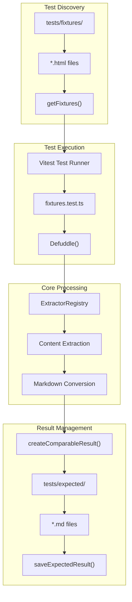
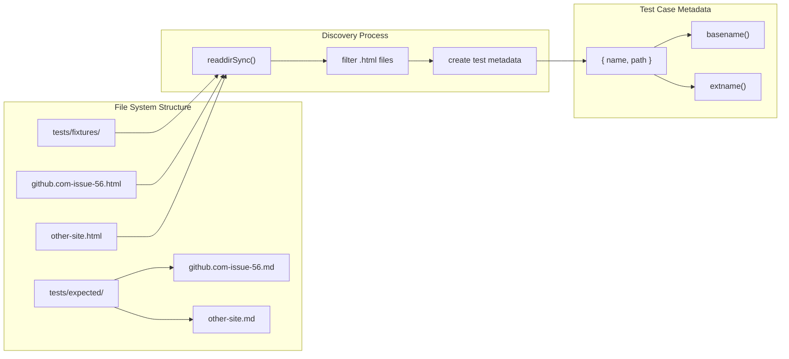
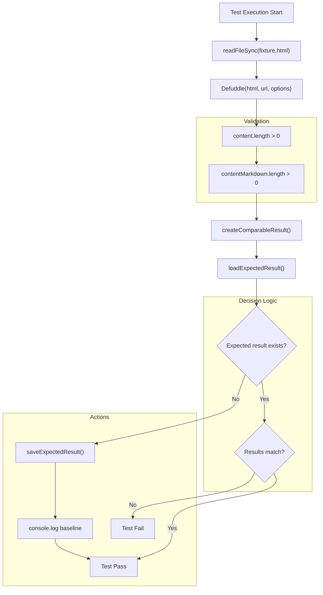
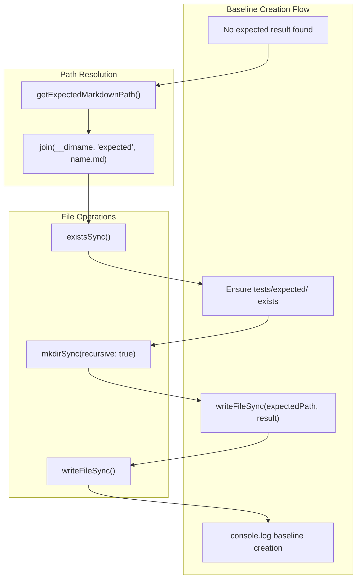
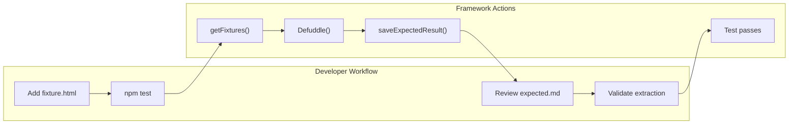

# 테스트 프레임워크

<details>
<summary>관련 소스 파일</summary>

다음 파일들은 이 위키 페이지를 생성하는 데 컨텍스트로 사용되었습니다.

- [src/elements/code.ts](src/elements/code.ts)
- [src/extractors/youtube.ts](src/extractors/youtube.ts)
- [tests/youtube-transcript.test.ts](tests/youtube-transcript.test.ts)
- [website/src/convert.ts](website/src/convert.ts)

</details>


Defuddle 테스트 프레임워크는 다양한 웹사이트와 콘텐츠 유형에서 콘텐츠 추출을 검증하기 위한 포괄적인 fixture 기반 테스트 시스템을 제공합니다. 이 프레임워크는 HTML fixture를 자동으로 발견하고, Defuddle 추출기를 통해 처리한 뒤, 일관된 추출 품질을 보장하기 위해 저장된 예상 출력과 결과를 비교합니다.

수동 테스트를 위한 인터랙티브 playground에 대한 정보는 [Playground](#7.1)를 참조하세요.

## 아키텍처 개요

테스트 프레임워크는 실제 HTML 샘플을 테스트 케이스로 저장하고 전체 Defuddle 파이프라인을 통해 처리하는 fixture 주도 접근 방식으로 동작합니다. 이 시스템은 기준선 생성, 결과 비교, 테스트 실패 보고를 자동으로 처리합니다.



**테스트 프레임워크 아키텍처**

출처: [tests/fixtures.test.ts:1-113]()

## Fixture 발견 시스템

프레임워크는 `getFixtures()` 함수를 통해 테스트 케이스를 자동으로 발견합니다. 이 함수는 `tests/fixtures/` 디렉터리에서 HTML 파일을 스캔하고 테스트 케이스 메타데이터를 생성합니다.



**Fixture 발견 및 파일 구조**

| 함수 | 목적 | 위치 |
|----------|---------|----------|
| `getFixtures()` | tests/fixtures/에서 HTML fixture를 발견합니다. | [tests/fixtures.test.ts:36-46]() |
| `readdirSync()` | fixture 디렉터리 내용을 읽습니다. | [tests/fixtures.test.ts:38]() |
| `basename()` | 파일 이름에서 fixture 이름을 추출합니다. | [tests/fixtures.test.ts:41]() |

출처: [tests/fixtures.test.ts:35-46]()

## 예상 결과 형식

프레임워크는 JSON 메타데이터 전문이 있는 markdown 파일로 예상 결과를 저장합니다. 이 형식은 자동 비교와 추출 품질에 대한 사람의 검토를 모두 가능하게 합니다.

```mermaid
graph TB
    subgraph "DefuddleResponse Structure"
        RESPONSE["DefuddleResponse"]
        TITLE["title"]
        AUTHOR["author"]
        SITE["site"]
        PUBLISHED["published"]
        CONTENT_MD["contentMarkdown"]
        CONTENT_HTML["content"]
    end
    
    subgraph "Expected Result Format"
        JSON_BLOCK["```json\n{ metadata }\n```"]
        SEPARATOR["\n\n"]
        MARKDOWN_CONTENT["markdown content"]
    end
    
    subgraph "Processing Functions"
        CREATE_COMPARABLE["createComparableResult()"]
        METADATA_ONLY["metadataOnly extraction"]
        JSON_STRINGIFY["JSON.stringify()"]
    end
    
    RESPONSE --> TITLE
    RESPONSE --> AUTHOR
    RESPONSE --> SITE
    RESPONSE --> PUBLISHED
    RESPONSE --> CONTENT_MD
    
    TITLE --> METADATA_ONLY
    AUTHOR --> METADATA_ONLY
    SITE --> METADATA_ONLY
    PUBLISHED --> METADATA_ONLY
    
    METADATA_ONLY --> JSON_STRINGIFY
    JSON_STRINGIFY --> JSON_BLOCK
    CONTENT_MD --> MARKDOWN_CONTENT
    
    JSON_BLOCK --> CREATE_COMPARABLE
    SEPARATOR --> CREATE_COMPARABLE
    MARKDOWN_CONTENT --> CREATE_COMPARABLE
```

**예상 결과 파일 형식 구조**

`createComparableResult()` 함수는 `DefuddleResponse` 객체를 표준화된 형식으로 변환합니다.

```typescript
// Metadata extracted for comparison
const metadataOnly = {
  title: response.title,
  author: response.author, 
  site: response.site,
  published: response.published,
};
```

출처: [tests/fixtures.test.ts:71-80]()

## 테스트 실행 파이프라인

테스트 실행은 fixture를 전체 Defuddle 시스템을 통해 처리하고 예상값과 비교해 결과를 검증하는 포괄적인 파이프라인을 따릅니다.



**테스트 실행 흐름**

| 단계 | 함수 | 목적 |
|------|----------|---------|
| Fixture 로드 | `readFileSync()` | HTML fixture 콘텐츠 읽기 |
| 처리 | `Defuddle()` | 전체 파이프라인을 사용해 콘텐츠 추출 |
| 결과 형식화 | `createComparableResult()` | 표준화된 비교 형식 생성 |
| 예상값 로드 | `loadExpectedResult()` | 저장된 예상 결과 로드 |
| 비교 | `expect().toEqual()` | 추출 결과가 예상과 일치하는지 검증 |

출처: [tests/fixtures.test.ts:89-111]()

## 기준선 생성 및 관리

fixture에 대한 예상 결과가 없으면 프레임워크는 기준 예상 결과를 자동으로 생성합니다. 이는 반복적인 테스트 개발을 지원하고 새 fixture를 즉시 테스트할 수 있게 보장합니다.



**기준선 생성 프로세스**

`saveExpectedResult()` 함수는 기준선 생성을 관리합니다.

| 함수 | 목적 | 위치 |
|----------|---------|----------|
| `getExpectedMarkdownPath()` | 예상 결과 파일 경로 생성 | [tests/fixtures.test.ts:49-51]() |
| `saveExpectedResult()` | 예상 결과를 파일 시스템에 쓰기 | [tests/fixtures.test.ts:53-60]() |
| `loadExpectedResult()` | 기존 예상 결과 로드 | [tests/fixtures.test.ts:62-69]() |

출처: [tests/fixtures.test.ts:48-69](), [tests/fixtures.test.ts:102-106]()

## 새 테스트 케이스 추가

새 테스트 케이스는 HTML fixture 파일을 `tests/fixtures/` 디렉터리에 배치하여 추가합니다. 프레임워크는 테스트 실행 중 이를 자동으로 발견하고 처리합니다.

### Fixture 이름 지정 규칙

Fixture 파일은 출처와 콘텐츠 유형을 명확히 식별하기 위해 `domain.com-page-identifier.html` 패턴을 사용해 이름을 지정해야 합니다.

- `github.com-issue-56.html` - GitHub issue 페이지
- `twitter.com-thread-123.html` - Twitter thread
- `youtube.com-video-abc.html` - YouTube video 페이지

### 테스트 케이스 워크플로

1. **Fixture 추가**: HTML 파일을 `tests/fixtures/`에 배치합니다.
2. **테스트 실행**: `npm test`를 실행해 새 fixture를 발견합니다.
3. **기준선 검토**: `tests/expected/`에 생성된 파일을 확인합니다.
4. **결과 검증**: 추출 품질이 기대를 충족하는지 확인합니다.



**새 테스트 케이스 추가 워크플로**

출처: [tests/fixtures.test.ts:24-32]()

## 예상 결과 업데이트

추출 로직이 변경되면 해당 예상 결과 파일을 삭제하고 테스트를 다시 실행해 새 기준선을 생성함으로써 예상 결과를 업데이트할 수 있습니다.

### 업데이트 워크플로

1. **예상 결과 삭제**: `tests/expected/`에서 파일을 제거합니다.
2. **테스트 실행**: 테스트를 실행해 기준선을 다시 생성합니다.
3. **변경 사항 검토**: 새 추출 결과를 검증합니다.
4. **업데이트된 기준선 커밋**: 새 예상 결과를 버전 관리에 포함합니다.

| 작업 | 명령 | 목적 |
|-----------|---------|---------|
| 예상값 삭제 | `rm tests/expected/fixture-name.md` | 오래된 기준선 제거 |
| 재생성 | `npm test` | 새 기준선 생성 |
| 검토 | `git diff tests/expected/` | 변경 사항 비교 |

출처: [tests/fixtures.test.ts:29-32]()
