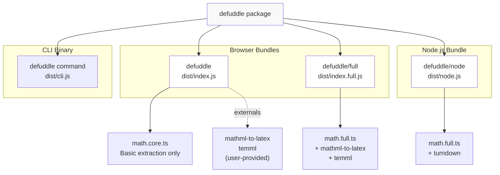
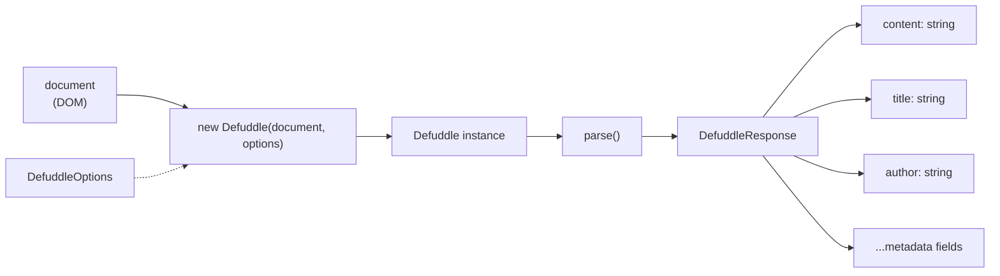
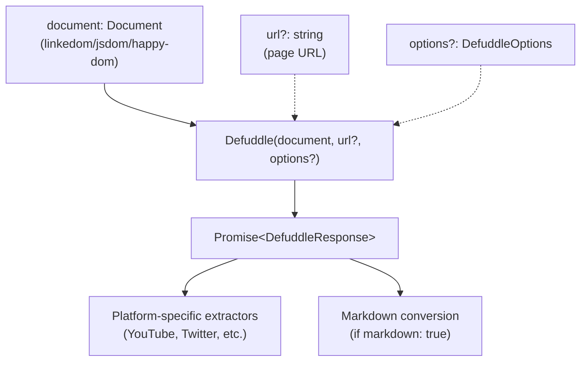
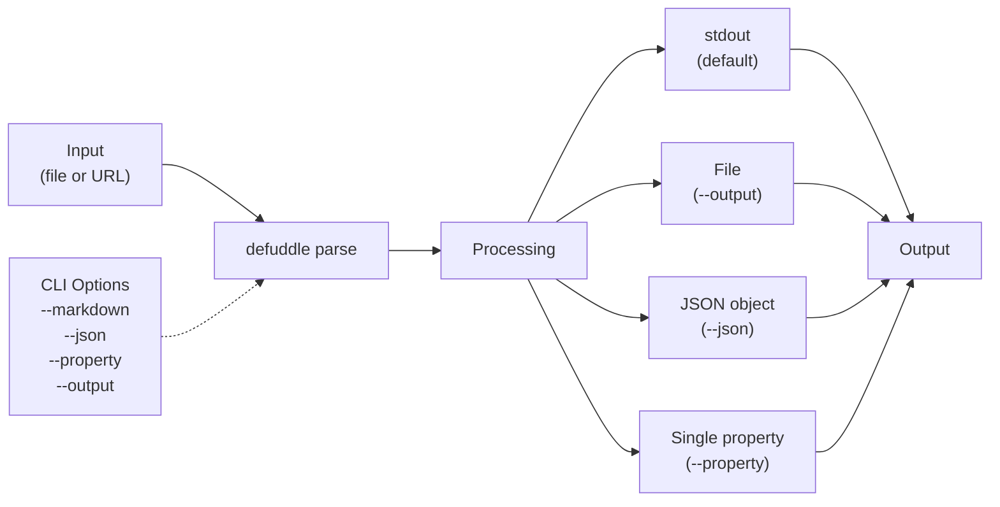

# 시작하기

<details>
<summary>관련 소스 파일</summary>

다음 파일들은 이 위키 페이지를 생성하는 맥락으로 사용되었습니다.

- [README.md](README.md)
- [package-lock.json](package-lock.json)
- [package.json](package.json)
- [src/metadata.ts](src/metadata.ts)
- [src/types.ts](src/types.ts)
- [tsconfig.node.json](tsconfig.node.json)
- [webpack.config.js](webpack.config.js)

</details>


이 페이지는 Defuddle을 빠르게 설치하고 실행할 수 있도록 설치 지침과 기본 사용 예제를 제공합니다. Defuddle을 사용하는 세 가지 주요 방식, 즉 브라우저, Node.js 환경, 명령줄 인터페이스에서의 사용을 다룹니다.

아키텍처와 내부 시스템에 대한 자세한 정보는 [Architecture](#3)를 참조하세요. 포괄적인 설정 옵션은 [Configuration and Options](#10)를 참조하세요.

---

## 설치

### 브라우저 및 Node.js

npm에서 Defuddle을 설치합니다.

```bash
npm install defuddle
```

Node.js에서 사용하려면 DOM 구현도 필요합니다. Defuddle은 `linkedom`, `jsdom`, `happy-dom`을 지원합니다.

```bash
# Recommended: linkedom (fastest, smallest)
npm install linkedom

# Alternative: jsdom (most compatible)
npm install jsdom
```

### CLI

CLI는 설치 없이 `npx`로 사용할 수 있습니다.

```bash
npx defuddle parse https://example.com/article
```

또는 `defuddle` 명령을 위해 전역으로 설치합니다.

```bash
npm install -g defuddle
```

**출처:** [package.json:1-103](), [README.md:104-134]()

---

## 패키지 구조 및 번들

Defuddle은 서로 다른 환경에 최적화된 세 가지 별도 번들을 제공합니다.

### 번들 배포 다이어그램



| 번들 | Import 경로 | 형식 | 환경 | 수식 라이브러리 | Markdown |
|--------|------------|--------|-------------|----------------|----------|
| **Core** | `defuddle` | UMD | 브라우저 | 외부(선택 사항) | 아니요 |
| **Full** | `defuddle/full` | UMD | 브라우저 | 번들 포함 | 아니요 |
| **Node.js** | `defuddle/node` | CommonJS | Node.js | 번들 포함 | 예 |
| **CLI** | `defuddle` | Binary | 명령줄 | 번들 포함 | 예 |

**core bundle**은 대부분의 브라우저 사용 사례에 권장됩니다. 번들 크기를 최소화하기 위해 수식 변환 라이브러리를 외부화합니다. **full bundle**은 완전한 수식 처리 기능을 포함합니다. **Node.js bundle**은 `turndown`을 통한 수식 처리와 markdown 변환을 모두 포함합니다.

**출처:** [package.json:24-39](), [README.md:158-167](), [webpack.config.js:1-102]()

---

## 브라우저 사용법

### 기본 사용법

브라우저 환경에서 Defuddle은 현재 `document`를 대상으로 동작합니다.

```javascript
import Defuddle from 'defuddle';

// Parse the current document
const defuddle = new Defuddle(document);
const result = defuddle.parse();

// Access extracted content and metadata
console.log(result.content);    // Clean HTML content
console.log(result.title);      // Article title
console.log(result.author);     // Author name
console.log(result.wordCount);  // Word count
```

### 사용 흐름 다이어그램



### 옵션과 함께 사용

```javascript
const result = new Defuddle(document, {
  debug: true,
  removeImages: false,
  contentSelector: 'article.main-content'
}).parse();
```

### 번들 선택

수식 변환(LaTeX ↔ MathML)을 위해서는 다음을 사용합니다.

```javascript
// Full bundle with built-in math libraries
import Defuddle from 'defuddle/full';

const result = new Defuddle(document).parse();
```

**출처:** [README.md:19-34](), [package.json:24-32]()

---

## Node.js 사용법

### linkedom 사용

Node.js의 `Defuddle()` 함수는 어떤 DOM `Document` 구현이든 받을 수 있습니다.

```javascript
import { parseHTML } from 'linkedom';
import { Defuddle } from 'defuddle/node';

const html = '<html>...</html>';
const { document } = parseHTML(html);

const result = await Defuddle(document, 'https://example.com/article', {
  markdown: true
});

console.log(result.content);        // Markdown content
console.log(result.title);          // Extracted title
console.log(result.description);    // Meta description
```

### jsdom 사용

```javascript
import { JSDOM } from 'jsdom';
import { Defuddle } from 'defuddle/node';

const html = '<html>...</html>';
const dom = new JSDOM(html, { url: 'https://example.com/article' });

const result = await Defuddle(dom.window.document, 'https://example.com/article', {
  markdown: true
});
```

### Node.js 함수 시그니처



**참고:** Node.js에서 사용하려면 올바른 ESM import 지원을 위해 `package.json`에 `{ "type": "module" }`이 필요합니다.

**출처:** [README.md:36-64](), [package.json:35-38]()

---

## 명령줄 인터페이스

### 기본 명령

CLI는 Defuddle의 파싱 기능에 명령줄에서 직접 접근할 수 있게 해줍니다.

```bash
# Parse local HTML file
npx defuddle parse page.html

# Parse URL
npx defuddle parse https://example.com/article

# Convert to markdown
npx defuddle parse page.html --markdown

# Output as JSON with full metadata
npx defuddle parse page.html --json

# Extract specific property
npx defuddle parse page.html --property title

# Save to file
npx defuddle parse page.html --output result.html --markdown

# Enable debug mode
npx defuddle parse page.html --debug
```

### CLI 옵션 표

| 옵션 | 별칭 | 설명 |
|--------|-------|-------------|
| `--output <file>` | `-o` | stdout 대신 파일에 출력 기록 |
| `--markdown` | `-m` | 콘텐츠를 markdown 형식으로 변환 |
| `--md` | | `--markdown`의 별칭 |
| `--json` | `-j` | 메타데이터와 콘텐츠를 포함해 JSON으로 출력 |
| `--property <name>` | `-p` | 특정 속성(title, author, domain 등) 추출 |
| `--debug` | | 상세 로깅이 포함된 debug mode 활성화 |

### CLI 워크플로 다이어그램



**출처:** [README.md:66-103](), [package.json:6-8]()

---

## 응답 구조

모든 Defuddle 파싱 메서드는 `DefuddleResponse` 객체를 반환합니다.

### DefuddleResponse 속성

```mermaid
graph TB
    Response["DefuddleResponse"]
    
    subgraph "Core Content"
        Content["content: string<br/>(cleaned HTML or markdown)"]
        ContentMD["contentMarkdown?: string<br/>(if separateMarkdown: true)"]
    end
    
    subgraph "Metadata"
        Title["title: string"]
        Author["author: string"]
        Description["description: string"]
        Published["published: string"]
        Domain["domain: string"]
        Site["site: string"]
        Language["language: string"]
    end
    
    subgraph "Media"
        Image["image: string<br/>(main image URL)"]
        Favicon["favicon: string"]
    end
    
    subgraph "Structured Data"
        SchemaOrg["schemaOrgData: object"]
        MetaTags["metaTags?: MetaTagItem[]"]
    end
    
    subgraph "Processing Info"
        WordCount["wordCount: number"]
        ParseTime["parseTime: number<br/>(milliseconds)"]
        ExtractorType["extractorType?: string"]
    end
    
    subgraph "Debugging"
        Debug["debug?: DebugInfo<br/>(if debug: true)"]
    end
    
    Response --> Content
    Response --> ContentMD
    Response --> Title
    Response --> Author
    Response --> Description
    Response --> Published
    Response --> Domain
    Response --> Site
    Response --> Language
    Response --> Image
    Response --> Favicon
    Response --> SchemaOrg
    Response --> MetaTags
    Response --> WordCount
    Response --> ParseTime
    Response --> ExtractorType
    Response --> Debug
```



### 속성 상세 표

| 속성 | 타입 | 설명 |
|----------|------|-------------|
| `content` | string | 정리된 HTML 콘텐츠(또는 `markdown: true`인 경우 markdown) |
| `contentMarkdown` | string | Markdown 콘텐츠(`separateMarkdown: true`인 경우에만) |
| `title` | string | meta 태그, Schema.org 또는 DOM에서 가져온 글 제목 |
| `author` | string | 여러 출처에서 가져온 작성자 이름 |
| `description` | string | 글 설명/요약 |
| `domain` | string | 도메인 이름(예: `example.com`) |
| `site` | string | 사이트 이름(예: `Example Blog`) |
| `published` | string | ISO 형식의 게시일 |
| `language` | string | BCP 47 형식의 언어 코드(예: `en-US`) |
| `image` | string | 주요 글 이미지 URL |
| `favicon` | string | 사이트 favicon URL |
| `schemaOrgData` | object | 원본 Schema.org JSON-LD 데이터 |
| `metaTags` | MetaTagItem[] | 수집된 meta 태그(선택 사항) |
| `wordCount` | number | 추출된 콘텐츠의 총 단어 수 |
| `parseTime` | number | 밀리초 단위 처리 시간 |
| `extractorType` | string | 사용된 추출기 이름(플랫폼별인 경우) |
| `debug` | DebugInfo | Debug 정보(`debug: true`인 경우에만) |

**출처:** [src/types.ts:34-41](), [README.md:136-156]()

---

## 기본 옵션

`DefuddleOptions`를 사용해 Defuddle의 동작을 설정합니다.

### 필수 옵션

```javascript
const options = {
  // Convert output to markdown
  markdown: true,
  
  // Enable debug logging and info
  debug: true,
  
  // Specify page URL (for Node.js)
  url: 'https://example.com/article',
  
  // Force specific content container
  contentSelector: 'article.main',
  
  // Remove all images
  removeImages: true
};

const result = new Defuddle(document, options).parse();
```

### 옵션 빠른 참조

| 옵션 | 타입 | 기본값 | 설명 |
|--------|------|---------|-------------|
| `markdown` | boolean | `false` | `content`를 markdown으로 변환 |
| `separateMarkdown` | boolean | `false` | HTML을 `content`에 유지하고 `contentMarkdown` 추가 |
| `debug` | boolean | `false` | 상세 로깅이 포함된 debug mode 활성화 |
| `url` | string | - | 페이지 URL(Node.js에서 필수) |
| `contentSelector` | string | - | 주요 콘텐츠로 강제할 CSS selector |
| `removeImages` | boolean | `false` | 출력에서 모든 이미지 제거 |
| `useAsync` | boolean | `true` | 플랫폼 추출기에 비동기 API 호출 허용 |

### 파이프라인 제어 옵션

| 옵션 | 타입 | 기본값 | 설명 |
|--------|------|---------|-------------|
| `removeExactSelectors` | boolean | `true` | 광고, 소셜 버튼 제거(정확 일치) |
| `removePartialSelectors` | boolean | `true` | 광고, 소셜 버튼 제거(부분 일치) |
| `removeHiddenElements` | boolean | `true` | CSS로 숨겨진 요소 제거 |
| `removeLowScoring` | boolean | `true` | 점수화를 통해 콘텐츠가 적은 블록 제거 |
| `removeSmallImages` | boolean | `true` | 아이콘과 추적 픽셀 제거 |
| `standardize` | boolean | `true` | HTML 구조 정규화 |

전체 옵션 세부 정보는 [Configuration and Options](#10)를 참조하세요.

**출처:** [src/types.ts:43-126](), [README.md:168-184]()

---

## 빠른 시작 예제

### 예제 1: 기본 브라우저 추출

```javascript
import Defuddle from 'defuddle';

const defuddle = new Defuddle(document);
const result = defuddle.parse();

document.body.innerHTML = result.content;
```

### 예제 2: Markdown을 사용하는 Node.js

```javascript
import { parseHTML } from 'linkedom';
import { Defuddle } from 'defuddle/node';
import fs from 'fs';

const html = fs.readFileSync('article.html', 'utf8');
const { document } = parseHTML(html);

const result = await Defuddle(document, 'https://example.com/article', {
  markdown: true
});

fs.writeFileSync('article.md', result.content);
```

### 예제 3: CLI 일괄 처리

```bash
# Process multiple files
for file in *.html; do
  npx defuddle parse "$file" --markdown --output "${file%.html}.md"
done
```

### 예제 4: Debug Mode 조사

```javascript
const result = new Defuddle(document, {
  debug: true,
  removeLowScoring: false  // Disable scoring to test
}).parse();

console.log('Chosen selector:', result.debug.contentSelector);
console.log('Removals:', result.debug.removals);
```

**출처:** [README.md:19-91](), [README.md:259-321]()

---

## 다음 단계

이제 Defuddle을 설치하고 실행할 수 있으므로 다음을 살펴보세요.

- **아키텍처 학습:** 시스템 설계와 컴포넌트 관계는 [Architecture](#3)를 참조하세요
- **콘텐츠 추출 이해:** 전체 파이프라인은 [Content Extraction](#4)를 참조하세요
- **플랫폼 추출기 탐색:** YouTube, Twitter, Reddit 등에 대해서는 [Platform-Specific Extractors](#6)를 참조하세요
- **고급 옵션 설정:** 사용 가능한 모든 설정은 [Configuration and Options](#10)를 참조하세요
- **추출 문제 디버깅:** 디버깅 기법은 [Development](#11)를 참조하세요

**출처:** [README.md:1-322]()
