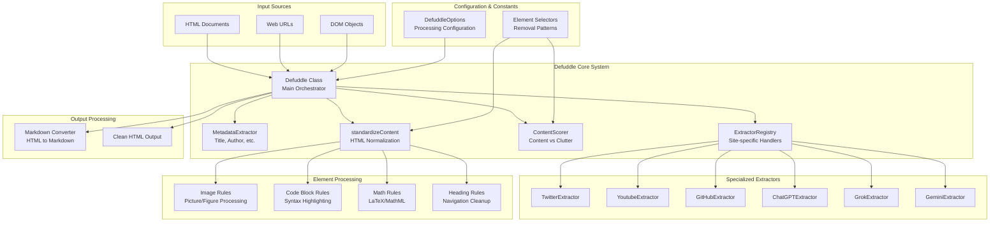
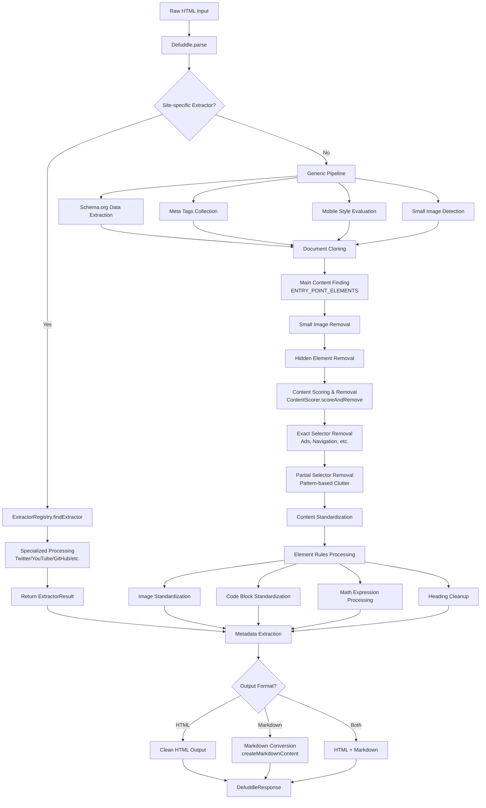
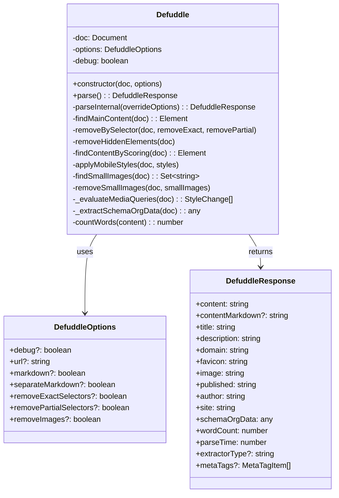
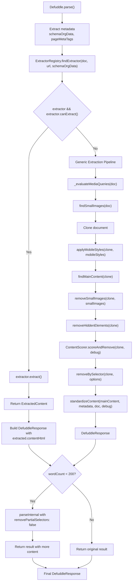
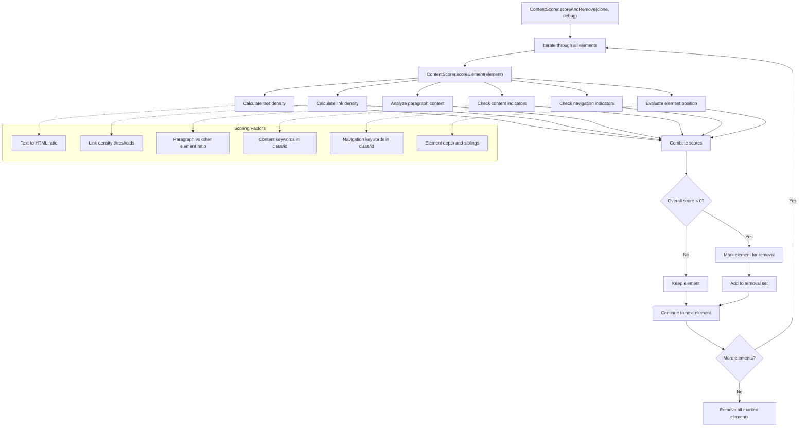
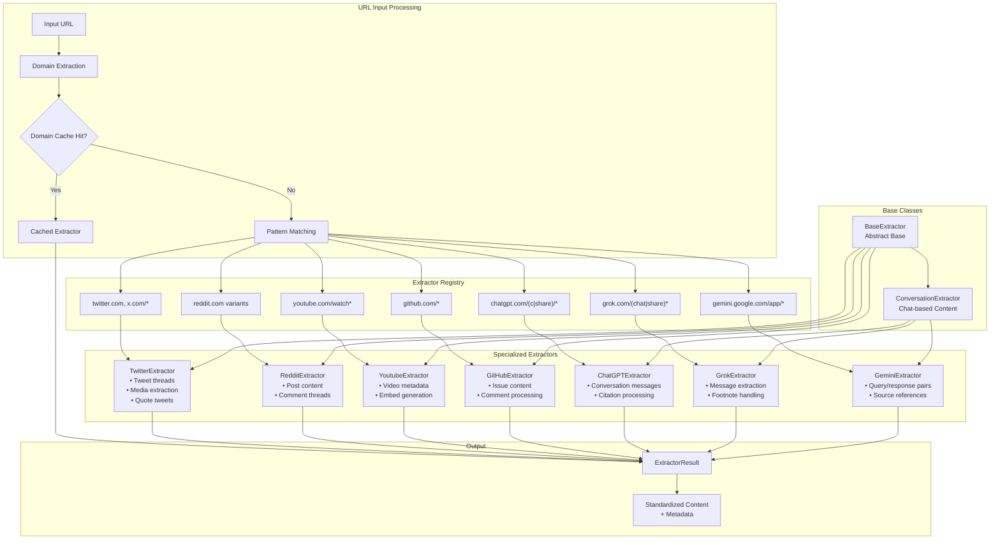
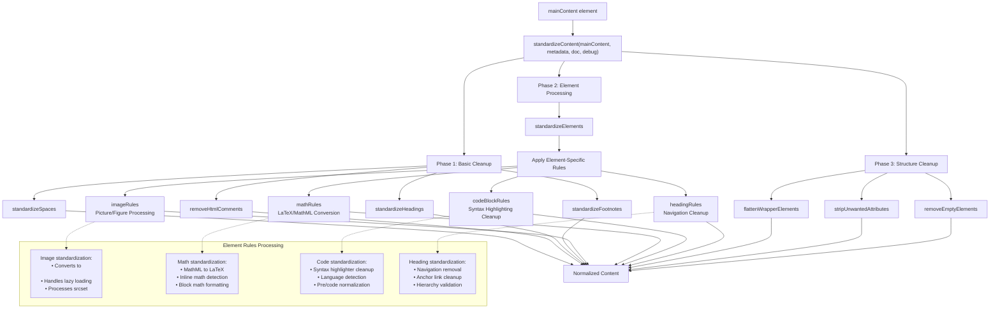
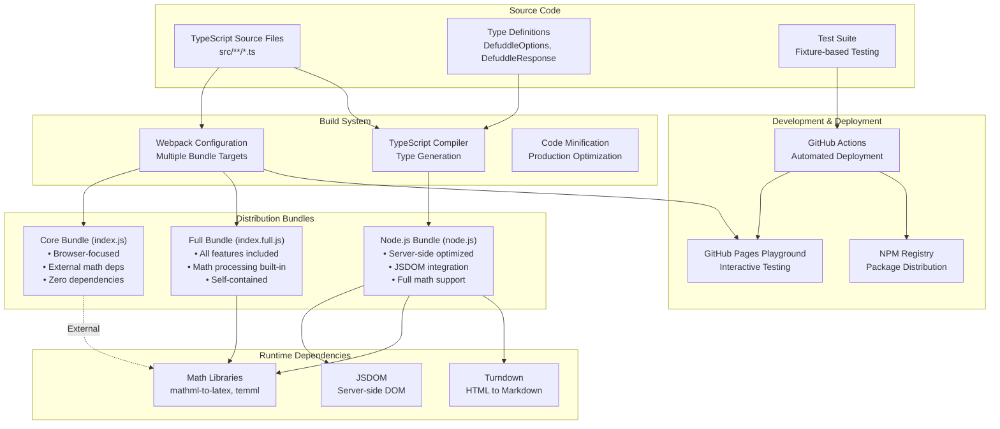
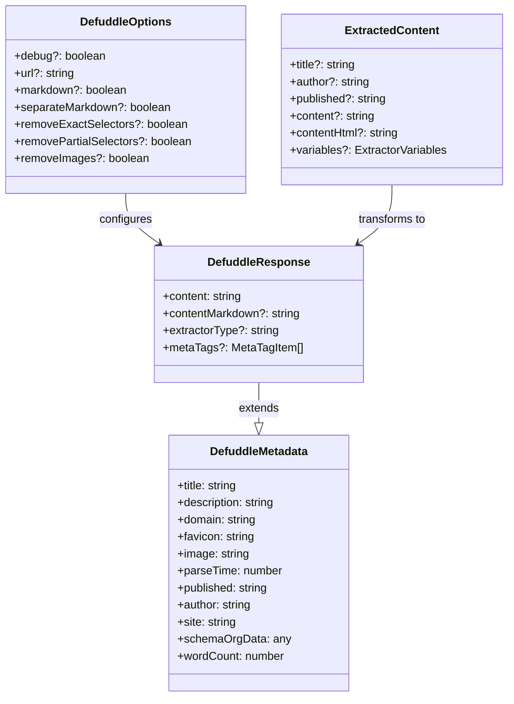

# 아키텍처

관련 소스 파일

다음 파일들은 이 위키 페이지를 생성하는 맥락으로 사용되었습니다.

- [package-lock.json](package-lock.json)
- [package.json](package.json)
- [src/constants.ts](src/constants.ts)
- [src/defuddle.ts](src/defuddle.ts)
- [tsconfig.node.json](tsconfig.node.json)
- [webpack.config.js](webpack.config.js)

이 문서는 Defuddle의 상위 수준 아키텍처를 개요로 설명하며, 핵심 컴포넌트, 데이터 흐름, 시스템 구성을 포함합니다. 코드베이스의 여러 부분이 웹 페이지에서 콘텐츠를 추출하고 처리하기 위해 어떻게 함께 동작하는지 설명합니다.

라이브러리 사용 방법은 [Overview](#1)를 참조하세요. 콘텐츠가 추출되는 방식에 대한 자세한 내용은 [Content Extraction](#3)을 참조하세요.

## 시스템 개요

Defuddle은 HTML 문서를 처리해 주요 콘텐츠를 식별하고 추출하면서 잡음 요소, 광고, 내비게이션 요소를 제거하는 콘텐츠 추출 라이브러리입니다. 이 시스템은 알려진 웹사이트를 위한 특화 추출기와 일반 웹 콘텐츠를 위한 범용 추출 파이프라인을 갖춘 모듈식 아키텍처를 따릅니다.

### 전체 시스템 아키텍처

출처: [src/defuddle.ts:1-14](), [src/defuddle.ts:21-35](), [src/defuddle.ts:40-59]()

### 콘텐츠 처리 파이프라인

출처: [src/defuddle.ts:40-186](), [src/defuddle.ts:64-175]()

## 핵심 컴포넌트

### 핵심 시스템 컴포넌트

`Defuddle` 클래스는 주요 오케스트레이터 역할을 하며, 잘 정의된 인터페이스를 통해 모든 추출 프로세스를 조율합니다.

`Defuddle.parse()` 메서드는 정교한 추출 전략을 구현합니다.

1. **Metadata Collection**: 문서에서 Schema.org 데이터와 meta 태그를 추출합니다
2. **Site-Specific Detection**: `ExtractorRegistry.findExtractor()`를 사용해 특화 추출기를 찾습니다
3. **Fallback Processing**: 추출기를 찾지 못하면 범용 콘텐츠 추출을 적용합니다
4. **Retry Logic**: 초기 추출 결과의 콘텐츠가 적으면(200단어 미만), 덜 공격적인 잡음 제거 방식으로 재시도합니다
5. **Content Standardization**: `standardizeContent()`를 적용해 HTML 구조를 정규화합니다
6. **Response Generation**: 콘텐츠와 메타데이터가 포함된 구조화된 `DefuddleResponse`를 반환합니다

출처: [src/defuddle.ts:21-35](), [src/defuddle.ts:40-59](), [src/defuddle.ts:64-186](), [src/types.ts:1-83]()

### 추출 알고리즘 구현

추출 프로세스는 fallback 메커니즘을 포함한 2단계 접근 방식을 구현합니다.

이 알고리즘에는 여러 최적화 전략이 포함됩니다.
- **Document Cloning**: 원본 문서는 보존하고 복제본을 수정합니다
- **Mobile Style Application**: CSS media query를 평가하고 적용해 모바일 콘텐츠 탐지를 개선합니다
- **Batch Processing**: 숨김 요소 제거와 작은 이미지 탐지는 성능을 위해 batching을 사용합니다
- **Retry Mechanism**: 추출 결과가 최소한의 콘텐츠만 생성하면, 잡음 제거 수준을 낮춰 재시도합니다

출처: [src/defuddle.ts:40-59](), [src/defuddle.ts:64-186](), [src/defuddle.ts:122-164]()

### 콘텐츠 점수화 시스템

`ContentScorer`는 여러 점수화 요인을 사용하는 heuristic 기반 콘텐츠 식별을 구현합니다.

`ContentScorer.findBestElement()` 메서드는 여러 후보가 있을 때 가장 가능성 높은 콘텐츠 컨테이너를 식별하기 위한 요소 순위화 기능도 제공합니다.

출처: [src/defuddle.ts:155](), [src/defuddle.ts:603-607](), [src/defuddle.ts:654]()

### 사이트별 추출기 시스템

`ExtractorRegistry`는 알려진 웹사이트를 위한 특화 추출기로 domain 기반 routing을 제공합니다.

각 추출기는 `canExtract()`와 `extract()` 메서드를 구현하며, 콘텐츠 구조와 메타데이터에 대한 사이트별 최적화가 포함된 `ExtractedContent`를 반환합니다.

출처: [src/defuddle.ts:97-118]()

### 콘텐츠 표준화 파이프라인

`standardizeContent()` 함수는 여러 처리 단계를 통해 포괄적인 HTML 정규화를 적용합니다.

표준화 프로세스는 서로 다른 원본 웹사이트와 콘텐츠 관리 시스템 전반에서 일관된 HTML 구조를 보장합니다.

출처: [src/defuddle.ts:163]()

## 배포 아키텍처

Defuddle은 서로 다른 배포 시나리오에 최적화된 세 가지 배포 번들을 제공합니다.

### 번들 구성

### 번들 비교

| 번들 | 대상 | 엔트리 포인트 | 의존성 | 사용 사례 |
|--------|--------|-------------|--------------|----------|
| Core | 브라우저 | `./dist/index.js` | 없음 | 가벼운 브라우저 통합 |
| Full | 브라우저 | `./dist/index.full.js` | mathml-to-latex, temml | 완전한 브라우저 기능 |
| Node.js | 서버 | `./dist/node.js` | jsdom, turndown | 서버 측 처리 |

모듈식 아키텍처를 통해 개발자는 배포 요구사항과 의존성 제약에 따라 적절한 번들을 선택할 수 있습니다.

출처: 빌드 시스템 분석과 패키지 구조 기반

## 통합 인터페이스

Defuddle은 다른 시스템과 통합하기 위한 인터페이스를 제공합니다.

### 타입 시스템 아키텍처

라이브러리의 타입 시스템은 설정과 데이터 교환을 위한 포괄적인 인터페이스를 제공합니다.

#### 핵심 설정 타입

| 인터페이스 | 목적 | 주요 속성 |
|-----------|---------|----------------|
| `DefuddleOptions` | 추출 설정 | `debug`, `url`, `markdown`, `removeExactSelectors`, `removePartialSelectors`, `removeImages` |
| `DefuddleResponse` | 추출 결과 | `content`, `title`, `description`, `wordCount`, `parseTime`, `extractorType` |
| `DefuddleMetadata` | 문서 메타데이터 | `title`, `description`, `domain`, `favicon`, `image`, `published`, `author`, `site` |

#### 추출기 시스템 타입

| 인터페이스 | 목적 | 주요 속성 |
|-----------|---------|----------------|
| `ExtractedContent` | 추출기 출력 | `title`, `author`, `published`, `content`, `contentHtml`, `variables` |
| `ExtractorVariables` | 동적 메타데이터 | 추출기별 데이터를 위한 key-value 쌍 |
| `MetaTagItem` | HTML meta 태그 | `name`, `property`, `content` |

#### 타입 관계

출처: [src/types.ts:1-83]()

## 데이터 흐름 요약

문서에서 콘텐츠를 추출할 때 Defuddle은 다음 순서를 따릅니다.

1. 먼저 문서에서 메타데이터(제목, 작성자 등)를 추출합니다
2. 사이트별 추출기가 존재하며 문서를 처리할 수 있는지 확인합니다
   - 가능하면 추출기를 사용해 콘텐츠와 메타데이터를 가져옵니다
3. 추출기가 없거나 추출이 실패하면 범용 추출을 적용합니다.
   - 추출을 개선하기 위해 모바일 스타일을 평가하고 적용합니다
   - 주요 콘텐츠 컨테이너를 찾습니다
   - 작은 이미지와 숨김 요소를 제거합니다
   - 콘텐츠 점수화를 적용해 콘텐츠가 아닌 블록을 제거합니다
   - 미리 정의된 selector를 사용해 잡음 요소를 제거합니다
   - 콘텐츠를 표준화합니다
4. 추출된 콘텐츠와 메타데이터를 `DefuddleResponse`로 반환합니다

출처: [src/defuddle.ts:64-164]()
