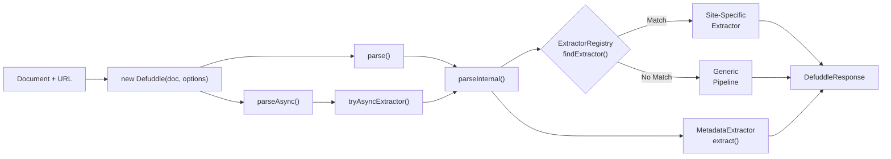
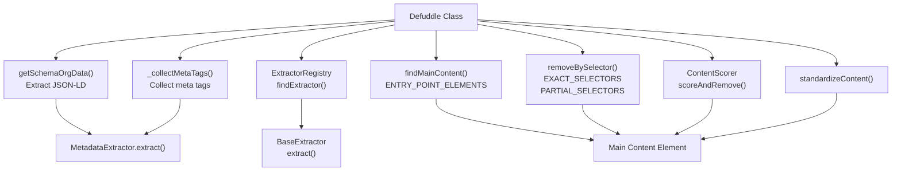
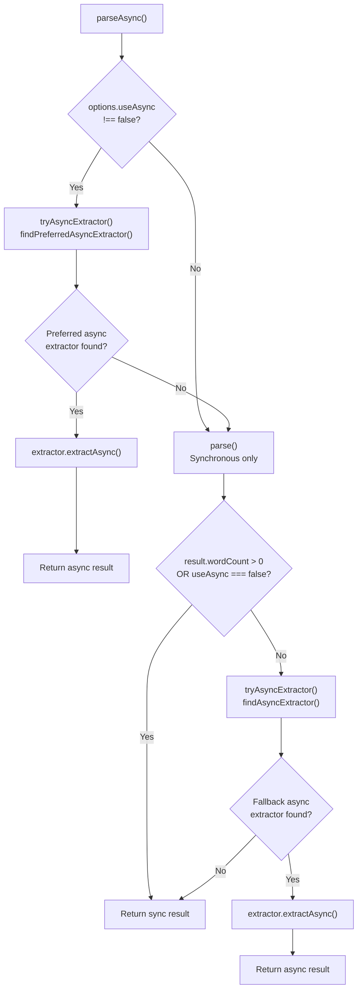
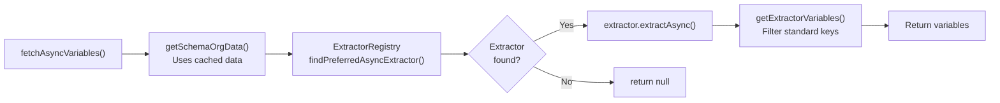

# 핵심 추출 파이프라인

관련 소스 파일

다음 파일들은 이 위키 페이지를 생성하는 맥락으로 사용되었습니다.

- [README.md](README.md)
- [src/constants.ts](src/constants.ts)
- [src/defuddle.ts](src/defuddle.ts)
- [src/metadata.ts](src/metadata.ts)
- [src/types.ts](src/types.ts)

`Defuddle` 클래스에 구현된 핵심 추출 파이프라인은 전체 콘텐츠 추출 프로세스를 조율합니다. 특화 추출기를 조정하고, 다단계 잡음 제거를 적용하며, 메타데이터를 추출하고, 다루기 어려운 페이지를 처리하기 위한 정교한 재시도 로직을 구현합니다.

이 파이프라인은 동기 `parse()` 메서드와 비동기 `parseAsync()` 메서드 중 어떤 방식을 사용하든 모든 콘텐츠 추출 작업의 주요 진입점 역할을 합니다.

관련 페이지: 사이트별 추출은 [[deepwiki-ko/defuddle/6.1-extractor-registry|6.1-extractor-registry]] 점수화 알고리즘은 [[deepwiki-ko/defuddle/4.1-content-identification-and-scoring|4.1-content-identification-and-scoring]], 제거 단계는 [[deepwiki-ko/defuddle/4.3-clutter-removal-pipeline|4.3-clutter-removal-pipeline]],  HTML 정규화는 [[deepwiki-ko/defuddle/5-content-standardization|5-content-standardization]]을 참조하세요.

## 파이프라인 아키텍처

`Defuddle` 클래스는 두 가지 주요 진입점, 즉 동기 추출을 위한 `parse()`와 타사 API fallback이 있는 비동기 추출을 위한 `parseAsync()`를 통해 핵심 추출 파이프라인을 구현합니다.

### 파이프라인 컴포넌트와 흐름

**Defuddle 클래스 파이프라인 흐름**

출처: [src/defuddle.ts:51-71](), [src/defuddle.ts:88-185](), [src/defuddle.ts:393-410]()

### 핵심 파이프라인 조율

**Defuddle의 하위 시스템 조율**

출처: [src/defuddle.ts:1-23](), [src/defuddle.ts:461-652](), [src/constants.ts:1-27]()

## parse() 메서드

`parse()` 메서드는 콘텐츠 추출을 위한 동기 진입점입니다. 초기 추출이 불충분한 콘텐츠를 반환하는 edge case를 처리하기 위해 지능적인 재시도 로직을 구현합니다.

### Parse 메서드 흐름

**재시도 로직이 포함된 parse() 실행 흐름**

```mermaid
flowchart TD
    parse["parse()"] --> parseInternal1["parseInternal()<br/>Default settings"]
    
    parseInternal1 --> checkWordCount1{"wordCount < 200?"}
    
    checkWordCount1 -->|"No"| stripUnsafe["_stripUnsafeElements()"]
    checkWordCount1 -->|"Yes"| retry1["parseInternal()<br/>removePartialSelectors: false"]
    
    retry1 --> compareResults1{"retryWordCount ><br/>2x original?"}
    compareResults1 -->|"Yes"| useRetry1["Use retry result"]
    compareResults1 -->|"No"| checkWordCount2{"wordCount < 50?"}
    
    useRetry1 --> checkWordCount2
    checkWordCount2 -->|"No"| stripUnsafe
    checkWordCount2 -->|"Yes"| retry2["parseInternal()<br/>removeHiddenElements: false"]
    
    retry2 --> compareResults2{"retryWordCount ><br/>2x original?"}
    compareResults2 -->|"Yes"| useRetry2["Use retry result"]
    compareResults2 -->|"No"| findHidden["findLargestHiddenContentSelector()"]
    
    useRetry2 --> findHidden
    findHidden --> hasHidden{"Hidden selector<br/>found?"}
    
    hasHidden -->|"Yes"| retry3["parseInternal()<br/>contentSelector: hidden<br/>removeHiddenElements: false"]
    hasHidden -->|"No"| checkWordCount3{"wordCount < 50?"}
    
    retry3 --> compareResults3{"Better focused<br/>content?"}
    compareResults3 -->|"Yes"| useRetry3["Use retry result"]
    compareResults3 -->|"No"| checkWordCount3
    
    useRetry3 --> checkWordCount3
    checkWordCount3 -->|"No"| stripUnsafe
    checkWordCount3 -->|"Yes"| retry4["parseInternal()<br/>removeLowScoring: false<br/>removePartialSelectors: false<br/>removeContentPatterns: false"]
    
    retry4 --> compareResults4{"retryWordCount ><br/>original?"}
    compareResults4 -->|"Yes"| useRetry4["Use retry result"]
    compareResults4 -->|"No"| stripUnsafe
    
    useRetry4 --> stripUnsafe
    stripUnsafe --> schemaFallback["Check schema.org<br/>_getSchemaText()"]
    
    schemaFallback --> hasSchemaText{"Schema text ><br/>extracted words?"}
    hasSchemaText -->|"Yes"| findBySchema["_findContentBySchemaText()"]
    hasSchemaText -->|"No"| returnResult["Return Result"]
    
    findBySchema --> useSchema["Use schema content"]
    useSchema --> returnResult
```

출처: [src/defuddle.ts:88-185]()

### 재시도 전략 표

| 재시도 단계 | 트리거 | 수정되는 옵션 | 근거 |
|-------------|---------|------------------|-----------|
| **Initial** | 항상 | 기본 설정 | 모든 필터가 활성화된 표준 추출 |
| **Retry 1** | wordCount < 200 | `removePartialSelectors: false` | 부분 selector가 정상 콘텐츠(예: 글 카드)를 제거했을 수 있음 |
| **Retry 2** | wordCount < 50 | `removeHiddenElements: false` | 페이지가 런타임에 콘텐츠를 드러내는 숨겨진 wrapper를 사용할 수 있음 |
| **Retry 3** | wordCount < 50 | `contentSelector: hiddenSelector` `removeHiddenElements: false` | body 수준의 잔여물 생성을 피하기 위해 가장 큰 숨겨진 하위 트리를 직접 대상으로 지정 |
| **Retry 4** | wordCount < 50 | `removeLowScoring: false` `removePartialSelectors: false` `removeContentPatterns: false` | 페이지가 점수화로 인해 카드가 잘못 제거되는 인덱스/목록 페이지일 수 있음 |
| **Schema.org Fallback** | 재시도 이후 | `_findContentBySchemaText()` 사용 | Schema.org에 DOM에서 찾을 수 없는 텍스트가 포함될 수 있음(예: 소셜 미디어 게시물) |

출처: [src/defuddle.ts:88-185]()

### 재시도 로직 세부사항

각 재시도는 2배 기준값(최종 재시도는 1배)을 사용하여, 재시도가 훨씬 더 많은 콘텐츠를 생성할 때만 성공하도록 보장합니다. 이를 통해 부분 selector가 적은 양의 잡음 요소를 올바르게 제거한 경우의 false positive를 방지합니다.

숨김 콘텐츠 재시도의 경우, 시스템은 `findLargestHiddenContentSelector()`를 사용해 가장 큰 숨겨진 요소를 식별하고 `contentSelector`로 직접 대상으로 삼아 FPS counter와 같은 body 수준의 잔여물을 피합니다.

출처: [src/defuddle.ts:93-159](), [src/defuddle.ts:324-347]()

## parseAsync() 메서드

`parseAsync()` 메서드는 로컬 HTML에 사용할 수 있는 콘텐츠가 없을 때(예: 클라이언트 측 렌더링 SPA) 타사 API에서 콘텐츠를 가져올 수 있는 비동기 추출기를 지원하도록 파이프라인을 확장합니다.

### 비동기 추출 흐름

**parseAsync() 결정 트리**

출처: [src/defuddle.ts:393-410]()

### 비동기 추출기 선택

파이프라인은 두 단계의 비동기 추출기 선택을 사용합니다.

1. **Preferred Async Extractors**: 동기 파싱 전에 먼저 확인됩니다. DOM 콘텐츠가 존재하더라도 비동기 추출(자막 가져오기)이 선호되는 YouTube 같은 플랫폼에 사용됩니다.

2. **Fallback Async Extractors**: 동기 파싱 결과 콘텐츠가 없을 때만 확인됩니다. API가 최후의 수단인 Twitter/X 같은 플랫폼에 사용됩니다.

`tryAsyncExtractor()` 메서드는 finder 함수(`findPreferredAsyncExtractor` 또는 `findAsyncExtractor`)를 받아 비동기 추출 흐름을 처리합니다.

출처: [src/defuddle.ts:436-456](), [src/defuddle.ts:393-410]()

### fetchAsyncVariables()

`fetchAsyncVariables()` 메서드는 문서를 다시 파싱하지 않고 비동기 변수(예: YouTube 자막)만 가져오는 방법을 제공합니다. `parse()`가 script 태그를 제거하기 때문에, 캐시된 schema.org 데이터를 안전하게 재사용합니다.

출처: [src/defuddle.ts:417-434]()

## parseInternal() 파이프라인

`parseInternal()` 메서드는 핵심 추출 파이프라인을 구현합니다. 원본을 보존하기 위해 복제된 문서에서 동작하며, 모든 추출 단계를 조율합니다.

### 범용 파이프라인 단계

**parseInternal() 파이프라인 단계**

```mermaid
flowchart TD
    parseInternal["parseInternal(overrideOptions)"] --> guard{"doc.documentElement<br/>exists?"}
    
    guard -->|"No"| emptyResponse["Return empty<br/>DefuddleResponse"]
    guard -->|"Yes"| mergeOptions["Merge default options<br/>with overrides"]
    
    mergeOptions --> schemaOrg["getSchemaOrgData()<br/>Extract JSON-LD<br/>_extractSchemaOrgData()"]
    schemaOrg --> collectMeta["_collectMetaTags()<br/>Cache meta tags"]
    collectMeta --> extractMetadata["MetadataExtractor.extract()<br/>Cache metadata"]
    
    extractMetadata --> checkExtractor{"ExtractorRegistry<br/>findExtractor()"}
    
    checkExtractor -->|"Found"| canExtract{"extractor<br/>canExtract()?"}
    canExtract -->|"Yes"| siteExtract["extractor.extract()"]
    siteExtract --> buildResponse1["buildExtractorResponse()"]
    
    canExtract -->|"No"| genericStart["Continue to<br/>generic pipeline"]
    checkExtractor -->|"Not Found"| genericStart
    
    genericStart --> mobileStyles["_evaluateMediaQueries()<br/>Cache mobile styles"]
    mobileStyles --> findSmall["findSmallImages()<br/>Cache small images"]
    findSmall --> clone["doc.cloneNode(true)<br/>Clone document"]
    
    clone --> normalize["clone.body.normalize()<br/>Merge text nodes"]
    normalize --> flattenShadow["flattenShadowRoots()<br/>Flatten shadow DOM"]
    flattenShadow --> resolveStream["resolveStreamedContent()<br/>React SSR boundaries"]
    resolveStream --> applyMobile["applyMobileStyles()"]
    
    applyMobile --> selectMain{"options<br/>contentSelector?"}
    selectMain -->|"Yes"| querySelector["querySelector(contentSelector)"]
    selectMain -->|"No"| findMain["findMainContent()<br/>ENTRY_POINT_ELEMENTS"]
    
    querySelector --> hasMain{"mainContent<br/>found?"}
    findMain --> hasMain
    
    hasMain -->|"No"| fallback["Return body content"]
    hasMain -->|"Yes"| footnotes{"options<br/>standardize?"}
    
    footnotes -->|"Yes"| stdFootnotes["standardizeFootnotes()"]
    footnotes -->|"No"| removeSmall{"options<br/>removeSmallImages?"}
    
    stdFootnotes --> removeSmall
    removeSmall -->|"Yes"| removeSmallImg["removeSmallImages()"]
    removeSmall -->|"No"| removeHidden{"options<br/>removeHiddenElements?"}
    
    removeSmallImg --> removeHidden
    removeHidden -->|"Yes"| removeHiddenEl["removeHiddenElements()"]
    removeHidden -->|"No"| removeLow{"options<br/>removeLowScoring?"}
    
    removeHiddenEl --> removeLow
    removeLow -->|"Yes"| scoreRemove["ContentScorer<br/>scoreAndRemove()"]
    removeLow -->|"No"| removeSelectors{"removeExactSelectors<br/>OR removePartialSelectors?"}
    
    scoreRemove --> removeSelectors
    removeSelectors -->|"Yes"| removeBySelector["removeBySelector()"]
    removeSelectors -->|"No"| removePatterns{"options<br/>removeContentPatterns?"}
    
    removeBySelector --> removePatterns
    removePatterns -->|"Yes"| removeContent["removeByContentPattern()"]
    removePatterns -->|"No"| standardize{"options<br/>standardize?"}
    
    removeContent --> standardize
    standardize -->|"Yes"| stdContent["standardizeContent()"]
    standardize -->|"No"| resolveUrls["resolveRelativeUrls()"]
    
    stdContent --> resolveUrls
    resolveUrls --> buildResponse2["Build DefuddleResponse<br/>content = mainContent.outerHTML"]
```

출처: [src/defuddle.ts:461-652]()

### 파이프라인 캐싱 전략

파이프라인은 재시도 전반에서 비용이 큰 여러 작업을 캐시합니다.

| 캐시된 항목 | 캐시 키 | 목적 |
|-------------|-----------|---------|
| Schema.org 데이터 | `_schemaOrgData` | 재시도 전반에서 JSON-LD script 재파싱 방지 |
| Meta 태그 | `_metaTags` | 재시도 전반에서 meta 태그 재조회 방지 |
| 메타데이터 | `_metadata` | 재시도 전반에서 메타데이터 재추출 방지 |
| 모바일 스타일 | `_mobileStyles` | 재시도 전반에서 media query 재평가 방지 |
| 작은 이미지 | `_smallImages` | 재시도 전반에서 작은 이미지 재식별 방지 |

재시도는 옵션만 수정하고 소스 문서는 수정하지 않으므로 이 캐싱은 안전합니다.

출처: [src/defuddle.ts:55-60](), [src/defuddle.ts:497-536]()

## 문서 전처리

주요 파이프라인이 실행되기 전에 `parseInternal()`은 edge case와 브라우저별 동작을 처리하기 위해 복제된 문서에 여러 전처리 단계를 수행합니다.

### 전처리 단계

| 단계 | 메서드 | 목적 |
|------|--------|---------|
| **Text Node Normalization** | `clone.body.normalize()` | `&#39;` 같은 HTML entity를 파싱할 때 linkedom이 생성하는 인접 텍스트 노드를 병합 |
| **Shadow DOM Flattening** | `flattenShadowRoots()` | 추출을 위해 shadow DOM 콘텐츠를 주 문서로 복사 |
| **Streamed Content Resolution** | `resolveStreamedContent()` | 콘텐츠를 숨길 수 있는 React streaming SSR suspense boundary 해결 |
| **Mobile Styles Application** | `applyMobileStyles()` | 숨겨진 콘텐츠를 드러내기 위해 모바일 viewport 스타일 적용 |

출처: [src/defuddle.ts:543-552]()

### 모바일 스타일 평가

`_evaluateMediaQueries()` 메서드는 모바일 viewport 너비(600px)에서 `max-width` 조건이 있는 CSS `@media` 규칙을 평가합니다. 이는 desktop에서는 숨겨져 있지만 mobile에서는 표시될 수 있는 콘텐츠를 드러냅니다.

이 메서드는 다음을 수행합니다.
1. 모든 stylesheet를 순회합니다
2. `max-width`가 있는 `CSSMediaRule` 인스턴스를 필터링합니다
3. 모바일 너비(600px)가 조건을 만족하는지 확인합니다
4. selector와 style이 포함된 일치 CSS rule을 수집합니다
5. `StyleChange` 객체 배열을 반환합니다

그런 다음 이 스타일들은 `applyMobileStyles()`를 통해 복제된 문서에 적용되며, 각 일치 요소의 inline style 속성에 style 텍스트를 추가합니다.

출처: [src/defuddle.ts:675-768]()

### Shadow DOM Flattening

`flattenShadowRoots()` 메서드는 shadow DOM 콘텐츠를 복제된 문서의 light DOM으로 복사하여 web component를 처리합니다. 이를 통해 shadow DOM 콘텐츠가 추출에 포함됩니다.

출처: [src/defuddle.ts:546]()

## 오류 처리와 Fallback

핵심 시스템은 견고한 동작을 보장하기 위해 여러 fallback 전략을 구현합니다.

### 재시도 로직
- 초기 parse가 200단어 미만을 반환하면 부분 selector 제거 없이 재시도합니다 [src/defuddle.ts:44-56]()

### Graceful Degradation
- 파싱 오류 시 전체 문서 콘텐츠로 fallback합니다 [src/defuddle.ts:175-185]()
- legacy layout을 위해 table 기반 콘텐츠 탐지를 사용합니다 [src/defuddle.ts:636-655]()
- cross-origin stylesheet 접근을 graceful하게 처리합니다 [src/defuddle.ts:217-229]()

### 성능 최적화
- layout thrashing을 최소화하기 위한 batched DOM 작업 [src/defuddle.ts:318-354]()
- selector matching을 위한 효율적인 regex 컴파일 [src/defuddle.ts:380-416]()
- 큰 요소 집합을 위한 chunked processing [src/defuddle.ts:462-537]()

출처: [src/defuddle.ts:40-748]()
