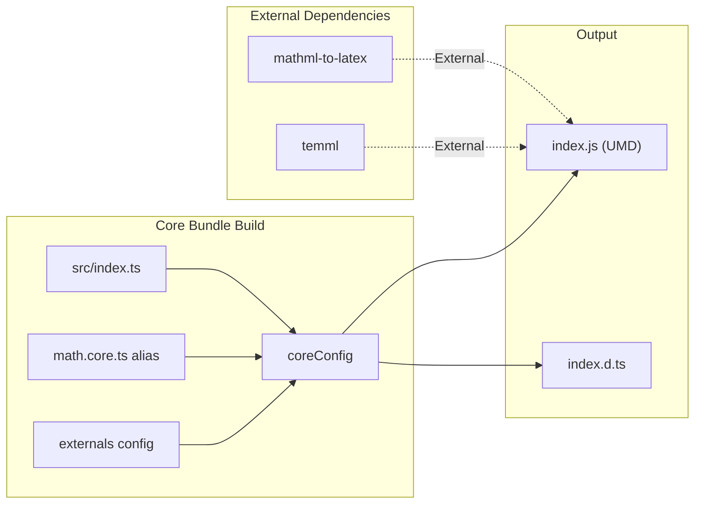
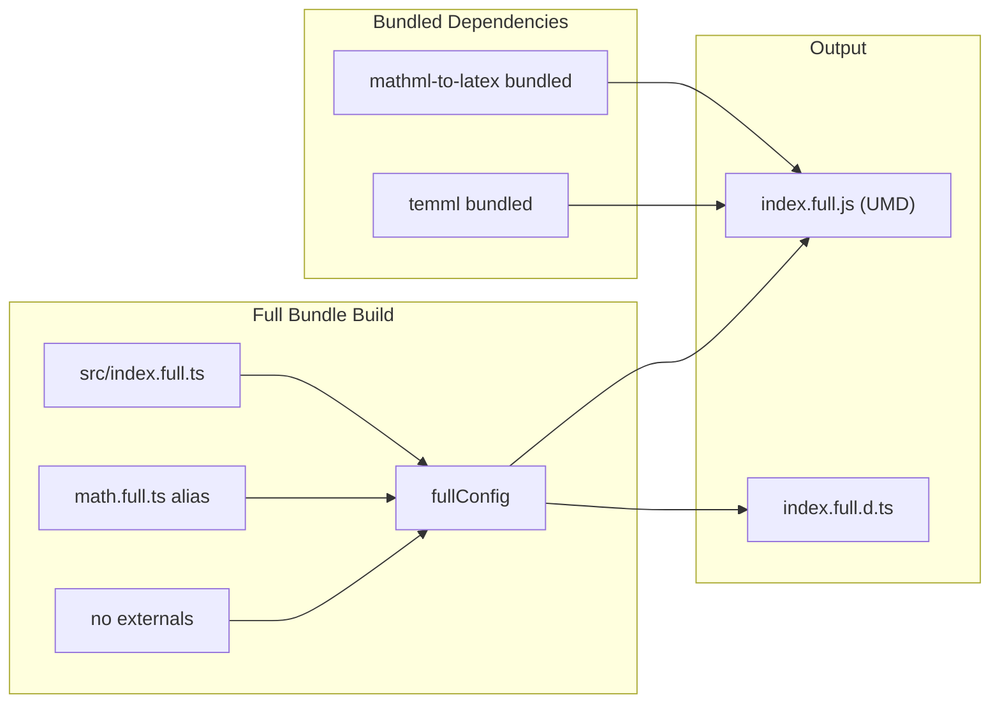
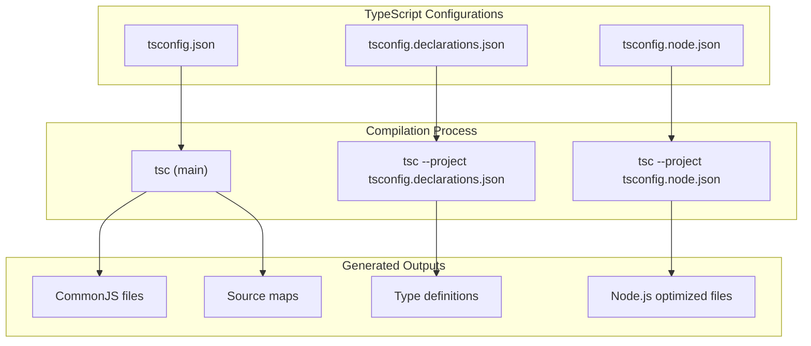
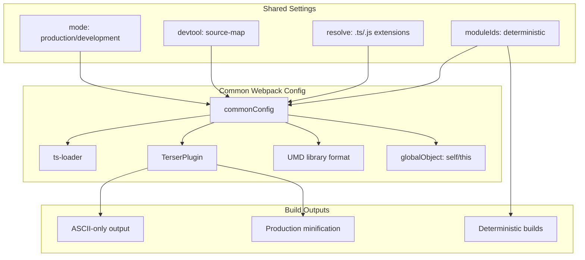
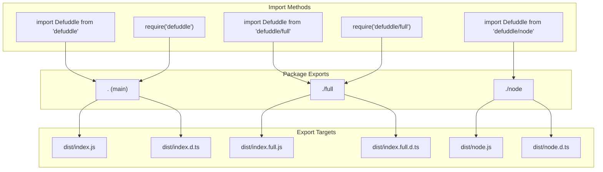
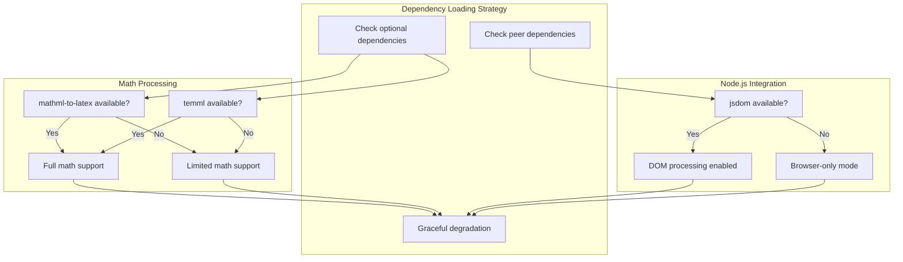
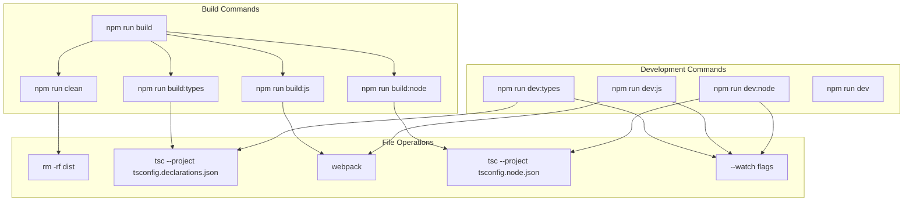

# 빌드 및 배포 시스템

<details>
<summary>관련 소스 파일</summary>

다음 파일들은 이 위키 페이지를 생성하는 맥락으로 사용되었습니다.

- [package-lock.json](package-lock.json)
- [package.json](package.json)
- [tsconfig.node.json](tsconfig.node.json)
- [webpack.config.js](webpack.config.js)

</details>


이 문서는 Defuddle 라이브러리의 빌드 설정, 번들링 전략, 배포 시스템을 다룹니다. 이 시스템은 가벼운 브라우저 사용부터 모든 기능을 갖춘 Node.js 통합까지, 서로 다른 배포 시나리오에 맞춘 여러 최적화 번들을 생성합니다.

핵심 추출 로직에 대한 정보는 [Core System](#2.1)을 참조하세요. 개별 기능이 처리되는 방식에 대한 자세한 내용은 [Content Standardization](#4)를 참조하세요.

## 빌드 아키텍처

Defuddle 빌드 시스템은 multi-target 접근 방식을 사용하며, 서로 다른 사용 사례에 최적화된 세 가지 별도 배포 번들을 생성합니다. 빌드 프로세스는 TypeScript 컴파일과 Webpack 번들링을 결합하여 브라우저 호환 UMD 모듈과 Node.js 전용 배포물을 만듭니다.

```mermaid
graph TB
    subgraph "Source Files"
        SRC["src/index.ts"]
        FULL_SRC["src/index.full.ts"]
        MATH_CORE["src/elements/math.core.ts"]
        MATH_FULL["src/elements/math.full.ts"]
        TS_FILES["src/**/*.ts"]
    end
    
    subgraph "Build Configurations"
        WEBPACK_CONFIG["webpack.config.js"]
        TSCONFIG["tsconfig.json"]
        TSCONFIG_DECL["tsconfig.declarations.json"]
        TSCONFIG_NODE["tsconfig.node.json"]
    end
    
    subgraph "Build Scripts"
        BUILD_TYPES["npm run build:types"]
        BUILD_JS["npm run build:js"]
        BUILD_NODE["npm run build:node"]
        BUILD_ALL["npm run build"]
    end
    
    subgraph "Output Bundles"
        CORE_JS["dist/index.js"]
        CORE_DTS["dist/index.d.ts"]
        FULL_JS["dist/index.full.js"]
        FULL_DTS["dist/index.full.d.ts"]
        NODE_JS["dist/node.js"]
        NODE_DTS["dist/node.d.ts"]
    end
    
    SRC --> BUILD_JS
    FULL_SRC --> BUILD_JS
    TS_FILES --> BUILD_TYPES
    TS_FILES --> BUILD_NODE
    
    WEBPACK_CONFIG --> BUILD_JS
    TSCONFIG_DECL --> BUILD_TYPES
    TSCONFIG_NODE --> BUILD_NODE
    
    BUILD_TYPES --> CORE_DTS
    BUILD_TYPES --> FULL_DTS
    BUILD_JS --> CORE_JS
    BUILD_JS --> FULL_JS
    BUILD_NODE --> NODE_JS
    BUILD_NODE --> NODE_DTS
    
    BUILD_ALL --> BUILD_TYPES
    BUILD_ALL --> BUILD_JS
    BUILD_ALL --> BUILD_NODE
```



출처: [package.json:31-44](), [webpack.config.js:1-102](), [tsconfig.json:1-16](), [tsconfig.declarations.json:1-20]()

## 번들 변형

빌드 시스템은 세 가지 별도 번들 변형을 생성하며, 각각 특정 배포 시나리오와 의존성 관리 전략에 최적화되어 있습니다.

| 번들 | 파일 | 대상 | 의존성 | 사용 사례 |
|--------|------|--------|--------------|----------|
| Core | `index.js` | 브라우저 | 외부 수식 라이브러리 | 가벼운 브라우저 사용 |
| Full | `index.full.js` | 브라우저 | 모두 번들 포함 | 독립 실행형 브라우저 배포 |
| Node | `node.js` | Node.js | 선택적 의존성 + JSDOM | 서버 측 처리 |

### Core Bundle 설정

core bundle은 수식 처리 라이브러리에 외부 의존성을 사용하여, 사용자가 이미 이러한 의존성을 로드했을 수 있는 브라우저 환경에서 번들 크기를 최소로 유지합니다.



출처: [webpack.config.js:47-74](), [package.json:15-20]()

### Full Bundle 설정

full bundle은 모든 의존성을 포함하여, 의존성 관리가 어렵거나 단일 파일 배포가 선호되는 환경을 위한 독립 실행형 배포물을 제공합니다.



출처: [webpack.config.js:76-99](), [package.json:21-26]()

## TypeScript 컴파일 전략

빌드 시스템은 서로 다른 컴파일 대상과 출력 요구사항을 처리하기 위해 여러 TypeScript 설정을 사용합니다. 각 설정은 전체 빌드 파이프라인에서 특정 목적을 담당합니다.

### 설정 파일

| 설정 파일 | 목적 | 대상 | 출력 |
|-------------|---------|--------|---------|
| `tsconfig.json` | 기본 컴파일 | CommonJS | 소스맵 + 선언 |
| `tsconfig.declarations.json` | 타입 정의만 | 여러 entry | `.d.ts` 파일만 |
| `tsconfig.node.json` | Node.js 빌드 | Node.js 전용 | 서버 측 최적화 |



출처: [tsconfig.json:1-16](), [tsconfig.declarations.json:1-20](), [package.json:33-36]()

## Webpack 번들 설정

Webpack 설정은 서로 다른 의존성 전략을 가진 두 개의 병렬 빌드를 생성합니다. 두 설정은 공통 설정을 공유하지만, 외부 의존성과 수식 처리 모듈을 다루는 방식이 다릅니다.

### 공통 설정 요소



출처: [webpack.config.js:8-45]()

### 수식 모듈 alias

빌드 시스템은 Webpack alias를 사용하여 core bundle과 full bundle 사이에서 수식 처리 구현을 교체합니다. 이를 통해 동일한 소스 코드가 의존성 요구사항에 따라 서로 다른 출력을 생성할 수 있습니다.

| 번들 타입 | Alias 대상 | 수식 의존성 |
|-------------|--------------|-------------------|
| Core | `math.core.ts` | 외부 참조 |
| Full | `math.full.ts` | 번들된 구현 |

출처: [webpack.config.js:69-72](), [webpack.config.js:94-97]()

## 패키지 export 전략

`package.json`의 exports 필드는 consuming application에 서로 다른 번들이 노출되는 방식을 정의합니다. 이 설정은 CommonJS와 ES module import를 모두 지원하면서 각 변형에 적절한 타입 정의를 제공합니다.



출처: [package.json:15-30]()

## 의존성 관리

빌드 시스템은 optional dependency와 peer dependency를 통해 번들 크기, 기능, 배포 유연성의 균형을 맞추는 정교한 의존성 관리 전략을 사용합니다.

### 의존성 범주

| 범주 | 라이브러리 | 목적 | 번들 포함 |
|----------|-----------|---------|------------------|
| `optionalDependencies` | `mathml-to-latex`, `temml`, `turndown` | 수식 및 markdown 처리 | 조건부 |
| `peerDependencies` | `jsdom` | Node.js용 DOM 조작 | 외부 |
| `devDependencies` | `webpack`, `typescript`, `vitest` | 빌드 및 테스트 | 없음 |

### 런타임 의존성 해석



출처: [package.json:65-72]()

## 빌드 스크립트 조율

빌드 프로세스는 TypeScript 컴파일, Webpack 번들링, 출력 생성을 조율하는 npm scripts를 통해 운영됩니다. 이 스크립트는 개발 및 production 워크플로를 모두 지원합니다.

### 빌드 명령



출처: [package.json:31-44]()

## 출력 구조

빌드 시스템은 여러 소비 패턴을 지원하고 TypeScript 사용자에게 포괄적인 타입 정보를 제공하는 일관된 출력 구조를 `dist` 디렉터리에 생성합니다.

```
dist/
├── index.js          # Core bundle (UMD)
├── index.d.ts        # Core bundle types
├── index.full.js     # Full bundle (UMD)
├── index.full.d.ts   # Full bundle types
├── node.js          # Node.js bundle
└── node.d.ts        # Node.js bundle types
```

각 번들은 개발 모드에서 적절한 소스맵을 포함하고 production 모드에서 minified output을 포함하며, 서로 다른 환경 전반에서 deterministic build를 보장하기 위해 일관된 module ID를 사용합니다.

출처: [package.json:5-14](), [package.json:87-91]()
