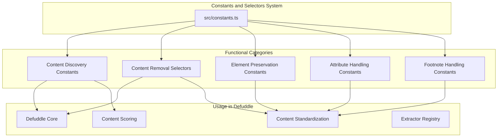
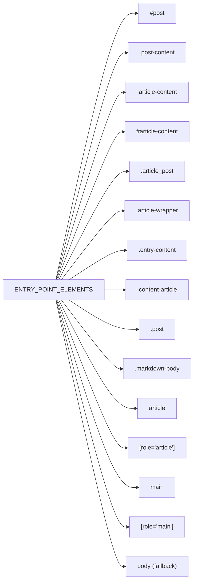
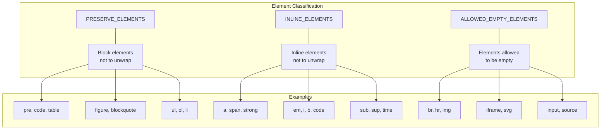
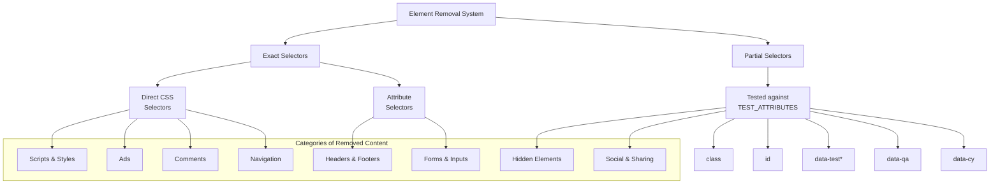
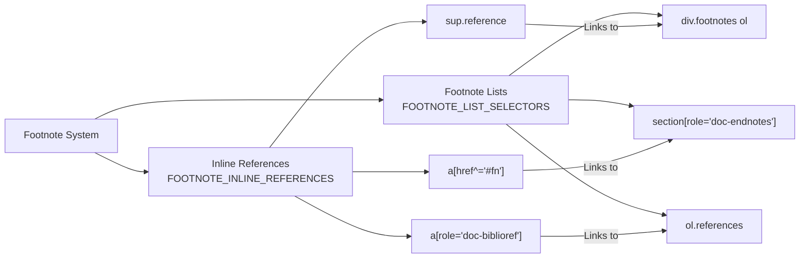
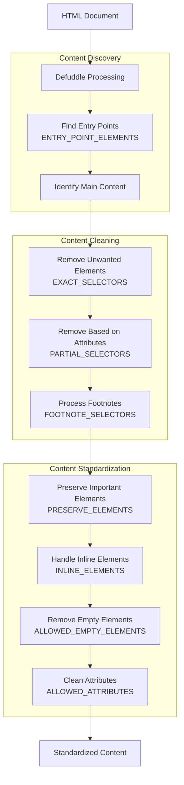

# 상수와 Selector

<details>
<summary>관련 소스 파일</summary>

다음 파일들은 이 위키 페이지를 생성하는 맥락으로 사용되었습니다.

- [src/constants.ts](src/constants.ts)
- [src/defuddle.ts](src/defuddle.ts)

</details>


이 문서는 Defuddle에서 콘텐츠 추출, 식별, 정리에 사용되는 상수와 selector에 대한 자세한 정보를 제공합니다. 이러한 상수는 Defuddle이 중요한 콘텐츠를 식별하고, 잡음 요소를 제거하며, 추출된 정보를 표준화하는 방식의 기반이 됩니다.

Defuddle의 전체 아키텍처에 대한 정보는 [Architecture](#2)를 참조하세요. 콘텐츠 표준화 프로세스에 대한 자세한 내용은 [Content Standardization](#4)를 참조하세요.

## 1. 개요

Defuddle은 코드베이스에 정의된 포괄적인 상수와 selector 집합을 사용해 다음을 수행합니다.

1. 콘텐츠 추출을 위한 진입점 식별
2. 보존하거나 제거할 요소 결정
3. 특수 콘텐츠 유형(각주, 코드 블록 등) 식별
4. 추출된 콘텐츠 표준화
5. 최종 출력에 유지할 속성 제어



출처: [src/constants.ts:1-908]()

## 2. 콘텐츠 탐색 상수

이 상수들은 Defuddle이 웹페이지 안에서 주요 콘텐츠를 찾는 데 도움을 줍니다.

### 2.1 진입점 요소

`ENTRY_POINT_ELEMENTS` 배열에는 주요 콘텐츠를 찾기 위한 시작점으로 사용되는 selector가 들어 있습니다. Defuddle은 일치 항목을 찾을 때까지 각 selector를 순서대로 시도합니다.



출처: [src/constants.ts:3-19]()

### 2.2 블록 및 구조 요소

블록 요소는 콘텐츠의 구조적 컴포넌트를 식별하는 데 사용됩니다.

- `BLOCK_ELEMENTS`: 콘텐츠를 구성하는 표준 block-level 요소를 정의합니다
- `MOBILE_WIDTH`: 모바일 스타일의 너비 기준값(600px)을 정의합니다

| 상수 | 목적 | 요소 |
|----------|---------|----------|
| `BLOCK_ELEMENTS` | 구조적 블록 식별 | 'div', 'section', 'article', 'main', 'aside', 'header', 'footer', 'nav', 'content' |

출처: [src/constants.ts:21-22]()

## 3. 요소 보존 및 분류

이 상수들은 표준화 프로세스 중 어떤 요소를 보존해야 하고 어떻게 처리해야 하는지를 정의합니다.

### 3.1 보존할 요소



보존 상수는 여러 목적을 수행합니다.
- `PRESERVE_ELEMENTS`: unwrap되면 안 되는 block-level 요소(`pre`, `table`, `blockquote` 등)
- `INLINE_ELEMENTS`: 보존해야 하는 inline 요소(`a`, `strong`, `em` 등)
- `ALLOWED_EMPTY_ELEMENTS`: 비어 있어도 허용되며 제거되지 않는 요소(`img`, `br`, `iframe` 등)

출처: [src/constants.ts:25-32](), [src/constants.ts:35-39](), [src/constants.ts:803-840]()

## 4. 콘텐츠 제거 Selector

Defuddle은 제거해야 하는 콘텐츠를 식별하기 위해 두 종류의 selector를 사용합니다.

### 4.1 정확한 Selector

`EXACT_SELECTORS` 배열에는 완전히 제거할 요소를 식별하는 CSS selector가 들어 있습니다. 이 selector들은 문서의 요소와 정확히 매칭됩니다.

정확한 selector로 제거되는 요소 범주는 다음과 같습니다.
- Script와 style
- 광고
- 댓글 섹션
- 내비게이션 요소
- Header와 footer
- Form과 input
- 숨겨진 요소
- 메타데이터 요소
- Sidebar와 banner

정확한 selector 예:
```
'script:not([type^="math/"])'
'.ad:not([class*="gradient"])'
'[id="comments" i]'
'header'
'nav'
'footer'
'form'
'.hidden'
'[hidden]'
```

출처: [src/constants.ts:42-210]()

### 4.2 부분 Selector

`PARTIAL_SELECTORS` 배열에는 요소의 특정 속성에 대해 검사되는 문자열 패턴이 들어 있습니다. 이는 부분 일치이며, 지정된 속성 중 하나라도 이러한 문자열 중 하나를 포함하면 해당 요소가 제거됩니다.

`TEST_ATTRIBUTES` 배열은 부분 일치를 검사할 속성을 정의합니다.

| 속성 | 목적 |
|-----------|---------|
| `class` | CSS class 이름 |
| `id` | 요소 ID |
| `data-test` | 테스트 자동화 selector |
| `data-testid` | 테스트 자동화 ID |
| `data-test-id` | 대체 테스트 ID 형식 |
| `data-qa` | QA 자동화 selector |
| `data-cy` | Cypress 테스트 selector |

일반적인 부분 selector 패턴:
- **광고 관련**: `'ad-placement'`, `'ads-container'`, `'advert'`
- **메타데이터**: `'article-meta'`, `'article-date'`, `'article-author'`
- **내비게이션**: `'nav-'`, `'menu-'`, `'breadcrumb'`
- **소셜/공유**: `'social-shar'`, `'share-'`, `'twitter'`
- **댓글**: `'comment-'`, `'commentbox'`, `'disqus'`
- **Sidebar**: `'sidebar-'`, `'aside'`, `'rail'`

출처: [src/constants.ts:213-221](), [src/constants.ts:225-756]()



출처: [src/constants.ts:42-756]()

## 5. 각주 처리 상수

Defuddle에는 콘텐츠의 각주와 인용을 처리하기 위한 특화 selector가 있습니다.

### 5.1 각주 참조

`FOOTNOTE_INLINE_REFERENCES`에는 콘텐츠 안의 inline 각주 참조(위첨자 숫자나 인용 표시 등)를 식별하는 selector가 들어 있습니다.

Selector 예:
```
'sup.reference'
'a[href^="#fn"]'
'a[href^="#cite"]'
'a[role="doc-biblioref"]'
```

출처: [src/constants.ts:759-781]()

### 5.2 각주 목록

`FOOTNOTE_LIST_SELECTORS`는 실제 각주 콘텐츠를 포함하는 섹션을 식별하며, 일반적으로 문서 끝에서 찾을 수 있습니다.

Selector 예:
```
'div.footnotes ol'
'section[role="doc-endnotes"]'
'ol.references'
```

출처: [src/constants.ts:783-799]()



출처: [src/constants.ts:759-799]()

## 6. 속성 처리

Defuddle은 두 집합을 통해 최종 콘텐츠에 보존할 속성을 제어합니다.

### 6.1 허용 속성

`ALLOWED_ATTRIBUTES`는 최종 출력에 유지할 HTML 속성을 정의합니다. 이 필터링은 추적 코드, event handler, 그 밖의 필수적이지 않은 속성을 제거하는 데 도움이 됩니다.

허용되는 속성의 주요 범주:
- 필수 속성(`src`, `href`, `alt`, `title`)
- 구조적 속성(`colspan`, `rowspan`, `headers`)
- 접근성 속성(`aria-label`, `role`)
- 미디어 속성(`width`, `height`, `controls`)
- 수식 콘텐츠를 위한 특화 속성

### 6.2 Debug 속성

`ALLOWED_ATTRIBUTES_DEBUG`는 문제 해결을 돕기 위해 debug mode에서 유지되는 추가 속성(`class`, `id`)을 제공합니다.

출처: [src/constants.ts:843-908]()

## 7. Defuddle 시스템에서의 사용

`src/constants.ts`에 정의된 상수와 selector는 콘텐츠가 추출, 정리, 표준화되는 방식을 제어하기 위해 Defuddle 시스템 전반에서 사용됩니다.



출처: [src/constants.ts:1-908]()

## 8. NODE_TYPE 상수

`NODE_TYPE` 객체는 브라우저와 Node.js 환경 모두에서 동작하는 cross-platform node type 상수를 제공합니다.

| 상수 | 값 | 설명 |
|----------|-------|-------------|
| `ELEMENT_NODE` | 1 | `<p>` 또는 `<div>` 같은 element node |
| `ATTRIBUTE_NODE` | 2 | 요소의 속성 |
| `TEXT_NODE` | 3 | 요소 내부의 텍스트 콘텐츠 |
| `CDATA_SECTION_NODE` | 4 | CDATASection |
| `COMMENT_NODE` | 8 | comment node |
| `DOCUMENT_NODE` | 9 | document node |
| `DOCUMENT_FRAGMENT_NODE` | 11 | DocumentFragment node |

이 상수들은 Defuddle 전반에서 DOM node를 다룰 때 서로 다른 환경에서도 일관된 동작을 보장하기 위해 사용됩니다.

출처: [src/constants.ts:2-15]()
