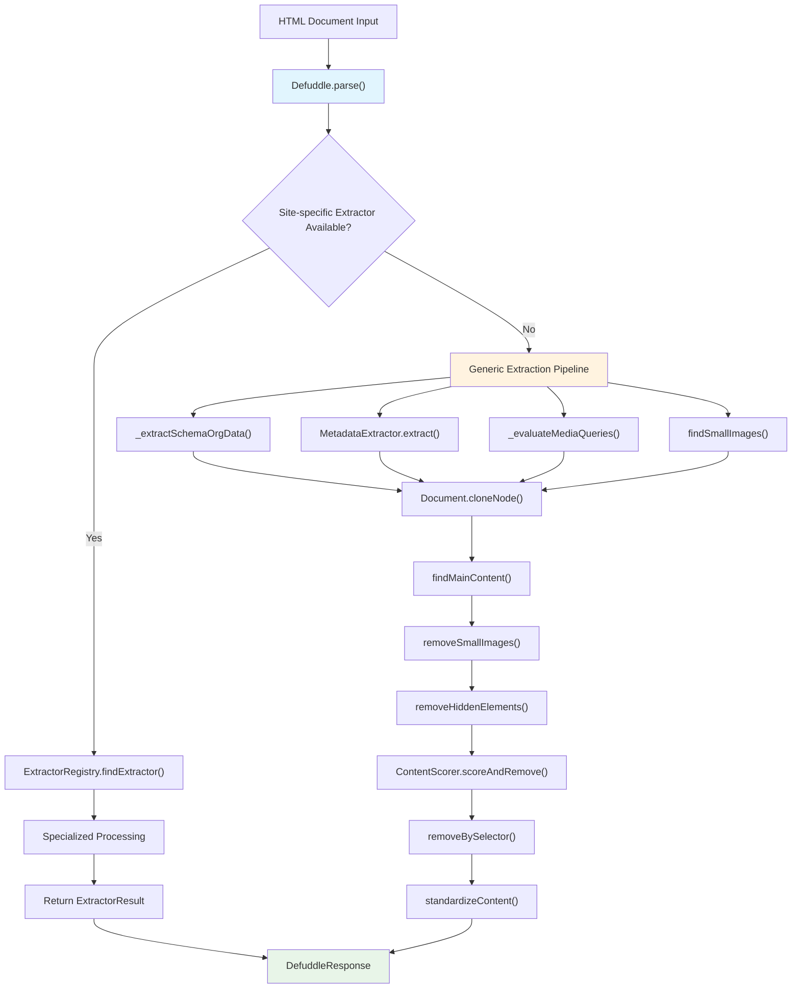
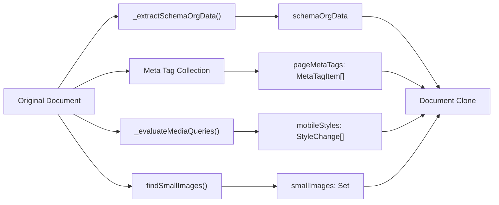
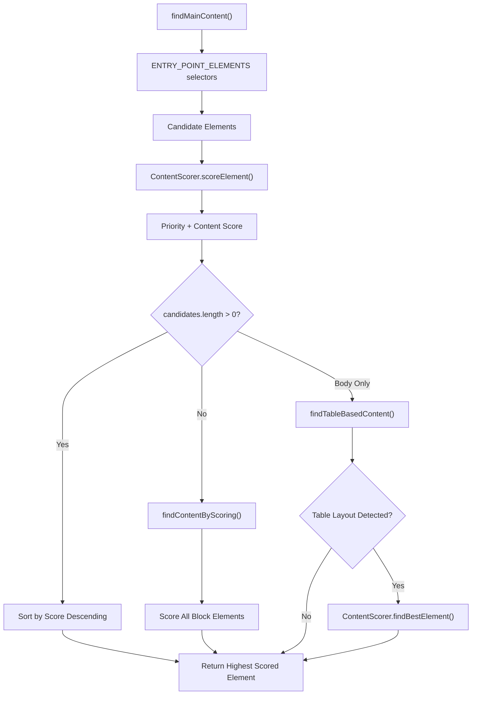
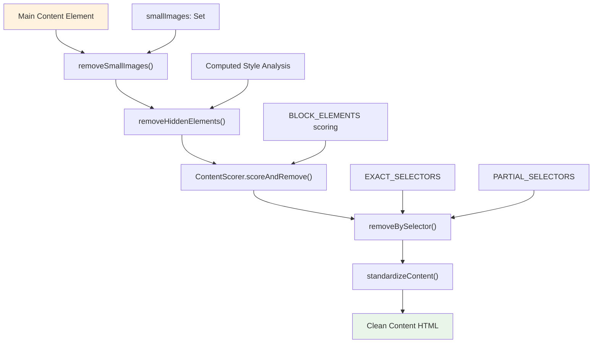
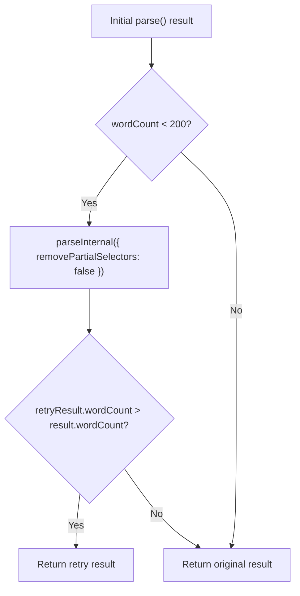

# 콘텐츠 추출

관련 소스 파일

다음 파일들은 이 위키 페이지를 생성하는 맥락으로 사용되었습니다.

- [README.md](README.md)
- [src/constants.ts](src/constants.ts)
- [src/defuddle.ts](src/defuddle.ts)
- [src/metadata.ts](src/metadata.ts)
- [src/types.ts](src/types.ts)

이 문서는 원시 HTML 문서를 깔끔하고 표준화된 콘텐츠로 변환하는 핵심 콘텐츠 추출 파이프라인을 다룹니다. 추출 프로세스는 주요 콘텐츠를 식별하고, 잡음 요소를 제거하며, 추가 처리를 위해 콘텐츠를 준비합니다.

콘텐츠 품질 점수화 알고리즘에 대한 자세한 정보는 [Content Scoring](#3.1)을 참조하세요. 다양한 출처에서의 메타데이터 추출은 [Metadata Extraction](#3.2)을 참조하세요. 콘텐츠 정규화와 표준화는 [Content Standardization](#4)를 참조하세요.

## 추출 파이프라인 개요

콘텐츠 추출 프로세스는 `Defuddle` 클래스의 `parse()` 메서드를 통해 조율되며, 이 메서드는 콘텐츠 식별을 점진적으로 정제하고 콘텐츠가 아닌 요소를 제거하는 다단계 파이프라인을 구현합니다.

출처: [src/defuddle.ts:40-59](), [src/defuddle.ts:64-186]()

## 초기 콘텐츠 분석

처리가 시작되기 전에 시스템은 추출 프로세스를 안내하는 정보를 수집하기 위해 원본 문서에 대해 여러 분석 단계를 수행합니다.

### Schema.org 및 메타데이터 수집

파이프라인은 문서에서 구조화된 데이터와 메타데이터를 추출하는 것으로 시작합니다.

| 데이터 출처 | 메서드 | 목적 |
|-------------|--------|---------|
| Schema.org JSON-LD | `_extractSchemaOrgData()` | 구조화된 콘텐츠 메타데이터 |
| Meta 태그 | `querySelectorAll('meta')` | 페이지 메타데이터 수집 |
| 모바일 스타일 | `_evaluateMediaQueries()` | 반응형 디자인 분석 |
| 작은 이미지 | `findSmallImages()` | 아이콘 및 장식 감지 |

출처: [src/defuddle.ts:73-86](), [src/defuddle.ts:123-127](), [src/defuddle.ts:211-283](), [src/defuddle.ts:432-546]()

## 주요 콘텐츠 식별

`findMainContent()` 메서드는 문서 안의 주요 콘텐츠 컨테이너를 식별하기 위해 다층 접근 방식을 구현합니다.

### 진입점 감지

시스템은 먼저 `ENTRY_POINT_ELEMENTS`의 미리 정의된 selector를 사용해 의미론적 콘텐츠 컨테이너를 검색합니다.

출처: [src/defuddle.ts:592-634](), [src/defuddle.ts:636-655](), [src/defuddle.ts:657-670]()

### 콘텐츠 점수화 통합

각 후보 요소는 다음을 결합한 composite score를 받습니다.

- **Selector Priority**: `ENTRY_POINT_ELEMENTS` 배열에서의 위치
- **Content Quality**: `ContentScorer.scoreElement()`의 점수
- **Structure Analysis**: 텍스트 밀도, 문단 수, 링크 밀도

출처: [src/defuddle.ts:596-607](), [src/scoring.ts:103-190]()

## 잡음 요소 제거 프로세스

주요 콘텐츠 컨테이너를 식별한 후, 시스템은 여러 잡음 제거 기법을 순서대로 적용합니다.

### 점진적 정리 파이프라인

출처: [src/defuddle.ts:148-164](), [src/defuddle.ts:548-563](), [src/defuddle.ts:311-358](), [src/scoring.ts:211-253](), [src/defuddle.ts:360-429]()

### Selector 기반 제거

`removeBySelector()` 메서드는 두 종류의 selector를 처리합니다.

| Selector 타입 | 출처 | 처리 메서드 |
|---------------|--------|-------------------|
| 정확한 selector | `EXACT_SELECTORS` | 직접 `querySelectorAll()` |
| 부분 selector | `PARTIAL_SELECTORS` | `TEST_ATTRIBUTES`에 대한 regex pattern matching |

이 메서드는 다음을 포함한 성능 최적화를 사용합니다.
- 미리 컴파일된 regex pattern
- 일괄 요소 수집
- 단일 pass 제거

출처: [src/defuddle.ts:360-429](), [src/constants.ts]()

### 숨김 요소 감지

`removeHiddenElements()` 메서드는 computed style이 보이지 않음을 나타내는 요소를 식별합니다.

- `display: none`
- `visibility: hidden` 
- `opacity: 0`

이 메서드는 layout thrashing을 최소화하기 위해 요소를 batch로 처리하며, computed style을 사용할 수 없을 때는 inline style parsing을 fallback으로 사용합니다.

출처: [src/defuddle.ts:311-358]()

## 콘텐츠 품질 평가

추출 파이프라인은 콘텐츠와 내비게이션 요소를 구별하기 위해 `ContentScorer` 클래스와 통합됩니다. 점수화 시스템은 다음을 평가합니다.

- **Text density**: 단어 수와 문단 구조
- **Link density**: 텍스트 콘텐츠 대비 링크 비율
- **Semantic indicators**: Class, ID, 텍스트 패턴
- **Structural patterns**: 내비게이션 목록과 layout 요소

기준값보다 낮은 점수를 받은 요소는 문서에서 제거되고, 높은 점수를 받은 요소는 보존됩니다.

출처: [src/scoring.ts:211-253](), [src/scoring.ts:302-361]()

## Fallback 메커니즘

시스템은 edge case를 처리하기 위해 여러 fallback 전략을 구현합니다.

### 낮은 콘텐츠 감지

초기 추출 결과가 200단어 미만이면 시스템은 완화된 설정으로 재시도합니다.

출처: [src/defuddle.ts:44-58]()

### Table 기반 Layout 감지

legacy table 기반 layout의 경우, 표준 semantic selector가 실패하면 시스템은 cell 기반 콘텐츠 식별로 fallback할 수 있습니다.

출처: [src/defuddle.ts:636-655]()

## 특화 시스템과의 통합

콘텐츠 추출 파이프라인은 여러 특화 하위 시스템과 통합됩니다.

- **Site-specific extractors**: `ExtractorRegistry`를 통한 알려진 플랫폼 우선 처리
- **Metadata extraction**: `MetadataExtractor`를 통한 병렬 처리
- **Content standardization**: `standardizeContent()`를 통한 후처리
- **Output formatting**: HTML 또는 Markdown 형식으로 변환

이러한 통합에 대한 자세한 정보는 [Site-Specific Extractors](#5), [Metadata Extraction](#3.2), [Content Standardization](#4)를 참조하세요.

출처: [src/defuddle.ts:95-118](), [src/defuddle.ts:163]()
