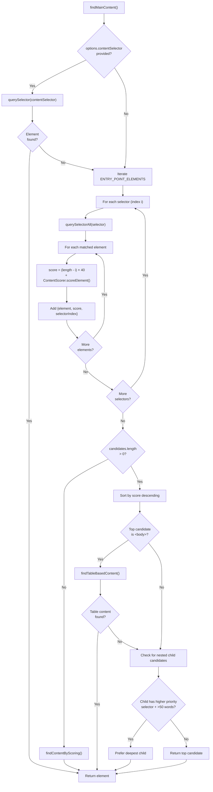
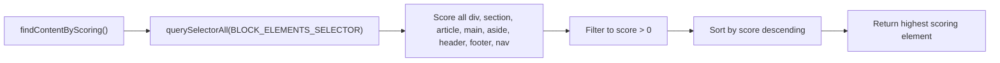
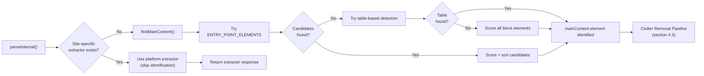

# 콘텐츠 식별과 점수화

<details>
<summary>관련 소스 파일</summary>

다음 파일들은 이 위키 페이지를 생성하는 맥락으로 사용되었습니다.

- [src/constants.ts](src/constants.ts)
- [src/defuddle.ts](src/defuddle.ts)
- [src/scoring.ts](src/scoring.ts)
- [src/standardize.ts](src/standardize.ts)

</details>


## 목적과 범위

이 문서는 Defuddle이 범용 추출 파이프라인 중 HTML 문서 안에서 주요 콘텐츠 컨테이너를 식별하는 방식을 설명합니다. 식별 프로세스는 2단계 전략을 사용합니다. 먼저 일반적인 콘텐츠 컨테이너(`ENTRY_POINT_ELEMENTS`)를 위한 우선순위 CSS selector와 매칭을 시도한 다음, selector가 실패하면 heuristic 점수화 알고리즘(`ContentScorer`)으로 fallback합니다. 이 프로세스는 플랫폼별 추출기를 사용할 수 없을 때만 실행됩니다([Extractor Registry](#6.1) 참조). 식별된 콘텐츠에서 잡음 요소를 제거하는 정보는 [Clutter Removal Pipeline](#4.3)을 참조하세요. 페이지에서 메타데이터를 추출하는 방법은 [Metadata Extraction](#4.2)을 참조하세요.

## 진입점 Selector

`ENTRY_POINT_ELEMENTS` 상수는 일반적인 콘텐츠 컨테이너를 대상으로 하는 우선순위 CSS selector 배열을 정의합니다. Selector는 가장 구체적인 것부터 가장 일반적인 것 순서로 정렬되어 있어, Defuddle은 일반 fallback(`main`, `body` 등)보다 의미론적 컨테이너(`#post`, `.article-content` 등)를 선호할 수 있습니다.

**우선순위:**

| 우선순위 | Selector | 대상 |
|----------|----------|--------|
| 1 | `#post` | 단일 게시물 컨테이너 |
| 2 | `.post-content` | 게시물 콘텐츠 wrapper |
| 3 | `.post-body` | 게시물 본문 섹션 |
| 4 | `.article-content` | 글 콘텐츠 div |
| 5 | `#article-content` | ID 기반 글 콘텐츠 |
| 6 | `.article_post` | 글 게시물 컨테이너 |
| 7 | `.article-wrapper` | 글 wrapper |
| 8 | `.entry-content` | WordPress 스타일 entry |
| 9 | `.content-article` | 콘텐츠 글 |
| 10 | `.instapaper_body` | Instapaper 형식 |
| 11 | `.post` | 범용 게시물 class |
| 12 | `.markdown-body` | GitHub 스타일 markdown |
| 13 | `article` | HTML5 article 요소 |
| 14 | `[role="article"]` | ARIA article role |
| 15 | `main` | HTML5 main 요소 |
| 16 | `[role="main"]` | ARIA main role |
| 17 | `#content` | 범용 콘텐츠 ID |
| 18 | `body` | 문서 body(fallback) |

`body` selector는 항상 최소 하나의 match가 있도록 보장하여 null 반환을 방지합니다.

**출처:** [src/constants.ts:3-22]()

## 콘텐츠 점수화 알고리즘

`ContentScorer` 클래스는 DOM 요소의 "content-worthiness"를 평가하기 위한 static method를 제공합니다. 점수화 알고리즘은 여러 heuristic을 결합하여 주요 콘텐츠를 내비게이션, 광고, boilerplate와 구별합니다.

### 점수 계산 구성 요소

```mermaid
graph TB
    Element["Element to Score"]
    
    Element --> TextDensity["Text Density<br/>+1 per word"]
    Element --> Paragraphs["Paragraph Count<br/>+10 per &lt;p&gt;"]
    Element --> Commas["Comma Count<br/>+1 per comma"]
    Element --> Images["Image Density<br/>-3 × (images/words)"]
    Element --> Position["Position Bonus<br/>+5 if right-aligned"]
    Element --> ContentMarkers["Content Indicators<br/>+10 for date/author"]
    Element --> Classes["Content Classes<br/>+15 for content/article/post"]
    Element --> Footnotes["Footnote References<br/>+10 if present"]
    Element --> FootnoteList["Footnote Lists<br/>+10 if present"]
    Element --> Tables["Nested Tables<br/>-5 per table"]
    Element --> TableCell["Table Cell Bonus<br/>+10 for center cells"]
    Element --> LinkDensity["Link Density<br/>×(1 - density) multiplier"]
    
    TextDensity --> FinalScore["Final Score"]
    Paragraphs --> FinalScore
    Commas --> FinalScore
    Images --> FinalScore
    Position --> FinalScore
    ContentMarkers --> FinalScore
    Classes --> FinalScore
    Footnotes --> FinalScore
    FootnoteList --> FinalScore
    Tables --> FinalScore
    TableCell --> FinalScore
    LinkDensity --> FinalScore
```



**출처:** [src/scoring.ts:132-230]()

### 점수화 기준 세부사항

| 기준 | 계산 | 근거 |
|-----------|-------------|-----------|
| **Text Density** | 단어당 `+1` | 텍스트가 많을수록 콘텐츠일 가능성이 높음 |
| **Paragraphs** | `<p>`당 `+10` | 산문 구조는 글을 나타냄 |
| **Commas** | 쉼표당 `+1` | 산문에는 쉼표가 있지만 내비게이션에는 없음 |
| **Image Density** | `-3 × (images / words)` | 높은 이미지 밀도는 갤러리를 시사함 |
| **Position Bonus** | `float: right` 또는 `text-align: right`이면 `+5` | 중앙/오른쪽 콘텐츠가 주요 콘텐츠인 경우가 많음 |
| **Date Presence** | 날짜 패턴과 일치하면 `+10` | 글에는 게시일이 있음 |
| **Author Presence** | 작성자 패턴과 일치하면 `+10` | 글에는 작성자 표시가 있음 |
| **Content Classes** | class에 `content`, `article`, `post`가 포함되면 `+15` | 의미론적 이름은 콘텐츠를 나타냄 |
| **Footnote References** | inline 각주 참조가 있으면 `+10` | 학술/long-form 콘텐츠 marker |
| **Footnote Lists** | 각주 목록이 있으면 `+10` | 추가 콘텐츠 신호 |
| **Nested Tables** | `<table>`당 `-5` | 내비게이션은 table을 사용하는 경우가 많음 |
| **Table Cell Bonus** | layout table의 중앙 cell에 `+10` | 예전 스타일 layout은 중앙 cell을 사용함 |
| **Link Density** | `score × (1 - min(linkText/totalText, 0.5))` | 높은 링크 밀도는 내비게이션을 시사함 |

링크 밀도는 최종 multiplier로 작동하여 점수를 비례적으로 낮춥니다. 블로그 index page처럼 링크가 많은 콘텐츠를 과도하게 벌점 처리하지 않도록 감소폭은 0.5로 제한됩니다.

**출처:** [src/scoring.ts:132-230]()

## 주요 콘텐츠 탐색 프로세스

`findMainContent()` 메서드는 다단계 접근 방식을 사용해 콘텐츠 식별을 조율합니다.



**출처:** [src/defuddle.ts:1077-1188]()

### 후보 선택 로직

알고리즘은 다음 방식으로 후보 목록을 만듭니다.

1. **Base Score Assignment**: 각 selector에는 우선순위 점수 `(ENTRY_POINT_ELEMENTS.length - selectorIndex) × 40`이 있습니다. 앞쪽 selector(`#post` 등)는 뒤쪽 selector(`body` 등)보다 더 높은 base score를 받습니다.

2. **Content Score Addition**: `ContentScorer.scoreElement()` 결과가 base score에 더해져, 높은 우선순위 selector와 콘텐츠가 풍부한 요소를 모두 선호하는 combined metric을 만듭니다.

3. **Sorting**: 후보는 total score를 기준으로 내림차순 정렬됩니다.

4. **Child Preference Logic**: 최상위 후보가 다음 조건을 만족하는 child candidate를 포함하는 경우:
   - 더 높은 우선순위 selector(더 낮은 `selectorIndex`)와 매칭됨
   - 의미 있는 콘텐츠(50단어 초과)를 포함함
   - 그러한 child가 하나뿐임(listing page가 아님)
   
   그러면 parent보다 child가 선호됩니다. 이는 잡음 sibling과 함께 단일 `<article>`을 포함하는 `<main>`이 선택되는 것을 방지합니다.

**출처:** [src/defuddle.ts:1118-1153]()

### Listing Page 감지

child preference logic에는 listing page에서 개별 card를 선택하지 않도록 하는 보호 장치가 포함되어 있습니다.

```javascript
// Count how many candidates share this selector index inside the top element
let siblingsAtIndex = 0;
for (const c of candidates) {
    if (c.selectorIndex === child.selectorIndex && top.element.contains(c.element)) {
        if (++siblingsAtIndex > 1) break;
    }
}
if (siblingsAtIndex > 1) {
    // Multiple articles/cards inside the parent — it's a listing page
    continue;
}
```

여러 요소가 동일한 높은 우선순위 selector와 매칭된 경우(예: 여러 `<article>` 태그), parent container가 주요 콘텐츠로 유지되어 grid에서 단일 card만 추출되는 것을 방지합니다.

**출처:** [src/defuddle.ts:1137-1145]()

## Fallback 메커니즘

### Table 기반 콘텐츠 감지

예전 스타일의 table 기반 layout(CSS Grid/Flexbox 이전에 흔함)을 위해 `findTableBasedContent()` 메서드는 layout table 안의 콘텐츠 cell을 식별합니다.

**감지 기준:**

| 기준 | 검사 |
|-----------|-------|
| Table 너비 | `width` 속성 > 400px 또는 CSS width > 400px |
| Table 정렬 | `align="center"` 속성 |
| Table class | Class 이름에 `content` 또는 `article` 포함 |

Table이 이러한 기준과 일치하면 모든 `<td>` 요소가 `ContentScorer.findBestElement()`를 사용해 점수화되며, 이 메서드는 최소 기준값 50을 넘는 가장 높은 점수의 cell을 반환합니다.

**출처:** [src/defuddle.ts:1156-1175]()

### 일반 블록 요소 점수화

진입점 selector와 table 감지가 모두 실패하면 `findContentByScoring()`이 최종 fallback을 제공합니다.



이 메서드는 모든 block-level 요소(`div`, `section`, `article`, `main`, `aside`, `header`, `footer`, `nav`, `content`)에 점수를 매기고 가장 높은 점수의 요소를 반환합니다.

**출처:** [src/defuddle.ts:1177-1188](), [src/constants.ts:25-26]()

## 비콘텐츠 감지

`ContentScorer`는 잡음 제거 단계([Clutter Removal Pipeline](#4.3) 참조)에서 사용되는 **콘텐츠가 아닌** 요소를 식별하기 위한 메서드도 제공합니다.

### 내비게이션 지표

scorer는 내비게이션/boilerplate를 나타내는 텍스트 패턴 목록을 유지합니다.

```javascript
const navigationIndicators = [
    'advertisement', 'all rights reserved', 'banner', 'cookie', 'comments',
    'copyright', 'follow me', 'follow us', 'footer', 'header', 'homepage',
    'login', 'menu', 'more articles', 'more like this', 'most read',
    'nav', 'navigation', 'newsletter', 'popular', 'privacy', 'recommended',
    'register', 'related', 'responses', 'share', 'sidebar', 'sign in',
    'sign up', 'signup', 'social', 'sponsored', 'subscribe', 'terms', 'trending'
];
```

**출처:** [src/scoring.ts:24-60]()

### 소셜 프로필 감지

Author bio와 social widget은 소셜 미디어 profile URL을 확인하여 식별합니다.

```javascript
const socialProfilePattern = /\b(linkedin\.com\/(in|company)\/|twitter\.com\/(?!intent\b)\w|x\.com\/(?!intent\b)\w|facebook\.com\/(?!share\b)\w|instagram\.com\/\w|threads\.net\/\w|mastodon\.\w)/i;
```

이 패턴은 정상적인 콘텐츠 공유 버튼에서 false positive를 피하기 위해 share/intent URL을 제외합니다.

**출처:** [src/scoring.ts:63]()

### Card Grid 감지

Article card grid(예: "Related Articles" 섹션)는 `isCardGrid()`로 감지됩니다.

**감지 로직:**

1. 요소에 heading(h2, h3 또는 h4)이 3개 이상 있음
2. 요소에 image가 2개 이상 있음
3. 요소 전체 단어 수가 3-500개임
4. heading당 prose가 20단어 미만임(`(totalWords - headingWords) / headingCount`로 계산)

이 조합은 제목이 붙은 card는 많지만 card당 prose 콘텐츠가 거의 없는 layout을 식별합니다.

**출처:** [src/scoring.ts:531-543]()

### Byline 감지

날짜가 포함된 독립 author byline은 pattern matching을 사용해 식별됩니다.

```javascript
const bylinePattern = /\bBy\s+[A-Z]/;  // Case-sensitive "By" + capitalized name
const datePattern = /(?:Jan|Feb|Mar|Apr|May|Jun|Jul|Aug|Sep|Oct|Nov|Dec)[a-z]*\s+\d{1,2}/i;
```

두 패턴 모두와 일치하는 15단어 미만의 요소는 점수화 중 penalty를 받습니다.

**출처:** [src/scoring.ts:67-70](), [src/scoring.ts:503-507]()

## 콘텐츠와 비콘텐츠 점수화

`scoreNonContentBlock()` 메서드는 잡음 정리 중 제거되어야 하는 요소에 대해 negative scoring을 제공합니다.

```mermaid
graph TB
    Element["Block Element"]
    
    Element --> SkipFootnotes{"Is footnote<br/>container?"}
    SkipFootnotes -->|Yes| Return0["Return 0<br/>(preserve)"]
    SkipFootnotes -->|No| InitScore["score = 0"]
    
    InitScore --> CommaBonus["+1 per comma<br/>(prose indicator)"]
    CommaBonus --> NavIndicators["-10 per navigation indicator match"]
    NavIndicators --> LinkDensity{">0.5 link<br/>density?"}
    LinkDensity -->|Yes| Penalty1["-15"]
    LinkDensity -->|No| LinkTextRatio
    
    Penalty1 --> LinkTextRatio
    LinkTextRatio{">1 links and<br/><80 words?"}
    LinkTextRatio -->|Yes| CheckRatio{"Link text<br/>> 80% total?"}
    CheckRatio -->|Yes| Penalty2["-15"]
    CheckRatio -->|No| ListStructure
    LinkTextRatio -->|No| ListStructure
    
    Penalty2 --> ListStructure
    ListStructure{"Lists present<br/>and links > lists×3?"}
    ListStructure -->|Yes| Penalty3["-10"]
    ListStructure -->|No| SocialProfile
    
    Penalty3 --> SocialProfile
    SocialProfile{"<80 words and<br/>social profile link?"}
    SocialProfile -->|Yes| Penalty4["-15"]
    SocialProfile -->|No| Byline
    
    Penalty4 --> Byline
    Byline{"<15 words and<br/>byline + date?"}
    Byline -->|Yes| Penalty5["-10"]
    Byline -->|No| CardGrid
    
    Penalty5 --> CardGrid
    CardGrid{"Is card<br/>grid?"}
    CardGrid -->|Yes| Penalty6["-15"]
    CardGrid -->|No| ClassPatterns
    
    Penalty6 --> ClassPatterns
    ClassPatterns["-8 per non-content class pattern"]
    ClassPatterns --> FinalScore["Return score<br/>(negative = remove)"]
```



**출처:** [src/scoring.ts:425-525]()

### 비콘텐츠 Class 패턴

다음 패턴과 일치하는 class/ID를 가진 요소는 score penalty를 받습니다.

```
advert, ad-, ads, banner, cookie, copyright, footer, header, homepage,
menu, nav, newsletter, popular, privacy, recommended, related, rights,
share, sidebar, social, sponsored, subscribe, terms, trending, widget
```

각 match는 점수를 8점 낮춥니다.

**출처:** [src/scoring.ts:90-116]()

## 콘텐츠 추출 파이프라인과의 통합

콘텐츠 식별과 점수화 프로세스는 다음과 같이 주요 추출 파이프라인에 통합됩니다.



주요 콘텐츠 요소가 식별되면, 이후 잡음 제거 작업의 root가 됩니다. `mainContent` 변수는 콘텐츠 ancestor가 실수로 삭제되는 것을 방지하기 위해 점수화 및 제거 함수에 전달됩니다.

**출처:** [src/defuddle.ts:554-606]()
