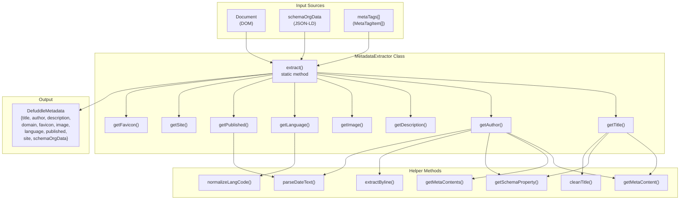
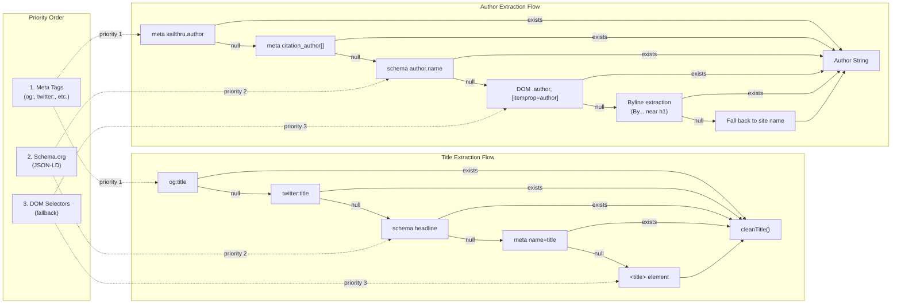
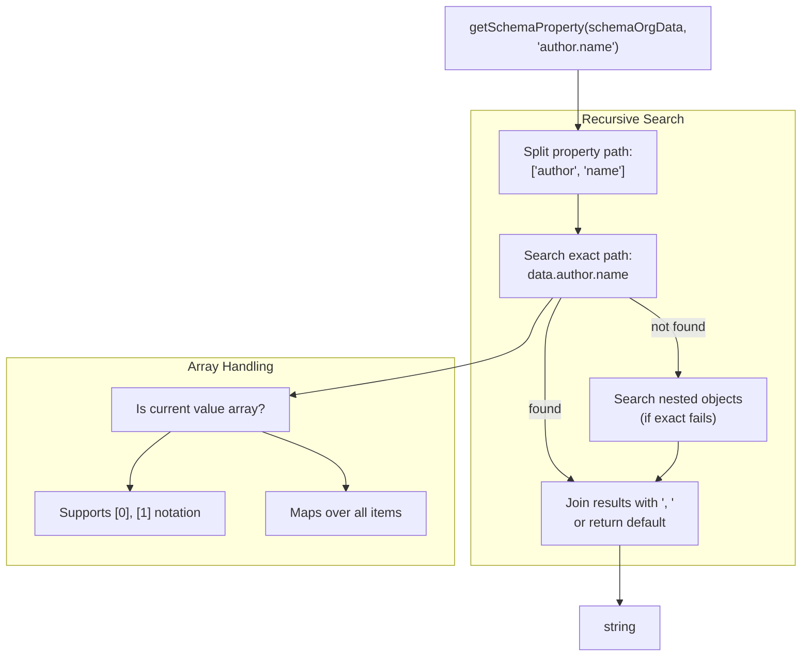
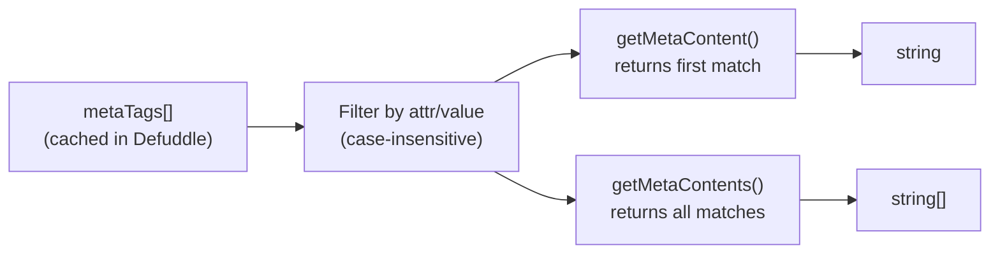
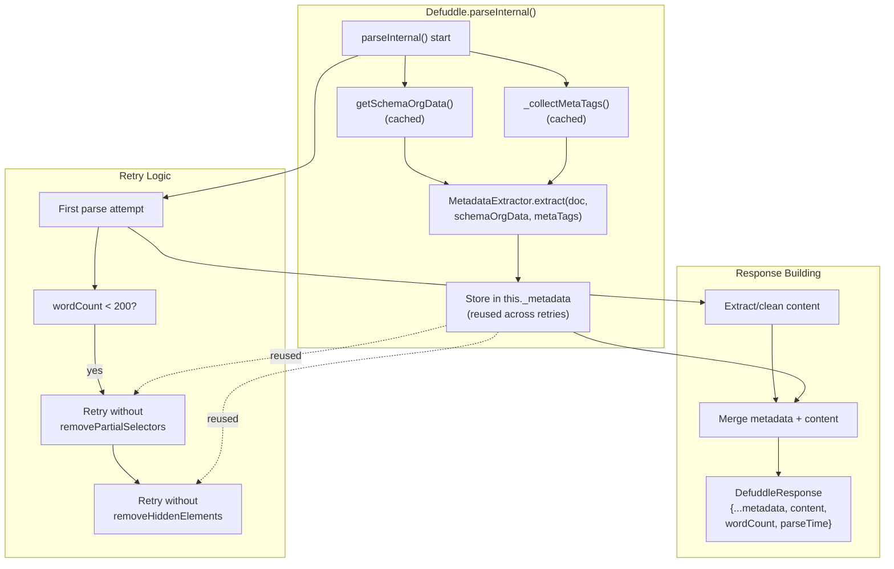

# 메타데이터 추출

<details>
<summary>관련 소스 파일</summary>

다음 파일들은 이 위키 페이지를 생성하는 맥락으로 사용되었습니다.

- [README.md](README.md)
- [src/constants.ts](src/constants.ts)
- [src/defuddle.ts](src/defuddle.ts)
- [src/metadata.ts](src/metadata.ts)
- [src/types.ts](src/types.ts)

</details>


이 페이지는 메타데이터 추출 하위 시스템, 특히 `MetadataExtractor` 클래스와 제목, 작성자, 설명 및 기타 페이지 메타데이터를 추출하기 위한 다중 출처 우선순위 전략을 문서화합니다. 주요 콘텐츠를 식별하고 점수화하는 정보는 [Content Identification and Scoring](#4.1)을 참조하세요. 전체 추출 파이프라인은 [Core Extraction Pipeline](#3.1)을 참조하세요.

## 개요

메타데이터 추출 시스템은 Schema.org JSON-LD 데이터, HTML meta 태그, DOM 요소 selector라는 세 가지 주요 출처에서 우선순위 순서대로 페이지 메타데이터를 수집합니다. `MetadataExtractor` 클래스는 각 메타데이터 필드(예: 제목, 작성자, 게시일)가 값을 찾을 때까지 신뢰도가 높은 순서에서 낮은 순서로 여러 추출 메서드를 시도하는 정교한 fallback 전략을 구현합니다.

메타데이터 추출은 파싱 파이프라인의 초기에 발생하며, 재시도 전반에서 캐시됩니다. 추출된 메타데이터는 정리된 콘텐츠와 함께 `DefuddleResponse` 객체를 채웁니다.

**출처:** [src/metadata.ts:1-473](), [src/defuddle.ts:1-24](), [src/types.ts:1-14]()

## MetadataExtractor 아키텍처



**MetadataExtractor 클래스 구조**

`MetadataExtractor` 클래스는 메타데이터 수집을 조율하는 단일 public method `extract()`를 가진 static utility입니다. 각 메타데이터 필드는 해당 필드의 구체적인 추출 로직을 구현하는 전용 private static method를 가집니다.

**출처:** [src/metadata.ts:3-57](), [src/metadata.ts:59-185]()

## 다중 출처 우선순위 전략



**우선순위 Fallback 패턴**

각 메타데이터 필드는 여러 출처를 우선순위 순서대로 시도하고 첫 번째 non-empty 값을 반환하는 waterfall 패턴을 구현합니다. Meta 태그(Open Graph, Twitter Cards)는 신뢰도가 높기 때문에 먼저 확인되고, 그 다음 Schema.org JSON-LD 데이터, 마지막 수단으로 DOM 요소 selector가 사용됩니다.

**출처:** [src/metadata.ts:224-236](), [src/metadata.ts:59-185]()

## 메타데이터 필드

### 제목

| 메서드 | `getTitle()` |
|--------|--------------|
| **우선순위** | 1. `og:title` meta 태그<br/>2. `twitter:title` meta 태그<br/>3. Schema.org `headline`<br/>4. `name="title"` meta 태그<br/>5. `<title>` 요소 |
| **후처리** | `cleanTitle()`는 "Title \| Site Name" 같은 패턴을 사용해 사이트 이름 접미사/접두사를 제거합니다 |

**출처:** [src/metadata.ts:224-257]()

### 작성자

| 메서드 | `getAuthor()` |
|--------|---------------|
| **우선순위** | 1. Meta 태그: `sailthru.author`, `author`, `byl`, `authorList`<br/>2. 연구 meta 태그: `citation_author[]`, `dc.creator[]`(이름 순서 뒤집기 포함)<br/>3. Schema.org: `author.name`, `author.[].name`<br/>4. DOM selector: `[itemprop="author"]`, `.author`, `[href*="/author/"]`<br/>5. Byline 추출: `<h1>` 근처의 "By ..." 텍스트<br/>6. 사이트 이름 fallback |
| **후처리** | • 쉼표로 구분된 목록 중복 제거<br/>• citation_author의 "Last, First" 형식 뒤집기<br/>• 최대 10명 작성자로 제한<br/>• 일반적인 "author" 텍스트 필터링<br/>• byline을 찾기 위해 `<h1>`의 최대 3단계 ancestor와 sibling 검색 |
| **특수 로직** | `extractByline()`은 `/^By\s+([A-Z].+)$/i` 패턴과 매칭합니다<br/>`parseDateText()`는 날짜와 인접한 작성자 링크를 식별합니다 |

**출처:** [src/metadata.ts:59-200](), [src/metadata.ts:374-398]()

### 설명

| 메서드 | `getDescription()` |
|--------|-------------------|
| **우선순위** | 1. `name="description"` meta 태그<br/>2. `property="description"` meta 태그<br/>3. `og:description` meta 태그<br/>4. Schema.org `description`<br/>5. `twitter:description` meta 태그<br/>6. `sailthru.description` meta 태그 |

**출처:** [src/metadata.ts:259-269]()

### 이미지

| 메서드 | `getImage()` |
|--------|--------------|
| **우선순위** | 1. `og:image` meta 태그<br/>2. `twitter:image` meta 태그<br/>3. Schema.org `image.url`<br/>4. `sailthru.image.full` meta 태그 |

**출처:** [src/metadata.ts:271-279]()

### 언어

| 메서드 | `getLanguage()` |
|--------|----------------|
| **우선순위** | 1. `<html lang="...">` 속성<br/>2. `content-language` meta 태그<br/>3. `og:locale` 속성<br/>4. `http-equiv="Content-Language"`<br/>5. Schema.org `inLanguage` |
| **후처리** | `normalizeLangCode()`는 BCP 47 준수를 위해 밑줄을 하이픈으로 변환합니다(예: `en_US` → `en-US`) |

**출처:** [src/metadata.ts:281-309]()

### 게시일

| 메서드 | `getPublished()` |
|--------|-----------------|
| **우선순위** | 1. Schema.org `datePublished`<br/>2. `name="publishDate"` meta 태그<br/>3. `article:published_time` 속성<br/>4. `<abbr itemprop="datePublished">` title 속성<br/>5. `<time>` 요소 datetime 또는 텍스트<br/>6. `sailthru.date` meta 태그<br/>7. `<h1>` 근처 날짜 텍스트(다음 3개 sibling) |
| **후처리** | `parseDateText()`는 두 형식을 파싱합니다:<br/>• "26 February 2025" → `2025-02-26T00:00:00+00:00`<br/>• "February 26, 2025" → `2025-02-26T00:00:00+00:00` |

**출처:** [src/metadata.ts:332-372](), [src/metadata.ts:374-398]()

### 사이트 이름

| 메서드 | `getSiteName()`, `getSite()` |
|--------|------------------------------|
| **우선순위** | 1. Schema.org `publisher.name`<br/>2. `og:site_name` 속성<br/>3. Schema.org `WebSite.name`, `sourceOrganization.name`<br/>4. `name="copyright"` meta 태그<br/>5. Schema.org `copyrightHolder.name`, `isPartOf.name`<br/>6. `application-name` meta 태그 |
| **Fallback** | `getSite()`는 사이트 이름을 찾지 못하면 작성자로 fallback합니다 |

**출처:** [src/metadata.ts:202-222]()

### Favicon

| 메서드 | `getFavicon()` |
|--------|----------------|
| **우선순위** | 1. `og:image:favicon` 속성<br/>2. `<link rel="icon">`<br/>3. `<link rel="shortcut icon">`<br/>4. `/favicon.ico`(사용 가능한 경우 base URL에서 구성) |

**출처:** [src/metadata.ts:310-330]()

### Domain

| 추출 로직 | 문서 URL 또는 base 태그에서 파생 |
|------------------|---------------------------------------|
| **출처** | 1. `doc.location.href`<br/>2. `og:url`, `twitter:url` meta 태그<br/>3. Schema.org `url`, `mainEntityOfPage.url`<br/>4. `<link rel="canonical">`<br/>5. `<base href="">` |
| **처리** | hostname에서 `www.` 접두사를 제거합니다 |

**출처:** [src/metadata.ts:5-41]()

## Helper 메서드

### getSchemaProperty()



**Schema.org 속성 추출**

`getSchemaProperty()` 메서드는 다음을 지원하면서 Schema.org JSON-LD 데이터를 재귀적으로 검색합니다.
- Dot-notation 경로(예: `author.name`)
- 배열 인덱싱(예: `author.[0].name`)
- 자동 배열 mapping(예: `author.[].name`은 모든 작성자 이름 반환)
- 중첩 객체 fallback(정확한 경로가 실패하면 전체 tree 검색)
- 여러 match에 대한 쉼표 결합 결과

**출처:** [src/metadata.ts:400-472]()

### getMetaContent() / getMetaContents()



**Meta 태그 Helper**

이 메서드들은 캐시된 `metaTags[]` 배열을 attribute name/property와 value로 필터링합니다. `getMetaContents()` 변형은 모든 match를 반환하며, 여러 tag가 존재할 수 있는 `citation_author` 같은 필드에 사용됩니다.

**출처:** [src/metadata.ts:356-365]()

## Defuddle 파이프라인과의 통합



**파이프라인 통합**

메타데이터 추출은 `parse()` 호출당 한 번 발생하며, 재시도 중 중복 추출을 피하기 위해 `this._metadata`에 캐시됩니다. 추출은 Schema.org 데이터와 meta 태그가 수집된 직후 파이프라인 초기에 발생합니다.

**캐싱 전략:**
- `this._schemaOrgData`: `getSchemaOrgData()`를 통해 lazy하게 캐시되며, script 태그 제거 전에 한 번 추출됩니다
- `this._metaTags`: `_collectMetaTags()`를 통해 캐시되며, parse당 한 번 추출됩니다
- `this._metadata`: 첫 번째 `MetadataExtractor.extract()` 호출 후 캐시되며, 재시도 전반에서 재사용됩니다

**통합 지점:**
1. **동기 파싱**: [src/defuddle.ts:498-509]() - `parseInternal()` 중 메타데이터 추출
2. **비동기 추출**: [src/defuddle.ts:448]() - 비동기 추출기가 사용될 때 메타데이터 추출
3. **응답 병합**: [src/defuddle.ts:624-630]() - 최종 `DefuddleResponse`에 메타데이터 spread
4. **추출기 fallback**: [src/defuddle.ts:521]() - 플랫폼 추출기가 콘텐츠를 override할 때 메타데이터 사용

**출처:** [src/defuddle.ts:461-652](), [src/defuddle.ts:77-83](), [src/defuddle.ts:393-410]()

## 데이터 구조

### MetaTagItem 인터페이스

```typescript
interface MetaTagItem {
  name?: string | null;      // meta name attribute
  property?: string | null;  // meta property attribute (og:, twitter:)
  content: string | null;    // meta content value
}
```

Meta 태그는 `_collectMetaTags()`를 통해 한 번 수집되어 배열에 캐시됩니다. Open Graph와 Twitter Card 태그를 지원하기 위해 `name`과 `property` 속성을 모두 캡처합니다.

**출처:** [src/types.ts:16-20]()

### DefuddleMetadata 인터페이스

```typescript
interface DefuddleMetadata {
  title: string;
  description: string;
  domain: string;
  favicon: string;
  image: string;
  language: string;
  parseTime: number;
  published: string;
  author: string;
  site: string;
  schemaOrgData: any;
  wordCount: number;
}
```

`DefuddleResponse`는 이 인터페이스를 확장하며, `content`, `contentMarkdown`, `metaTags`, `debug`, `variables` 필드를 추가합니다.

**출처:** [src/types.ts:1-14](), [src/types.ts:34-41]()
