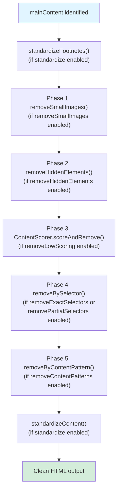
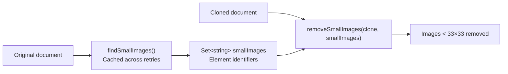
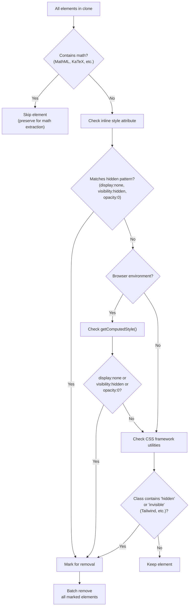
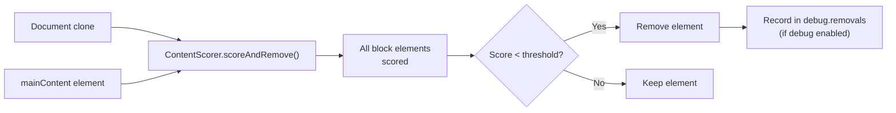
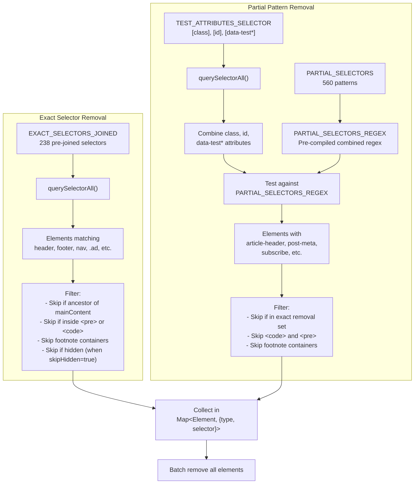
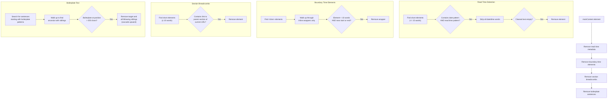
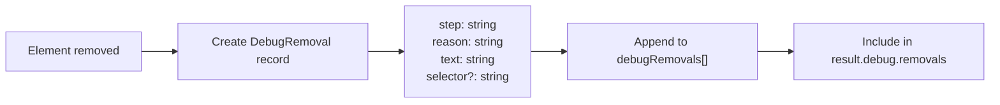
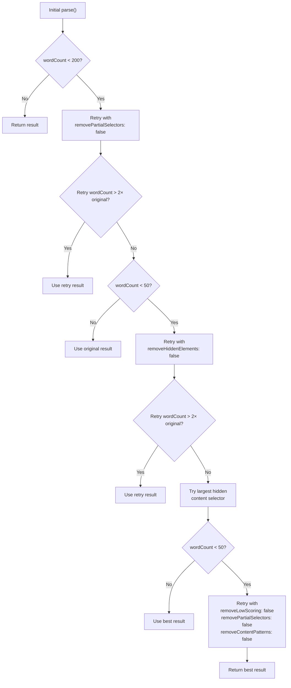

# 잡음 요소 제거 파이프라인

<details>
<summary>관련 소스 파일</summary>

다음 파일들은 이 위키 페이지를 생성하는 맥락으로 사용되었습니다.

- [src/constants.ts](src/constants.ts)
- [src/defuddle.ts](src/defuddle.ts)

</details>


잡음 요소 제거 파이프라인은 추출된 HTML에서 콘텐츠가 아닌 요소를 체계적으로 제거하는 다단계 프로세스입니다. 콘텐츠 식별([4.1](#4.1) 참조) 이후, 표준화([5](#5) 참조) 이전에 동작하며, clean content output에 나타나면 안 되는 내비게이션 메뉴, 광고, 소셜 공유 버튼, 메타데이터 표시 및 기타 인터페이스 요소를 제거합니다.

이 파이프라인은 설정 가능한 다섯 단계와 추가 content-pattern 단계로 구성되며, 각 단계는 상호 보완적인 탐지 전략을 사용해 서로 다른 유형의 잡음 요소를 대상으로 합니다. 각 단계는 `DefuddleOptions`를 통해 개별적으로 활성화하거나 비활성화할 수 있으므로, 초기 추출 결과가 불충분한 콘텐츠를 생성할 때 재시도 메커니즘이 공격적인 단계를 적응적으로 비활성화할 수 있습니다.

## 파이프라인 실행 흐름

잡음 요소 제거 파이프라인은 `parseInternal` 메서드 안에서 다음 순서로 실행됩니다.



**출처:** [src/defuddle.ts:575-620]()

### 실행 순서의 근거

각 단계는 콘텐츠 컨테이너가 제거되는 것을 방지하도록 설계된 특정 순서로 실행됩니다.

1. **작은 이미지 먼저** — 숨김 요소 감지 전에 장식용 아이콘을 제거하여, 아이콘이 많은 내비게이션에서 false positive가 발생하는 것을 방지합니다
2. **숨김 요소** — 잡음 selector를 포함할 수 있는 display:none 콘텐츠를 제거합니다
3. **점수화 기반 제거** — selector matching 전에 heuristic을 사용해 낮은 가치의 블록을 제거합니다
4. **Selector 기반 제거** — 구조 정리 후 알려진 잡음 패턴을 제거합니다
5. **콘텐츠 패턴** — 주요 콘텐츠 안에서만 감지할 수 있는 메타데이터와 boilerplate를 최종 정리합니다

**출처:** [src/defuddle.ts:580-611]()

## 설정 옵션

각 단계는 `DefuddleOptions`의 boolean 옵션으로 제어됩니다.

| 옵션 | 기본값 | 제어 단계 |
|--------|---------|----------------|
| `removeSmallImages` | `true` | 작은 이미지 제거 |
| `removeHiddenElements` | `true` | 숨김 요소 감지 |
| `removeLowScoring` | `true` | 콘텐츠 점수화 제거 |
| `removeExactSelectors` | `true` | 정확한 selector matching |
| `removePartialSelectors` | `true` | 부분 selector matching |
| `removeContentPatterns` | `true` | 콘텐츠 패턴 제거 |

**출처:** [src/defuddle.ts:484-493](), [src/types.ts]()

## 1단계: 작은 이미지 제거

작은 이미지 제거는 33×33 픽셀보다 작은 장식용 이미지(아이콘, 버튼, 배지)를 식별하고 제거하여, 추출된 콘텐츠가 지저분해지는 것을 방지합니다.



**출처:** [src/defuddle.ts:532-536](), [src/defuddle.ts:979-1031]()

### 감지 전략

`findSmallImages` 메서드는 원본 문서의 모든 ``와 `<svg>` 요소를 검사하며, 다음 여러 dimension source를 우선순위 순서로 확인합니다.

1. **HTML 속성** — `width`와 `height` 속성
2. **Inline style** — `style="width: X; height: Y"` 패턴
3. **Computed style** — `getComputedStyle()`(브라우저 전용)
4. **Bounding rectangle** — `getBoundingClientRect()`(브라우저 전용)

감지된 dimension pair 중 **하나라도** width < 33px 및 height < 33px를 나타내면 해당 요소는 작은 요소로 표시됩니다. CSS transform이 요소를 다르게 scaling하는 경우를 처리하기 위해 감지된 모든 dimension 중 최솟값이 사용됩니다.

**출처:** [src/defuddle.ts:979-1031]()

### 요소 식별

작은 이미지는 복제된 문서에서 매칭할 수 있도록 고유 식별자로 추적됩니다.

```typescript
// For  elements
`src:${src}`           // Primary: src attribute
`srcset:${srcset}`     // Fallback: srcset attribute
`src:${dataSrc}`       // Lazy-loaded: data-src attribute

// For <svg> elements
`id:${id}`             // Primary: id attribute
`viewBox:${viewBox}`   // Fallback: viewBox attribute
`class:${className}`   // Fallback: class attribute
```

**출처:** [src/defuddle.ts:1050-1075]()

### 제거 프로세스

`removeSmallImages` 메서드는 식별자를 매칭하여 복제된 문서에서 표시된 요소를 제거합니다. 이 2단계 접근 방식(원본에서 찾고, clone에서 제거)은 dimension 계산이 원본 DOM의 computed style과 layout을 사용하도록 보장합니다.

**출처:** [src/defuddle.ts:1033-1048]()

## 2단계: 숨김 요소 제거

숨김 요소 제거는 CSS를 사용해 시각적으로 숨겨진 요소를 감지하고 제거합니다. 이러한 요소는 일반적으로 내비게이션 overlay, 모바일 메뉴 및 기타 콘텐츠가 아닌 인터페이스 요소를 포함합니다.



**출처:** [src/defuddle.ts:777-852]()

### 감지 전략

`removeHiddenElements` 메서드는 세 가지 상호 보완적 전략을 사용합니다.

#### 1. Inline Style Pattern Matching

Regex를 사용해 `style` 속성에서 CSS hiding pattern을 확인합니다.

```
/(?:^|;\s*)(?:display\s*:\s*none|visibility\s*:\s*hidden|opacity\s*:\s*0)(?:\s*;|\s*$)/i
```

이 빠른 pattern match는 DOM API 호출 없이 대부분의 명시적으로 숨겨진 요소를 포착합니다.

**출처:** [src/defuddle.ts:782](), [src/defuddle.ts:800-807]()

#### 2. Computed Style 분석(브라우저 전용)

브라우저 환경에서는 `getComputedStyle()`을 사용해 외부 stylesheet나 CSS cascade로 숨겨진 요소를 감지합니다. computed style이 신뢰하기 어렵고 느린 Node.js 환경(jsdom/linkedom)에서는 건너뜁니다.

**출처:** [src/defuddle.ts:786-787](), [src/defuddle.ts:810-823]()

#### 3. CSS Framework Utility 감지

Tailwind 같은 CSS framework의 utility class를 감지합니다.
- `hidden`
- `invisible`
- `sm:hidden`, `md:hidden`(responsive variant)
- `not-machine:hidden`(custom variant)

**출처:** [src/defuddle.ts:826-838]()

### 수식 요소 보존

수학 콘텐츠를 포함하는 요소는 숨겨져 있더라도 절대 제거되지 않습니다. Wikipedia 같은 사이트가 접근성을 위해 `display:none` wrapper를 사용하기 때문입니다.

```html
<!-- Wikipedia's dual-rendering approach -->
<span style="display:none">
  <math>...</math>  <!-- MathML for accessibility -->
</span>
  <!-- Visual fallback -->
```

보존 검사는 다음과 매칭합니다.
- `math` 요소
- `[data-mathml]` 속성
- `.katex-mathml` class

**출처:** [src/defuddle.ts:794-797]()

### 일괄 제거

요소는 제거 이유와 함께 `Map<Element, string>`에 수집된 다음, DOM thrashing을 피하기 위해 단일 batch로 제거됩니다. Debug mode는 각 제거 항목을 이유와 텍스트 preview와 함께 기록합니다.

**출처:** [src/defuddle.ts:779](), [src/defuddle.ts:841-851]()

## 3단계: 낮은 점수 블록 제거

낮은 점수 블록 제거는 콘텐츠 품질 heuristic을 사용해 selector 기반 제거로 포착되지 않은 내비게이션 메뉴, 링크 목록 및 기타 콘텐츠가 아닌 블록을 식별하고 제거합니다. 이 단계는 `ContentScorer` 클래스에 완전히 구현되어 있습니다(자세한 점수화 알고리즘은 [4.1](#4.1) 참조).



**출처:** [src/defuddle.ts:592-594]()

점수화 알고리즘은 다음을 평가합니다.
- Text-to-link ratio(높은 링크 밀도 = 내비게이션)
- 단어 수와 문단 구조
- List density(짧은 list item이 많음 = 메뉴)
- 요소 depth와 nesting pattern

**출처:** [src/scoring.ts]()

## 4단계: Selector 기반 제거

Selector 기반 제거는 알려진 잡음 패턴에 대한 정확한 CSS selector와 요소 속성에 대한 부분 pattern matching이라는 두 가지 상호 보완적 전략을 사용합니다.



**출처:** [src/defuddle.ts:854-976](), [src/constants.ts:62-240](), [src/constants.ts:255-812]()

### 정확한 Selector Matching

정확한 selector는 항상 제거해야 하는 요소를 위한 특정 CSS selector를 대상으로 합니다.

| 범주 | 예시 Selector | 개수 |
|----------|------------------|-------|
| 구조 | `header`, `footer`, `nav`, `aside` | ~10 |
| 메타데이터 | `.author`, `.date`, `.tags`, `#title` | ~40 |
| 내비게이션 | `.menu`, `.navigation`, `[role="navigation"]` | ~15 |
| 광고 | `.ad`, `[class^="ad-"]`, `.promo` | ~12 |
| 소셜 | 코드에 숨겨져 있으며, 댓글 섹션 포함 | ~8 |
| Form | `form`, `input`, `button`, `select` | ~10 |
| 숨김 | `[hidden]`, `[aria-hidden="true"]`, `.hidden` | ~4 |
| 기타 | Script, style, iframe 등 | ~140 |

238개의 정확한 selector 전체 목록은 `EXACT_SELECTORS`에 정의되어 있으며, 성능을 위해 `EXACT_SELECTORS_JOINED`로 미리 결합되어 있습니다.

**출처:** [src/constants.ts:62-240](), [src/defuddle.ts:864-885]()

### 부분 Pattern Matching

부분 selector는 요소 속성의 substring pattern과 매칭하여, 사이트가 비의미론적 class 이름이나 CSS-in-JS를 사용할 때도 잡음 요소를 포착합니다.

```typescript
// Matches any of these attributes
TEST_ATTRIBUTES = ['class', 'id', 'data-test', 'data-testid', 
                   'data-test-id', 'data-qa', 'data-cy']

// Against 560 patterns including:
'article-header'      // Matches class="article-header-wrapper"
'post-meta'          // Matches id="post-meta-section"  
'subscribe'          // Matches class="newsletter-subscribe-form"
'share'              // Matches data-test="share-buttons"
```

패턴은 단일 regex `PARTIAL_SELECTORS_REGEX`로 컴파일되어, 560개의 개별 pattern에 대해 O(n)으로 검사하는 대신 요소당 O(1)로 검사합니다.

**출처:** [src/constants.ts:255-812](), [src/constants.ts:814-815](), [src/defuddle.ts:887-934]()

### 보호 메커니즘

여러 safeguard가 콘텐츠 제거를 방지합니다.

#### 1. 주요 콘텐츠 Ancestor 보호
`mainContent`를 포함하는 요소는 절대 제거되지 않아, 콘텐츠 tree가 분리되는 것을 방지합니다.

```typescript
if (mainContent && el.contains(mainContent)) {
    return;
}
```

**출처:** [src/defuddle.ts:942-944]()

#### 2. 각주 컨테이너 보호
각주 목록과 그 child는 `FOOTNOTE_LIST_SELECTORS`를 사용해 보존됩니다.

```typescript
if (el.matches(FOOTNOTE_LIST_SELECTORS) || 
    el.querySelector(FOOTNOTE_LIST_SELECTORS)) {
    return;
}
```

**출처:** [src/defuddle.ts:949-957](), [src/constants.ts:847-864]()

#### 3. 코드 블록 보호
`<pre>` 또는 `<code>` 안의 요소는 건너뜁니다. syntax highlighter가 `language-javascript`, `token-comment`처럼 잡음 패턴과 매칭되는 class를 사용하기 때문입니다.

```typescript
if (el.closest('pre, code')) {
    return;
}
```

**출처:** [src/defuddle.ts:878-880](), [src/defuddle.ts:906-908]()

#### 4. Heading Anchor 보호
Heading 안의 anchor link(linkable heading에 흔함)는 보존됩니다.

```typescript
if (el.tagName === 'A' && el.closest('h1, h2, h3, h4, h5, h6')) {
    return;
}
```

**출처:** [src/defuddle.ts:945-947]()

### 성능 최적화

구현은 큰 문서를 위해 여러 최적화를 사용합니다.

1. **미리 결합된 selector** — `EXACT_SELECTORS_JOINED`는 parse마다 selector 문자열을 만드는 것을 피합니다
2. **미리 컴파일된 regex** — `PARTIAL_SELECTORS_REGEX`는 module load 시 한 번 컴파일됩니다
3. **속성 pre-filtering** — `TEST_ATTRIBUTES_SELECTOR`는 관련 속성이 있는 요소만 query합니다
4. **일괄 제거** — 모든 요소를 `Map`에 수집한 다음 한 번의 pass로 제거합니다

**출처:** [src/constants.ts:240](), [src/constants.ts:814-818](), [src/defuddle.ts:894](), [src/defuddle.ts:941-967]()

## 5단계: 콘텐츠 패턴 제거

콘텐츠 패턴 제거는 CSS selector가 아니라 텍스트 콘텐츠를 기반으로 메타데이터와 boilerplate를 제거하는 최종 정리 단계입니다. 이는 class 이름이 의미 정보를 제공하지 않는 Tailwind/CSS-in-JS 사이트의 요소를 포착합니다.



**출처:** [src/defuddle.ts:1554-1744]()

### 읽기 시간 메타데이터 제거

글 위에 표시되는 "Mar 4th 2026 | 3 min read" 같은 게시일과 읽기 시간 표시를 제거합니다.

```typescript
// Detection patterns
CONTENT_DATE_PATTERN = /(?:Jan|Feb|Mar|Apr|May|Jun|Jul|Aug|Sep|Oct|Nov|Dec)[a-z]*\s+\d{1,2}/i
CONTENT_READ_TIME_PATTERN = /\d+\s*min(?:ute)?s?\s+read\b/i

// Stripping patterns to verify text is ONLY metadata
METADATA_STRIP_PATTERNS = [
    /\b(?:Jan(?:uary)?|Feb(?:ruary)?|...)\b/gi,  // Month names
    /\b\d+(?:st|nd|rd|th)?\b/g,                   // Day numbers
    /\bmin(?:ute)?s?\b/gi,                         // "min", "minutes"
    /\bread\b/gi,                                  // "read"
    /[|·•—–\-,.\s]/g                              // Punctuation
]
```

요소는 다음 조건을 모두 만족할 때만 제거됩니다.
1. 텍스트가 15단어 이하
2. 날짜와 읽기 시간 패턴을 모두 포함
3. 날짜/시간 단어를 제거한 뒤 의미 있는 콘텐츠가 남지 않음
4. 요소에 block child(`<p>`, `<div>` 등)가 없음

**출처:** [src/defuddle.ts:36-49](), [src/defuddle.ts:1559-1588]()

### 경계 Time 요소 제거

콘텐츠의 시작 또는 끝 근처에 있는 독립적인 `<time>` 요소(게시일)를 제거하면서, prose 안의 inline time reference는 보존합니다.

```html
<!-- Removed: standalone time at start -->
<p><time>March 4, 2026</time></p>

<!-- Preserved: inline time in prose -->
<p>The event occurred on <time>March 4, 2026</time> during...</p>
```

알고리즘은 inline formatting wrapper(`<i>`, `<em>`, `<span>`, `<b>`, `<strong>`, `<small>`)를 따라 위로 올라가며 가장 작은 제거 가능 단위를 찾지만, 다른 콘텐츠가 있는 컨테이너를 제거하지 않도록 block element에서 멈춥니다.

**출처:** [src/defuddle.ts:1593-1633]()

### 섹션 Breadcrumb 제거

상위 섹션으로 돌아가는 링크를 포함한 짧은 요소를 제거합니다.

```html
<!-- URL: example.com/blog/tech/article -->
<!-- Removed: link to parent section -->
<div>Filed under: <a href="/blog/tech">Technology</a></div>
```

감지 기준:
- 요소가 10단어 이하
- 현재 URL path의 prefix인 path를 가진 링크를 포함
- 링크가 root(`/`) 또는 현재 페이지가 아님
- 요소에 block child가 없음

**출처:** [src/defuddle.ts:1635-1665]()

### Boilerplate 문장 제거

글 끝의 boilerplate와 뒤따르는 비콘텐츠를 제거합니다.

```typescript
BOILERPLATE_PATTERNS = [
    /^This (?:article|story|piece) (?:appeared|was published|originally appeared) in\b/i,
    /^A version of this (?:article|story) (?:appeared|was published) in\b/i,
    /^Originally (?:published|appeared) (?:in|on|at)\b/i,
]
```

Boilerplate 문장이 발견되면:
1. Ancestor tree를 따라 올라가 next sibling이 있는 요소를 찾습니다
2. Boilerplate가 콘텐츠 안에서 200자 이후에 나타나는지 확인합니다
3. 해당 요소와 그 이후의 모든 sibling을 제거합니다
4. 위로 cascade합니다. 각 ancestor level에서 뒤따르는 sibling을 제거합니다

이 공격적인 truncation은 boilerplate 이후의 모든 항목(관련 글, author bio 등)이 제거되도록 보장합니다.

**출처:** [src/defuddle.ts:38-42](), [src/defuddle.ts:1667-1714]()

## Debug 지원

잡음 요소 제거 파이프라인은 `options.debug`가 활성화되면 모든 단계에서 제거된 모든 요소를 추적하는 자세한 debugging 정보를 제공합니다.



**출처:** [src/defuddle.ts:632-637](), [src/types.ts]()

### DebugRemoval 구조

각 제거 항목은 다음 정보와 함께 기록됩니다.

```typescript
interface DebugRemoval {
    step: string;      // Phase name: 'removeHiddenElements', 'removeBySelector', etc.
    reason: string;    // Specific reason: 'display:none', 'exact selector match', etc.
    text: string;      // Text preview (first 100 chars)
    selector?: string; // For partial matches: the matched pattern
}
```

**출처:** [src/types.ts]()

### Debug 출력 예

```json
{
  "debug": {
    "removals": [
      {
        "step": "removeHiddenElements",
        "reason": "display:none",
        "text": "Subscribe to our newsletter..."
      },
      {
        "step": "removeBySelector",
        "selector": "article-header",
        "reason": "partial match: article-header",
        "text": "Technology | 5 min read"
      },
      {
        "step": "removeByContentPattern",
        "reason": "read time metadata",
        "text": "Mar 4th 2026 | 3 min read"
      }
    ]
  }
}
```

`textPreview()` utility 함수는 가독성을 위해 긴 텍스트를 처음 100자로 잘라냅니다.

**출처:** [src/utils/index.ts]()

## 적응형 재시도 메커니즘

`parse()` 메서드는 초기 추출 결과가 불충분한 콘텐츠를 생성할 때 잡음 요소 제거 단계를 점진적으로 비활성화하는 적응형 재시도 메커니즘을 구현합니다. 이는 짧은 글이나 특이한 페이지 구조에서 지나치게 공격적인 제거를 방지합니다.



**출처:** [src/defuddle.ts:88-159]()

### 재시도 전략

재시도 로직은 word count threshold를 사용해 문제가 있는 추출을 감지합니다.

| Threshold | 트리거 | Override 옵션 | 근거 |
|-----------|---------|------------------|-----------|
| < 200 words | 과도한 제거 가능성 | `removePartialSelectors: false` | 부분 selector가 짧은 글에서 정상 콘텐츠 class 이름과 매칭될 수 있음 |
| < 50 words | 최소 콘텐츠 | `removeHiddenElements: false` | 페이지가 런타임에 숨겨진 wrapper에서 콘텐츠를 드러낼 수 있음 |
| < 50 words | 숨김 콘텐츠 | `contentSelector: hiddenSelector` | 가장 큰 숨겨진 하위 트리를 직접 대상으로 지정 |
| < 50 words | 인덱스 페이지 가능성 | 모든 scoring/pattern 비활성화 | 카드가 제거된 listing page일 수 있음 |

**출처:** [src/defuddle.ts:93-159]()

### 2배 기준값

재시도는 **2배 더 많은 콘텐츠**를 생성하는 경우에만 원래 결과를 대체하여, 작은 증가가 false positive가 되는 것을 방지합니다.

```typescript
// Small increase likely means partial selectors correctly removed
// clutter (author blocks, related articles) from a short article.
// Large increase (2x+) suggests partial selectors were too aggressive.
if (retryResult.wordCount > result.wordCount * 2) {
    result = retryResult;
}
```

**출처:** [src/defuddle.ts:99-106]()

### 숨김 콘텐츠 탐색

기본 재시도 이후에도 콘텐츠가 불충분하면, `findLargestHiddenContentSelector()`는 30단어를 초과하는 가장 큰 숨겨진 요소를 식별하고 이를 targeted `contentSelector`로 사용합니다.

```typescript
const candidates = body.querySelectorAll(HIDDEN_EXACT_SKIP_SELECTOR)
    .filter(el => !el.className.includes('math'));

// Find element with most words
const best = candidates.reduce((best, el) => 
    countWords(el.textContent) > bestWords ? el : best
);

if (best && countWords(best.textContent) > 30) {
    return getElementSelector(best);
}
```

이는 처음에는 숨겨진 컨테이너 안에 main content를 렌더링하는 React app 및 기타 SPA를 처리합니다.

**출처:** [src/defuddle.ts:324-347]()

### Schema.org Fallback

모든 재시도 전략 이후 Schema.org 데이터가 추출된 콘텐츠보다 더 많은 텍스트를 포함하면, parser는 Schema.org 텍스트 콘텐츠를 사용하거나 매칭되는 DOM 요소를 찾는 방식으로 fallback합니다.

```typescript
const schemaText = this._getSchemaText(result.schemaOrgData);
if (schemaText && this.countHtmlWords(schemaText) > result.wordCount) {
    // Try to find DOM element matching schema text
    const contentHtml = this._findContentBySchemaText(schemaText);
    if (contentHtml) {
        result.content = contentHtml;
    } else {
        // Use schema text directly as fallback
        result.content = schemaText;
    }
}
```

이는 content scorer가 잘못된 요소를 선택한 feed page에서 빈 결과가 반환되는 것을 방지합니다.

**출처:** [src/defuddle.ts:165-182](), [src/defuddle.ts:190-203](), [src/defuddle.ts:247-322]()

---

**문서 출처:**
- [src/defuddle.ts:461-651]() - 주요 parseInternal 메서드와 파이프라인 조율
- [src/defuddle.ts:88-185]() - parse 메서드의 재시도 메커니즘
- [src/defuddle.ts:777-852]() - removeHiddenElements 구현
- [src/defuddle.ts:854-976]() - removeBySelector 구현
- [src/defuddle.ts:979-1048]() - 작은 이미지 감지 및 제거
- [src/defuddle.ts:1554-1744]() - removeByContentPattern 구현
- [src/constants.ts:62-240]() - EXACT_SELECTORS 정의
- [src/constants.ts:243-818]() - PARTIAL_SELECTORS 및 관련 상수
- [src/scoring.ts]() - ContentScorer 클래스(참조됨)
