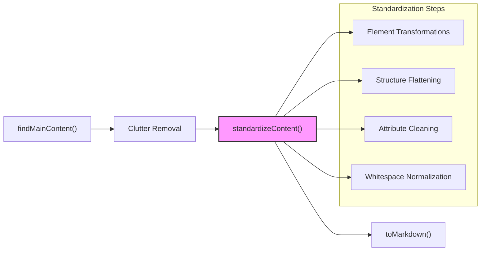
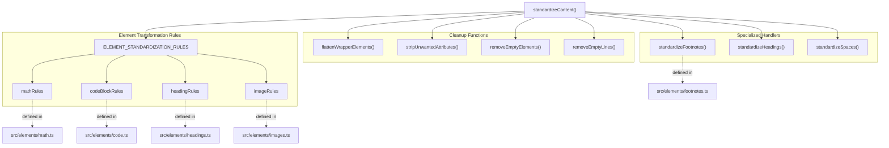
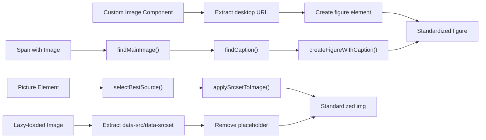
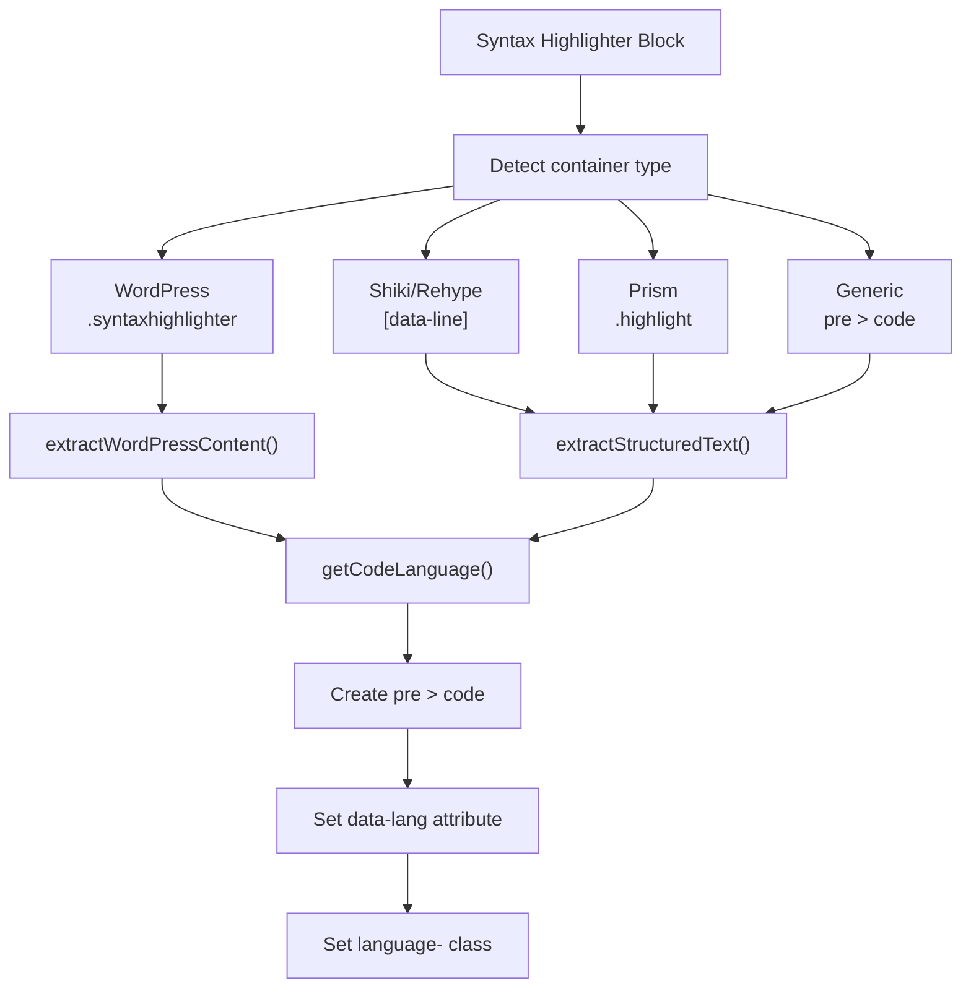
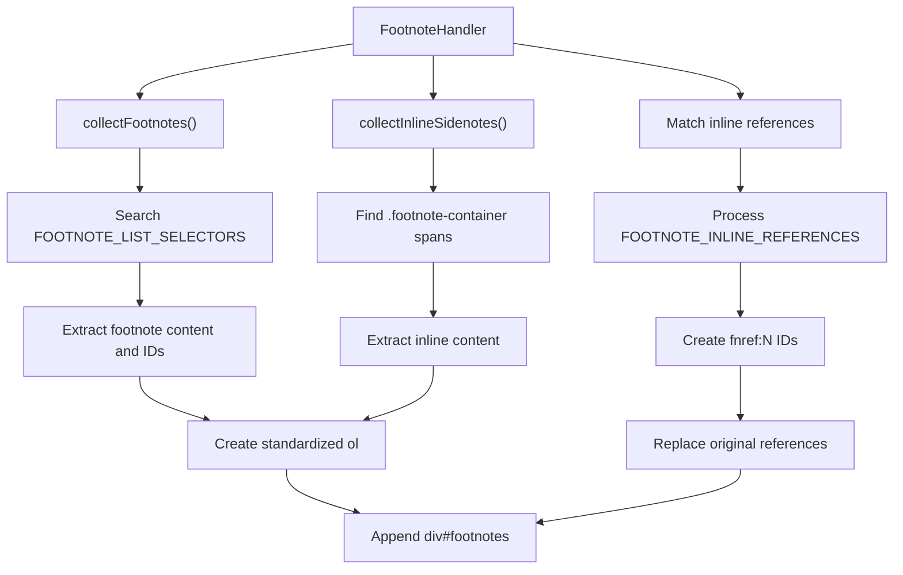
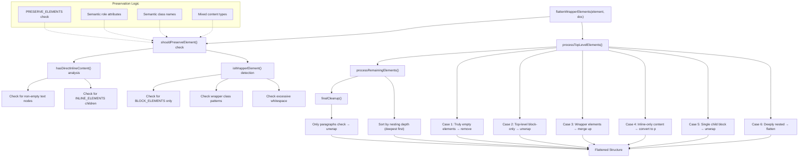
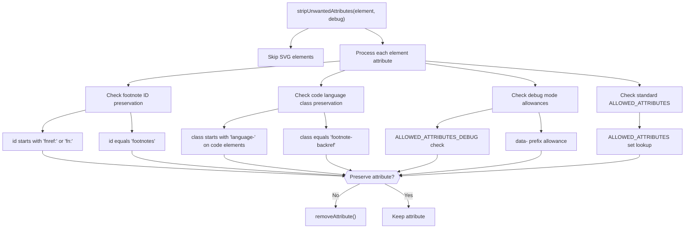
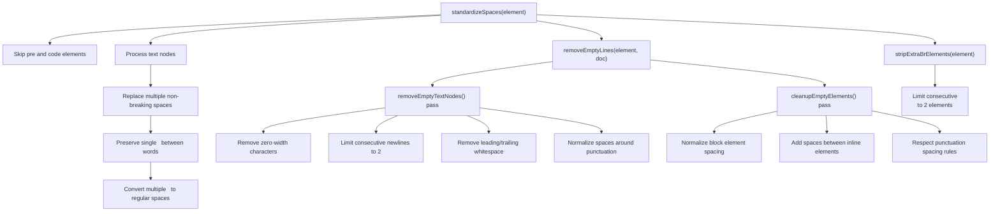
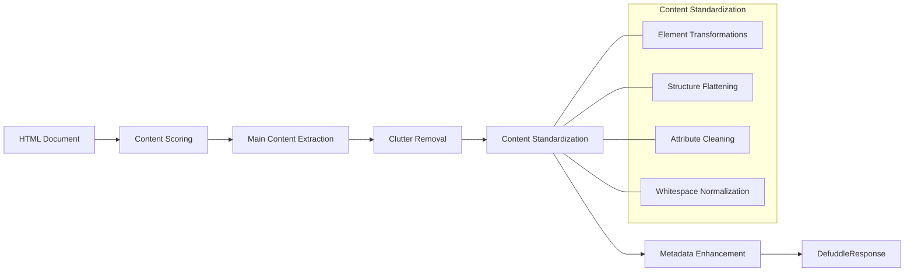

# 콘텐츠 표준화

<details>
<summary>관련 소스 파일</summary>

다음 파일들은 이 위키 페이지를 생성하는 맥락으로 사용되었습니다.

- [src/elements/code.ts](src/elements/code.ts)
- [src/elements/footnotes.ts](src/elements/footnotes.ts)
- [src/elements/images.ts](src/elements/images.ts)
- [src/extractors/chatgpt.ts](src/extractors/chatgpt.ts)
- [src/extractors/gemini.ts](src/extractors/gemini.ts)
- [src/extractors/twitter.ts](src/extractors/twitter.ts)
- [src/scoring.ts](src/scoring.ts)
- [src/standardize.ts](src/standardize.ts)

</details>


Content Standardization은 다양한 HTML 구조를 markdown 변환과 가독성에 적합한 일관되고 정규화된 형식으로 변환합니다. 잡음 요소 제거를 통해 주요 콘텐츠가 추출된 뒤, 표준화는 이미지, 코드 블록, 수학 표현식, 각주가 원래 구현 방식과 관계없이 예측 가능한 패턴을 따르도록 보장합니다.

이 페이지는 표준화 아키텍처의 개요를 제공합니다. 특정 하위 시스템에 대한 자세한 정보는 다음을 참조하세요.
- [Overall Standardization Process](#5.1) - `standardizeContent` 조율과 정리 파이프라인
- [Image Standardization](#5.2) - picture 요소, lazy-loaded 이미지, caption 정규화
- [Code Block Standardization](#5.3) - syntax highlighter 출력을 깔끔한 코드 블록으로 변환
- [Math Content Standardization](#5.4) - MathML, LaTeX, 방정식 형식 처리
- [Footnote Standardization](#5.5) - 각주 참조와 목록 형식 통합

## 표준화가 필요한 이유

웹 페이지는 동일한 콘텐츠 유형을 표현하기 위해 매우 다양한 구조를 사용합니다. 코드 블록은 Prism, Shiki, highlight.js, WordPress syntax highlighter 등을 사용해 렌더링될 수 있으며, 각각 DOM 구조, class 이름, 줄 번호 체계가 다릅니다. 이미지는 여러 source를 가진 `<picture>` 요소, data attribute를 사용하는 lazy-loaded ``, 또는 custom web component로 나타날 수 있습니다. 각주는 적절히 구조화된 `<sup>` 참조부터 다양한 markup pattern을 가진 inline citation까지 폭넓게 존재합니다.

표준화는 다음을 통해 이 문제를 해결합니다.
1. **구조 정규화** - 다양한 구현을 canonical HTML pattern으로 변환
2. **콘텐츠 추출** - wrapper 요소와 metadata attribute에서 실제 콘텐츠를 끌어냄
3. **마크업 정리** - 표현용 attribute, wrapper div, 중복 요소 제거
4. **변환 준비** - markdown 변환 규칙을 위한 일관된 구조 보장

출처: [src/standardize.ts:1-235]()

## 파이프라인 위치

콘텐츠 표준화는 콘텐츠 식별과 잡음 요소 제거 이후, markdown 변환 이전에 실행됩니다.



출처: [src/defuddle.ts:1-500](), [src/standardize.ts:166-235]()

## 아키텍처 개요

표준화 시스템은 `standardizeContent()`가 조율하는 변환 규칙과 정리 함수들을 중심으로 구성됩니다.

**표준화 아키텍처**



이 시스템은 각 콘텐츠 유형이 selector, 대상 요소, 선택적 transform 함수를 가진 `StandardizationRule` 객체 배열을 갖는 **규칙 기반 변환 패턴**을 사용합니다.

출처: [src/standardize.ts:1-35](), [src/standardize.ts:166-235]()

## 표준화 하위 시스템

### 이미지 표준화

이미지는 다양한 source 형식을 처리하고 최상의 품질 버전을 추출하기 위해 복잡한 처리가 필요합니다.

**이미지 처리 체인**



이미지 규칙은 다음을 처리합니다.
- 여러 `<source>` child를 가진 `<picture>` 요소
- `data-src`, `data-srcset` attribute를 가진 lazy-loaded 이미지
- `<uni-image-full-width>` 같은 custom component
- 다양한 구조(figcaption, alt text, sibling element)에서 caption 추출

자세한 처리 로직은 [Image Standardization](#5.2)을 참조하세요.

출처: [src/elements/images.ts:1-900]()

### 코드 블록 표준화

코드 블록은 다양한 syntax highlighter 형식으로 나타나며, 각각 줄 번호, 언어 감지, 구조가 다릅니다.

**코드 블록 정규화**



코드 규칙은 9개의 서로 다른 regex pattern에서 언어를 추출하며, 130개 이상의 language identifier를 지원합니다. 특수 처리는 다음을 포함합니다.
- WordPress table 기반 줄 구조
- hover tooltip이 있는 Verso/Lean 문서 블록
- 다양한 형식의 줄 번호 제거

언어 감지와 추출 세부사항은 [Code Block Standardization](#5.3)을 참조하세요.

출처: [src/elements/code.ts:1-372]()

### 수학 콘텐츠 표준화

수학 콘텐츠는 MathML, LaTeX 문자열 또는 렌더링된 방정식 라이브러리(KaTeX, MathJax)로 나타납니다.

수학 규칙은 다음을 추출합니다.
- 직접적인 `<math>` MathML 요소
- `data-latex` attribute 또는 `<script type="math/tex">` 태그의 LaTeX
- KaTeX/MathJax 렌더링 출력을 원본 notation으로 다시 변환
- alttext annotation이 있는 arXiv LaTeXML 방정식 table

**번들 변형:**
- **Core bundle** (`math.core.ts`) - 기본 추출만 수행
- **Full bundle** (`math.full.ts`) - 양방향 변환을 위해 `mathml-to-latex`와 `temml` 포함

형식 감지와 변환 로직은 [Math Content Standardization](#5.4)를 참조하세요.

출처: [src/elements/math.ts:1-200](), [src/elements/math.core.ts:1-50](), [src/elements/math.full.ts:1-100]()

### 각주 표준화

각주는 semantic `<sup>` 참조부터 inline citation, CSS sidenote까지 구조가 매우 다양합니다.

**각주 처리 흐름**



시스템은 다음을 처리합니다.
- 12개 이상의 footnote list selector(Wikipedia, arXiv, Substack 등)
- 6개 이상의 inline reference pattern(다양한 `<sup>`, `<a>` 구조)
- 콘텐츠가 inline으로 존재하는 CSS sidenote
- 표준 selector가 실패할 때 ID 기반 감지를 사용하는 범용 fallback

Matching 로직과 reference ID 생성은 [Footnote Standardization](#5.5)를 참조하세요.

출처: [src/elements/footnotes.ts:1-683]()

## 핵심 메커니즘

### 요소 변환 규칙

변환 시스템은 선언적 rule interface를 사용합니다.

```typescript
interface StandardizationRule {
  selector: string;          // CSS selector to match elements
  element: string;           // Target element type
  transform?: (el: Element, doc: Document) => Element;  // Optional transform function
}
```

규칙은 특화 모듈과 built-in conversion에서 결합됩니다.

```javascript
const ELEMENT_STANDARDIZATION_RULES: StandardizationRule[] = [
  ...mathRules,          // From src/elements/math.ts
  ...codeBlockRules,     // From src/elements/code.ts
  ...headingRules,       // From src/elements/headings.ts
  ...imageRules,         // From src/elements/images.ts
  // Built-in rules for role-based elements, callouts, etc.
];
```

`standardizeElements()` 함수는 이러한 규칙을 순서대로 순회하며 변환을 적용합니다. Custom `transform` 함수를 가진 규칙은 단순한 요소 교체를 넘어 복잡한 재구성을 수행할 수 있습니다.

출처: [src/standardize.ts:22-164]()

### Wrapper Flattening

많은 사이트가 layout 목적으로 콘텐츠를 불필요한 `<div>` 요소로 감쌉니다. `flattenWrapperElements()` 함수는 semantic structure를 보존하면서 이를 제거합니다.

**Wrapper 감지 로직**

| 보존 조건 | 감지 방법 |
|--------------|------------------|
| Semantic element | `PRESERVE_ELEMENTS`에 있는 tag(article, section, nav 등) |
| Semantic role 보유 | `role` attribute = article, main, navigation, banner, contentinfo |
| Semantic class 보유 | Class 이름에 article, main, content, footnote, reference, bibliography 포함 |
| 직접 inline content | 직접 child로 text node 또는 inline element 포함 |
| 혼합 콘텐츠 유형 | wrapper가 필요한 inline element와 block element를 모두 포함 |

요소가 다음에 해당하면 **unwrap됩니다**.
- block-level child만 포함
- wrapper처럼 보이는 class 이름(wrapper, container, layout, row, col, grid 등)을 가짐
- 비어 있거나 whitespace만 포함
- 직접 콘텐츠 없이 nesting depth가 과도함

이 함수는 두 pass로 실행됩니다. attribute stripping 전 초기 flattening을 수행한 다음, cleanup 후 최종 pass로 앞선 작업에서 만들어진 wrapper를 collapse합니다.

출처: [src/standardize.ts:1008-1299]()

### Attribute Filtering

`stripUnwantedAttributes()`는 요소 유형과 attribute 목적에 따라 선택적 보존을 구현합니다.

**보존되는 Attribute**

| Attribute | 조건 | 목적 |
|-----------|-----------|---------|
| `id` | `fnref:`, `fn:`으로 시작하거나 `footnotes`와 같음 | 각주 참조와 컨테이너 |
| `class` | `<code>` 요소에서 `language-`로 시작 | 코드 syntax highlighting |
| `class` | `footnote-backref`와 같음 | 각주 back-navigation link |
| 표준 집합 | `ALLOWED_ATTRIBUTES` 상수에 포함 | href, src, alt, title, lang, colspan, rowspan 등 |
| Debug mode | `ALLOWED_ATTRIBUTES_DEBUG`에 포함되거나 `data-*` prefix | Debugging 정보 |

그 밖의 모든 attribute는 markdown 변환에 적합한 clean HTML을 생성하기 위해 제거됩니다.

출처: [src/standardize.ts:422-477](), [src/constants.ts:1-100]()

## 구조 Flattening과 Cleanup

`flattenWrapperElements` 함수는 semantic structure를 보존하면서 layout cruft를 제거하는 정교한 multi-pass 알고리즘을 통해 불필요한 wrapper element를 제거합니다.

**Wrapper Element Flattening 알고리즘**



**요소 처리 Case**

| Case | 조건 | 동작 |
|------|-----------|--------|
| Truly Empty | 텍스트 콘텐츠와 child가 없고 `ALLOWED_EMPTY_ELEMENTS`에 없음 | 요소 제거 |
| Top-level Block-only | Parent가 root element이고 block element만 포함 | Unwrap하고 콘텐츠 병합 |
| Wrapper Element | `isWrapperElement()` heuristic으로 감지됨 | DocumentFragment로 교체 |
| Inline-only Content | text node와 inline element만 포함 | `<p>` 요소로 변환 |
| Single Child Block | child가 하나이며 block element임 | Unwrap하고 child 승격 |
| Deeply Nested | 직접 inline content 없이 nesting depth가 높음 | Unwrap하여 flatten |

**보존 규칙**

요소는 다음 기준 중 하나를 만족하면 보존됩니다.
- Tag name이 `PRESERVE_ELEMENTS` 상수에 포함됨
- Semantic `role` attribute(article, main, navigation, banner, contentinfo)를 가짐
- Semantic class 이름(article, main, content, footnote, reference, bibliography)을 가짐
- 보존되는 child element를 포함함

출처: [src/standardize.ts:681-977](), [src/standardize.ts:704-733](), [src/standardize.ts:735-778]()

## Attribute와 Whitespace 관리

표준화 프로세스는 특화 함수들을 통해 HTML attribute와 whitespace를 정밀하게 관리합니다.

### Attribute Filtering

`stripUnwantedAttributes` 함수는 선택적 attribute 보존 전략을 구현합니다.

**Attribute 보존 로직**



**특수 Attribute Case**

| Attribute 유형 | 조건 | 보존 규칙 |
|----------------|-----------|-------------------|
| Footnote IDs | `id` attribute | `fnref:`, `fn:`으로 시작하거나 `footnotes`와 같으면 보존 |
| Code Language | `<code>`의 `class` attribute | `language-`로 시작하면 보존 |
| Footnote Backref | `class` attribute | `footnote-backref`와 같으면 보존 |
| Debug Attributes | Debug mode 활성화 | `ALLOWED_ATTRIBUTES_DEBUG`의 추가 attribute |
| Data Attributes | Debug mode 활성화 | 모든 `data-*` attribute 보존 |

### Whitespace 정규화

시스템은 여러 특화 함수를 통해 다단계 whitespace cleanup을 수행합니다.

**Space 표준화 프로세스**



**Whitespace 규칙**

| 작업 | 규칙 | 구현 |
|-----------|------|----------------|
| Non-breaking Space | 단어 사이의 단일 `&nbsp;` | 보존 |
| Multiple `&nbsp;` | 연속된 non-breaking space | 일반 space로 변환 |
| Consecutive Newlines | 2개를 초과하는 `\n` 문자 | 2개 newline으로 축소 |
| Punctuation Spacing | 문장부호 앞의 space | 제거(`\s+([,.!?:;])` → `$1`) |
| Consecutive `<br>` | 2개를 초과하는 `<br>` 요소 | 2개 요소로 축소 |
| Zero-width Characters | Unicode format character | 완전히 제거 |

출처: [src/standardize.ts:337-392](), [src/standardize.ts:189-227](), [src/standardize.ts:449-506](), [src/standardize.ts:508-641]()

## 추출 파이프라인과의 통합

Content Standardization 시스템은 Defuddle의 전체 콘텐츠 추출 프로세스에서 중요한 컴포넌트입니다.



Content Standardization은 추출된 콘텐츠가 메타데이터와 결합되어 최종 `DefuddleResponse`를 생성하기 전의 마지막 cleanup 단계 역할을 합니다.

출처: [src/standardize.ts:144-188]()

## 확장성

표준화 시스템은 추가 rule set을 통해 확장 가능하도록 설계되었습니다. 각 콘텐츠 유형은 수정하거나 확장할 수 있는 자체 rule array를 가집니다.
- `mathRules`
- `codeBlockRules`
- `headingRules`
- `imageRules`

특정 콘텐츠 유형 표준화에 대한 자세한 정보는 다음을 참조하세요.
- [Image Standardization](#4.1)
- [Code Block Standardization](#4.2)
- [Math Content Standardization](#4.3)
- [Footnote Standardization](#4.4)
