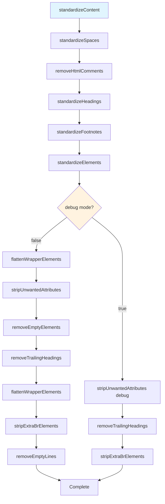
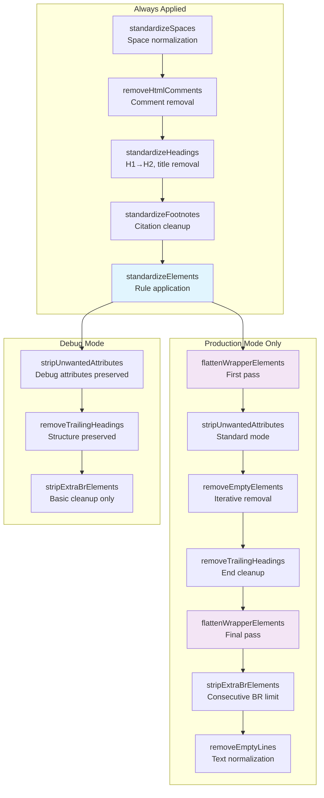

# 전체 표준화 프로세스

<details>
<summary>관련 소스 파일</summary>

다음 파일들은 이 위키 페이지를 생성하는 맥락으로 사용되었습니다.

- [src/scoring.ts](src/scoring.ts)
- [src/standardize.ts](src/standardize.ts)

</details>


이 문서는 Defuddle의 모든 콘텐츠 정규화 작업을 조율하는 주요 표준화 orchestrator를 다룹니다. 표준화 프로세스는 요소별 규칙을 적용하고 multi-pass cleanup 작업을 수행하여, 추출된 원시 HTML을 깔끔하고 표준화된 markup으로 변환합니다.

특정 요소 표준화 규칙에 대한 정보는 [Image Standardization](#4.1), [Code Block Standardization](#4.2), [Math Content Standardization](#4.3), [Footnote Standardization](#4.4)를 참조하세요. 표준화에 앞서 수행되는 콘텐츠 추출은 [Content Extraction](#3)을 참조하세요.

## 표준화 아키텍처

표준화 시스템은 특정 순서로 특화 처리 모듈과 cleanup 작업을 조율하는 중앙 orchestrator 함수를 중심으로 구축됩니다.

```mermaid
graph TB
    subgraph "Element Rule Modules"
        MATH_RULES[mathRules]
        CODE_RULES[codeBlockRules] 
        HEADING_RULES[headingRules]
        IMAGE_RULES[imageRules]
    end
    
    subgraph "Core Standardization"
        STANDARDIZE_CONTENT[standardizeContent]
        ELEMENT_RULES[ELEMENT_STANDARDIZATION_RULES]
        STANDARDIZE_ELEMENTS[standardizeElements]
    end
    
    subgraph "Cleanup Operations"
        STANDARDIZE_SPACES[standardizeSpaces]
        REMOVE_COMMENTS[removeHtmlComments]
        STANDARDIZE_HEADINGS[standardizeHeadings]
        STANDARDIZE_FOOTNOTES[standardizeFootnotes]
        FLATTEN_WRAPPERS[flattenWrapperElements]
        STRIP_ATTRIBUTES[stripUnwantedAttributes]
        REMOVE_EMPTY[removeEmptyElements]
        REMOVE_TRAILING[removeTrailingHeadings]
        STRIP_BRS[stripExtraBrElements]
        REMOVE_LINES[removeEmptyLines]
    end
    
    MATH_RULES --> ELEMENT_RULES
    CODE_RULES --> ELEMENT_RULES
    HEADING_RULES --> ELEMENT_RULES  
    IMAGE_RULES --> ELEMENT_RULES
    
    ELEMENT_RULES --> STANDARDIZE_ELEMENTS
    
    STANDARDIZE_CONTENT --> STANDARDIZE_SPACES
    STANDARDIZE_CONTENT --> REMOVE_COMMENTS
    STANDARDIZE_CONTENT --> STANDARDIZE_HEADINGS
    STANDARDIZE_CONTENT --> STANDARDIZE_FOOTNOTES
    STANDARDIZE_CONTENT --> STANDARDIZE_ELEMENTS
    STANDARDIZE_CONTENT --> FLATTEN_WRAPPERS
    STANDARDIZE_CONTENT --> STRIP_ATTRIBUTES
    STANDARDIZE_CONTENT --> REMOVE_EMPTY
    STANDARDIZE_CONTENT --> REMOVE_TRAILING
    STANDARDIZE_CONTENT --> STRIP_BRS
    STANDARDIZE_CONTENT --> REMOVE_LINES
    
    style STANDARDIZE_CONTENT fill:#e1f5fe
    style ELEMENT_RULES fill:#f3e5f5
```



**출처:** [src/standardize.ts:1-187]()

## 주요 표준화 함수

`standardizeContent` 함수는 모든 표준화 작업의 기본 진입점 역할을 합니다. 이 함수는 HTML 요소, 메타데이터, 문서 context, debug flag를 받아 신중하게 조율된 순서로 변환을 적용합니다.



**출처:** [src/standardize.ts:143-187]()

## 요소 표준화 규칙 시스템

요소 표준화 시스템은 각 규칙이 CSS selector, 대상 요소 타입, 선택적 변환 함수를 정의하는 rule-based 접근 방식을 사용합니다. 규칙은 특화 모듈에서 가져와 하나의 배열로 결합됩니다.

| 규칙 출처 | 목적 | 예시 Selector |
|-------------|---------|-------------------|
| `mathRules` | 수학 표현식 변환 | LaTeX 컨테이너, MathML 요소 |
| `codeBlockRules` | 코드 syntax highlighting | `.highlight`, `.code-block` |
| `headingRules` | 내비게이션 정리 | `nav h1`, `.nav-header` |
| `imageRules` | 이미지/figure 처리 | `figure`, `.image-container` |

### StandardizationRule 인터페이스

```typescript
interface StandardizationRule {
    selector: string;
    element: string;
    transform?: (el: Element, doc: Document) => Element;
}
```

규칙 배열에는 가져온 규칙과 일반적인 패턴을 위한 inline rule이 모두 포함됩니다.

- **Paragraph conversion**: `div[data-testid^="paragraph"]`, `div[role="paragraph"]` → `p`
- **List conversion**: `div[role="list"]` → 중첩 item 처리가 포함된 `ul`/`ol`
- **List item conversion**: `div[role="listitem"]` → `li`

**출처:** [src/standardize.ts:18-141](), [src/standardize.ts:643-679]()

## Multi-Pass Cleanup 프로세스

표준화 프로세스는 상호 의존적인 변환과 edge case를 처리하기 위해 여러 cleanup pass를 사용합니다. Debug mode와 production mode에서는 서로 다른 작업이 실행됩니다.



**출처:** [src/standardize.ts:159-186]()

## Space와 Text 정규화

`standardizeSpaces` 함수는 단어 사이의 의도적인 non-breaking space를 보존하면서 Unicode space 정규화를 처리합니다. `pre`와 `code` 요소를 건너뛰며 text node를 재귀적으로 처리합니다.

### 주요 작업:
- 여러 `&nbsp;` sequence를 일반 space로 변환
- 단어 문자 사이의 단일 `&nbsp;` 보존
- 코드 블록 내부 처리 건너뛰기

**출처:** [src/standardize.ts:189-227]()

## Wrapper 요소 Flattening

`flattenWrapperElements` 함수는 semantic content를 보존하면서 불필요한 구조 요소를 제거하기 위해 여러 pass에서 공격적인 div flattening을 수행합니다.

### Flattening 기준:
- **Empty elements**: 텍스트 콘텐츠나 child element가 없음
- **Wrapper elements**: 직접 inline content 없이 block element만 포함
- **Single-child containers**: 하나의 block-level child를 포함
- **Deep nesting**: 의미론적 목적 없이 nesting depth가 과도함

### 보존 규칙:
- `PRESERVE_ELEMENTS` 집합에 있는 요소
- Semantic role(`article`, `main`, `navigation`)을 가진 요소
- Semantic class(`article`, `content`, `footnote`)를 가진 요소
- 혼합 콘텐츠 유형을 포함하는 요소

**출처:** [src/standardize.ts:681-977]()

## Attribute와 Cleanup 작업

Cleanup 단계는 필수 semantic information을 보존하면서 원치 않는 attribute를 제거합니다.

### Attribute 보존:
- **Footnote IDs**: `fnref:` 또는 `fn:`으로 시작하는 `id` attribute
- **Code languages**: `code` 요소의 `class="language-*"`
- **Footnote references**: `class="footnote-backref"`
- **Debug mode**: 추가 `data-*` attribute 보존

### 요소 Cleanup:
- **Empty elements**: 콘텐츠가 없는 요소를 반복적으로 제거
- **Trailing headings**: 뒤따르는 콘텐츠가 없는 heading 제거
- **Consecutive BR elements**: 연속된 `<br>` tag를 최대 2개로 제한
- **Empty text nodes**: whitespace-only text node를 제거하고 spacing 정규화

**출처:** [src/standardize.ts:337-447](), [src/standardize.ts:449-506](), [src/standardize.ts:508-641]()

## Debug Mode 차이점

Debug mode는 개발과 debugging을 돕기 위해 구조 요소와 추가 attribute를 보존합니다.

| 작업 | Production Mode | Debug Mode |
|-----------|----------------|------------|
| Div flattening | 완전하고 공격적인 flattening | 완전히 건너뜀 |
| Attribute stripping | 표준 whitelist만 | `data-*` attribute 포함 |
| Empty element removal | 완전 제거 | 건너뜀 |
| Text normalization | 완전 cleanup | 기본 cleanup만 |

Debug mode를 사용하면 개발자가 읽기 쉬운 구조를 유지하면서 중간 표준화 상태를 검사할 수 있습니다.

**출처:** [src/standardize.ts:159-186]()
