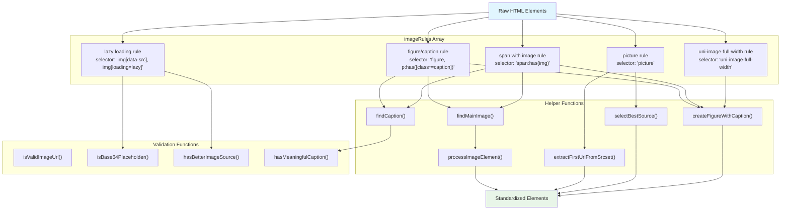
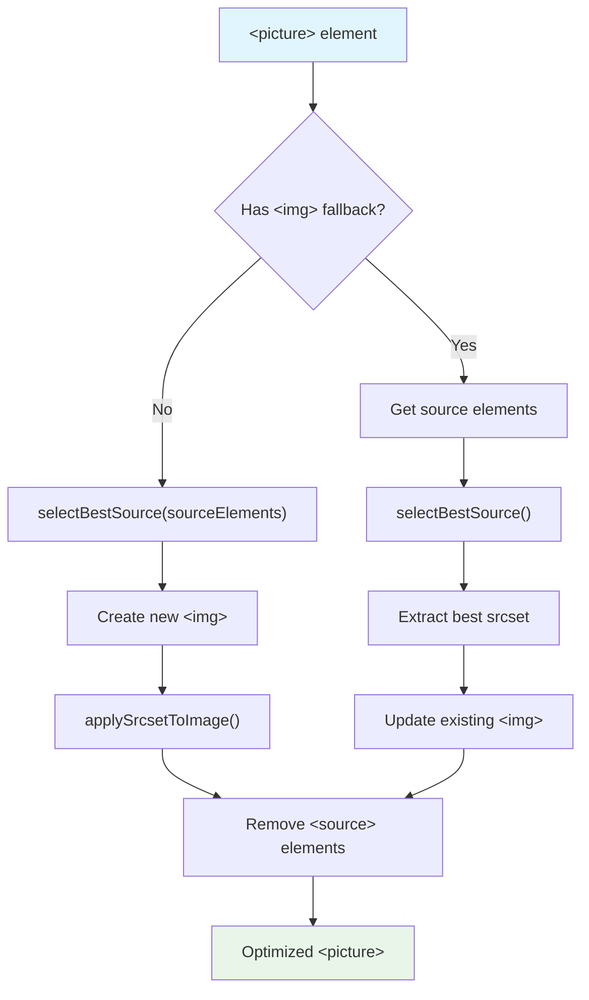
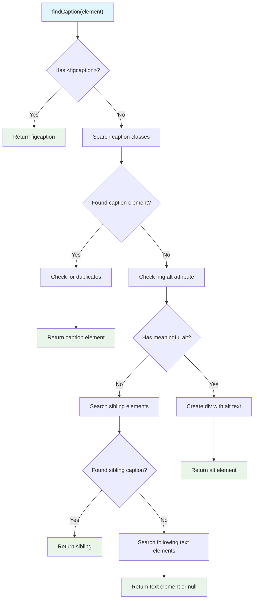
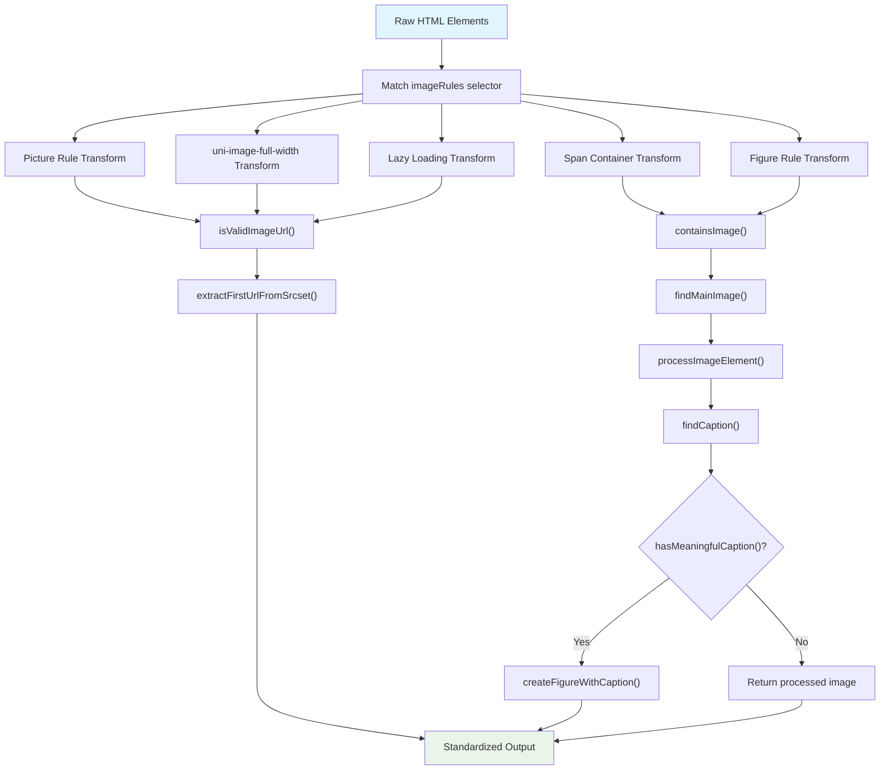

# 이미지 표준화

<details>
<summary>관련 소스 파일</summary>

다음 파일들은 이 위키 페이지를 생성하는 맥락으로 사용되었습니다.

- [src/elements/footnotes.ts](src/elements/footnotes.ts)
- [src/elements/images.ts](src/elements/images.ts)
- [src/extractors/chatgpt.ts](src/extractors/chatgpt.ts)
- [src/extractors/gemini.ts](src/extractors/gemini.ts)
- [src/extractors/twitter.ts](src/extractors/twitter.ts)

</details>


## 목적과 범위

Image Standardization 시스템은 이미지 관련 HTML 요소를 일관되고 깔끔한 구조로 처리하고 정규화합니다. 이 시스템은 ``, `<picture>`, `<figure>`, `<source>` 요소를 처리하며, 다양한 출처의 복잡한 이미지 markup을 적절한 caption과 최적의 source selection을 갖춘 표준화된 형식으로 변환합니다.

다른 콘텐츠 유형의 처리는 [Code Block Standardization](#4.2), [Math Content Standardization](#4.3), [Footnote Standardization](#4.4)를 참조하세요. 전체 표준화 조율은 [Overall Standardization Process](#4.5)를 참조하세요.

## 아키텍처 개요

이미지 표준화 시스템은 특화 handler를 통해 다양한 유형의 이미지 요소를 처리하는 rule-based transformation engine으로 구성됩니다.

### 핵심 컴포넌트



**출처:** [src/elements/images.ts:18-291]()

## 이미지 규칙 시스템

표준화는 `imageRules` 배열의 다섯 가지 주요 규칙을 통해 동작하며, 각 규칙은 특정 이미지 markup pattern을 대상으로 합니다.

| 규칙 | Selector | 목적 | 출력 |
|------|----------|---------|---------|
| Picture Rule | `picture` | 여러 source를 가진 `<picture>` 요소 처리 | 최적 source가 적용된 `<picture>` |
| Custom Image Rule | `uni-image-full-width` | custom image component 처리 | 표준 `<figure>` 요소 |
| Lazy Loading Rule | `img[data-src], img[loading="lazy"]` | lazy-loaded 이미지 해결 | 적절한 src가 있는 clean `` |
| Span Container Rule | `span:has(img)` | 이미지를 포함하는 span 처리 | caption이 있는 `<figure>` 또는 독립 `` |
| Figure Rule | `figure, p:has([class*="caption"])` | figure 요소 표준화 | 적절한 caption이 있는 clean `<figure>` |

### Picture 요소 처리

picture rule [src/elements/images.ts:20-72]()은 다음 방식으로 responsive image source를 처리합니다.

1. **Source Selection**: `selectBestSource()`를 사용해 사용 가능한 option 중 최적 source를 선택합니다
2. **Srcset Application**: `applySrcsetToImage()`를 통해 선택한 srcset을 img 요소에 적용합니다
3. **Source Cleanup**: 추출 후 처리된 `<source>` 요소를 제거합니다
4. **Fallback Handling**: fallback이 없으면 새 img 요소를 만듭니다



**출처:** [src/elements/images.ts:20-72](), [src/elements/images.ts:923-976](), [src/elements/images.ts:313-322]()

### Lazy Loading 해결

lazy loading rule [src/elements/images.ts:145-196]()은 다음 방식으로 지연된 이미지 로딩을 해결합니다.

1. **Placeholder Detection**: `isBase64Placeholder()`를 사용해 base64 placeholder를 식별합니다
2. **Data Attribute Processing**: `data-src`와 `data-srcset`을 표준 attribute로 이전합니다
3. **Pattern Matching**: regex를 사용해 모든 attribute에서 image URL pattern을 scan합니다
4. **Cleanup**: lazy loading class와 data attribute를 제거합니다

**출처:** [src/elements/images.ts:145-196](), [src/elements/images.ts:338-358](), [src/elements/images.ts:390-416]()

## Caption 처리

Caption 감지와 처리는 의미 있는 이미지 설명을 찾기 위해 다단계 접근 방식을 사용합니다.

### Caption 감지 전략

`findCaption()` 함수 [src/elements/images.ts:514-645]()는 다음 순서로 caption을 검색합니다.

1. **기존 figcaption 요소**
2. **caption 관련 class를 가진 요소**(caption, description, title, credit 등)
3. **이미지 alt attribute**
4. **caption class를 가진 sibling 요소**
5. **이미지 뒤에 오는 text 요소**(em, strong, span)



**출처:** [src/elements/images.ts:514-645]()

### Caption 검증

`hasMeaningfulCaption()` 함수 [src/elements/images.ts:691-714]()는 설명적이지 않은 콘텐츠를 걸러냅니다.

- **길이 검사**: 최소 10자
- **URL 감지**: URL과 file path 거부
- **Pattern matching**: filename, 숫자, 날짜 제외

**출처:** [src/elements/images.ts:691-714](), [src/elements/images.ts:15-16]()

## Source Selection 로직

`selectBestSource()` 함수 [src/elements/images.ts:923-976]()는 `<picture>` 요소에서 최적의 이미지 source를 선택합니다.

### 선택 기준

1. **Default source preference**: media query가 없는 source가 우선순위를 가집니다
2. **Resolution analysis**: width와 DPR 값을 통해 effective resolution을 계산합니다
3. **Srcset parsing**: width descriptor와 device pixel ratio를 추출합니다
4. **Fallback logic**: 최적 선택이 없으면 첫 번째 source를 반환합니다

### Resolution 계산

```javascript
// From selectBestSource implementation
const resolution = width * dpr; // Effective resolution = width × device pixel ratio
```

**출처:** [src/elements/images.ts:923-976](), [src/elements/images.ts:12-13]()

## 처리 파이프라인

전체 이미지 표준화 파이프라인은 여러 검증과 처리 단계를 통해 원시 HTML을 변환합니다.



**출처:** [src/elements/images.ts:18-291](), [src/elements/images.ts:420-430](), [src/elements/images.ts:442-510](), [src/elements/images.ts:718-737](), [src/elements/images.ts:295-309]()

### 출력 표준화

표준화 프로세스는 일관된 출력 형식을 생성합니다.

- **Standalone images**: 적절한 src와 srcset이 있는 clean `` 요소
- **Captioned images**: ``와 `<figcaption>`을 포함하는 `<figure>` 요소
- **Complex images**: 최적화된 source를 가진 처리된 `<picture>` 요소
- **Custom components**: 표준 HTML 구조로 변환됨

**출처:** [src/elements/images.ts:295-309](), [src/elements/images.ts:78-141]()
