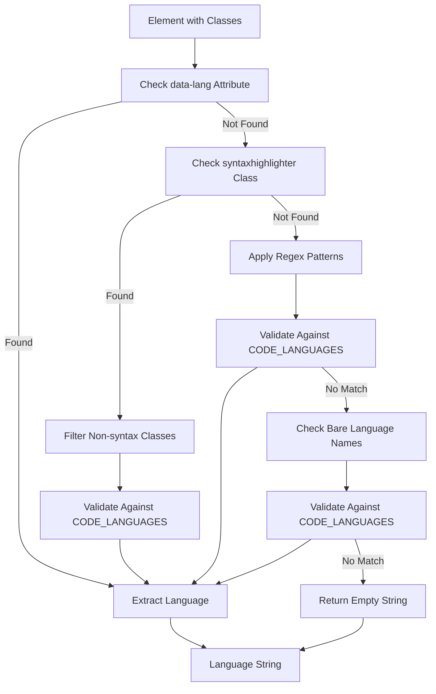
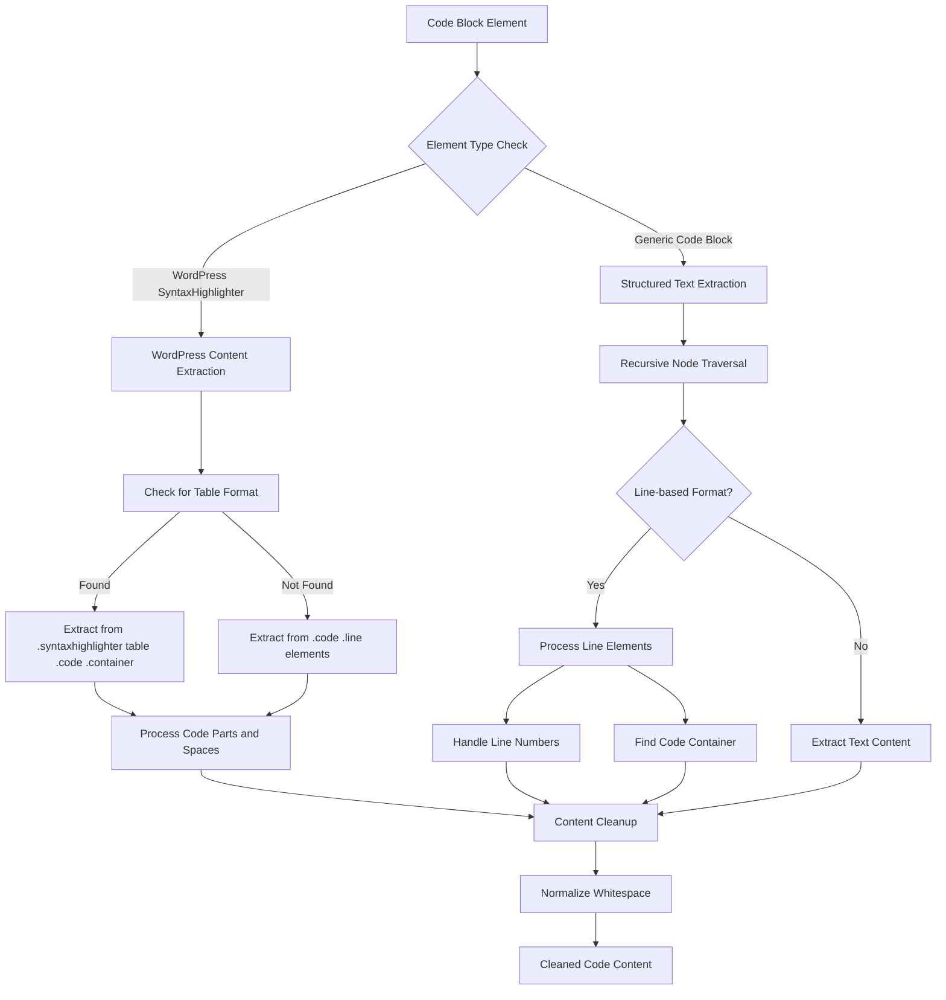
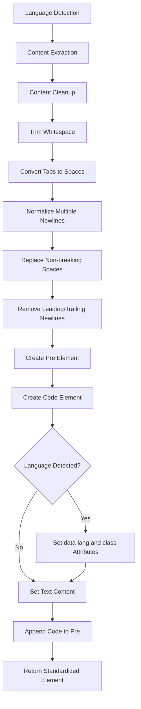

# 코드 블록 표준화

<details>
<summary>관련 소스 파일</summary>

다음 파일들은 이 위키 페이지를 생성하는 맥락으로 사용되었습니다.

- [src/elements/code.ts](src/elements/code.ts)

</details>


이 문서는 Defuddle의 코드 블록 표준화 시스템을 다룹니다. 이 시스템은 다양한 syntax highlighter의 코드 블록을 표준화된 language attribute를 가진 통합 `<pre><code>` 구조로 변환합니다. 이 시스템은 Prism.js, WordPress SyntaxHighlighter 및 범용 코드 블록 형식을 포함한 널리 쓰이는 syntax highlighter를 처리합니다.

다른 콘텐츠 표준화 프로세스에 대한 정보는 [Image Standardization](#4.1), [Math Content Standardization](#4.3), [Overall Standardization Process](#4.5)를 참조하세요.

## 언어 감지 시스템

코드 블록 표준화 시스템은 pattern matching과 curated supported programming language 목록을 결합하는 포괄적인 언어 감지 접근 방식을 사용합니다.

### 언어 패턴

시스템은 CSS class 이름에서 언어 정보를 추출하기 위해 여러 regex pattern을 사용합니다.

| Pattern Type | Regex | Example Match |
|--------------|-------|---------------|
| Standard | `^language-(\w+)$` | `language-javascript` |
| Short form | `^lang-(\w+)$` | `lang-python` |
| Suffix | `^(\w+)-code$` | `javascript-code` |
| Prefix | `^code-(\w+)$` | `code-ruby` |
| Syntax | `^syntax-(\w+)$` | `syntax-cpp` |
| Snippet | `^code-snippet__(\w+)$` | `code-snippet__java` |
| Highlight | `^highlight-(\w+)$` | `highlight-go` |
| Fallback | General pattern match | Various formats |



**출처:** [src/elements/code.ts:4-16](), [src/elements/code.ts:148-184]()

### 지원 언어

시스템은 JavaScript, Python, Java 같은 인기 언어와 GLSL, Solidity, WebAssembly 같은 특수 언어를 포함해 120개 이상의 프로그래밍 언어를 포괄적으로 유지합니다.

**출처:** [src/elements/code.ts:19-120]()

## 콘텐츠 추출 파이프라인

코드 블록 표준화 시스템은 source format에 따라 세 가지 주요 콘텐츠 추출 전략을 처리합니다.



**출처:** [src/elements/code.ts:203-237](), [src/elements/code.ts:240-282]()

### WordPress SyntaxHighlighter 처리

시스템은 줄 번호와 syntax highlighting span이 있는 복잡한 table 또는 div 구조를 사용하는 WordPress SyntaxHighlighter plugin을 위한 특화 추출을 제공합니다.

Table 형식 추출의 경우:
- `.syntaxhighlighter table .code .container`를 찾습니다
- 각 줄의 code part를 처리합니다
- `.spaces` class가 있는 특수 spacing 요소를 처리합니다

Non-table 형식의 경우:
- `.code .line` 요소를 찾습니다
- 중첩된 code 요소에서 코드 콘텐츠를 추출합니다
- 줄 구조를 보존합니다

**출처:** [src/elements/code.ts:203-237]()

### Line-based 형식 처리

많은 syntax highlighter는 코드의 각 줄이 별도 요소로 감싸지는 line-based 접근 방식을 사용합니다. 시스템은 다음 방식으로 이를 처리합니다.

1. **Line Detection**: `div[class*="line"]`, `span[class*="line"]`, `.ec-line` 같은 pattern을 가진 요소와 매칭합니다
2. **Content Isolation**: 실제 코드 콘텐츠를 줄 번호와 gutter 요소에서 분리합니다
3. **Structure Preservation**: 코드 줄 사이의 newline을 유지합니다

**출처:** [src/elements/code.ts:255-275]()

## 표준화 프로세스

전체 표준화 workflow는 다양한 코드 블록 형식을 통합 구조로 변환합니다.



**출처:** [src/elements/code.ts:295-317]()

### 변환 규칙 설정

시스템은 여러 selector pattern을 대상으로 하는 하나의 포괄적인 transformation rule을 사용합니다.

```typescript
// Selector targets from codeBlockRules
selector: [
    'pre',                                    // Basic pre elements
    'div[class*="prismjs"]',                 // Prism.js containers
    '.syntaxhighlighter',                    // WordPress SyntaxHighlighter
    '.highlight',                            // Generic highlight containers
    '.highlight-source',                     // GitHub-style highlights
    '.wp-block-syntaxhighlighter-code',      // WordPress block editor
    '.wp-block-code',                        // WordPress code blocks
    'div[class*="language-"]'                // Language-specific containers
].join(', ')
```

**출처:** [src/elements/code.ts:126-138]()

## 출력 형식

표준화 프로세스는 입력 형식과 관계없이 일관된 출력 구조를 생성합니다.

```html
<pre>
    <code data-lang="javascript" class="language-javascript">
        // Cleaned and normalized code content
        console.log('Hello, world!');
    </code>
</pre>
```

### 적용되는 Attribute

| Attribute | 목적 | 예시 |
|-----------|---------|---------|
| `data-lang` | 감지된 언어 저장 | `data-lang="python"` |
| `class` | styling을 위한 CSS hook 제공 | `class="language-python"` |

코드 콘텐츠는 다음 정규화를 거칩니다.
- Tab 문자를 4개의 space로 변환
- 여러 연속 newline을 최대 2개로 축소
- Non-breaking space를 일반 space로 교체
- 앞뒤 whitespace 제거
- 일관된 line ending 처리

**출처:** [src/elements/code.ts:295-317]()

## Content Standardization과의 통합

`codeBlockRules` export는 더 넓은 content standardization 시스템에서 요소 변환 파이프라인의 일부로 사용됩니다. 이를 통해 콘텐츠 추출 프로세스 중 모든 코드 블록이 일관되게 처리됩니다.

**출처:** [src/elements/code.ts:124-318]()
