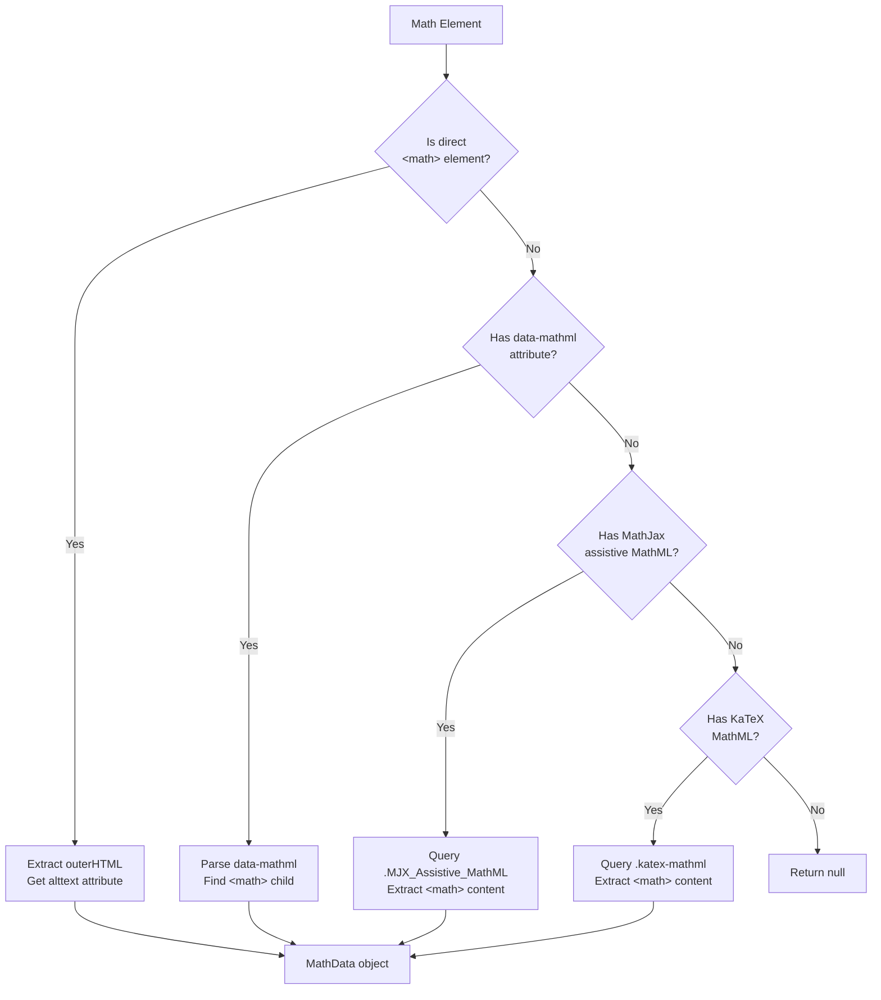
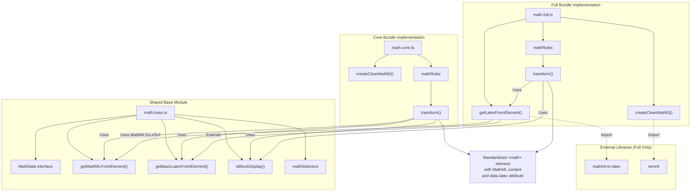
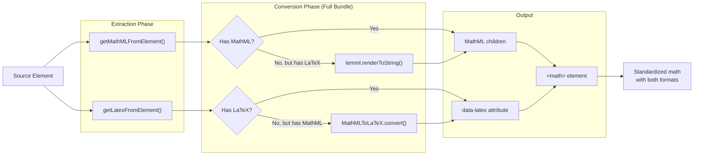

# 수학 콘텐츠 표준화

<details>
<summary>관련 소스 파일</summary>

다음 파일들은 이 위키 페이지를 생성하는 맥락으로 사용되었습니다.

- [src/elements/math.base.ts](src/elements/math.base.ts)
- [src/elements/math.core.ts](src/elements/math.core.ts)
- [src/elements/math.full.ts](src/elements/math.full.ts)
- [tests/expected/issues--169-svg-classname-crash.md](tests/expected/issues--169-svg-classname-crash.md)
- [tests/expected/math--mathjax-tex-scripts.md](tests/expected/math--mathjax-tex-scripts.md)
- [tests/fixtures/issues--169-svg-classname-crash.html](tests/fixtures/issues--169-svg-classname-crash.html)
- [tests/fixtures/math--mathjax-tex-scripts.html](tests/fixtures/math--mathjax-tex-scripts.html)

</details>


이 문서는 Defuddle이 다양한 렌더링 라이브러리(MathJax, KaTeX, MediaWiki, WordPress LaTeX)의 수학 콘텐츠를 MathML 콘텐츠와 LaTeX annotation이 있는 표준화된 `<math>` 요소로 정규화하는 방식을 설명합니다. 수학 표준화 시스템은 세 모듈로 구성됩니다. 추출 로직을 위한 공유 base module과 core/full 번들을 위한 두 implementation module입니다.

전체 표준화 조율은 [Overall Standardization Process](#5.1)를 참조하세요. 표준화된 수학 요소의 markdown 변환은 [Markdown Conversion](#7)을 참조하세요.

---

## 수학 요소 감지

시스템은 `mathSelectors` [src/elements/math.base.ts:190-226]()에 정의된 포괄적인 selector 목록을 사용해 수학 콘텐츠를 감지합니다. 이 selector는 다섯 범주로 구성된 26가지 서로 다른 pattern을 다룹니다.

| 범주 | Selector | 설명 |
|----------|-----------|-------------|
| **WordPress** | `img.latex[src*="latex.php"]` | 이미지로 렌더링된 LaTeX |
| **MathJax** | `span.MathJax`, `mjx-container`, `script[type="math/tex"]`, etc. | MathJax v2 및 v3 요소 |
| **MediaWiki** | `.mwe-math-element`, `.mwe-math-fallback-image-*`, etc. | Wikipedia 스타일 수식 |
| **KaTeX** | `.katex`, `.katex-display`, `[data-katex]`, etc. | KaTeX 렌더링 라이브러리 |
| **Generic** | `math`, `[data-math]`, `[data-latex]`, etc. | 표준 및 custom 형식 |

이 selector는 inline 및 display math, 렌더링된 콘텐츠와 script 요소를 모두 매칭하며, 접근성을 위해 사용되는 assistive MathML container를 처리합니다.

**출처:** [src/elements/math.base.ts:190-226]()

---

## 콘텐츠 추출 전략

### MathData 인터페이스

추출 프로세스는 다음을 포함하는 `MathData` 객체 [src/elements/math.base.ts:3-7]()를 생성합니다.

```typescript
interface MathData {
    mathml: string;      // MathML content as HTML string
    latex: string | null; // LaTeX source (may be null)
    isBlock: boolean;     // Display mode (block vs inline)
}
```

### 다중 출처 MathML 추출

`getMathMLFromElement` 함수 [src/elements/math.base.ts:9-67]()는 4단계 fallback 전략을 사용해 MathML 콘텐츠를 추출합니다.



**다이어그램: MathML 추출 Fallback 전략**

각 추출 단계는 display mode indicator를 확인하고 `alttext` attribute에서 LaTeX source를 보존하려 시도합니다. MathJax assistive MathML 경로 [src/elements/math.base.ts:36-54]()는 `<math>` 요소와 그 container 모두에서 `display="block"` attribute를 확인합니다.

**출처:** [src/elements/math.base.ts:9-67]()

---

### LaTeX 추출

#### 기본 LaTeX 추출(모든 번들)

`getBasicLatexFromElement` 함수 [src/elements/math.base.ts:69-131]()는 외부 라이브러리 없이 LaTeX 문자열을 추출합니다. 이 함수는 7단계 fallback 전략을 사용합니다.

1. **직접 data-latex attribute** [src/elements/math.base.ts:71-74]()
2. **WordPress LaTeX 이미지** [src/elements/math.base.ts:77-94]() - `alt` 텍스트 또는 URL parameter에서 추출
3. **MathML annotation 요소** [src/elements/math.base.ts:96-100]() - `<annotation encoding="application/x-tex">`
4. **KaTeX annotation** [src/elements/math.base.ts:102-108]() - `.katex-mathml annotation`
5. **MathJax script 요소** [src/elements/math.base.ts:110-113]() - `script[type="math/tex"]`
6. **Sibling script 요소** [src/elements/math.base.ts:115-121]()
7. **직접 `<math>` textContent** [src/elements/math.base.ts:123-127]() - 정리된 Unicode representation

WordPress LaTeX 추출 [src/elements/math.base.ts:84-92]()은 URL decoding과 특수 문자 정규화를 수행합니다.

```typescript
decodeURIComponent(match[1])
    .replace(/\+/g, ' ')      // Replace + with spaces
    .replace(/%5C/g, '\\');   // Fix escaped backslashes
```

**출처:** [src/elements/math.base.ts:69-131]()

#### 향상된 LaTeX 추출(Full Bundle 전용)

full bundle 구현 [src/elements/math.full.ts:12-30]()은 `mathml-to-latex` 라이브러리를 사용한 MathML-to-LaTeX 변환으로 기본 추출을 확장합니다. 기본 추출이 실패하면 사용 가능한 MathML 변환을 시도합니다.

```typescript
const mathData = getMathMLFromElement(el);
if (mathData?.mathml) {
    try {
        return MathMLToLaTeX.convert(mathData.mathml);
    } catch (e) {
        console.warn('Failed to convert MathML to LaTeX:', e);
    }
}
```

이를 통해 source에 MathML만 존재하는 경우에도 markdown 변환에 사용할 LaTeX를 확보할 수 있습니다.

**출처:** [src/elements/math.full.ts:12-30]()

---

### Display Mode 감지

`isBlockDisplay` 함수 [src/elements/math.base.ts:133-187]()는 아홉 가지 감지 방법을 사용해 수식이 block(display) mode로 렌더링되어야 하는지 inline mode로 렌더링되어야 하는지 결정합니다.

| 우선순위 | 메서드 | 코드 참조 |
|----------|--------|----------------|
| 1 | 명시적 `display="block"` attribute | [src/elements/math.base.ts:135-138]() |
| 2 | "display" 또는 "block"을 포함하는 class 이름 | [src/elements/math.base.ts:141-144]() |
| 3 | Display container class | [src/elements/math.base.ts:147-150]() |
| 4 | 앞에 `<p>` 요소가 있음 | [src/elements/math.base.ts:153-156]() |
| 5 | MediaWiki display class | [src/elements/math.base.ts:159-161]() |
| 6 | KaTeX `.katex-display` container | [src/elements/math.base.ts:164-168]() |
| 7 | MathJax v3 `display="true"` | [src/elements/math.base.ts:171-173]() |
| 8 | MathJax script `mode=display` | [src/elements/math.base.ts:176-178]() |
| 9 | Parent container display attribute | [src/elements/math.base.ts:181-184]() |

감지는 보수적입니다. 명시적인 display indicator를 찾지 못하면 inline이 기본값입니다.

**출처:** [src/elements/math.base.ts:133-187]()

---

## 표준화 구현

### 아키텍처: Core vs Full Bundle



**다이어그램: 수학 표준화 모듈 아키텍처**

이 아키텍처는 Webpack module aliasing([Build and Distribution System](#3.2) 참조)을 사용해 `math.core.ts` 또는 `math.full.ts`를 동일한 import path `./elements/math`로 컴파일합니다. 따라서 표준화 orchestrator는 단일 import 문을 사용하면서 서로 다른 구현을 얻을 수 있습니다.

**출처:** [src/elements/math.core.ts:1-63](), [src/elements/math.full.ts:1-99](), [src/elements/math.base.ts:1-226]()

---

### Core Bundle 구현

core bundle [src/elements/math.core.ts:1-63]()은 외부 의존성 없이 가벼운 수학 추출을 제공합니다. 기존 MathML과 LaTeX를 추출하지만 변환은 수행하지 않습니다.

#### createCleanMathEl (Core)

`createCleanMathEl` 함수 [src/elements/math.core.ts:10-31]()는 표준화된 `<math>` 요소를 생성합니다.

```typescript
const cleanMathEl = doc.createElement('math');
cleanMathEl.setAttribute('xmlns', 'http://www.w3.org/1998/Math/MathML');
cleanMathEl.setAttribute('display', isBlock ? 'block' : 'inline');
cleanMathEl.setAttribute('data-latex', latex || '');
```

콘텐츠 채우기는 다음 우선순위를 따릅니다.
1. **MathML content** - 사용 가능한 경우 기존 `<math>` 요소에서 child를 이전합니다 [src/elements/math.core.ts:17-24]()
2. **LaTeX fallback** - MathML이 없으면 LaTeX를 `textContent`로 저장합니다 [src/elements/math.core.ts:25-28]()

이를 통해 LaTeX만 사용 가능한 경우에도 output이 유효한 MathML이 되도록 보장하지만, 적절한 rendering structure는 없습니다.

**출처:** [src/elements/math.core.ts:10-31]()

---

### Full Bundle 구현

full bundle [src/elements/math.full.ts:1-99]()은 MathML과 LaTeX 간 양방향 변환을 위해 `mathml-to-latex`와 `temml` 라이브러리를 포함합니다.

#### createCleanMathEl (Full)

full bundle의 `createCleanMathEl` [src/elements/math.full.ts:32-70]()는 `temml`을 사용해 LaTeX-to-MathML 변환을 구현합니다.

```typescript
const mathml = temml.renderToString(latex, {
    displayMode: isBlock,
    throwOnError: false
});
```

콘텐츠 채우기 전략:
1. **기존 MathML** - 직접 이전 [src/elements/math.full.ts:40-45]()
2. **LaTeX 변환** - temml을 사용해 MathML로 변환 [src/elements/math.full.ts:48-62]()
3. **오류 fallback** - 변환이 실패하면 LaTeX를 textContent로 저장 [src/elements/math.full.ts:61, 65]()

이는 pure LaTeX source에서 적절한 MathML 구조를 생성하여 올바른 렌더링과 downstream processing을 가능하게 합니다.

**출처:** [src/elements/math.full.ts:32-70]()

#### 양방향 변환 전략



**다이어그램: 양방향 수학 형식 변환(Full Bundle)**

full bundle은 source format과 관계없이 MathML content와 LaTeX annotation을 모두 채우려고 시도하여 유연한 downstream processing을 가능하게 합니다.

**출처:** [src/elements/math.full.ts:12-70]()

---

## 지원되는 수학 형식

시스템은 다음 렌더링 라이브러리와 형식의 수학 콘텐츠를 처리합니다.

### MathJax (v2 및 v3)

| 컴포넌트 | 감지 | 추출 메서드 |
|-----------|-----------|-------------------|
| 렌더링된 container | `span.MathJax`, `mjx-container` | `.MJX_Assistive_MathML`의 MathML [src/elements/math.base.ts:37-54]() |
| Script 요소 | `script[type="math/tex"]` | 직접 textContent [src/elements/math.base.ts:111-113]() |
| Display mode script | `script[type="math/tex; mode=display"]` | textContent + display flag [src/elements/math.base.ts:176-178]() |
| LaTeX source | `<annotation encoding="application/x-tex">` | annotation textContent [src/elements/math.base.ts:97-100]() |

**테스트 케이스:** [tests/fixtures/math--mathjax-tex-scripts.html]()는 inline `$...$`와 display `$$...$$` delimiter가 있는 markdown을 생성하는 script element 추출을 보여줍니다 [tests/expected/math--mathjax-tex-scripts.md:10-24]().

**출처:** [src/elements/math.base.ts:36-54, 97-113](), [tests/fixtures/math--mathjax-tex-scripts.html]()

---

### KaTeX

| 컴포넌트 | 감지 | 추출 메서드 |
|-----------|-----------|-------------------|
| Container | `.katex`, `.katex-display` | `.katex-mathml` child의 MathML [src/elements/math.base.ts:57-64]() |
| LaTeX source | `.katex-mathml annotation` | annotation textContent [src/elements/math.base.ts:104-107]() |
| Display mode | `.katex-display` container | Container presence check [src/elements/math.base.ts:164-168]() |

KaTeX 요소는 기본적으로 inline입니다. Block mode에는 명시적인 `.katex-display` wrapper가 필요합니다.

**테스트 케이스:** [tests/fixtures/issues--169-svg-classname-crash.html:24]()는 crash 없이 SVG className object를 처리해야 하는 inline KaTeX 렌더링을 보여줍니다 [src/elements/math.base.ts:33-35]().

**출처:** [src/elements/math.base.ts:57-64, 102-108, 164-168](), [tests/fixtures/issues--169-svg-classname-crash.html]()

---

### MediaWiki Math

| 컴포넌트 | 감지 | 추출 메서드 |
|-----------|-----------|-------------------|
| Inline math | `.mwe-math-mathml-inline` | 직접 `<math>` child [src/elements/math.base.ts:11-18]() |
| Display math | `.mwe-math-mathml-display` | `<math>` + display flag [src/elements/math.base.ts:159-161]() |
| Fallback image | `.mwe-math-fallback-image-*` | Alt text를 LaTeX로 사용 [src/elements/math.base.ts:130]() |

MediaWiki는 최신 렌더링 mode에서 clean MathML을 제공하고 호환성을 위해 fallback image를 제공합니다.

**출처:** [src/elements/math.base.ts:11-18, 130, 159-161]()

---

### WordPress LaTeX

WordPress는 `latex.php`에서 제공되는 이미지로 LaTeX를 렌더링합니다. 추출 프로세스 [src/elements/math.base.ts:77-94]()는 다음을 처리합니다.

1. **Alt text 추출** - 더 깔끔하므로 선호되는 source [src/elements/math.base.ts:79-82]()
2. **URL parameter parsing** - `latex.php?latex=` parameter에서 fallback 추출 [src/elements/math.base.ts:86-92]()
3. **Decoding 및 정규화** - 특수 문자 수정이 포함된 URL decoding

감지는 `img.latex[src*="latex.php"]`를 사용합니다 [src/elements/math.base.ts:192]().

**출처:** [src/elements/math.base.ts:77-94, 192]()

---

## 변환 규칙

### mathRules 배열

core와 full bundle 모두 단일 transformation rule을 포함하는 `mathRules` 배열 [src/elements/math.core.ts:38-63](), [src/elements/math.full.ts:72-99]()을 export합니다.

```typescript
{
    selector: mathSelectors,
    element: 'math',
    transform: (el: Element, doc: Document): Element => {
        // Extract math data
        const mathData = getMathMLFromElement(el);
        const latex = getLatexFromElement(el);
        const isBlock = isBlockDisplay(el);
        
        // Create clean element
        const cleanMathEl = createCleanMathEl(...);
        
        // Clean up associated scripts
        // ...
        
        return cleanMathEl;
    }
}
```

이 규칙은 [Overall Standardization Process](#5.1)에 설명된 표준화 orchestrator가 사용하며, 매칭된 모든 요소에 적용됩니다.

**출처:** [src/elements/math.core.ts:38-63](), [src/elements/math.full.ts:72-99]()

---

### Script 요소 Cleanup

콘텐츠를 추출한 뒤 transformation은 관련 수학 렌더링 script를 제거합니다 [src/elements/math.core.ts:50-58](), [src/elements/math.full.ts:86-94]().

```typescript
if (el.parentElement && !el.matches('script[type^="math/"]')) {
    const mathElements = el.parentElement.querySelectorAll(
        'script[type^="math/"], .MathJax_Preview, ' +
        'script[type="text/javascript"][src*="mathjax"], ' +
        'script[type="text/javascript"][src*="katex"]'
    );
    mathElements.forEach(el => el.remove());
}
```

조건문 `!el.matches('script[type^="math/"]')`는 변환 중인 요소 자체가 script일 때 premature removal을 방지합니다. 호출자가 해당 요소의 교체를 처리하며, sibling을 제거하면 아직 처리되지 않은 script가 파괴될 수 있습니다.

**출처:** [src/elements/math.core.ts:50-58](), [src/elements/math.full.ts:86-94]()

---

## 출력 구조

모든 수학 변환은 일관된 구조의 표준화된 `<math>` 요소를 생성합니다.

```html
<math xmlns="http://www.w3.org/1998/Math/MathML" 
      display="inline|block" 
      data-latex="E=mc^2">
    <!-- MathML children here -->
</math>
```

**Attribute:**
- `xmlns` - MathML namespace declaration(항상 존재)
- `display` - display mode 감지에 따른 `"inline"` 또는 `"block"`
- `data-latex` - 사용 가능한 경우 LaTeX source(없으면 빈 문자열)

**Content:**
- Core bundle: 기존 MathML을 이전하거나 LaTeX를 textContent로 저장
- Full bundle: 기존 MathML을 이전하거나 LaTeX를 적절한 MathML 구조로 변환

이 표준화 형식은 `data-latex` attribute를 사용해 inline math를 `$...$`로, block math를 `$$...$$`로 변환하는 일관된 markdown 변환([Markdown Conversion](#7) 참조)을 가능하게 합니다.

**출처:** [src/elements/math.core.ts:10-31](), [src/elements/math.full.ts:32-70]()
