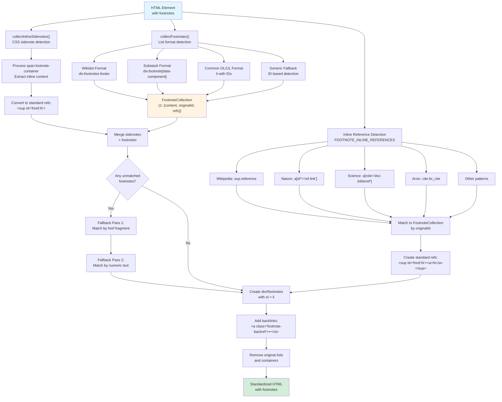
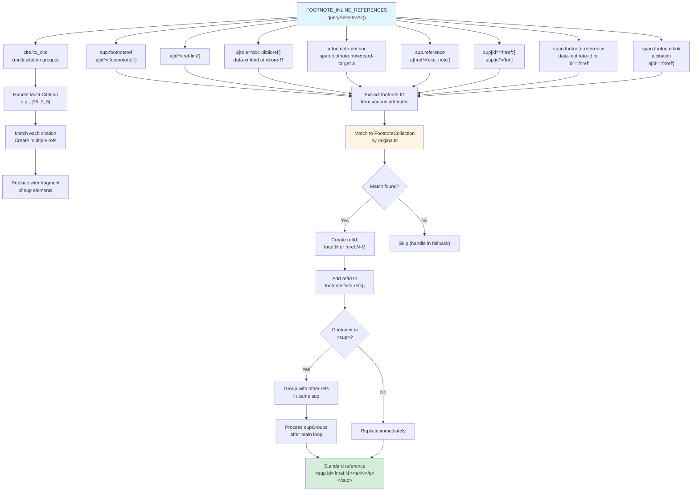

# 각주 표준화

<details>
<summary>관련 소스 파일</summary>

다음 파일들은 이 위키 페이지를 생성하는 맥락으로 사용되었습니다.

- [src/elements/footnotes.ts](src/elements/footnotes.ts)
- [src/elements/images.ts](src/elements/images.ts)
- [src/extractors/chatgpt.ts](src/extractors/chatgpt.ts)
- [src/extractors/gemini.ts](src/extractors/gemini.ts)
- [src/extractors/twitter.ts](src/extractors/twitter.ts)

</details>


이 페이지는 다양한 웹사이트의 각기 다른 각주 형식을 하나의 일관된 구조로 정규화하는 각주 표준화 하위 시스템을 문서화합니다. `FootnoteHandler` 클래스는 12개 이상의 목록 형식과 6개 이상의 inline reference pattern을 감지하여 markdown 변환 준비가 된 표준화된 HTML 구조로 변환합니다.

전체 콘텐츠 표준화 조율은 [5.1 Overall Standardization Process](#5.1)를 참조하세요. 다른 요소 변환은 [5.2 Image Standardization](#5.2), [5.3 Code Block Standardization](#5.3), [5.4 Math Content Standardization](#5.4)를 참조하세요.

---

## 개요

웹사이트는 각주를 매우 다양한 방식으로 구현합니다. Wikipedia는 `<sup class="reference">`를 사용하고, Substack은 `<div class="footnote" data-component-name="FootnoteToDOM">`을 사용하며, 학술 사이트는 `<a role="doc-biblioref">`를 사용하고, 일부 사이트는 CSS(sidenotes)를 사용해 각주 콘텐츠를 inline에 직접 포함합니다. 각주 표준화 시스템은 이러한 모든 형식을 감지하고 균일한 구조로 변환합니다.

**표준화된 출력 형식:**

모든 각주는 다음으로 변환됩니다.
```html
<div id="footnotes">
  <ol>
    <li class="footnote" id="fn:1">
      <p>Footnote content... <a href="#fnref:1" class="footnote-backref">↩</a></p>
    </li>
  </ol>
</div>
```

Inline reference는 다음으로 표준화됩니다.
```html
<sup id="fnref:1"><a href="#fn:1">1</a></sup>
```

출처: [src/elements/footnotes.ts:1-683]()

---

## 아키텍처

### 핵심 컴포넌트

| 컴포넌트 | 타입 | 목적 |
|-----------|------|---------|
| `FootnoteHandler` | Class | 각주 표준화를 위한 주요 orchestrator |
| `standardizeFootnotes()` | Function | Public API 진입점 |
| `FootnoteData` | Interface | 각주 콘텐츠, 원본 ID, reference 저장 |
| `FootnoteCollection` | Interface | 각주 번호에서 `FootnoteData`로의 map |
| `FOOTNOTE_LIST_SELECTORS` | Constant | 각주 목록을 감지하기 위한 CSS selector |
| `FOOTNOTE_INLINE_REFERENCES` | Constant | inline reference를 감지하기 위한 CSS selector |

출처: [src/elements/footnotes.ts:1-25](), [src/constants]()

---

## FootnoteHandler 클래스

### 데이터 구조

`FootnoteHandler`는 각주 정보를 추적하기 위해 두 가지 핵심 interface를 사용합니다.

```typescript
interface FootnoteData {
  content: any;        // HTML element or string containing footnote text
  originalId: string;  // Original ID from source (e.g., "r1", "fn:5", "cite_note-12")
  refs: string[];      // Array of reference IDs that link to this footnote
}

interface FootnoteCollection {
  [footnoteNumber: number]: FootnoteData;  // Numeric key = standardized footnote number
}
```

**상태 관리:**
- `doc`: 처리 중인 문서
- `genericContainer`: generic ID 기반 각주의 container를 저장합니다(처리 후 제거됨)

출처: [src/elements/footnotes.ts:5-21]()

### 주요 메서드

| 메서드 | 목적 |
|--------|---------|
| `standardizeFootnotes(element)` | 전체 파이프라인을 실행하는 주요 orchestration method |
| `collectFootnotes(element)` | 12개 이상의 목록 형식에서 각주를 감지하고 수집 |
| `collectInlineSidenotes(element)` | CSS 기반 inline sidenote 처리 |
| `createFootnoteItem(num, content, refs)` | backlink가 있는 표준화된 `<li>` 요소 생성 |
| `createFootnoteReference(num, refId)` | 표준화된 `<sup><a>` reference 생성 |
| `removeBackrefs(el)` | 기존 backref arrow(↩, ↑ 등) 제거 |
| `findOuterFootnoteContainer(el)` | 가장 바깥쪽 `<span>` 또는 `<sup>` wrapper 탐색 |

출처: [src/elements/footnotes.ts:15-667]()

---

## 각주 감지 파이프라인

### 다이어그램: 각주 감지와 표준화 흐름



출처: [src/elements/footnotes.ts:365-666]()

---

## 목록 형식 감지

### 지원 형식

`collectFootnotes()` 메서드는 12개 이상의 서로 다른 목록 형식을 감지하고 처리합니다.

#### 1. Wikidot 형식
```html
<div class="footnotes-footer">
  <div class="footnote-footer" id="footnote-1">
    . <a href="#footnoteref-1">1</a> Footnote text...
  </div>
</div>
```
- **감지**: `div.footnotes-footer`가 `div.footnote-footer`를 포함
- **ID 추출**: `/^footnote-(\d+)$/`
- **처리**: backlink anchor를 제거하고 텍스트 앞의 ". "를 제거

출처: [src/elements/footnotes.ts:83-113]()

#### 2. Substack 형식
```html
<div class="footnote" data-component-name="FootnoteToDOM">
  <a class="footnote-number" id="footnote-1"></a>
  <span class="footnote-content">Footnote text...</span>
</div>
```
- **감지**: `div.footnote[data-component-name="FootnoteToDOM"]`
- **ID 추출**: `a.footnote-number` ID에서 `footnote-` prefix 제거
- **처리**: `.footnote-content` 요소 추출

출처: [src/elements/footnotes.ts:116-132]()

#### 3. 일반 OL/UL 형식
```html
<ol class="footnotes">
  <li id="fn:1">Footnote text... <a href="#fnref:1">↩</a></li>
</ol>
```
- **감지**: list selector 안의 `li` 또는 `div[role="listitem"]`
- **ID 형식**: 여러 pattern 지원:
  - `fn:N` → `N` 추출
  - `fnN` → `N` 추출
  - `bib.bibN` → `N` 추출
  - `cite_note-XXX` → `XXX` 추출

출처: [src/elements/footnotes.ts:135-177]()

#### 4. `.citations` Class를 가진 인용
```html
<li>
  <div class="citations" id="r1">
    <div class="citation-content">Citation text...</div>
  </div>
</li>
```
- **감지**: `r`로 시작하는 ID를 가진 `.citations` div
- **처리**: 사용 가능한 경우 `.citation-content` 추출

출처: [src/elements/footnotes.ts:141-149]()

#### 5. Nature.com 형식
```html
<li data-counter="1.">Reference text...</li>
```
- **감지**: `li[data-counter]`
- **ID 추출**: `data-counter` attribute에서 trailing period 제거

출처: [src/elements/footnotes.ts:158-160]()

### Generic Fallback 감지

표준 형식을 찾지 못한 경우(`footnoteCount === 1`), 시스템은 정교한 ID 기반 감지 전략을 사용합니다.

**알고리즘:**
1. **Candidate reference 찾기**: `<sup>` 또는 `<span>` 안에 있는 숫자 텍스트(1-4자리)를 가진 `<a href="#...">` scan
2. **Container 식별**: 여러 child가 reference fragment와 매칭되는 ID를 가진 container(`div`, `section`, `aside`, `footer`) 탐색
3. **각주 추출**: ID가 없는 연속 요소를 multi-paragraph footnote로 group
4. **Container 저장**: 나중에 제거할 container reference 저장

출처: [src/elements/footnotes.ts:179-276]()

---

## Inline Reference 감지

### 다이어그램: Reference Pattern Matching



출처: [src/elements/footnotes.ts:372-632]()

### 플랫폼별 Reference Pattern

| 플랫폼 | Pattern | ID 추출 |
|----------|---------|---------------|
| **Wikidot** | `sup.footnoteref > a[id^="footnoteref-"]` | `footnoteref-N`에서 숫자 추출 |
| **Nature.com** | `a[id^="ref-link"]` | 텍스트 콘텐츠를 ID로 사용 |
| **Science.org** | `a[role="doc-biblioref"]` | `data-xml-rid` 또는 `#core-R` href에서 추출 |
| **Substack** | `a.footnote-anchor`, `span.footnote-hovercard-target a` | ID에서 `footnote-anchor-` prefix 제거 |
| **Arxiv** | `cite.ltx_cite` | 여러 `a[href*="bib.bib"]` 링크에서 추출 |
| **Wikipedia** | `sup.reference > a` | href의 `cite_note-XXX` 또는 `cite_ref-XXX`와 매칭 |
| **Standard** | `sup[id^="fnref:"]`, `sup[id^="fnr"]` | ID에서 prefix 제거 |
| **LessWrong** | `span.footnote-reference` | `data-footnote-id` 또는 `id^="fnref"`에서 추출 |
| **Generic** | `a.citation`, `span.footnote-link` | href fragment에서 추출 |

출처: [src/elements/footnotes.ts:384-521]()

### Multi-Citation 처리(Arxiv)

Arxiv는 단일 `<cite>` 요소 안에서 `[35, 2, 5]` 같은 grouped citation을 사용합니다.

**프로세스:**
1. `cite.ltx_cite` 요소 감지
2. Citation 안의 모든 `a` 링크 찾기
3. 각 href(`bib.bibN`)에서 citation ID 추출
4. 각 citation마다 별도 `<sup>` reference 생성
5. Reference 사이에 space 삽입
6. 전체 `cite` 요소를 reference fragment로 교체

출처: [src/elements/footnotes.ts:416-449]()

---

## CSS Sidenote 감지

### Pattern Recognition

CSS sidenote는 CSS를 사용해 margin에 표시하기 위해 각주 콘텐츠를 inline에 직접 포함합니다.

```html
<span class="footnote-container">
  <label class="footnote-number"></label>
  <input class="margin-toggle">
  <span class="footnote">Footnote content here...</span>
</span>
```

**감지:**
- `span.footnote-container` 또는 `span.sidenote-container` query
- `span.footnote` 또는 `span.sidenote`에서 콘텐츠 추출

**변환:**
1. Content span clone
2. Auto-incremented number와 함께 `FootnoteCollection`에 추가
3. 표준 `<sup id="fnref:N"><a href="#fn:N">N</a></sup>` reference 생성
4. 전체 container를 reference로 교체

출처: [src/elements/footnotes.ts:336-363]()

---

## Fallback Matching 전략

초기 reference 감지 이후에도 매칭되지 않은 각주가 남아 있으면, 시스템은 두 가지 fallback pass를 적용합니다.

### Pass 1: Fragment Link Matching

Fragment identifier가 있는 링크를 scan합니다.

```html
<a href="#footnote-37">1</a>
```

**알고리즘:**
1. 모든 `a[href*="#"]` 링크 query
2. 이미 표준화된 ref(`[id^="fnref:"]`) 안의 링크는 건너뜀
3. `#footnotes` 섹션 또는 generic container 안의 링크는 건너뜀
4. href에서 fragment 추출
5. fragment를 `footnoteIdMap`과 매칭
6. Link text가 각주 marker처럼 보이는지 검증(`/^[\[\(]?\d{1,4}[\]\)]?$/`)
7. Reference 생성 및 교체

출처: [src/elements/footnotes.ts:537-574]()

### Pass 2: Numeric Text Matching

숫자 콘텐츠를 가진 `<sup>` 또는 `<span class="footnote-ref">` 요소를 scan합니다.

```html
<sup>1</sup>
```

**알고리즘:**
1. `sup, span.footnote-ref` 요소 query
2. 이미 표준화된 ref는 건너뜀
3. `#footnotes` 안의 요소는 건너뜀
4. 텍스트 콘텐츠에서 숫자 추출
5. `footnoteNumMap` 또는 `footnoteIdMap`과 매칭
6. 각주가 아직 매칭되지 않았는지 확인
7. Reference 생성 및 교체

출처: [src/elements/footnotes.ts:576-610]()

---

## Reference ID 생성

### 단일 Reference

각주에 대한 첫 번째 reference:
```
fnref:1
```

### 여러 Reference

각주가 여러 번 참조되는 경우:
```
fnref:1      (first reference)
fnref:1-2    (second reference)
fnref:1-3    (third reference)
```

**구현:**
```typescript
const refId = footnoteData.refs.length > 0 
  ? `fnref:${footnoteNumber}-${footnoteData.refs.length + 1}` 
  : `fnref:${footnoteNumber}`;
```

출처: [src/elements/footnotes.ts:499-501](), [src/elements/footnotes.ts:566-568]()

---

## Footnote Item 생성

### 구조

`createFootnoteItem()` 메서드는 표준화된 각주 list item을 만듭니다.

```html
<li class="footnote" id="fn:1">
  <p>Footnote content... <a href="#fnref:1" class="footnote-backref">↩</a></p>
</li>
```

**프로세스:**
1. `<li class="footnote" id="fn:N">` 생성
2. 콘텐츠 처리:
   - 문자열인 경우: `<p>` 요소로 감쌈
   - 요소인 경우: 모든 `<p>` tag를 복사하거나, 없으면 콘텐츠를 `<p>`로 감쌈
3. 콘텐츠에서 기존 backref link 제거
4. 각 reference ID마다 마지막 paragraph에 backlink 추가:
   ```html
   <a href="#fnref:N" title="return to article" class="footnote-backref">↩</a>
   ```
5. 여러 backlink는 space character로 구분

출처: [src/elements/footnotes.ts:23-73]()

### Backref 제거

`removeBackrefs()` 메서드는 표준화된 backlink를 추가하기 전에 기존 backref link를 제거합니다.

**감지:**
- Unicode arrow 문자가 있는 링크: ↩ (U+21A9), ↥ (U+21A5), ↑ (U+2191), ↵ (U+21B5), ⤴ (U+2934), ⤵ (U+2935), ⏎ (U+23CE)
- `class="footnote-backref"`가 있는 링크
- 뒤따르는 whitespace/punctuation text node 제거

출처: [src/elements/footnotes.ts:281-298]()

---

## 출력 생성

### 최종 조립

`standardizeFootnotes()` 메서드는 최종 출력을 조립합니다.

1. **Collection 병합**: sidenote와 일반 각주 결합
2. **Container 생성**:
   ```html
   <div id="footnotes">
     <ol>
       <!-- footnote items -->
     </ol>
   </div>
   ```
3. **목록 채우기**: 숫자 순서대로 각 각주에 대해 `<li>` 요소를 생성하고 append
4. **원본 제거**: 모든 원본 각주 목록 삭제(`FOOTNOTE_LIST_SELECTORS` 사용)
5. **Generic container 제거**: generic fallback이 사용된 경우 해당 container 제거
6. **문서에 append**: 새 footnotes div를 element에 추가

출처: [src/elements/footnotes.ts:634-666]()

### 출력 조건

Footnotes 섹션은 `orderedList.children.length > 0`인 경우에만 추가됩니다.

```typescript
if (orderedList.children.length > 0) {
  newList.appendChild(orderedList);
  element.appendChild(newList);
}
```

출처: [src/elements/footnotes.ts:662-665]()

---

## Container 탐색

### 바깥쪽 Container 찾기

`findOuterFootnoteContainer()` 메서드는 DOM tree를 따라 올라가 가장 바깥쪽 `<span>` 또는 `<sup>` wrapper를 찾습니다.

**알고리즘:**
1. 현재 요소에서 시작
2. parent가 존재하고 `<span>` 또는 `<sup>`인 동안:
   - current를 parent로 이동
   - parent를 한 단계 위로 이동
3. current element 반환

**목적:** 내부 요소만이 아니라 전체 각주 reference 구조가 교체되도록 보장합니다.

변환 예:
```html
<!-- Before -->
<span class="ref-wrapper">
  <sup>
    <a href="#fn1">1</a>
  </sup>
</span>

<!-- After -->
<sup id="fnref:1">
  <a href="#fn:1">1</a>
</sup>
```

출처: [src/elements/footnotes.ts:300-314]()

---

## AI Platform 통합

### ChatGPT Citation

`ChatGPTExtractor`는 콘텐츠 추출 중 각주 생성을 보여줍니다.

**Pattern:** 외부 링크가 있는 inline citation span
```html
<span>
  <a target="_blank" rel="noopener" href="https://example.com#:~:text=fragment">
    citation
  </a>
</span>
```

**처리:**
1. Regex로 citation pattern 감지
2. URL과 domain 추출
3. 존재하는 경우 fragment text decode
4. URL이 이미 footnotes array에 있는지 확인
5. 각주 번호 생성 또는 재사용
6. `<sup id="fnref:N"><a href="#fn:N">N</a></sup>`로 교체

출처: [src/extractors/chatgpt.ts:56-106]()

### Gemini Sources

`GeminiExtractor`는 browse item에서 source footnote를 수집합니다.

**Pattern:** 링크가 있는 browse item
```html
<browse-item>
  <a href="...">
    <span class="domain">example.com</span>
    <span class="title">Article Title</span>
  </a>
</browse-item>
```

**처리:**
1. 모든 `browse-item` 요소 query
2. href, domain, title 추출
3. 형식화된 텍스트 `domain: title`과 함께 footnotes array에 추가

출처: [src/extractors/gemini.ts:73-93]()

---

## Public API

### 진입점

```typescript
export function standardizeFootnotes(element: any): void {
  const doc = element.ownerDocument;
  if (!doc) {
    console.warn('standardizeFootnotes: No document available');
    return;
  }
  
  const handler = new FootnoteHandler(doc);
  handler.standardizeFootnotes(element);
}
```

**Parameters:**
- `element`: 처리할 DOM 요소(일반적으로 주요 콘텐츠 컨테이너)

**Side Effects:**
- `element`를 in place로 수정
- 원본 각주 목록 제거
- 새 `<div id="footnotes">`를 element에 append

출처: [src/elements/footnotes.ts:673-683]()

---

## 콘텐츠 파이프라인과의 통합

각주 표준화는 전체 콘텐츠 표준화 프로세스의 일부로 호출됩니다([5.1 Overall Standardization Process](#5.1) 참조).

1. 이미지 표준화가 먼저 실행됩니다
2. 코드 블록 표준화
3. 수학 콘텐츠 표준화
4. **각주 표준화**(이 컴포넌트)
5. Wrapper flattening과 cleanup

이 순서는 각주 처리가 시작되기 전에 각주 안의 이미지, 코드, 수학 콘텐츠가 이미 정규화되도록 보장합니다.

출처: [src/elements/footnotes.ts:1-683]()
