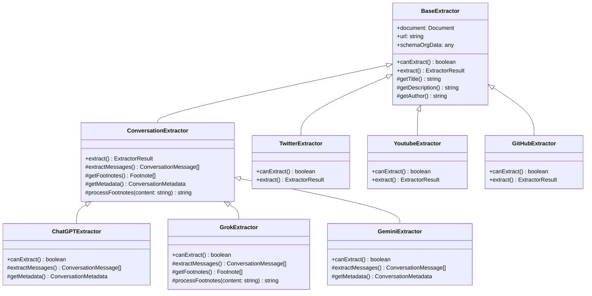
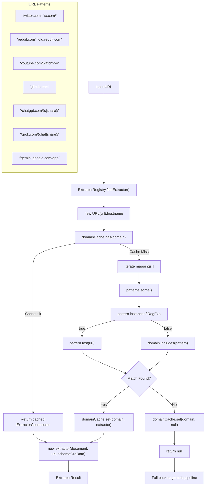

<!-- manual_reconstruction: DeepWiki TOC slug/title is "Platform-Specific Extractors", but the embedded Markdown H1 is "Site-Specific Extractors". Body copied from the Next.js markdown payload in raw/pages/6-platform-specific-extractors.html. -->

# 사이트별 추출기

<details>
<summary>관련 소스 파일</summary>

다음 파일들은 이 위키 페이지를 생성하는 맥락으로 사용되었습니다.

- [src/extractor-registry.ts](src/extractor-registry.ts)
- [src/extractors/_base.ts](src/extractors/_base.ts)
- [src/extractors/github.ts](src/extractors/github.ts)
- [src/extractors/grok.ts](src/extractors/grok.ts)
- [src/extractors/hackernews.ts](src/extractors/hackernews.ts)
- [src/extractors/reddit.ts](src/extractors/reddit.ts)
- [src/extractors/x-oembed.ts](src/extractors/x-oembed.ts)
- [src/extractors/youtube.ts](src/extractors/youtube.ts)
- [tests/youtube-transcript.test.ts](tests/youtube-transcript.test.ts)
- [website/src/convert.ts](website/src/convert.ts)

</details>


사이트별 추출기는 범용 콘텐츠 추출 파이프라인만으로는 부족한 인기 웹사이트와 플랫폼을 위해 특화된 콘텐츠 처리를 제공합니다. 이러한 추출기는 각 사이트에 고유한 DOM 구조, 콘텐츠 패턴, 메타데이터 형식을 처리합니다.

추출기 시스템을 통해 Defuddle은 표준 콘텐츠 markup pattern을 따르지 않는 소셜 미디어 플랫폼, AI chat interface, 코드 저장소 및 기타 특화 웹 애플리케이션에서 구조화된 콘텐츠를 추출할 수 있습니다. URL을 추출기에 매칭하는 registry 메커니즘에 대한 자세한 내용은 [Extractor Registry](#5.1)를 참조하세요. 특정 추출기 구현은 [Social Media Extractors](#5.2), [AI Chat Extractors](#5.3), [Code Repository Extractors](#5.4)를 참조하세요.

## 추출기 시스템 아키텍처

사이트별 추출기 시스템은 들어오는 URL을 적절한 특화 추출기에 매칭하는 registry pattern을 통해 동작합니다. 주요 Defuddle parser가 URL을 만나면, 범용 파이프라인 대신 사이트별 추출기가 콘텐츠를 처리해야 하는지 판단하기 위해 먼저 `ExtractorRegistry`를 확인합니다.

### 추출기 클래스 계층



*출처: [src/extractor-registry.ts:1-145](), [src/extractors/grok.ts:1-163]()*

### URL Pattern Matching 흐름



*출처: [src/extractor-registry.ts:103-137]()*

## 추출기 등록 시스템

`ExtractorRegistry` 클래스는 URL pattern과 extractor class 사이의 mapping을 관리합니다. 각 추출기는 string domain name과 더 복잡한 URL matching을 위한 regular expression을 모두 포함할 수 있는 pattern 배열로 등록됩니다.

### 등록 Pattern

| Extractor | Pattern Type | Patterns |
|-----------|--------------|----------|
| `TwitterExtractor` | String + RegExp | `'twitter.com'`, `/\/x\.com\/.*/` |
| `RedditExtractor` | String + RegExp | `'reddit.com'`, `'old.reddit.com'`, `/^https:\/\/[^\/]+\.reddit\.com/` |
| `YoutubeExtractor` | String + RegExp | `'youtube.com'`, `'youtu.be'`, `/youtube\.com\/watch\?v=.*/` |
| `GitHubExtractor` | String + RegExp | `'github.com'`, `/^https?:\/\/github\.com\/.*/` |
| `ChatGPTExtractor` | RegExp | `/^https?:\/\/chatgpt\.com\/(c\|share)\/.*/` |
| `GrokExtractor` | RegExp | `/^https?:\/\/grok\.com\/(chat\|share)(\/.*)?$/` |
| `GeminiExtractor` | RegExp | `/^https?:\/\/gemini\.google\.com\/app\/.*/` |

*출처: [src/extractor-registry.ts:25-97]()*

### 캐싱 메커니즘

Registry는 동일한 domain에 대해 반복적인 pattern matching을 피하기 위해 domain 기반 cache(`domainCache: Map<string, ExtractorConstructor | null>`)를 구현합니다. Cache는 매칭된 extractor constructor 또는 매칭되는 추출기가 없는 domain에 대해 `null`을 저장합니다.

```typescript
// Cache lookup in findExtractor method
if (this.domainCache.has(domain)) {
    const cachedExtractor = this.domainCache.get(domain);
    return cachedExtractor ? new cachedExtractor(document, url, schemaOrgData) : null;
}
```

*출처: [src/extractor-registry.ts:107-111]()*

## Base Extractor 클래스

### BaseExtractor

`BaseExtractor` abstract class는 모든 사이트별 추출기의 기반을 제공합니다. 모든 추출기가 구현해야 하는 핵심 interface를 정의합니다.

- `canExtract(): boolean` - 추출기가 현재 문서를 처리할 수 있는지 결정합니다
- `extract(): ExtractorResult` - 콘텐츠 추출을 수행하고 구조화된 데이터를 반환합니다
- 공통 메타데이터 추출 작업을 위한 protected helper method

### ConversationExtractor

`ConversationExtractor`는 `BaseExtractor`를 확장하여 chat 기반 플랫폼을 위한 특화 기능을 제공합니다. 대화 message 추출, 각주 처리, chat 특화 메타데이터 구조 처리를 위한 method를 추가합니다.

주요 method는 다음과 같습니다.
- `extractMessages(): ConversationMessage[]` - 대화에서 개별 message를 추출합니다
- `getFootnotes(): Footnote[]` - 각주 reference를 처리하고 반환합니다
- `processFootnotes(content: string): string` - link를 각주 reference로 변환합니다

*출처: [src/extractors/grok.ts:1-4](), [src/extractors/grok.ts:22-78]()*

## 콘텐츠 처리 예시

### Conversation Extractor의 각주 처리

`GrokExtractor`는 conversation extractor가 link와 citation을 처리하는 방식을 보여줍니다. `processFootnotes` method는 inline link를 번호가 매겨진 각주 reference로 변환합니다.

```typescript
private processFootnotes(content: string): string {
    const linkPattern = /<a\s+(?:[^>]*?\s+)?href="([^"]*)"[^>]*>(.*?)<\/a>/gi;
    
    return content.replace(linkPattern, (match, url, linkText) => {
        // Skip internal anchors and non-http URLs
        if (!url || url.startsWith('#') || !url.match(/^https?:\/\//i)) {
            return match;
        }
        
        // Create or reuse footnote reference
        let footnote = this.footnotes.find(fn => fn.url === url);
        // ... footnote processing logic
        
        return `${linkText}<sup id="fnref:${footnoteIndex}">
                <a href="#fn:${footnoteIndex}">${footnoteIndex}</a></sup>`;
    });
}
```

*출처: [src/extractors/grok.ts:120-162]()*

추출기 시스템은 범용 콘텐츠 처리와 플랫폼별 추출 로직을 깔끔하게 분리하여, Defuddle이 일관된 출력 형식을 유지하면서 현대 웹 플랫폼 전반의 다양한 콘텐츠 구조를 처리할 수 있게 합니다.
