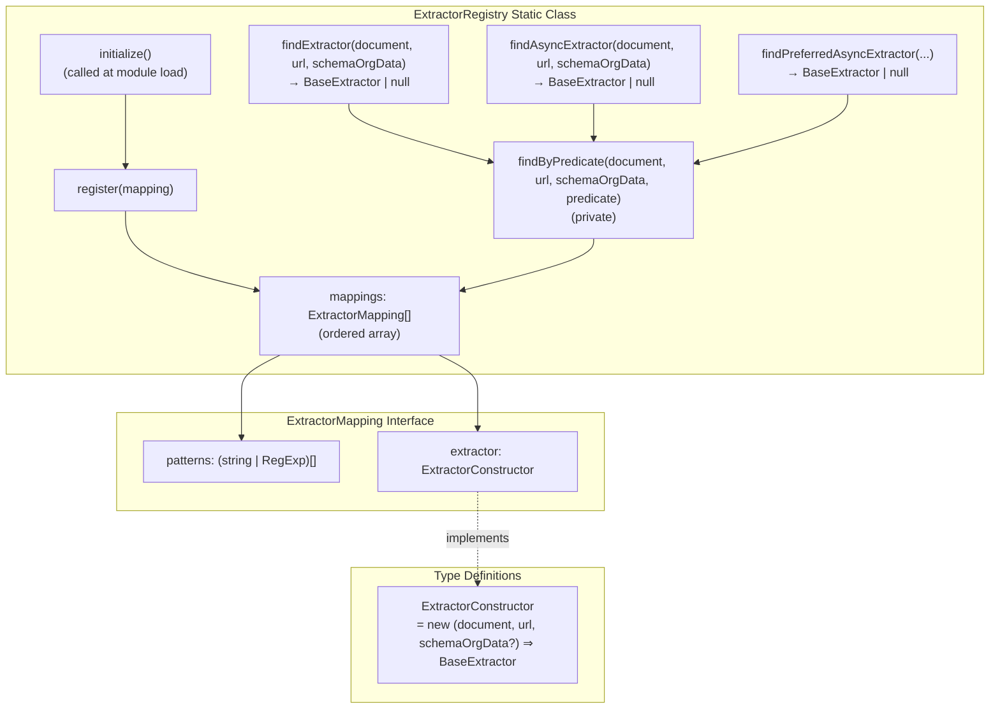
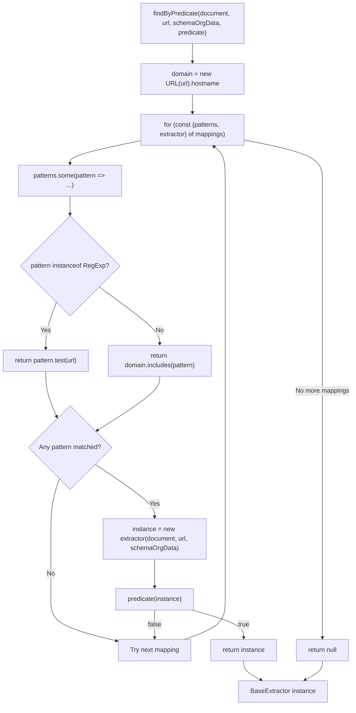
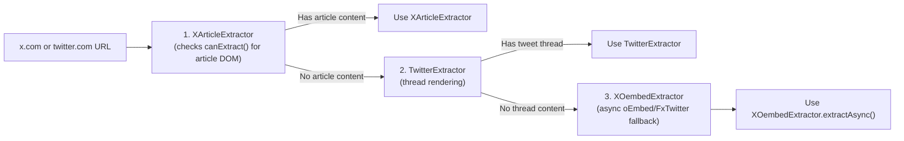

# Extractor Registry

<details>
<summary>관련 소스 파일</summary>

다음 파일들은 이 위키 페이지를 생성하는 맥락으로 사용되었습니다.

- [src/extractor-registry.ts](src/extractor-registry.ts)
- [src/extractors/_base.ts](src/extractors/_base.ts)
- [src/extractors/grok.ts](src/extractors/grok.ts)
- [src/extractors/x-oembed.ts](src/extractors/x-oembed.ts)

</details>


Extractor Registry는 URL pattern을 기반으로 URL을 특화 콘텐츠 추출기로 route하는 중앙 dispatch 시스템입니다. 주어진 URL이 범용 콘텐츠 추출 처리 대신 사이트별 처리를 필요로 하는지 판단하는 진입점 역할을 합니다.

개별 추출기 구현에 대한 정보는 [Social Media Extractors](#6.3), [AI Chat Extractors](#6.4), [Code Repository Extractors](#6.5)를 참조하세요. 전체 플랫폼별 추출 프로세스는 [Platform-Specific Extractors](#6)를 참조하세요.

## Registry 아키텍처

`ExtractorRegistry` 클래스는 URL pattern과 extractor constructor function 사이의 mapping을 담은 ordered array를 유지하는 static registry로 동작합니다. Registry는 capability에 따라 추출기를 선택하기 위해 predicate 기반 matching을 사용하는 세 가지 finder method를 제공합니다.

### ExtractorRegistry 클래스 구조



출처: [src/extractor-registry.ts:16-21](), [src/extractor-registry.ts:23-24](), [src/extractor-registry.ts:26-117](), [src/extractor-registry.ts:123-164]()

### Finder Method와 Predicate Matching

Registry는 instantiate된 추출기에 적용하는 predicate가 서로 다른 세 가지 finder method를 제공합니다.

| Method | Predicate | 목적 |
|--------|-----------|---------|
| `findExtractor()` | `extractor.canExtract()` | 동기 추출을 수행할 수 있는 추출기 찾기 |
| `findAsyncExtractor()` | `extractor.canExtractAsync()` | 비동기 추출을 수행할 수 있는 추출기 찾기 |
| `findPreferredAsyncExtractor()` | `extractor.canExtractAsync() && extractor.prefersAsync()` | sync보다 async 추출을 선호하는 추출기 찾기 |

세 method는 모두 private `findByPredicate()` method에 위임합니다. 이 method는 다음을 수행합니다.
1. URL에서 domain 추출
2. `mappings` 배열을 순서대로 순회
3. 각 pattern(string 또는 RegExp)을 URL/domain에 대해 test
4. Pattern이 match되면 extractor constructor instantiate
5. Instance에서 predicate test
6. Predicate를 만족하는 첫 번째 extractor 반환

출처: [src/extractor-registry.ts:123-133](), [src/extractor-registry.ts:135-164]()

## Pattern Matching 시스템

Registry는 domain 기반 string matching과 더 복잡한 URL 구조를 위한 regex pattern matching을 결합하는 2단계 matching 시스템을 사용합니다. `findByPredicate()` method가 matching 로직을 구현합니다.

### Pattern Matching 흐름



**Pattern Matching 규칙:**
- **String patterns**: `domain.includes(pattern)`이면 match됩니다(예: `"twitter.com"`은 `"mobile.twitter.com"`과 match)
- **RegExp patterns**: `pattern.test(url)`이면 match됩니다(예: `/^https?:\/\/chatgpt\.com\/(c|share)\/.*/`는 전체 URL을 test)
- **First match wins**: Registry는 pattern이 match되고 predicate가 `true`를 반환하는 첫 번째 추출기를 반환합니다

출처: [src/extractor-registry.ts:135-164](), [src/extractor-registry.ts:142-148]()

## 추출기 등록 프로세스

Registry는 module load 중 `initialize()` method를 통해 초기화되며, 지원되는 모든 추출기를 해당 URL pattern과 함께 등록합니다. **등록 순서는 중요합니다.** 첫 번째로 match되는 추출기가 반환되기 때문입니다.

### 등록 순서와 우선순위

순서 의존 동작의 중요한 예는 Twitter/X 플랫폼 처리입니다.



코드의 주석은 "X Article extractor must be registered BEFORE Twitter to take priority"라고 명시합니다([src/extractor-registry.ts:28-29]()). 이를 통해 thread extractor로 넘어가기 전에 DOM 기반 `canExtract()`가 페이지에 article content가 있는지 판단할 수 있습니다.

출처: [src/extractor-registry.ts:26-52](), [src/extractor-registry.ts:28-36]()

### 전체 추출기 등록 표

| 순서 | Extractor | Domain Patterns | Regex Patterns | Notes |
|-------|-----------|----------------|----------------|-------|
| 1 | `XArticleExtractor` | `x.com`, `twitter.com` | - | X/Twitter URL에서 반드시 첫 번째여야 함 |
| 2 | `TwitterExtractor` | `twitter.com` | `/\/x\.com\/.*/` | Thread rendering |
| 3 | `XOembedExtractor` | `x.com`, `twitter.com` | - | oEmbed/FxTwitter를 통한 async fallback |
| 4 | `RedditExtractor` | `reddit.com`, `old.reddit.com`, `new.reddit.com` | `/^https:\/\/[^\/]+\.reddit\.com/` | Subdomain variant 처리 |
| 5 | `YoutubeExtractor` | `youtube.com`, `youtu.be` | `/youtube\.com\/watch\?v=.*/`, `/youtu\.be\/.*/` | Transcript fetching |
| 6 | `HackerNewsExtractor` | - | `/news\.ycombinator\.com\/item\?id=.*/` | Story 및 comment thread |
| 7 | `ChatGPTExtractor` | - | `/^https?:\/\/chatgpt\.com\/(c\|share)\/.*/` | Conversation extraction |
| 8 | `ClaudeExtractor` | `claude.ai` | `/^https?:\/\/claude\.ai\/(chat\|share)\/.*/` | Conversation extraction |
| 9 | `GrokExtractor` | - | `/^https?:\/\/grok\.com\/(chat\|share)(\/.*)?$/` | Footnote가 있는 conversation |
| 10 | `GeminiExtractor` | - | `/^https?:\/\/gemini\.google\.com\/app\/.*/` | Source가 있는 conversation |
| 11 | `GitHubExtractor` | `github.com` | `/^https?:\/\/github\.com\/.*/` | Issues, PRs, discussions |

출처: [src/extractor-registry.ts:30-116]()

## BaseExtractor Interface

등록된 모든 추출기는 extraction capability에 대한 contract를 정의하는 `BaseExtractor` abstract class를 구현합니다. Registry는 `document`, `url`, 선택적 `schemaOrgData`라는 세 parameter로 추출기를 instantiate합니다.

### BaseExtractor Method Contract

```mermaid
graph TB
    subgraph "BaseExtractor Abstract Class"
        constructor["constructor(document: Document,<br/>url: string,<br/>schemaOrgData?: any)"]
        canExtract["canExtract(): boolean<br/>(abstract, must implement)"]
        extract["extract(): ExtractorResult<br/>(abstract, must implement)"]
        canExtractAsync["canExtractAsync(): boolean<br/>(default: false)"]
        extractAsync["extractAsync(): Promise&lt;ExtractorResult&gt;<br/>(default: calls extract())"]
        prefersAsync["prefersAsync(): boolean<br/>(default: false)"]
    end
    
    subgraph "Used by Registry"
        findExtractor["findExtractor()"] -.calls.-> canExtract
        findAsyncExtractor["findAsyncExtractor()"] -.calls.-> canExtractAsync
        findPreferredAsync["findPreferredAsyncExtractor()"] -.calls.-> canExtractAsync
        findPreferredAsync -.calls.-> prefersAsync
    end
    
    subgraph "Return Types"
        ExtractorResult["ExtractorResult {<br/>content: string,<br/>contentHtml: string,<br/>variables?: ExtractorVariables<br/>}"]
    end
    
    extract --> ExtractorResult
    extractAsync --> ExtractorResult
```

**Method 설명:**
- `canExtract()`: 추출기가 이 문서를 동기적으로 처리할 수 있으면 `true`를 반환합니다
- `extract()`: 동기 추출을 수행하고 결과를 반환합니다
- `canExtractAsync()`: 추출기가 이 문서를 비동기적으로 처리할 수 있으면 `true`를 반환합니다
- `extractAsync()`: 비동기 추출을 수행합니다(예: API call, UI interaction)
- `prefersAsync()`: async 추출이 sync 추출보다 명확히 더 나은 결과를 제공하면 `true`를 반환합니다(예: YouTube transcript)

출처: [src/extractors/_base.ts:3-33](), [src/extractor-registry.ts:151-154]()

## 지원 플랫폼

Registry는 현재 `BaseExtractor` class 또는 그 subclass를 확장하는 특화 추출기를 통해 아홉 가지 플랫폼 범주를 지원합니다.

- **Social Media**: Twitter/X, Reddit, YouTube
- **Developer Platforms**: GitHub, Hacker News
- **AI Chat Platforms**: ChatGPT, Claude, Grok, Gemini

각 추출기는 플랫폼별 DOM 구조, 콘텐츠 구성, 메타데이터 추출 pattern을 처리합니다. Registry pattern matching은 subdomain variation, path-specific pattern, protocol variation을 포함한 다양한 URL 형식을 수용합니다.

출처: [src/extractor-registry.ts:1-13](), [src/extractor-registry.ts:144-145]()
