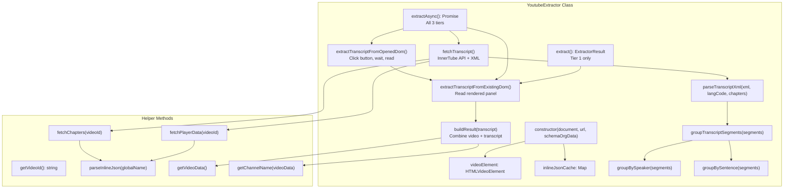
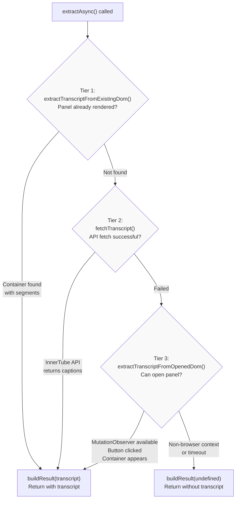
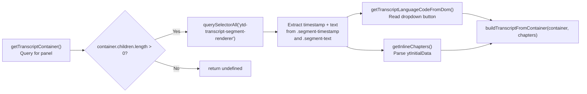
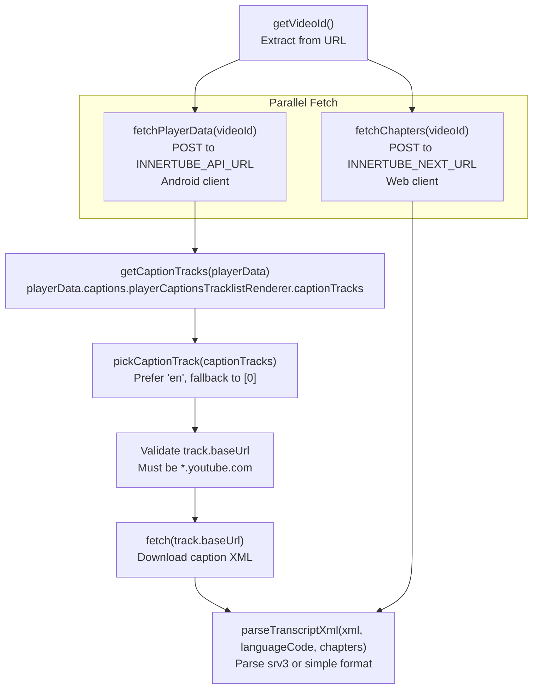
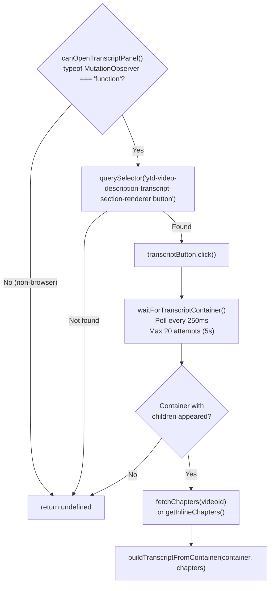
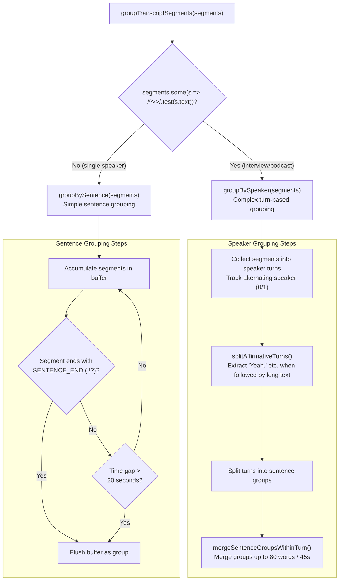
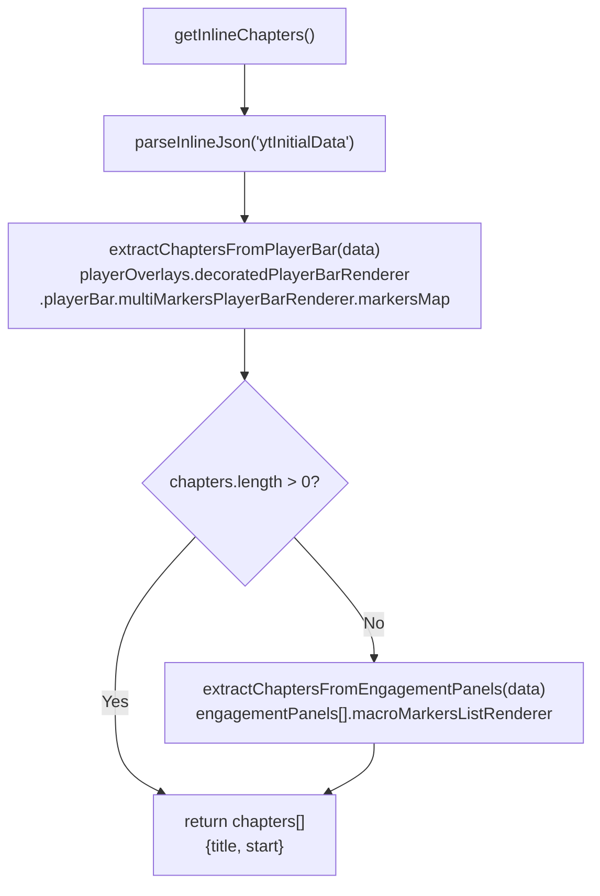
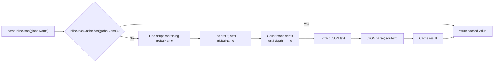

# YouTube Extractor

<details>
<summary>관련 소스 파일</summary>

다음 파일들이 이 위키 페이지를 생성하기 위한 컨텍스트로 사용되었습니다:

- [src/extractors/youtube.ts](src/extractors/youtube.ts)
- [tests/youtube-transcript.test.ts](tests/youtube-transcript.test.ts)
- [website/src/convert.ts](website/src/convert.ts)

</details>


## 목적과 범위

`YoutubeExtractor` 클래스는 동영상 메타데이터, 설명, 챕터, 그리고 특히 동영상 트랜스크립트를 포함해 YouTube 동영상에 특화된 추출을 제공합니다. 이 추출기는 다양한 컨텍스트(브라우저, 서버 사이드, API 차단 시나리오)에서 트랜스크립트를 안정적으로 가져오기 위해 정교한 3단계 fallback 전략을 구현합니다.

추출기 시스템에 대한 일반 정보는 [Extractor Registry](#6.1)를 참조하세요. 다른 플랫폼 추출기는 [Social Media Extractors](#6.3), [AI Chat Extractors](#6.4), [Code Repository Extractors](#6.5)를 참조하세요.

**출처:** [src/extractors/youtube.ts:1-850]()

---

## 아키텍처 개요

`YoutubeExtractor`는 `BaseExtractor`를 확장하며 트랜스크립트 검색에 최적화된 다단계 async 추출 전략을 구현합니다. 이 클래스는 비디오 요소 참조, 성능을 위한 inline JSON 캐시, Schema.org 데이터를 포함한 내부 상태를 유지합니다.



**출처:** [src/extractors/youtube.ts:36-68]()

---

## 추출 메서드

### 동기 추출과 비동기 추출

이 추출기는 동기 및 비동기 추출 메서드를 모두 제공합니다:

| 메서드 | 반환값 | 사용 단계 | 사용 사례 |
|--------|---------|------------|----------|
| `extract()` | `ExtractorResult` | Tier 1만 | 트랜스크립트가 이미 렌더링된 브라우저 |
| `extractAsync()` | `Promise<ExtractorResult>` | Tier 1, 2, 3 | 모든 컨텍스트, 최대 안정성 |

추출기는 `prefersAsync()`가 `true`를 반환해 자신의 선호를 나타내며, 가능할 때 async 경로를 사용해야 한다는 신호를 `Defuddle` 오케스트레이터에 보냅니다.

**출처:** [src/extractors/youtube.ts:47-68]()

---

## 3단계 트랜스크립트 가져오기 전략

async 추출은 트랜스크립트를 바로 사용할 수 있거나 없을 수 있는 여러 시나리오를 처리하기 위해 fallback cascade를 구현합니다.



**출처:** [src/extractors/youtube.ts:63-68]()

### Tier 1: 기존 DOM 추출

트랜스크립트 패널이 이미 DOM에 렌더링되어 있는지 확인합니다(예: 사용자가 추출 전에 열어 둔 경우). `ytd-transcript-segment-renderer` 요소에서 세그먼트를 읽습니다.



**출처:** [src/extractors/youtube.ts:123-176](), [src/extractors/youtube.ts:129-164]()

### Tier 2: InnerTube API 가져오기

Android 클라이언트 컨텍스트를 사용해 YouTube의 비공식 InnerTube API에서 캡션을 직접 가져옵니다. DOM에 트랜스크립트가 아직 포함되어 있지 않을 때 가장 안정적인 방법입니다.



`fetchPlayerData()` 메서드는 먼저 API를 시도한 뒤, API 호출이 실패하면 inline page data(`ytInitialPlayerResponse`)로 fallback합니다.

**출처:** [src/extractors/youtube.ts:335-381](), [src/extractors/youtube.ts:428-457](), [src/extractors/youtube.ts:459-485]()

#### InnerTube API 상수

| 상수 | 값 | 목적 |
|----------|-------|---------|
| `INNERTUBE_API_URL` | `https://www.youtube.com/youtubei/v1/player` | 캡션 트랙 URL을 위한 Player API endpoint |
| `INNERTUBE_CLIENT_VERSION` | `20.10.38` | Android 클라이언트 버전 |
| `INNERTUBE_USER_AGENT` | `com.google.android.youtube/20.10.38 (Linux; U; Android 14)` | API 요청용 user agent |
| `INNERTUBE_NEXT_URL` | `https://www.youtube.com/youtubei/v1/next` | 챕터를 위한 Next API endpoint |
| `INNERTUBE_CONTEXT` | `{ client: { clientName: 'ANDROID', ... } }` | Android 클라이언트 컨텍스트 |
| `INNERTUBE_WEB_CONTEXT` | `{ client: { clientName: 'WEB', ... } }` | 챕터를 위한 Web 클라이언트 컨텍스트 |

**출처:** [src/extractors/youtube.ts:15-32]()

### Tier 3: UI 상호작용 Fallback

브라우저 컨텍스트에서 최후의 수단으로, 프로그래밍 방식으로 트랜스크립트 버튼을 클릭하고 패널이 채워질 때까지 기다립니다. 이는 API가 차단되었거나 캡션을 반환하지 않지만 UI 트랜스크립트는 사용 가능한 경우를 처리합니다.



**출처:** [src/extractors/youtube.ts:178-180](), [src/extractors/youtube.ts:383-426]()

---

## 트랜스크립트 처리

### XML 형식 파싱

YouTube는 두 가지 XML 형식으로 트랜스크립트를 제공합니다. `parseTranscriptXml()` 메서드는 둘 모두를 처리합니다:

#### srv3 형식(단어 수준 타이밍)

```xml
<timedtext>
  <body>
    <p t="0" d="5000"><s>Hello </s><s>world.</s></p>
    <p t="5000" d="3000"><s>Second line.</s></p>
  </body>
</timedtext>
```

- `<p>` 요소에는 `t`(시작 시간, ms)와 `d`(지속 시간, ms)가 있습니다
- `<s>` 요소에는 개별 단어나 구문이 들어 있습니다
- `<p>` 안의 단어는 연결되어 세그먼트 텍스트를 형성합니다

#### 단순 형식(구문 수준 타이밍)

```xml
<transcript>
  <text start="0" dur="5">Hello world.</text>
  <text start="5.5" dur="3">Second line.</text>
</transcript>
```

- `<text>` 요소에는 초 단위의 `start` 및 `dur` 속성이 있습니다
- 콘텐츠는 전체 구문 텍스트입니다

파서는 numeric entity(예: `&#39;`, `&#x2019;`)를 포함한 HTML entity도 디코딩합니다.

**출처:** [src/extractors/youtube.ts:547-608]()

### 세그먼트 그룹화

원시 트랜스크립트 세그먼트는 화자 마커(`>>`)가 있는지에 따라 두 가지 전략 중 하나를 사용해 읽기 쉬운 블록으로 그룹화됩니다.



**출처:** [src/extractors/youtube.ts:618-849]()

### 화자 발화 구간 감지

화자 마커(`>>`)가 감지되면 추출기는 정교한 발화 구간 관리를 수행합니다:

#### 화자 변경 감지

이전 세그먼트가 문장 경계에서 끝난 경우(문장 중간이 아닌 경우)에만 `>>`를 실제 화자 변경으로 처리합니다. 이를 통해 자동 캡션 산출물에서 생기는 false positive를 피합니다.

```typescript
const prevEndsWithComma = /,\s*$/.test(prevSegText);
const prevEndedSentence = (SENTENCE_END.test(prevSegText) || !prevSegText) && !prevEndsWithComma;
const isRealSpeakerChange = isSpeakerChange && prevEndedSentence;
```

**출처:** [src/extractors/youtube.ts:640-668]()

#### 긍정 응답 분리

발화 구간 시작 부분의 짧은 긍정 응답(예: "Yeah.", "Mhm.") 뒤에 상당한 내용(30단어 이상)이 이어지는 경우를 감지합니다. 긍정 응답은 이전 화자의 것이고 나머지는 새 화자의 것이라고 가정해 이를 별도 발화 구간으로 분리합니다(자동 캡션 diarization 오류에서 흔함).

**출처:** [src/extractors/youtube.ts:693-743]()

#### 발화 구간 병합 매개변수

| 상수 | 값 | 목적 |
|----------|-------|---------|
| `SENTENCE_END` | `/[.!?]["'\u2019\u201D)]*\s*$/` | 문장 끝 문장부호 패턴 |
| `QUESTION_END` | `/\?["'\u2019\u201D)]*\s*$/` | 물음표 패턴(병합 방지) |
| `TRANSCRIPT_GROUP_GAP_SECONDS` | `20` | 문장 끊김을 강제하기 전 최대 간격 |
| `TURN_MERGE_MAX_WORDS` | `80` | 발화 구간 내 그룹 병합 시 최대 단어 수 |
| `TURN_MERGE_MAX_SPAN_SECONDS` | `45` | 그룹 병합 시 최대 시간 범위 |
| `SHORT_UTTERANCE_MAX_WORDS` | `3` | 독립적인 짧은 발화의 임계값 |
| `FIRST_GROUP_MERGE_MIN_WORDS` | `8` | 병합 전 첫 번째 그룹의 최소 단어 수 |

**출처:** [src/extractors/youtube.ts:7-13](), [src/extractors/youtube.ts:745-805]()

### 트랜스크립트 출력 형식

`buildTranscript()` 유틸리티 함수(`src/utils/transcript.ts`에서 제공)는 그룹화된 세그먼트를 HTML 및 plain text로 변환합니다. YouTube의 경우:

**Plain Text 형식:**
```
**0:00** · Hello world.
**0:05** · Second sentence.

**0:15** · Different speaker turn.
```

**HTML 형식:**
```html
<div class="youtube transcript">
  <h2>Transcript</h2>
  <p class="transcript-segment">
    <span class="timestamp" data-seconds="0">0:00</span> · Hello world.
  </p>
  <!-- Blank line (separate <p>) for speaker changes -->
  <p class="transcript-segment">
    <span class="timestamp" data-seconds="15">0:15</span> · Different speaker turn.
  </p>
</div>
```

**출처:** [src/extractors/youtube.ts:157-158](), [src/extractors/youtube.ts:593-595]()

---

## 챕터 추출

YouTube 동영상에는 두 가지 출처의 챕터가 있을 수 있습니다. 플레이어 바의 명시적 챕터 또는 설명 타임스탬프에서 자동 생성된 "Key moments"입니다.



### 챕터 데이터 구조

**플레이어 바 챕터(명시적):**
- `markersMap[].value.chapters[].chapterRenderer`에 위치합니다
- `title.simpleText`와 `timeRangeStartMillis`를 가집니다

**Engagement Panel 챕터(자동 생성):**
- `engagementPanels[].macroMarkersListRenderer.contents[].macroMarkersListItemRenderer`에 위치합니다
- `title.simpleText`와 `timeDescription.simpleText`를 가집니다(`parseTimestamp()`로 파싱 필요)

**출처:** [src/extractors/youtube.ts:113-121](), [src/extractors/youtube.ts:487-537]()

---

## 메타데이터 추출

### 동영상 데이터

동영상 메타데이터는 생성자에 전달된 Schema.org 구조화 데이터에서 추출됩니다. `getVideoData()` 메서드는 schema data에서 `VideoObject` 타입을 검색합니다.

**출처:** [src/extractors/youtube.ts:225-233]()

### 채널 이름 추출

채널 이름 추출은 여러 출처를 사용하는 fallback 전략을 따릅니다:

```mermaid
graph TD
    GetChannelName["getChannelName(videoData)"]
    
    TryDom["getChannelNameFromDom()<br/>Query selectors"]
    CheckDomResult{"Found?"}
    
    TryPlayer["getChannelNameFromPlayerResponse()<br/>ytInitialPlayerResponse"]
    CheckPlayerResult{"Found?"}
    
    TrySchema["videoData?.author<br/>(Schema.org)"]
    
    DomSelectors["'ytd-video-owner-renderer #channel-name a[href^=\"/@\"]'<br/>'#owner-name a[href^=\"/@\"]'"]
    DomMicrodata["getChannelNameFromMicrodata()<br/>[itemprop='author'] meta/link[itemprop='name']"]
    
    PlayerVideoDetails["data.videoDetails.author<br/>data.videoDetails.ownerChannelName"]
    PlayerMicroformat["data.microformat.playerMicroformatRenderer.ownerChannelName"]
    
    GetChannelName --> TryDom
    TryDom --> DomSelectors
    DomSelectors --> CheckDomResult
    CheckDomResult -->|"No"| DomMicrodata
    DomMicrodata --> CheckDomResult
    CheckDomResult -->|"Yes"| Return["return name"]
    CheckDomResult -->|"No"| TryPlayer
    
    TryPlayer --> PlayerVideoDetails
    PlayerVideoDetails --> CheckPlayerResult
    CheckPlayerResult -->|"No"| PlayerMicroformat
    PlayerMicroformat --> CheckPlayerResult
    CheckPlayerResult -->|"Yes"| Return
    CheckPlayerResult -->|"No"| TrySchema
    TrySchema --> Return
```

**출처:** [src/extractors/youtube.ts:235-295]()

### 설명 형식화

동영상 설명은 Schema.org 데이터에서 추출되며 줄바꿈은 `<br>` 태그로 변환되어 형식화됩니다:

```typescript
private formatDescription(description: string): string {
  return `<p>${description.replace(/\n/g, '<br>')}</p>`;
}
```

**출처:** [src/extractors/youtube.ts:221-223]()

---

## Inline JSON 파싱

YouTube는 `ytInitialPlayerResponse`, `ytInitialData` 같은 전역 변수 형태로 `<script>` 태그에 구성 데이터를 삽입합니다. `parseInlineJson()` 메서드는 edge case를 처리하기 위해 수동 JSON 파싱으로 이를 추출합니다.



**출처:** [src/extractors/youtube.ts:297-333]()

---

## 결과 형식

`buildResult()` 메서드는 동영상 메타데이터, 설명, 트랜스크립트를 결합해 최종 `ExtractorResult`를 구성합니다.

### 콘텐츠 구조

```html
<iframe width="560" height="315" 
        src="https://www.youtube.com/embed/{videoId}" 
        title="YouTube video player" 
        frameborder="0" 
        allow="accelerometer; autoplay; clipboard-write; encrypted-media; gyroscope; picture-in-picture; web-share" 
        referrerpolicy="strict-origin-when-cross-origin" 
        allowfullscreen>
</iframe>

<p>Video description with<br>line breaks preserved</p>

<div class="youtube transcript">
  <h2>Transcript</h2>
  <!-- Transcript segments -->
</div>
```

### Variables 객체

| 변수 | 출처 | 설명 |
|----------|--------|-------------|
| `title` | `videoData.name` | 동영상 제목 |
| `author` | `getChannelName()` | 채널 이름 |
| `site` | hardcoded | `"YouTube"` |
| `image` | `videoData.thumbnailUrl[0]` | 썸네일 URL |
| `published` | `videoData.uploadDate` | 업로드 날짜(ISO 형식) |
| `description` | `videoData.description` (first 200 chars) | 동영상 설명 snippet |
| `transcript` | `transcript.text` | plain text 트랜스크립트(사용 가능한 경우) |
| `language` | `transcript.languageCode` | 트랜스크립트 언어 코드(사용 가능한 경우) |

### 추출된 콘텐츠

`extractedContent` 객체는 다음을 포함합니다:
- `videoId`: URL에서 추출됨
- `author`: 채널 이름

**출처:** [src/extractors/youtube.ts:182-219]()

---

## Defuddle Pipeline에서의 사용

`YoutubeExtractor`는 YouTube URL을 처리할 때 `ExtractorRegistry`에 의해 자동으로 선택됩니다. 이 추출기는 `prefersAsync() === true`를 반환하므로, `parseAsync()`를 사용할 때 `Defuddle` 오케스트레이터는 `extract()` 대신 `extractAsync()`를 호출합니다.

웹 서비스를 통한 예시 흐름:

1. 사용자 요청: `GET https://defuddle.md/https://www.youtube.com/watch?v=abc123`
2. `convertToMarkdown()`이 페이지 HTML을 가져옵니다
3. `defuddleHtmlAsync()`가 `Defuddle` 인스턴스를 생성합니다
4. `Defuddle.parseAsync()`가 YouTube URL을 감지하고 `YoutubeExtractor`를 인스턴스화합니다
5. `YoutubeExtractor.extractAsync()`가 3단계 fallback을 실행합니다
6. 트랜스크립트가 파싱, 그룹화, 형식화됩니다
7. 동영상 메타데이터, 설명, 트랜스크립트가 포함된 결과가 반환됩니다

**출처:** [website/src/convert.ts:136-193]()

---

## 테스트

추출기에는 다음을 다루는 포괄적인 테스트가 포함되어 있습니다:

- srv3 및 단순 형식 모두에 대한 XML 파싱
- HTML entity 디코딩(numeric entity 포함)
- 화자 발화 구간 및 문장 기준 세그먼트 그룹화
- false positive 처리를 포함한 화자 변경 감지
- 긍정 응답 분리
- 단어 수 및 시간 범위 제한을 적용한 발화 구간 병합
- 플레이어 바 및 engagement panel에서의 챕터 추출
- 추출 단계 전반의 언어 코드 보존
- API 실패 시 fallback 동작
- 비브라우저 컨텍스트 감지(UI 상호작용 단계 건너뜀)

**출처:** [tests/youtube-transcript.test.ts:1-458]()
