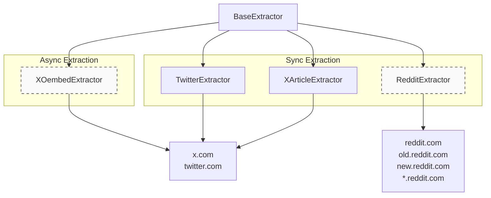
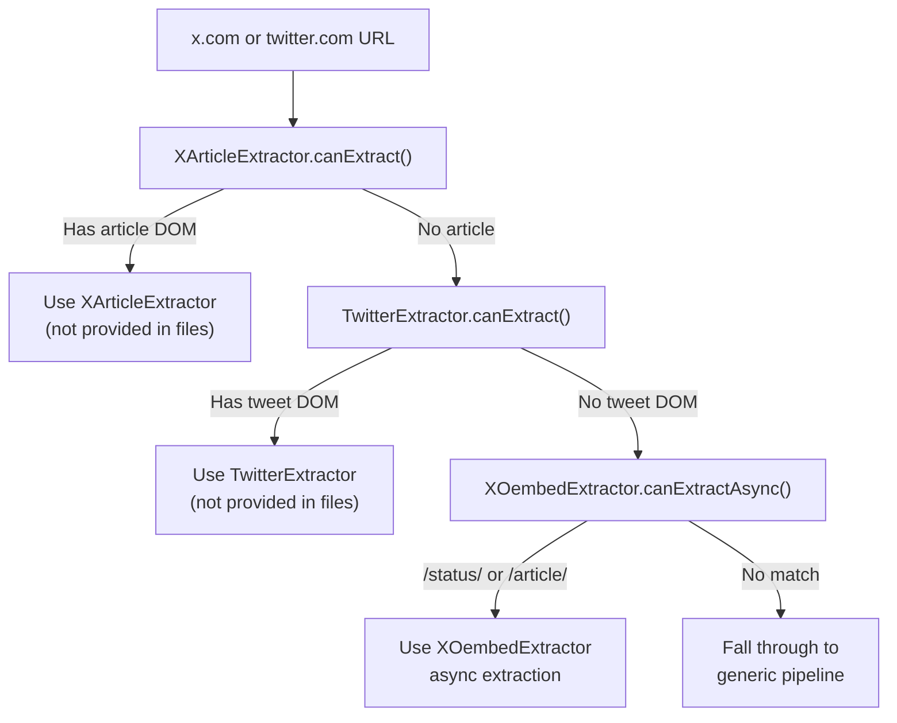
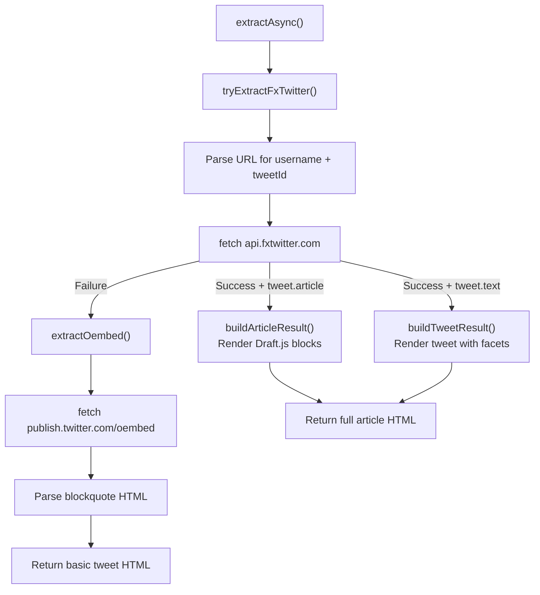
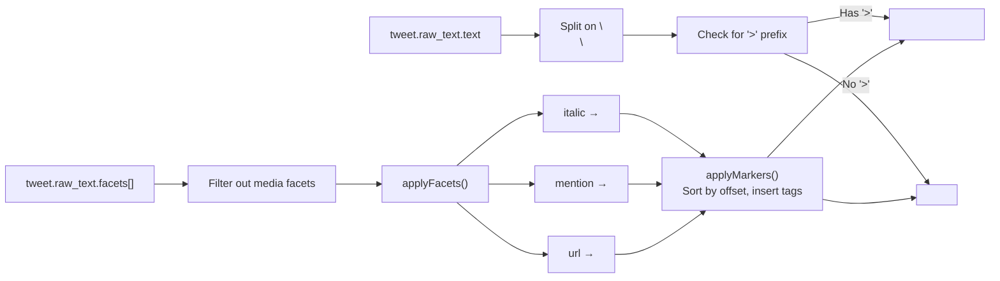
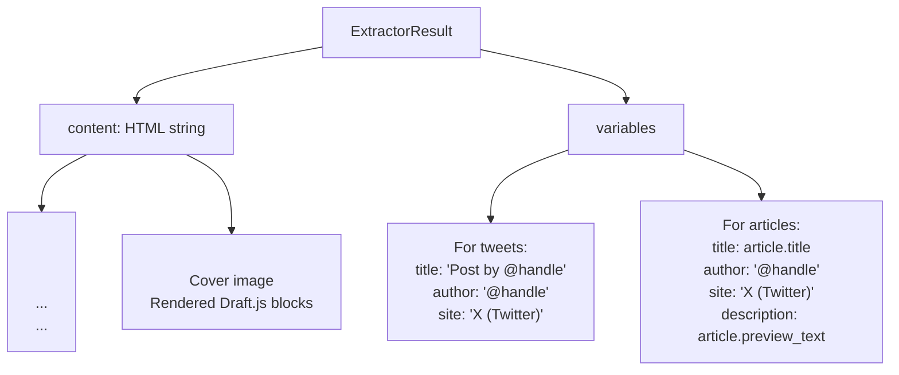
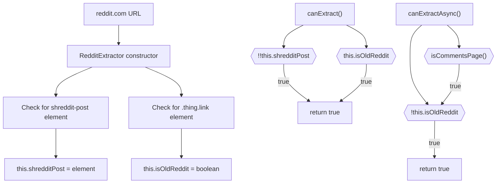
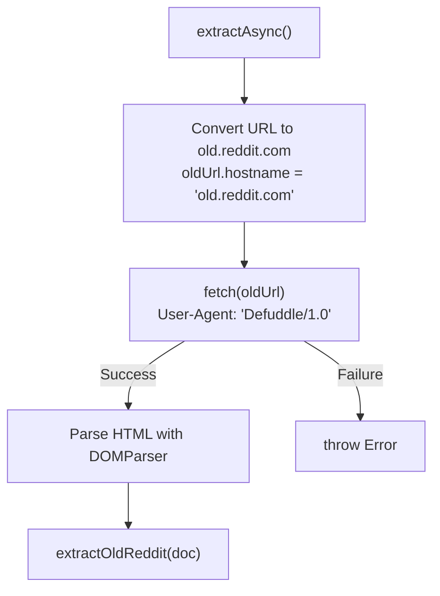
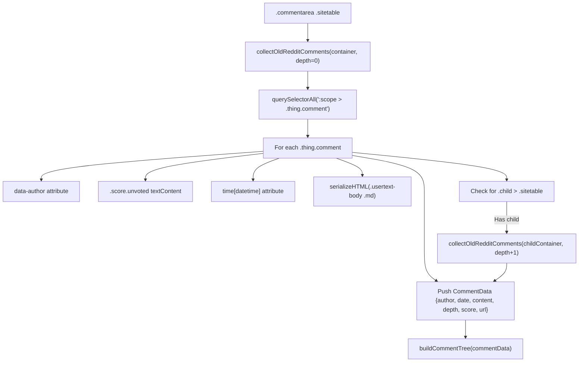
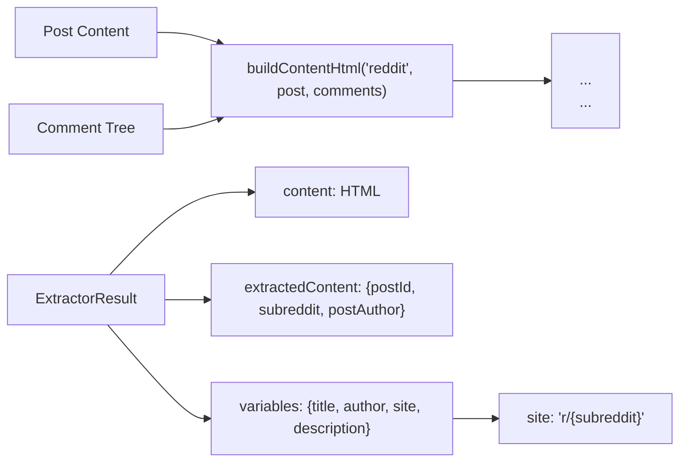

# Social Media Extractors

<details>
<summary>관련 소스 파일</summary>

다음 파일들이 이 위키 페이지를 생성하기 위한 컨텍스트로 사용되었습니다:

- [src/extractor-registry.ts](src/extractor-registry.ts)
- [src/extractors/_base.ts](src/extractors/_base.ts)
- [src/extractors/github.ts](src/extractors/github.ts)
- [src/extractors/grok.ts](src/extractors/grok.ts)
- [src/extractors/hackernews.ts](src/extractors/hackernews.ts)
- [src/extractors/reddit.ts](src/extractors/reddit.ts)
- [src/extractors/x-oembed.ts](src/extractors/x-oembed.ts)

</details>


이 문서는 소셜 미디어 플랫폼 Twitter/X와 Reddit을 위한 특수 추출기를 다룹니다. 이 추출기들은 플랫폼별 콘텐츠 구조를 처리하고, 게시물, 스레드, 댓글 및 관련 메타데이터를 표준화된 방식으로 추출합니다.

다른 특수 추출기에 대한 정보는 동영상 트랜스크립트를 위한 [YouTube Extractor](6.2), ChatGPT, Claude, Gemini, Grok을 위한 [AI Chat Extractors](6.4), GitHub와 Hacker News를 위한 [Code Repository Extractors](6.5)를 참조하세요. 이러한 추출기가 URL에 어떻게 등록되고 매칭되는지는 [Extractor Registry](6.1)를 참조하세요.

## 아키텍처 개요

소셜 미디어 추출기는 `BaseExtractor`를 상속하고 콘텐츠 추출을 위한 플랫폼별 로직을 구현합니다. 이 시스템은 Twitter/X용 특수 추출기 세 개(서로 다른 콘텐츠 유형과 가용성 시나리오 처리)와 Reddit용 추출기 하나(old/new Reddit 이중 경로 지원)를 제공합니다.

### 추출기 우선순위와 등록

`ExtractorRegistry`는 순서가 있는 추출기 목록을 유지하며, 각 추출기를 순서대로 확인하다가 어느 하나의 `canExtract()` 메서드가 true를 반환하면 멈춥니다. Twitter/X URL에서는 **우선순위가 중요합니다**. article 형식 게시물을 처리하기 위해 `XArticleExtractor`가 먼저 확인되고, 그다음 표준 tweet을 위한 `TwitterExtractor`, 마지막으로 DOM 기반 추출이 실패할 때 async fallback으로 `XOembedExtractor`가 확인됩니다.

출처: [src/extractor-registry.ts:23-52](), [src/extractor-registry.ts:123-164]()

### 클래스 계층과 URL 패턴



**참고**: `RedditExtractor`는 sync(`extract()`)와 async(`extractAsync()`) 경로를 모두 지원합니다. `XOembedExtractor`는 async 전용이며, `canExtract()`는 항상 false를 반환합니다.

출처: [src/extractor-registry.ts:6-14](), [src/extractor-registry.ts:30-62](), [src/extractors/_base.ts:1-33]()

## Twitter/X 추출기

Twitter/X 콘텐츠 추출은 서로 다른 콘텐츠 유형과 가용성 시나리오를 서로 다른 추출기가 처리하는 **3단계 우선순위 시스템**을 사용합니다. 레지스트리는 `XArticleExtractor` → `TwitterExtractor` → `XOembedExtractor` 순서로 추출기를 확인합니다.

### 추출기 선택 흐름



**우선순위 설명**: `XArticleExtractor`는 `TwitterExtractor`보다 먼저 등록되어야 합니다. 둘 다 x.com/twitter.com 도메인에 매칭되기 때문입니다. article 추출기의 `canExtract()` 메서드는 article 전용 DOM 요소를 확인하므로, 해당 요소가 있을 때 우선권을 가질 수 있습니다.

출처: [src/extractor-registry.ts:28-52](), [src/extractors/x-oembed.ts:96-109]()

### XOembedExtractor: Async Fallback 추출

`XOembedExtractor`는 DOM 기반 추출기를 실행할 수 없을 때(예: 클라이언트 사이드 hydration이 없는 서버 사이드 렌더링 HTML) async 추출을 제공합니다. 이는 **async 전용**입니다. `canExtract()`는 `false`를 반환하고, `canExtractAsync()`는 `/status/` 또는 `/article/` 패턴과 일치하는 URL에 대해 `true`를 반환합니다.

#### XOembedExtractor 추출 전략

이 추출기는 **2단계 fallback** 시스템을 사용합니다:



**FxTwitter의 장점**: FxTwitter API는 전체 tweet 텍스트(잘림 없음), facet(mention, URL, italic)이 포함된 raw text, 그리고 Draft.js 형식의 완전한 article 콘텐츠를 제공합니다. oEmbed API는 긴 tweet을 잘라내지만 항상 사용할 수 있습니다.

출처: [src/extractors/x-oembed.ts:107-120](), [src/extractors/x-oembed.ts:182-199](), [src/extractors/x-oembed.ts:122-180]()

#### Draft.js 형식의 Article 렌더링

X article은 Draft.js 콘텐츠 표현을 사용합니다. `XOembedExtractor`는 이를 HTML로 변환합니다:

| Draft.js Block Type | HTML 출력 | Handler Method |
|---------------------|-------------|----------------|
| `unstyled` | `<p>` | `renderBlock()` |
| `header-two` | `<h2>` | `renderBlock()` |
| `header-three` | `<h3>` | `renderBlock()` |
| `unordered-list-item` | `<ul><li>` (grouped) | `renderArticle()` |
| `atomic` + `MEDIA` entity | `<figure><figcaption>` | `renderAtomicBlock()` |
| `atomic` + `MARKDOWN` entity | `<pre><code>` | `renderAtomicBlock()` |

**Inline Styling**: 추출기는 `inlineStyleRanges`(bold), `entityRanges`(links), `data.mentions`/`data.urls`를 처리해 marker 기반 시스템(`applyMarkers()`)으로 HTML 태그를 적용합니다.

출처: [src/extractors/x-oembed.ts:357-392](), [src/extractors/x-oembed.ts:394-444](), [src/extractors/x-oembed.ts:446-485]()

#### Facet을 사용한 Tweet 렌더링

표준 tweet(article이 아닌 경우)의 경우 `XOembedExtractor`는 `tweet.raw_text.facets`를 사용해 형식을 적용합니다:



**미디어 처리**: `tweet.media.photos[]`의 사진은 텍스트 콘텐츠 뒤에 `` 태그로 추가됩니다.

출처: [src/extractors/x-oembed.ts:251-301](), [src/extractors/x-oembed.ts:330-355](), [src/extractors/x-oembed.ts:303-328]()

#### XOembedExtractor 출력 구조



출처: [src/extractors/x-oembed.ts:217-249](), [src/extractors/x-oembed.ts:235-249](), [src/extractors/x-oembed.ts:157-179]()

## RedditExtractor: 이중 경로 추출

`RedditExtractor`는 old.reddit.com과 new Reddit(www.reddit.com)을 모두 처리합니다. 이 추출기는 서로 다른 콘텐츠 가용성 시나리오를 처리하기 위해 **sync와 async 추출 경로를 모두** 구현합니다.

### Reddit 콘텐츠 감지 전략



**왜 두 경로인가?** New Reddit의 서버 사이드 HTML에는 `shreddit-post` 요소가 포함되지만 **`shreddit-comment` 요소는 포함되지 않습니다**(클라이언트 사이드 JavaScript가 필요). sync 추출에서 댓글 누락이 감지되면 빈 콘텐츠를 반환하고, 이로 인해 `parseAsync()`가 `extractAsync()`로 넘어갑니다.

출처: [src/extractors/reddit.ts:10-18](), [src/extractors/reddit.ts:16-29](), [src/extractors/reddit.ts:56-68]()

### Async 추출: Old Reddit Fallback

new Reddit에 댓글 데이터가 없으면 `extractAsync()`는 old.reddit.com을 가져옵니다:



출처: [src/extractors/reddit.ts:31-54]()

### Old Reddit 댓글 추출

Old Reddit은 자식 컨테이너로 깊이가 표시되는 중첩 `.sitetable > .thing.comment` 구조를 사용합니다:



출처: [src/extractors/reddit.ts:169-199](), [src/extractors/reddit.ts:96-126]()

### New Reddit 댓글 추출

New Reddit은 `depth` 속성이 있는 `shreddit-comment` custom element를 사용합니다:

| 속성/요소 | 목적 | 예시 |
|-------------------|---------|---------|
| `depth` attribute | 중첩 수준 | `"0"`, `"1"`, `"2"` |
| `author` attribute | 댓글 작성자 | `"username"` |
| `score` attribute | 투표 수 | `"42"` |
| `created` attribute | ISO timestamp | `"2024-01-15T12:00:00Z"` |
| `[slot="comment"]` | 댓글 HTML | Rich content container |

**처리 흐름**: 모든 `shreddit-comment` 요소를 쿼리하고, 속성에서 메타데이터를 추출하며, `[slot="comment"]` HTML을 직렬화한 뒤 `buildCommentTree()` 유틸리티로 댓글 트리를 구축합니다.

출처: [src/extractors/reddit.ts:140-228]()

### Reddit 콘텐츠 조립

old와 new Reddit 경로는 모두 같은 출력 구조를 생성합니다:



출처: [src/extractors/reddit.ts:70-94](), [src/extractors/reddit.ts:111-125](), [src/extractors/reddit.ts:136-138]()

### RedditExtractor URL 파싱

추출기는 URL 구조에서 직접 메타데이터를 추출합니다:

```typescript
// Post ID from URL: /r/subreddit/comments/POST_ID/title
private getPostId(): string {
    const match = this.url.match(/comments\/([a-zA-Z0-9]+)/);
    return match?.[1] || '';
}

// Subreddit from URL: /r/SUBREDDIT/...
private getSubreddit(): string {
    const match = this.url.match(/\/r\/([^/]+)/);
    return match?.[1] || '';
}
```

출처: [src/extractors/reddit.ts:145-157]()

## Extractor Registry와의 통합

소셜 미디어 추출기는 URL 패턴에 따라 자동 등록되고 매칭됩니다. 레지스트리는 소셜 미디어 도메인과 일치하는 URL을 식별하고 적절한 추출기 클래스를 인스턴스화합니다.

### URL 패턴 매칭

| 플랫폼 | URL 패턴 | 추출기 클래스 |
|----------|--------------|-----------------|
| Twitter/X | `twitter.com/*`, `x.com/*` | `TwitterExtractor` |
| YouTube | `youtube.com/watch*`, `youtu.be/*` | `YoutubeExtractor` |

출처: [src/extractors/twitter.ts:4](), [src/extractors/youtube.ts:4]()

## 공통 기능

두 소셜 미디어 추출기는 모두 `BaseExtractor`에서 상속한 공통 패턴을 공유합니다:

- **Schema.org 통합**: 사용 가능한 경우 구조화 데이터를 활용
- **메타데이터 표준화**: 플랫폼 전반에서 일관된 변수 이름 사용
- **HTML 출력**: 의미 있는 class 이름을 가진 구조화된 HTML
- **오류 처리**: 콘텐츠를 찾지 못했을 때 graceful degradation
- **URL 검증**: `canExtract()` 메서드가 추출 가능성을 검증

소셜 미디어 추출기는 메인 Defuddle pipeline의 downstream 처리를 위해 일관된 출력 형식을 유지하면서 플랫폼에 최적화된 콘텐츠 추출을 제공합니다.

출처: [src/extractors/_base.ts:1](), [src/extractors/twitter.ts:41-43](), [src/extractors/youtube.ts:14-16]()
