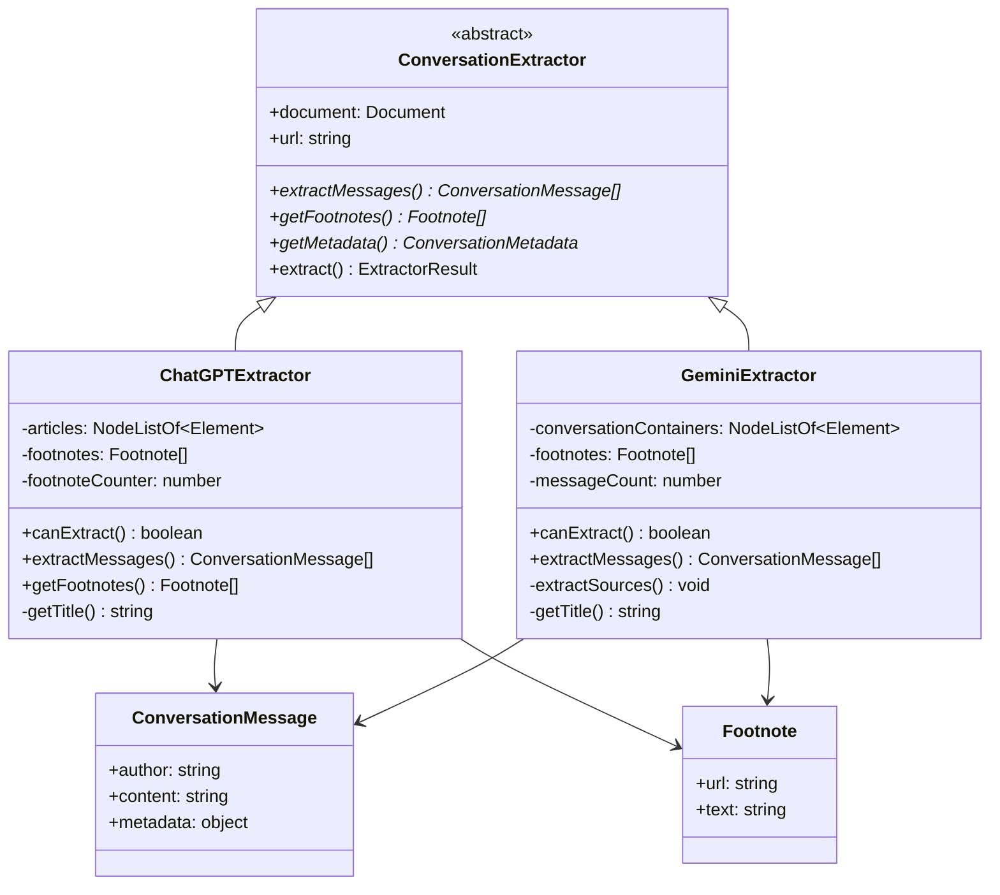
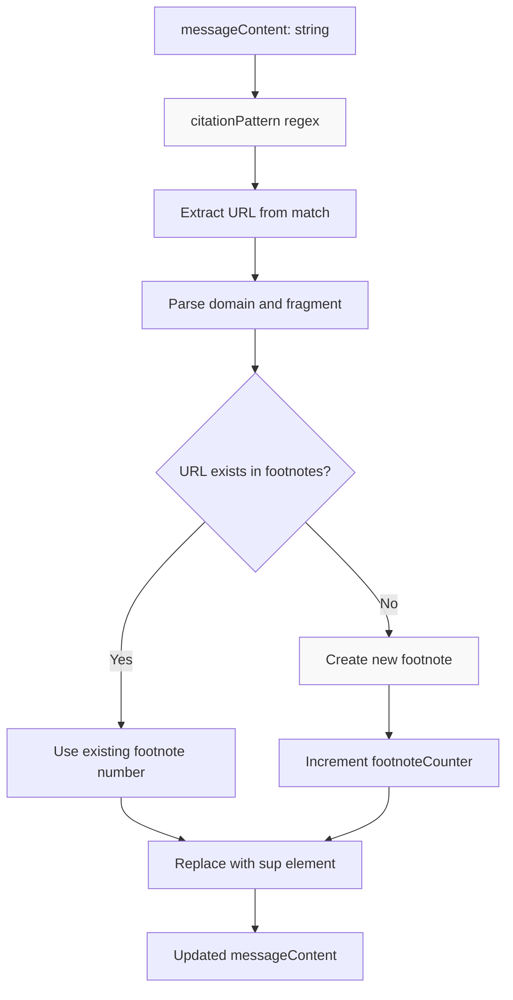
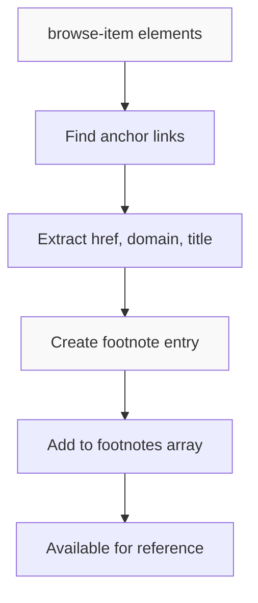

# AI Chat Extractors

<details>
<summary>관련 소스 파일</summary>

다음 파일들이 이 위키 페이지를 생성하기 위한 컨텍스트로 사용되었습니다:

- [src/elements/footnotes.ts](src/elements/footnotes.ts)
- [src/elements/images.ts](src/elements/images.ts)
- [src/extractor-registry.ts](src/extractor-registry.ts)
- [src/extractors/_base.ts](src/extractors/_base.ts)
- [src/extractors/chatgpt.ts](src/extractors/chatgpt.ts)
- [src/extractors/gemini.ts](src/extractors/gemini.ts)
- [src/extractors/grok.ts](src/extractors/grok.ts)
- [src/extractors/twitter.ts](src/extractors/twitter.ts)
- [src/extractors/x-oembed.ts](src/extractors/x-oembed.ts)

</details>


이 페이지는 구조화된 메시지 흐름, 인용, 플랫폼별 DOM 패턴을 가진 대화 기반 콘텐츠를 처리하는 AI 채팅 플랫폼용 특수 추출기를 문서화합니다. 이 추출기들은 ChatGPT와 Gemini 같은 AI 챗봇의 대화를 표준화된 대화 형식으로 파싱합니다.

URL을 이러한 추출기로 라우팅하는 registry 시스템에 대한 정보는 [Extractor Registry](#5.1)를 참조하세요. 소셜 미디어 같은 다른 대화 기반 플랫폼은 [Social Media Extractors](#5.2)를 참조하세요.

## 개요

AI 채팅 추출기는 사용자와 AI assistant 사이의 대화로 콘텐츠가 구조화된 플랫폼을 처리합니다. 전통적인 article 콘텐츠와 달리, 이러한 플랫폼은 메시지 스레드, 작성자 식별, 인용 처리에 대한 특수 파싱이 필요합니다.

AI 채팅 추출기는 `ConversationExtractor` base class를 확장하고, 구조화된 대화 데이터를 추출하기 위한 플랫폼별 DOM 파싱 로직을 구현합니다.

## AI 채팅 추출기 아키텍처



출처: [src/extractors/chatgpt.ts:1-4](), [src/extractors/gemini.ts:1-4]()

## ChatGPT Extractor

`ChatGPTExtractor` 클래스는 개별 대화 턴을 포함하는 article 요소를 파싱하여 ChatGPT 대화 페이지를 처리합니다.

### DOM 구조 처리

추출기는 ChatGPT가 사용하는 특정 DOM 패턴을 대상으로 합니다:

| 요소 | 목적 | Selector |
|---------|---------|----------|
| Article containers | 개별 대화 턴 | `article[data-testid^="conversation-turn-"]` |
| Author headings | 화자 식별 | `h5.sr-only, h6.sr-only` |
| Author roles | 역할 메타데이터 | `[data-message-author-role]` |
| Citation spans | Inline reference | `span` containing `a[target=_blank][rel=noopener]` |

### 인용 처리



ChatGPT 추출기는 regex pattern matching을 사용해 inline citation 요소를 식별하고 번호가 매겨진 footnote reference로 대체하는 정교한 인용 처리를 구현합니다:

출처: [src/extractors/chatgpt.ts:54-102]()

### 메시지 추출 과정

`extractMessages()` 메서드는 각 article 요소를 처리해 대화 메시지를 추출합니다:

1. **작성자 추출**: screen reader 요소에서 작성자 텍스트를 가져오고 형식을 정리합니다
2. **역할 식별**: `data-message-author-role` 속성에서 작성자 역할을 가져옵니다
3. **콘텐츠 처리**: zero-width space와 원치 않는 요소를 제거합니다
4. **인용 대체**: inline citation을 footnote reference로 변환합니다
5. **콘텐츠 정리**: 빈 paragraph tag를 제거합니다

출처: [src/extractors/chatgpt.ts:20-119]()

## Gemini Extractor

`GeminiExtractor` 클래스는 conversation container에 초점을 둔 다른 DOM 구조를 가진 Google Gemini 대화 페이지를 처리합니다.

### DOM 구조 처리

| 요소 | 목적 | Selector |
|---------|---------|----------|
| Conversation containers | 대화 경계 | `div.conversation-container` |
| User queries | 사용자 입력 | `user-query .query-text` |
| Model responses | AI 응답 | `model-response .markdown` |
| Extended responses | 긴 형식 응답 | `#extended-response-markdown-content` |
| Browse items | 출처 인용 | `browse-item` |

### 출처 추출

Gemini 추출기는 ChatGPT와 다르게 전용 `browse-item` 요소에서 source reference를 추출해 처리합니다:



출처: [src/extractors/gemini.ts:72-92]()

### 메시지 처리

`extractMessages()` 메서드는 Gemini 특유의 대화 구조를 처리합니다:

1. **User Queries**: `.query-text` selector로 `user-query` 요소에서 콘텐츠를 추출합니다
2. **Model Responses**: 일반 응답 콘텐츠와 extended response 콘텐츠를 모두 처리합니다
3. **Table Content Handling**: 콘텐츠 제거를 유발할 수 있는 충돌 CSS class를 제거합니다
4. **Source Extraction**: `extractSources()`를 호출해 citation reference를 처리합니다

출처: [src/extractors/gemini.ts:19-70]()

## 대화 메시지 형식

두 추출기 모두 `ConversationMessage` interface를 따르는 메시지를 생성합니다:

```typescript
interface ConversationMessage {
    author: string;      // "You", "ChatGPT", "Gemini", etc.
    content: string;     // HTML content of the message
    metadata: {
        role: string;    // "user", "assistant", "unknown"
    };
}
```

## 메타데이터와 제목 추출

두 추출기 모두 fallback 전략을 사용한 제목 추출을 구현합니다:

| 우선순위 | ChatGPT | Gemini |
|----------|---------|--------|
| 1 | Document title ("ChatGPT"가 아닌 경우) | Document title ("Gemini"가 아닌 경우) |
| 2 | 첫 번째 사용자 메시지(잘림) | `.title-text`의 research title |
| 3 | "ChatGPT Conversation" | 첫 번째 user query(잘림) |
| 4 | - | "Gemini Conversation" |

추출기들은 메시지 수와 플랫폼 식별을 포함한 대화 메타데이터도 제공합니다.

출처: [src/extractors/chatgpt.ts:138-154](), [src/extractors/gemini.ts:110-128]()

## 추출기 등록

이 추출기들은 특정 URL 패턴을 처리하기 위해 extractor registry 시스템에 등록됩니다:

- **ChatGPT**: `chatgpt.com/(c|share)/*` 패턴
- **Gemini**: `gemini.google.com/app/*` 패턴

레지스트리는 도메인과 경로 패턴을 기준으로 일치하는 URL을 적절한 추출기로 자동 라우팅합니다.

출처: [src/extractors/chatgpt.ts:1-155](), [src/extractors/gemini.ts:1-130]()
