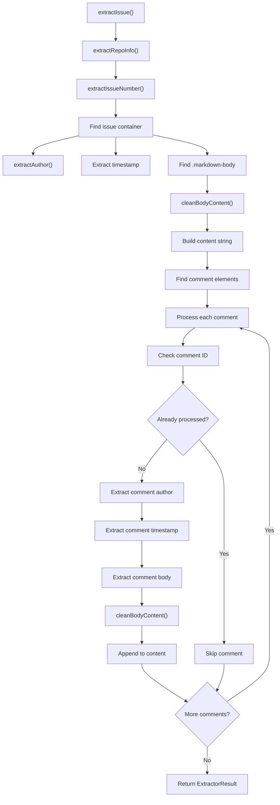
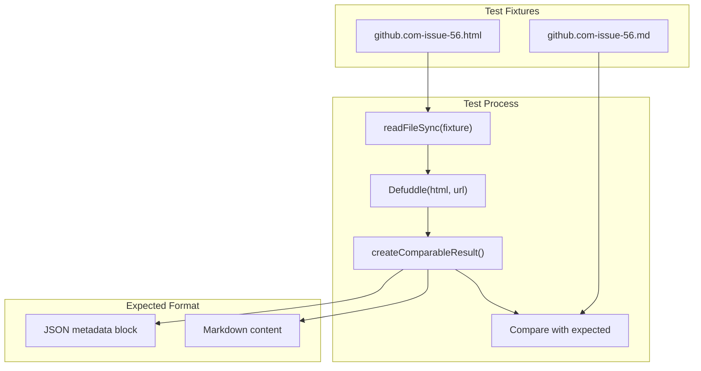

# Code Repository Extractors

<details>
<summary>관련 소스 파일</summary>

다음 파일들이 이 위키 페이지를 생성하기 위한 컨텍스트로 사용되었습니다:

- [src/extractors/github.ts](src/extractors/github.ts)
- [src/extractors/hackernews.ts](src/extractors/hackernews.ts)
- [src/extractors/reddit.ts](src/extractors/reddit.ts)

</details>


이 문서는 현재 GitHub에 초점을 둔 코드 저장소 및 개발 플랫폼용 특수 추출기를 다룹니다. 이 추출기들은 issue discussion, pull request comment, repository metadata처럼 개발 플랫폼에서 발견되는 고유한 콘텐츠 구조를 처리합니다.

일반 extractor registry 시스템에 대한 정보는 [Extractor Registry](#5.1)를 참조하세요. 다른 플랫폼별 추출기는 [Social Media Extractors](#5.2)와 [AI Chat Extractors](#5.3)를 참조하세요.

## 개요

코드 저장소 추출기는 개발 플랫폼에서 발견되는 구조화된 discussion과 metadata를 처리하도록 설계된 특수 콘텐츠 처리기입니다. 현재 시스템에는 issue page를 처리하고 main issue content, 모든 comment, author information, timestamp를 표준화된 형식으로 추출하는 포괄적인 GitHub 추출기가 포함되어 있습니다.

```mermaid
graph TB
    subgraph "ExtractorRegistry"
        REGISTRY["ExtractorRegistry.findExtractor()"]
    end
    
    subgraph "GitHub Detection"
        PATTERNS["github.com/*"]
        INDICATORS["GitHub Page Indicators"]
    end
    
    subgraph "GitHubExtractor"
        CAN_EXTRACT["canExtract()"]
        EXTRACT["extract()"]
        EXTRACT_ISSUE["extractIssue()"]
        EXTRACT_AUTHOR["extractAuthor()"]
        CLEAN_BODY["cleanBodyContent()"]
    end
    
    subgraph "GitHub Content"
        ISSUE_CONTAINER["[data-testid=\"issue-viewer-issue-container\"]"]
        COMMENT_ELEMENTS["[data-wrapper-timeline-id]"]
        MARKDOWN_BODY[".markdown-body"]
    end
    
    subgraph "Output"
        EXTRACTOR_RESULT["ExtractorResult"]
        CONTENT_HTML["contentHtml"]
        VARIABLES["variables (title, author, site)"]
    end
    
    REGISTRY --> PATTERNS
    PATTERNS --> CAN_EXTRACT
    CAN_EXTRACT --> INDICATORS
    INDICATORS --> EXTRACT
    EXTRACT --> EXTRACT_ISSUE
    
    EXTRACT_ISSUE --> ISSUE_CONTAINER
    EXTRACT_ISSUE --> COMMENT_ELEMENTS
    ISSUE_CONTAINER --> MARKDOWN_BODY
    COMMENT_ELEMENTS --> MARKDOWN_BODY
    
    EXTRACT_ISSUE --> EXTRACT_AUTHOR
    EXTRACT_ISSUE --> CLEAN_BODY
    CLEAN_BODY --> CONTENT_HTML
    
    EXTRACT_ISSUE --> EXTRACTOR_RESULT
    EXTRACTOR_RESULT --> VARIABLES
```

출처: [src/extractors/github.ts:1-184](), [tests/fixtures/github.com-issue-56.html:1-290]()

## GitHub Extractor 구현

`GitHubExtractor` 클래스는 GitHub page, 특히 issue와 pull request discussion에서의 추출을 처리합니다. 이 클래스는 `BaseExtractor`를 확장하고 표준 extractor interface를 구현합니다.

### 감지 로직

추출기는 GitHub page를 식별하고 추출 가능한 콘텐츠가 포함되어 있는지 판단하기 위해 2단계 감지 시스템을 사용합니다:

```mermaid
graph TB
    subgraph "Phase 1: GitHub Site Detection"
        META_HOSTNAME["meta[name=\"expected-hostname\"][content=\"github.com\"]"]
        META_OCTOLYTICS["meta[name=\"octolytics-url\"]"]
        META_SHORTCUTS["meta[name=\"github-keyboard-shortcuts\"]"]
        HEADER_WRAPPER[".js-header-wrapper"]
        REPO_CONTAINER["#js-repo-pjax-container"]
    end
    
    subgraph "Phase 2: Content Type Detection"
        ISSUE_METADATA["[data-testid=\"issue-metadata-sticky\"]"]
        ISSUE_TITLE["[data-testid=\"issue-title\"]"]
    end
    
    subgraph "canExtract() Logic"
        GITHUB_CHECK["githubIndicators.some()"]
        CONTENT_CHECK["githubPageIndicators.some()"]
        FINAL_RESULT["return boolean"]
    end
    
    META_HOSTNAME --> GITHUB_CHECK
    META_OCTOLYTICS --> GITHUB_CHECK
    META_SHORTCUTS --> GITHUB_CHECK
    HEADER_WRAPPER --> GITHUB_CHECK
    REPO_CONTAINER --> GITHUB_CHECK
    
    ISSUE_METADATA --> CONTENT_CHECK
    ISSUE_TITLE --> CONTENT_CHECK
    
    GITHUB_CHECK --> FINAL_RESULT
    CONTENT_CHECK --> FINAL_RESULT
```

출처: [src/extractors/github.ts:5-23]()

### 콘텐츠 추출 과정

추출 과정은 GitHub issue에 초점을 맞추며, 관련 콘텐츠를 모두 캡처하기 위한 구조화된 접근 방식을 따릅니다:

| 추출 단계 | 대상 Selector | 목적 |
|-----------------|------------------|----------|
| Repository Info | URL pattern `github.com/([^/]+)/([^/]+)` | owner와 repository name 추출 |
| Issue Number | URL pattern `/issues/(\d+)` | 특정 issue 식별 |
| Main Issue Content | `[data-testid="issue-viewer-issue-container"]` | primary issue content 추출 |
| Issue Author | `a[data-testid="issue-body-header-author"]` | issue creator 식별 |
| Issue Timestamp | `relative-time` elements | creation time 추출 |
| Comments | `[data-wrapper-timeline-id]` elements | 모든 comment 추출 |
| Comment Authors | `.ActivityHeader-module__AuthorLink--iofTU` | comment author 식별 |
| Markdown Content | `.markdown-body` elements | formatted content 추출 |

주요 추출 흐름은 먼저 issue content를 처리한 다음 comment를 순회합니다:



출처: [src/extractors/github.ts:29-121]()

### 작성자 추출 전략

추출기는 여러 GitHub UI 변형에서 작성자를 안정적으로 식별하기 위해 cascading selector 접근 방식을 사용합니다:

```mermaid
graph TB
    subgraph "Author Extraction Selectors"
        TESTID_AUTHOR["a[data-testid=\"issue-body-header-author\"]"]
        MODULE_AUTHOR[".IssueBodyHeaderAuthor-module__authorLoginLink--_S7aT"]
        ACTIVITY_AUTHOR[".ActivityHeader-module__AuthorLink--iofTU"]
        HOVERCARD_AUTHOR["a[href*=\"/users/\"][data-hovercard-url*=\"/users/\"]"]
        PROFILE_AUTHOR["a[aria-label*=\"profile\"]"]
    end
    
    subgraph "URL Processing"
        RELATIVE_PATH["href.startsWith('/')"]
        ABSOLUTE_URL["href.includes('github.com/')"]
        REGEX_MATCH["github.com/([^/\\?#]+)"]
        USERNAME_EXTRACT["Extract username"]
    end
    
    TESTID_AUTHOR --> RELATIVE_PATH
    MODULE_AUTHOR --> RELATIVE_PATH
    ACTIVITY_AUTHOR --> RELATIVE_PATH
    HOVERCARD_AUTHOR --> ABSOLUTE_URL
    PROFILE_AUTHOR --> REGEX_MATCH
    
    RELATIVE_PATH --> USERNAME_EXTRACT
    ABSOLUTE_URL --> USERNAME_EXTRACT
    REGEX_MATCH --> USERNAME_EXTRACT
```

출처: [src/extractors/github.ts:123-141]()

## 콘텐츠 정리와 표준화

추출기에는 실제 discussion content를 보존하면서 GitHub 특유의 UI 요소를 제거하기 위한 특수 콘텐츠 정리 로직이 포함되어 있습니다:

```mermaid
graph LR
    subgraph "cleanBodyContent() Process"
        CLONE["cloneNode(true)"]
        REMOVE_BUTTONS["Remove button elements"]
        REMOVE_CLIPBOARD["Remove clipboard components"]
        RETURN_HTML["Return cleaned innerHTML"]
    end
    
    subgraph "Removed Elements"
        BUTTONS["button"]
        TESTID_BUTTONS["[data-testid*=\"button\"]"]
        TESTID_MENUS["[data-testid*=\"menu\"]"]
        CLIPBOARD[".js-clipboard-copy"]
        ZEROCLIP[".zeroclipboard-container"]
    end
    
    CLONE --> REMOVE_BUTTONS
    REMOVE_BUTTONS --> REMOVE_CLIPBOARD
    REMOVE_CLIPBOARD --> RETURN_HTML
    
    BUTTONS --> REMOVE_BUTTONS
    TESTID_BUTTONS --> REMOVE_BUTTONS
    TESTID_MENUS --> REMOVE_BUTTONS
    CLIPBOARD --> REMOVE_CLIPBOARD
    ZEROCLIP --> REMOVE_CLIPBOARD
```

출처: [src/extractors/github.ts:143-148]()

## 출력 구조

`GitHubExtractor`는 GitHub 특화 metadata와 구조화된 콘텐츠를 포함한 `ExtractorResult`를 반환합니다:

| 필드 | 타입 | 콘텐츠 |
|-------|------|---------|
| `content` | string | issue와 모든 comment의 결합 HTML |
| `contentHtml` | string | content와 동일(HTML 형식) |
| `extractedContent.type` | string | 항상 "issue" |
| `extractedContent.issueNumber` | string | 추출된 issue number |
| `extractedContent.repository` | string | repository name |
| `extractedContent.owner` | string | repository owner |
| `variables.title` | string | page title |
| `variables.author` | string | 비어 있음(작성자가 여러 명) |
| `variables.site` | string | "GitHub - owner/repo" |
| `variables.description` | string | 잘린 content preview |

콘텐츠 구조는 다음 형식을 따릅니다:
```html
<div class="issue-author"><strong>username</strong> opened this issue on MM/DD/YYYY</div>
<div class="issue-body"><!-- main issue content --></div>

<div class="comment">
  <div class="comment-header"><strong>username</strong> commented on MM/DD/YYYY</div>
  <div class="comment-body"><!-- comment content --></div>
</div>
```

출처: [src/extractors/github.ts:105-121](), [tests/expected/github.com-issue-56.md:1-71]()

## 테스트 인프라

GitHub 추출기는 실제 GitHub HTML을 처리하고 추출 결과를 검증하는 fixture 기반 테스트 시스템을 사용해 테스트됩니다:



이 테스트는 추출기가 실제 GitHub issue page(defuddle repository의 Issue #56)를 올바르게 처리하고 적절한 metadata extraction이 포함된 예상 markdown output을 생성하는지 검증합니다.

출처: [tests/fixtures.test.ts:82-112](), [tests/fixtures/github.com-issue-56.html:116](), [tests/expected/github.com-issue-56.md:1-8]()
