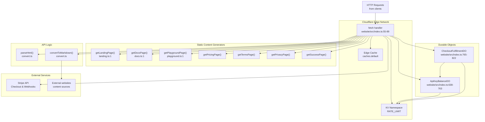
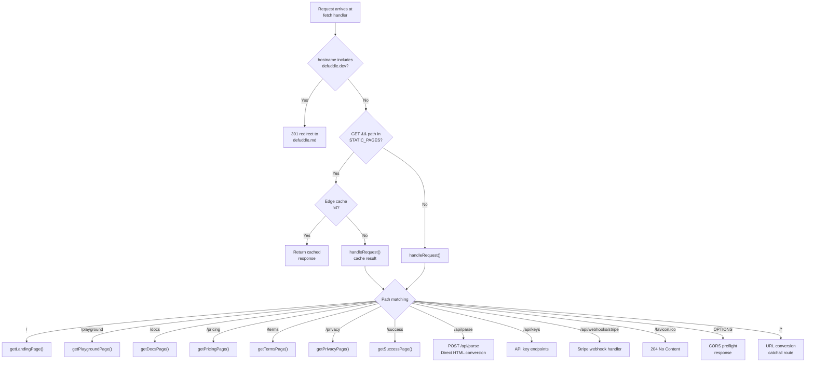
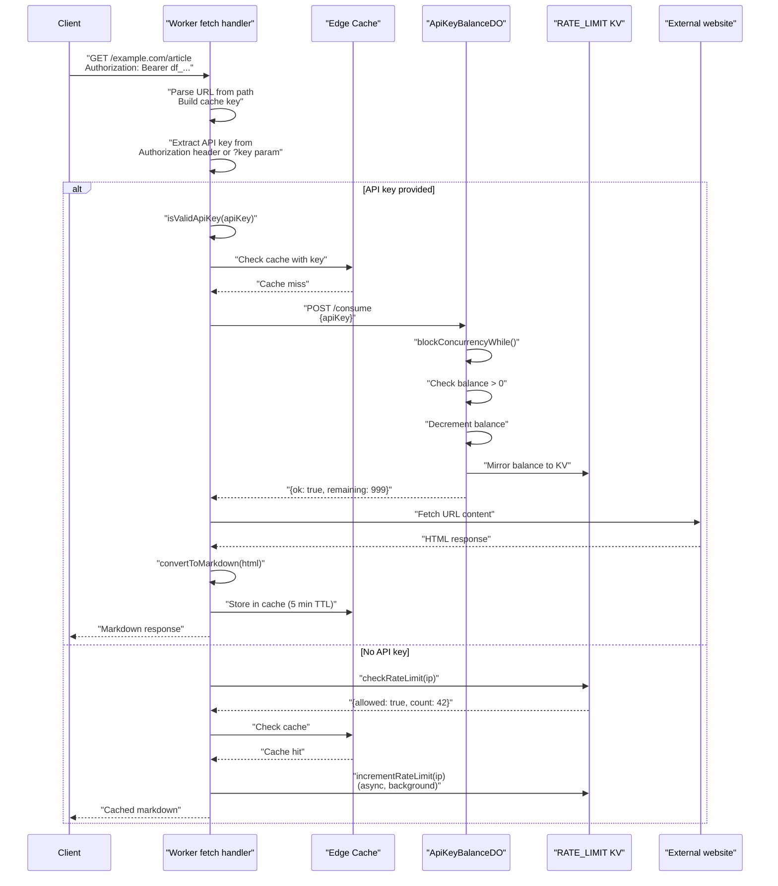
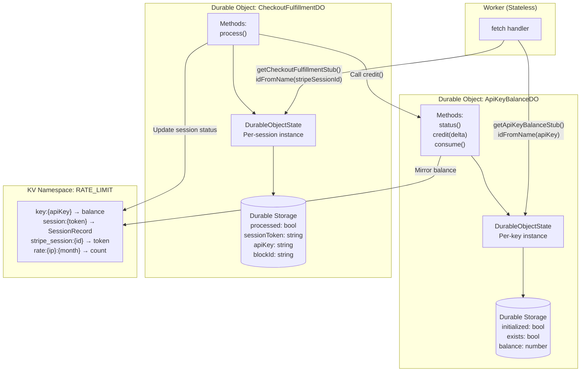
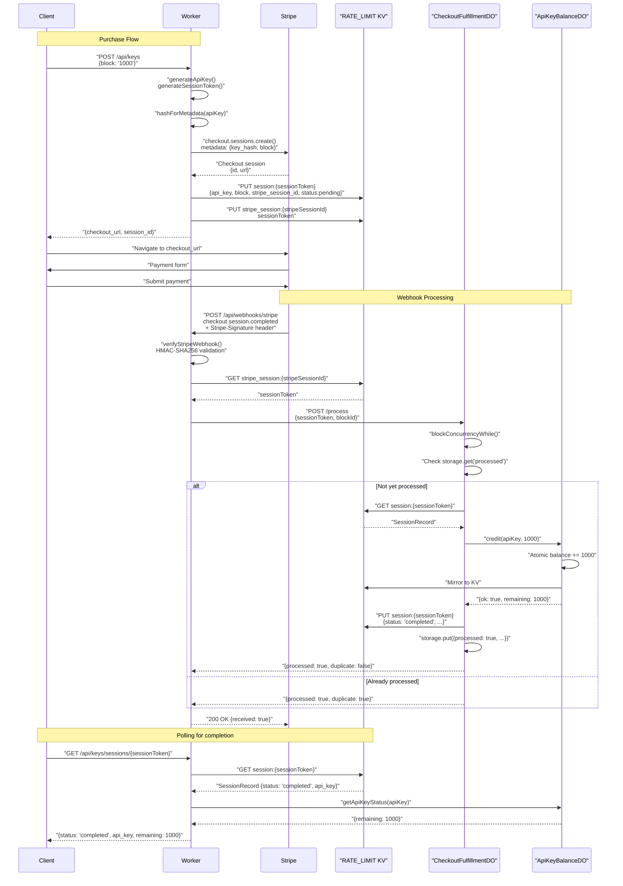

# Web Service

<details>
<summary>관련 소스 파일</summary>

다음 파일들이 이 위키 페이지를 생성하기 위한 컨텍스트로 사용되었습니다:

- [.gitignore](.gitignore)
- [tests/debug.test.ts](tests/debug.test.ts)
- [website/src/docs.ts](website/src/docs.ts)
- [website/src/index.ts](website/src/index.ts)
- [website/src/landing.ts](website/src/landing.ts)
- [website/src/playground.ts](website/src/playground.ts)
- [website/wrangler.toml](website/wrangler.toml)

</details>


Web Service 컴포넌트는 Cloudflare Workers에 배포되는 serverless application으로, 콘텐츠 추출을 위한 공개 API와 문서 및 interactive testing을 위한 static website를 모두 제공합니다. 여기에는 payment processing, rate limiting, caching을 포함한 완전한 API key management system이 포함됩니다.

API가 사용하는 핵심 추출 로직에 대한 정보는 [Core Extraction Pipeline](#3.1)을 참조하세요. JavaScript library bundle에 대한 자세한 내용은 [Build and Distribution System](#3.2)을 참조하세요.

## 시스템 아키텍처

웹 서비스는 모든 HTTP 요청을 처리하는 단일 Cloudflare Worker로 실행되며, URL path와 HTTP method에 따라 적절한 handler로 dispatch합니다. 시스템은 여러 Cloudflare service 및 외부 API와 통합됩니다:



출처: [website/src/index.ts:1-636](), [website/wrangler.toml:1-19]()

## 요청 라우팅

Worker의 `fetch` handler는 우선순위 기반 routing system을 구현합니다. 먼저 redirect와 cached static page를 확인한 다음, route별 로직을 위해 `handleRequest`에 위임합니다:



**출처:** [website/src/index.ts:54-89](), [website/src/index.ts:332-636]()

## Static Pages

Worker는 일곱 개의 static HTML page를 제공하며, 각 페이지는 전용 함수로 생성됩니다. 모든 static page는 edge에서 5분(300초) 동안 cache됩니다.

| Route | Generator Function | 목적 |
|-------|-------------------|---------|
| `/` | `getLandingPage()` | URL/HTML input form이 있는 main landing page |
| `/playground` | `getPlaygroundPage(prefillHtml?)` | tabbed output을 갖춘 interactive HTML testing interface |
| `/docs` | `getDocsPage()` | syntax highlighting이 포함된 완전한 문서 |
| `/pricing` | `getPricingPage()` | API pricing 및 purchase information |
| `/terms` | `getTermsPage()` | Terms of service |
| `/privacy` | `getPrivacyPage()` | Privacy policy |
| `/success` | `getSuccessPage(sessionToken)` | Post-checkout success page |

Static page는 `STATIC_PAGES` set으로 식별되며 Cloudflare edge cache를 사용해 cache됩니다. Cache key는 전체 request URL이고, response는 2xx status code를 반환할 때만 저장됩니다(204와 205 제외).

**출처:** [website/src/index.ts:15-16](), [website/src/index.ts:69-82](), [website/src/landing.ts:1-292](), [website/src/docs.ts:1-576](), [website/src/playground.ts:1-401]()

## API Endpoints

Worker는 content conversion, API key management, webhook handling을 위한 여러 API endpoint를 노출합니다:

### Content Conversion Endpoints

| Method | Path | Authentication | 목적 | Response |
|--------|------|----------------|---------|----------|
| POST | `/api/parse` | None | HTML string을 markdown으로 변환 | content 및 metadata가 포함된 JSON |
| GET | `/{url}` | Optional API key or IP rate limit | URL을 fetch하고 markdown으로 변환 | YAML frontmatter가 포함된 Markdown text |

**POST /api/parse**

`html`(필수)과 `url`(선택) field가 있는 JSON을 받습니다. Defuddle library를 사용해 HTML을 parse하고 추출된 content와 metadata가 포함된 JSON을 반환합니다.

```typescript
// Request body
{ 
  html: string;
  url?: string;
}

// Response
{
  content: string;        // Markdown content
  contentHtml: string;    // Clean HTML
  title: string;
  author: string;
  description: string;
  // ... additional metadata
}
```

**GET /{url}**

임의의 URL path를 받는 catch-all route입니다. URL은 path에서 추출되고, fetch된 뒤 markdown으로 변환됩니다. `Authorization: Bearer {api_key}` header 또는 `?key={api_key}` query parameter를 통한 authentication을 지원합니다. 인증되지 않은 요청에는 IP 기반 rate limiting(월 5,000 requests)이 적용됩니다.

**출처:** [website/src/index.ts:366-379](), [website/src/index.ts:511-636]()

### API Key Management Endpoints

| Method | Path | Authentication | 목적 | Response |
|--------|------|----------------|---------|----------|
| GET | `/api/keys` | None | 사용 가능한 credit block 목록 | block option이 포함된 JSON |
| POST | `/api/keys` | None | 새 API key 및 checkout session 생성 | `checkout_url`이 포함된 JSON |
| POST | `/api/keys/topup` | Bearer token required | 기존 key top up | `checkout_url`이 포함된 JSON |
| GET | `/api/keys/usage` | Bearer token required | 남은 credit 확인 | `remaining` count가 포함된 JSON |
| GET | `/api/keys/sessions/{token}` | None | checkout status polling | status 및 API key가 포함된 JSON |
| POST | `/api/webhooks/stripe` | Stripe signature required | 완료된 payment 처리 | `received: true`가 포함된 JSON |

**API Key 형식**

API key는 `df_{48 hex characters}` pattern을 따르며 regex `/^df_[0-9a-f]{48}$/`로 검증됩니다. Key는 24 random byte를 hex로 encode하여 생성됩니다.

**Credit Blocks**

시스템은 `BLOCKS` constant에 정의된 세 가지 credit block을 제공합니다:

| Block ID | Requests | Price (USD) |
|----------|----------|-------------|
| `1000` | 1,000 | $5.00 |
| `10000` | 10,000 | $40.00 |
| `100000` | 100,000 | $300.00 |

**출처:** [website/src/index.ts:19-23](), [website/src/index.ts:161-167](), [website/src/index.ts:388-468]()

## API Key Authentication Flow

URL conversion endpoint(`GET /{url}`)는 API key 기반(paid)과 IP 기반 rate limiting(free)의 2단계 authentication system을 구현합니다. Authentication flow는 balance를 차감하기 전에 cache를 확인하여 불필요한 credit consumption을 방지합니다.



**출처:** [website/src/index.ts:543-605](), [website/src/index.ts:196-220](), [website/src/index.ts:222-234]()

## Rate Limiting

시스템은 두 가지 별도의 rate limiting mechanism을 구현합니다:

### IP-Based Rate Limiting(Unauthenticated Requests)

URL conversion endpoint에 대한 인증되지 않은 요청은 IP address당 calendar month 기준 5,000 requests로 제한됩니다. Limit counter는 `rate:{ip}:{YYYY-MM}` 형식의 key를 사용해 KV에 저장되며, 각 월 말에 자동 만료됩니다.

**주요 함수:**
- `getRateLimitKey(ip: string)`: current month가 포함된 KV key 생성 [website/src/index.ts:133-137]()
- `checkRateLimit(kv, ip)`: `{allowed: boolean, count: number}` 반환 [website/src/index.ts:145-150]()
- `incrementRateLimit(kv, ip)`: counter를 atomically increment [website/src/index.ts:152-157]()
- `secondsUntilMonthEnd()`: expiration TTL 계산 [website/src/index.ts:139-143]()

Rate limit이 초과되면 response에는 `429` status와 다음 달까지 남은 초로 설정된 `Retry-After` header가 포함됩니다.

### API Key Credit System

API key는 각 request마다 감소하는 고정 credit balance를 가집니다. Credit은 race condition을 방지하기 위해 atomic operation을 제공하는 `ApiKeyBalanceDO` instance가 관리합니다.

**출처:** [website/src/index.ts:131-157](), [website/src/index.ts:577-593]()

## Durable Objects 아키텍처

시스템은 strong consistency guarantee가 필요한 stateful operation을 관리하기 위해 두 개의 Durable Object class를 사용합니다:



**출처:** [website/src/index.ts:188-194](), [website/src/index.ts:638-763](), [website/src/index.ts:765-822](), [website/wrangler.toml:10-14]()

## ApiKeyBalanceDO 구현

각 API key는 API key 자체로 식별되는 전용 Durable Object instance를 가집니다. 이 instance는 atomic operation이 포함된 balance counter를 유지하고, 빠른 read를 위해 balance를 KV에 mirror합니다.

### 초기화 전략

Durable Object는 KV fallback이 있는 lazy initialization을 사용해 기존 key(Durable Object 이전에 생성된 key)를 원활하게 migrate할 수 있도록 보장합니다:

1. 첫 접근 시 Durable Storage에 `initialized` flag가 있는지 확인
2. 초기화되지 않았으면 `key:{apiKey}` key를 사용해 KV에서 기존 balance 확인
3. balance(또는 없으면 0)를 Durable Storage에 저장
4. `initialized` 및 `exists` flag 설정

이는 이전 KV-only system과의 backward compatibility를 보장합니다.

**출처:** [website/src/index.ts:648-673]()

### Concurrency Control

모든 mutation operation은 serialized access를 보장하기 위해 `blockConcurrencyWhile()`을 사용합니다:

```typescript
// Consume one credit atomically
private async consume(apiKey: string): Promise<ApiKeyMutationResult> {
  return await this.ctx.blockConcurrencyWhile(async () => {
    await this.ensureInitialized(apiKey);
    const exists = (await this.ctx.storage.get<boolean>('exists')) ?? false;
    const current = (await this.ctx.storage.get<number>('balance')) ?? 0;
    
    if (!exists || current <= 0) {
      return { ok: false, exists, remaining: 0 };
    }
    
    const updated = current - 1;
    await this.ctx.storage.put('balance', updated);
    await this.mirrorToKv(apiKey, updated);
    return { ok: true, exists: true, remaining: updated };
  });
}
```

**출처:** [website/src/index.ts:713-742]()

### KV Mirroring

각 balance mutation 후 새 balance는 `key:{apiKey}` key로 KV에 mirror됩니다. Source of truth는 Durable Storage에 남아 있지만, 이를 통해 Durable Object overhead 없이 balance를 확인하는 빠른 read path를 제공합니다.

**출처:** [website/src/index.ts:675-678]()

## Stripe를 사용한 Payment Flow

Payment flow는 결제 수집에 Stripe Checkout을 사용하고 fulfillment에 webhook을 사용합니다. 시스템은 중복 credit allocation을 방지하기 위해 `CheckoutFulfillmentDO`를 사용한 idempotent processing을 구현합니다.



**출처:** [website/src/index.ts:280-328](), [website/src/index.ts:470-508](), [website/src/index.ts:774-821]()

## Stripe Webhook Verification

Webhook request는 forged request를 방지하기 위해 HMAC-SHA256 signature verification으로 검증됩니다. Verification은 timestamp tolerance를 포함한 Stripe의 signature scheme을 구현합니다:

1. `Stripe-Signature` header에서 timestamp(`t`)와 signature value(`v1`) 파싱
2. timestamp가 5분 tolerance window(300초) 안에 있는지 확인
3. expected signature 계산: `HMAC-SHA256(secret, "{timestamp}.{payload}")`
4. constant-time comparison을 사용해 expected signature와 제공된 `v1` value 비교

`constantTimeEquals` 함수는 문자열이 어디에서 다른지와 관계없이 comparison이 항상 같은 시간을 쓰도록 보장하여 timing attack을 방지합니다.

**출처:** [website/src/index.ts:236-243](), [website/src/index.ts:247-278]()

## Caching Strategy

Worker는 2단계 caching system을 구현합니다:

### Static Page Caching

Static page(`/`, `/playground`, `/docs` 등)는 edge에서 5분 동안 cache됩니다. Cache key는 전체 request URL이며, response에는 browser caching을 위한 `Cache-Control: public, max-age=3600` header가 포함됩니다.

**구현:**
1. path가 `STATIC_PAGES` set에 있고 method가 GET인지 확인
2. 전체 URL에서 cache key 생성
3. `cache.match(cacheKey)` 시도
4. miss이면 handler를 호출하고 `cache.put()`으로 결과 저장

**출처:** [website/src/index.ts:69-82](), [website/src/index.ts:102-109]()

### URL Conversion Caching

`GET /{url}`의 변환된 markdown response는 5분(`s-maxage=300`) 동안 cache되지만, 다음 조건을 만족할 때만 cache됩니다:
- 콘텐츠에 `wordCount > 0`이 있음(의미 있는 콘텐츠)
- 요청이 cache-eligible authentication(API key 또는 free tier)을 사용함

Cache check는 API key credit을 소비하기 **전에** 발생하여 cached content에 대해 과금되는 것을 방지합니다. 인증되지 않은 요청의 경우 abuse를 막기 위해 cache hit에도 rate limit이 background에서 증가합니다.

**Cache Key 생성:**

```typescript
const cacheKey = useCache
  ? new Request(new URL(targetUrl, 'https://defuddle.md').toString())
  : null;
```

Cache key는 incoming request URL이 아니라 target URL을 기준으로 하므로 서로 다른 request path 간에 cache sharing이 가능합니다.

**출처:** [website/src/index.ts:544-546](), [website/src/index.ts:564-567](), [website/src/index.ts:596-604](), [website/src/index.ts:607-631]()

## Environment Configuration

Worker는 `wrangler.toml`에 설정된 다음 binding이 필요합니다:

| Binding Type | Name | 목적 |
|--------------|------|---------|
| KV Namespace | `RATE_LIMIT` | rate limit, API key balance, session data 저장 |
| Durable Object | `API_KEY_BALANCES` | `ApiKeyBalanceDO` instance용 namespace |
| Durable Object | `CHECKOUT_FULFILLMENTS` | `CheckoutFulfillmentDO` instance용 namespace |
| Environment Variable | `STRIPE_SECRET_KEY` | Stripe API secret key |
| Environment Variable | `STRIPE_WEBHOOK_SECRET` | Stripe webhook signing secret |

`Env` type interface는 TypeScript용으로 이러한 binding을 정의합니다:

```typescript
type Env = {
  RATE_LIMIT?: KVNamespace;
  STRIPE_SECRET_KEY?: string;
  STRIPE_WEBHOOK_SECRET?: string;
  API_KEY_BALANCES: DurableObjectNamespace;
  CHECKOUT_FULFILLMENTS: DurableObjectNamespace;
};
```

**출처:** [website/wrangler.toml:1-19](), [website/src/index.ts:25-31]()

## Error Handling

Worker는 적절한 HTTP status code와 함께 일관된 JSON error response를 사용합니다:

| Status | Condition | Example |
|--------|-----------|---------|
| 400 | Invalid request parameters | `html` field 누락, invalid block ID, invalid URL |
| 401 | Authentication failure | invalid API key format, invalid Stripe signature |
| 402 | Payment required | API key에 남은 credit 없음 |
| 404 | Resource not found | API key not found, session not found, unknown API route |
| 429 | Rate limit exceeded | Monthly IP limit exceeded |
| 500 | Internal server error | processing 중 unexpected error |
| 502 | Bad gateway | External URL fetch failed |
| 503 | Service unavailable | Required configuration missing(Stripe keys, KV) |

모든 error response는 `errorResponse(message, status)` helper를 사용합니다. 이 helper는 `error` field가 있는 JSON을 반환하고 `Access-Control-Allow-Origin: *`로 CORS를 활성화합니다.

**출처:** [website/src/index.ts:121-129](), [website/src/index.ts:85-88]()

## CORS Configuration

Worker는 browser-based client가 API를 호출할 수 있도록 Cross-Origin Resource Sharing(CORS)을 활성화합니다:

- 모든 JSON response는 `Access-Control-Allow-Origin: *`를 포함합니다
- Preflight request(`OPTIONS`)는 적절한 CORS header를 반환합니다:
  - `Access-Control-Allow-Methods: GET, POST, OPTIONS`
  - `Access-Control-Allow-Headers: Content-Type, Authorization`

이를 통해 playground와 다른 web application이 어떤 domain에서도 API를 호출할 수 있습니다.

**출처:** [website/src/index.ts:111-119](), [website/src/index.ts:338-347]()
