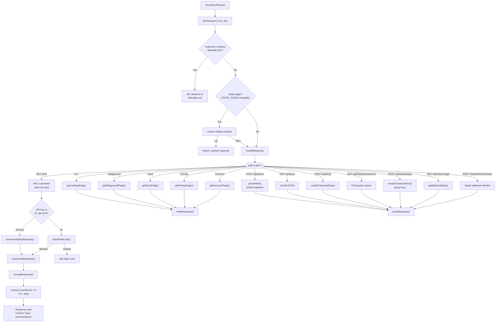
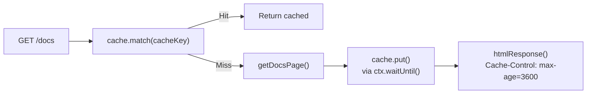
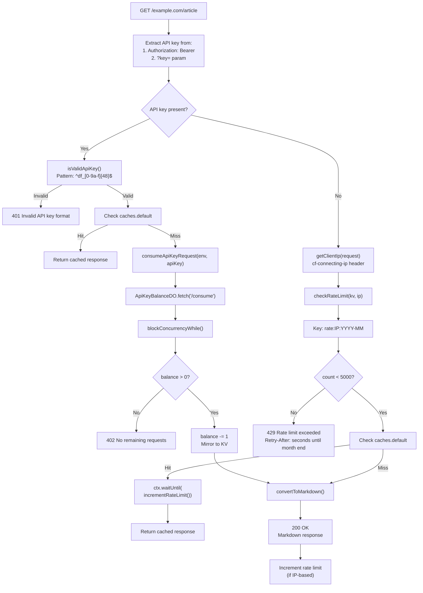
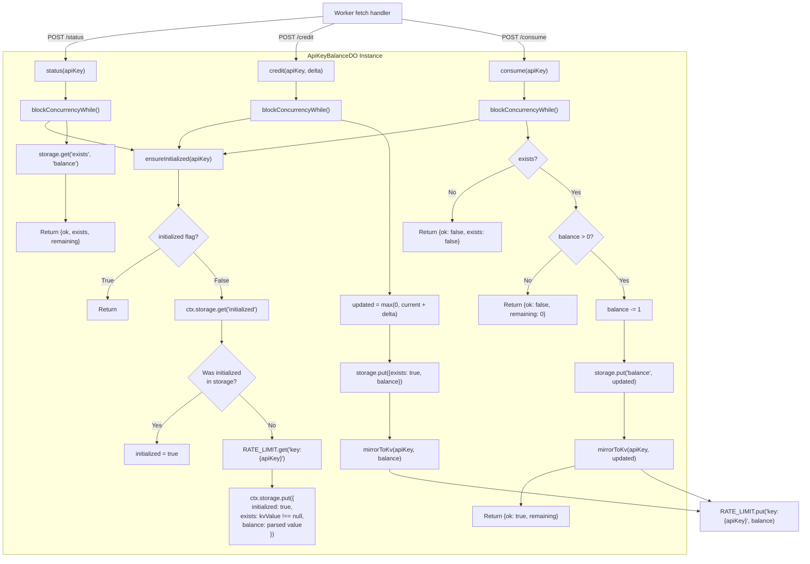
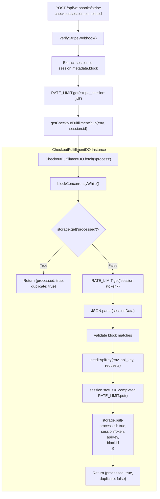

# Cloudflare Worker Architecture

<details>
<summary>관련 소스 파일</summary>

다음 파일들이 이 위키 페이지를 생성하기 위한 컨텍스트로 사용되었습니다:

- [.gitignore](.gitignore)
- [website/src/index.ts](website/src/index.ts)
- [website/wrangler.toml](website/wrangler.toml)

</details>


이 문서는 Cloudflare Workers에 배포된 Defuddle web service의 아키텍처를 설명합니다. Worker의 request routing, caching strategy, authentication mechanism, API key management를 위한 Durable Objects, Stripe payment integration을 다룹니다.

특정 API endpoint와 request/response 형식에 대한 정보는 [API Endpoints](#8.2)를 참조하세요. Static website page와 playground interface에 대한 자세한 내용은 [Website and Playground](#8.3)를 참조하세요. 전체 API key purchase 및 credit management flow는 [API Key Management](#8.4)를 참조하세요.

## Worker 진입점과 환경

Cloudflare Worker는 [website/src/index.ts]()에 정의되어 있으며, 모든 incoming request를 처리하는 단일 `fetch` handler를 가집니다. Worker environment(`Env` type)는 세 가지 핵심 Cloudflare resource를 binding합니다:

| Binding | Type | 목적 |
|---------|------|---------|
| `RATE_LIMIT` | KV Namespace | IP 기반 rate limit, session record, API key balance mirror 저장 |
| `API_KEY_BALANCES` | Durable Object Namespace | 각 API key의 atomic credit operation 관리 |
| `CHECKOUT_FULFILLMENTS` | Durable Object Namespace | 각 checkout session의 idempotent webhook processing 처리 |
| `STRIPE_SECRET_KEY` | Environment Variable | Stripe API authentication |
| `STRIPE_WEBHOOK_SECRET` | Environment Variable | Webhook signature verification |

Binding은 [website/wrangler.toml:6-14]()에 설정되어 있습니다.

**출처:** [website/src/index.ts:25-31](), [website/wrangler.toml:6-14]()

## Request Routing Architecture



**출처:** [website/src/index.ts:54-89](), [website/src/index.ts:332-636]()

Worker는 3단계 routing strategy를 사용합니다:

1. **Domain redirect** [website/src/index.ts:62-66](): `defuddle.dev`를 `defuddle.md`로 redirect
2. **Static page caching** [website/src/index.ts:69-82](): handler를 호출하기 전에 `STATIC_PAGES` set에 포함된 page의 edge cache 확인
3. **Dynamic routing** [website/src/index.ts:332-636](): static page, API endpoint 또는 URL conversion catch-all로 route

`STATIC_PAGES` constant [website/src/index.ts:15]()는 5분 TTL [website/src/index.ts:16]()로 edge caching 대상이 되는 path를 정의합니다.

## Caching Strategy

Worker는 static content와 dynamic conversion 모두에 최적화된 2계층 caching system을 구현합니다:

### Static Page Caching

Static page는 `caches.default`를 사용해 Cloudflare edge에 cache됩니다:



**출처:** [website/src/index.ts:69-82](), [website/src/index.ts:102-109]()

Caching logic [website/src/index.ts:69-82]()은 `useCache`가 true(production, localhost 아님)이고 request method가 GET일 때만 적용됩니다. `ctx.waitUntil()` pattern은 cache storage가 response를 block하지 않고 비동기적으로 수행되도록 보장합니다.

### URL Conversion Caching

URL conversion은 같은 edge cache를 사용하지만, cached response에 대해 API credit이 소비되지 않도록 하는 추가 로직이 있습니다:

| Request Type | Cache Check Timing | Credit Consumption |
|--------------|-------------------|-------------------|
| API key | `consumeApiKeyRequest()` 이전 [website/src/index.ts:564-567]() | cache miss에서만 |
| IP rate limit | `checkRateLimit()` 이후 [website/src/index.ts:596-604]() | rate limit check 이후 |

Response는 `wordCount > 0` [website/src/index.ts:622]()인 경우에만 cache되어 extraction failure가 cache되는 것을 방지합니다. Cache TTL은 300초 [website/src/index.ts:16]()이며, `Cache-Control: s-maxage=300` [website/src/index.ts:616]()으로 설정됩니다.

**출처:** [website/src/index.ts:544-624]()

## Authentication and Rate Limiting



**출처:** [website/src/index.ts:548-629](), [website/src/index.ts:161-177](), [website/src/index.ts:145-157]()

### API Key Format

API key는 `df_[0-9a-f]{48}` pattern [website/src/index.ts:161]()을 따르며, 24 random byte [website/src/index.ts:163-167]()에서 생성됩니다. `isValidApiKey()` 함수 [website/src/index.ts:175-177]()는 처리 전에 이 pattern을 검증합니다.

### Rate Limit Implementation

IP 기반 rate limiting은 `rate:{ip}:{YYYY-MM}` [website/src/index.ts:133-137]() 형식의 key를 가진 monthly window를 사용합니다. Limit은 월 5000 requests [website/src/index.ts:17]()입니다. KV entry는 `secondsUntilMonthEnd()` [website/src/index.ts:139-143]()를 사용해 월말에 자동 만료됩니다.

`getBearerApiKey()` helper [website/src/index.ts:222-234]()는 Authorization header에서 API key를 추출하고 검증하며, caller가 validation failure를 반드시 처리하도록 하는 discriminated union type(`ApiKeyAuthResult`)을 반환합니다.

**출처:** [website/src/index.ts:133-157](), [website/src/index.ts:222-234]()

## Durable Objects Architecture

Worker는 atomic state management와 idempotent processing을 제공하기 위해 두 개의 Durable Object class를 사용합니다:

### ApiKeyBalanceDO: Credit Management



**출처:** [website/src/index.ts:638-763]()

각 API key는 key 자체로 식별되는 고유한 `ApiKeyBalanceDO` instance를 가집니다 [website/src/index.ts:188-190](). 이 instance는 `fetch()` handler [website/src/index.ts:744-762]()를 통해 세 가지 operation을 제공합니다:

| Endpoint | Method | 목적 |
|----------|--------|---------|
| `/status` | POST | 수정 없이 현재 balance 읽기 |
| `/credit` | POST | credit 추가(`delta` parameter 수락) |
| `/consume` | POST | balance를 atomic하게 1 감소 |

**Lazy Initialization Pattern:** DO는 2단계 initialization [website/src/index.ts:648-673]()을 사용합니다:
1. in-memory `initialized` flag 확인
2. durable storage의 `initialized` key 확인
3. 둘 다 없으면 KV namespace에서 기존 balance load
4. 모든 값을 durable storage에 저장

이 pattern은 기존 API key(DO가 도입되기 전에 KV에만 저장된 key)를 원활하게 migrate할 수 있게 합니다.

**Concurrency Control:** 모든 mutating operation은 atomic update를 보장하기 위해 `blockConcurrencyWhile()` [website/src/index.ts:681-742]()를 사용합니다. 이는 여러 request가 동시에 credit을 소비하려 할 때 race condition을 방지합니다.

**KV Mirroring:** `mirrorToKv()` 함수 [website/src/index.ts:675-678]()는 balance update를 KV에 다시 기록하여, DO에 접근하지 않고 빠른 balance lookup이 가능하게 합니다.

### CheckoutFulfillmentDO: Idempotent Webhook Processing



**출처:** [website/src/index.ts:765-822](), [website/src/index.ts:470-509]()

각 Stripe checkout session은 Stripe session ID [website/src/index.ts:192-194]()로 식별되는 고유한 `CheckoutFulfillmentDO` instance를 가집니다. 이 instance는 단일 operation을 처리합니다:

- **POST /process:** 완료된 checkout session을 처리하고 API key에 정확히 한 번 credit을 부여

**Idempotency Guarantee:** DO는 processing 시작 시 `storage.get('processed')` [website/src/index.ts:787-790]()를 확인합니다. 이미 처리되었다면 즉시 반환하여 Stripe가 보낼 수 있는 duplicate webhook이 account에 이중 credit을 부여하지 않도록 보장합니다.

**Session Flow:**
1. Webhook이 Stripe session ID와 함께 도착
2. Worker가 `stripe_session:{id}` KV key [website/src/index.ts:494]()에서 session token 조회
3. Worker가 DO의 `/process` endpoint [website/src/index.ts:496-500]() 호출
4. DO가 `session:{token}` KV key [website/src/index.ts:792]()에서 전체 session record load
5. DO가 `creditApiKey()` [website/src/index.ts:806]()를 통해 API key에 credit 부여
6. DO가 session을 completed로 mark [website/src/index.ts:808-811]()
7. DO가 `processed: true` flag [website/src/index.ts:812-817]() 저장

## Stripe Integration Flow

```mermaid
sequenceDiagram
    participant Client
    participant Worker
    participant Stripe
    participant KV as RATE_LIMIT KV
    participant CFDO as CheckoutFulfillmentDO
    participant AKDO as ApiKeyBalanceDO
    
    Note over Client,Worker: Purchase Flow
    Client->>Worker: POST /api/keys {block: "1000"}
    Worker->>Worker: generateApiKey()<br/>df_[48 hex chars]
    Worker->>Worker: generateSessionToken()<br/>[64 hex chars]
    Worker->>Worker: hashForMetadata(apiKey)<br/>SHA-256 truncated to 16
    Worker->>Stripe: checkout.sessions.create({<br/>metadata: {key_hash, block},<br/>success_url: /success?session={token}<br/>})
    Stripe-->>Worker: {id: sess_xxx, url: checkout_url}
    Worker->>KV: put("session:{token}", {<br/>status: "pending",<br/>api_key,<br/>stripe_session_id<br/>})
    Worker->>KV: put("stripe_session:{sess_xxx}", token)
    Worker-->>Client: {checkout_url, session_id}
    
    Client->>Stripe: Visit checkout_url
    Stripe->>Client: Payment form
    Client->>Stripe: Submit payment
    Stripe->>Client: Redirect to /success?session={token}
    
    Note over Stripe,AKDO: Webhook Flow
    Stripe->>Worker: POST /api/webhooks/stripe<br/>checkout.session.completed
    Worker->>Worker: verifyStripeWebhook()<br/>HMAC-SHA256 signature
    Worker->>KV: get("stripe_session:{sess_xxx}")
    KV-->>Worker: session token
    Worker->>CFDO: POST /process {sessionToken, blockId}
    CFDO->>CFDO: blockConcurrencyWhile()
    CFDO->>CFDO: Check storage.get("processed")
    CFDO->>KV: get("session:{token}")
    KV-->>CFDO: {api_key, block, ...}
    CFDO->>AKDO: POST /credit {apiKey, delta: 1000}
    AKDO->>AKDO: blockConcurrencyWhile()
    AKDO->>AKDO: balance += 1000
    AKDO->>KV: put("key:{apiKey}", balance)
    AKDO-->>CFDO: {ok: true, remaining: 1000}
    CFDO->>KV: put("session:{token}", {status: "completed"})
    CFDO->>CFDO: storage.put({processed: true})
    CFDO-->>Worker: {processed: true}
    Worker-->>Stripe: {received: true}
    
    Note over Client,AKDO: Polling Flow
    Client->>Worker: GET /api/keys/sessions/{token}
    Worker->>KV: get("session:{token}")
    KV-->>Worker: {status: "completed", api_key}
    Worker->>AKDO: POST /status {apiKey}
    AKDO-->>Worker: {remaining: 1000}
    Worker-->>Client: {status: "completed",<br/>api_key,<br/>remaining: 1000}
```



**출처:** [website/src/index.ts:280-328](), [website/src/index.ts:470-509](), [website/src/index.ts:404-412](), [website/src/index.ts:414-436]()

### 주요 보안 조치

1. **API Key Hashing:** API key는 Stripe로 전송되지 않습니다. 대신 truncated SHA-256 hash가 checkout session metadata [website/src/index.ts:179-182](), [website/src/index.ts:293]()에 저장됩니다

2. **Session Token Indirection:** Success URL은 API key가 아닌 randomly generated session token [website/src/index.ts:169-173]()을 사용하여 browser URL에 key가 노출되는 것을 방지합니다

3. **Webhook Signature Verification:** `verifyStripeWebhook()` 함수 [website/src/index.ts:247-278]()는 5분 tolerance window [website/src/index.ts:263-264]()가 포함된 Stripe의 HMAC-SHA256 signature validation을 구현합니다

4. **Constant-Time Comparison:** Signature validation은 timing attack을 방지하기 위해 `constantTimeEquals()` [website/src/index.ts:236-243]()를 사용합니다

### Purchase Blocks

세 가지 predefined purchase block이 `BLOCKS` constant [website/src/index.ts:19-23]()에 정의되어 있습니다:

| Block ID | Requests | Price (USD) | Stripe unit_amount |
|----------|----------|-------------|-------------------|
| `1000` | 1,000 | $5.00 | 500 cents |
| `10000` | 10,000 | $40.00 | 4000 cents |
| `100000` | 100,000 | $300.00 | 30000 cents |

동일한 `createCheckoutFlow()` 함수 [website/src/index.ts:280-328]()가 새 key purchase와 top-up을 모두 처리하며, `isTopup` parameter가 metadata flag [website/src/index.ts:307]()를 설정해 둘을 구분합니다.

## Environment Configuration

Worker의 deployment configuration은 `wrangler.toml`에 다음과 같이 정의됩니다:

```toml
name = "defuddle"
main = "src/index.ts"
compatibility_date = "2024-12-30"
compatibility_flags = ["nodejs_compat"]

[[kv_namespaces]]
binding = "RATE_LIMIT"
id = "335cf626a6db4759b12bc6855634f3ce"

[durable_objects]
bindings = [
	{ name = "API_KEY_BALANCES", class_name = "ApiKeyBalanceDO" },
	{ name = "CHECKOUT_FULFILLMENTS", class_name = "CheckoutFulfillmentDO" }
]
```

**출처:** [website/wrangler.toml:1-14]()

`nodejs_compat` flag [website/wrangler.toml:4]()는 signature verification에 사용되는 `crypto.subtle` 같은 Node.js API를 활성화합니다. Migration tag [website/wrangler.toml:16-18]()는 Durable Object를 SQLite-backed(Cloudflare의 DO storage 내부 용어)로 선언합니다.

민감한 environment variable(`STRIPE_SECRET_KEY`, `STRIPE_WEBHOOK_SECRET`)은 Cloudflare dashboard 또는 `.dev.vars` file(gitignored)을 통해 설정되며 `Env` type [website/src/index.ts:27-28]()을 통해 접근됩니다.
