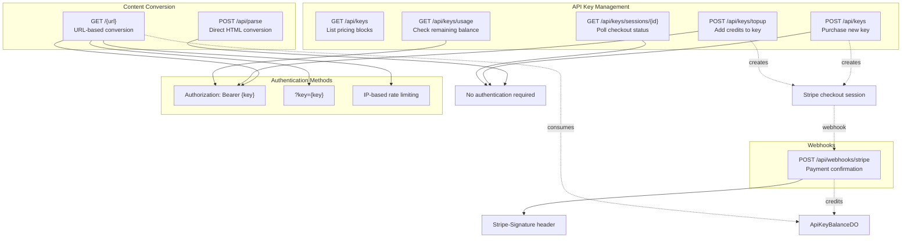
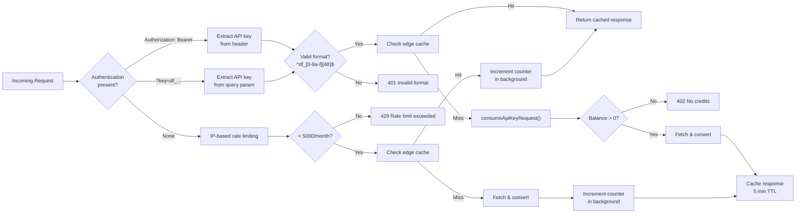
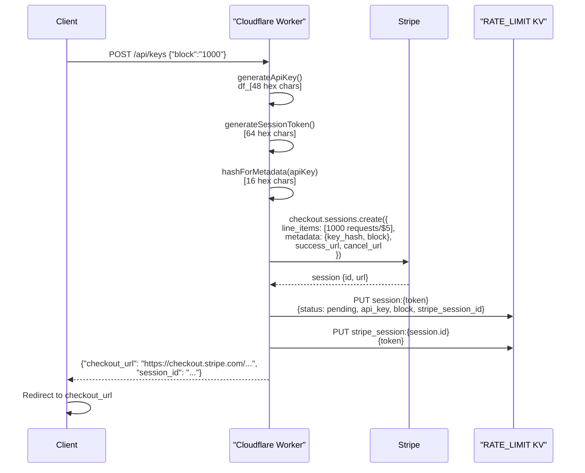
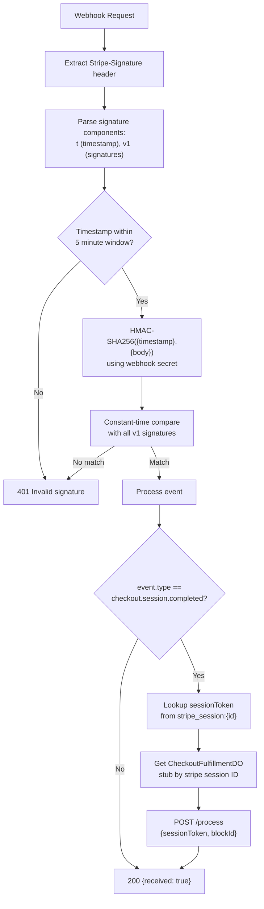
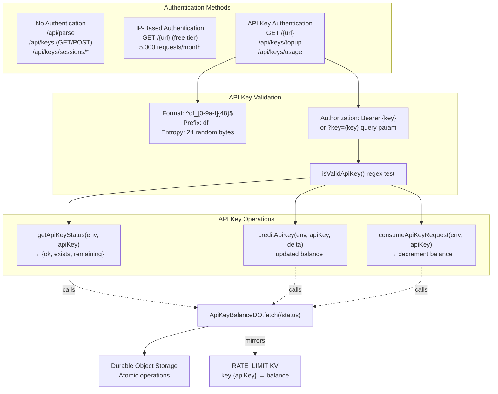
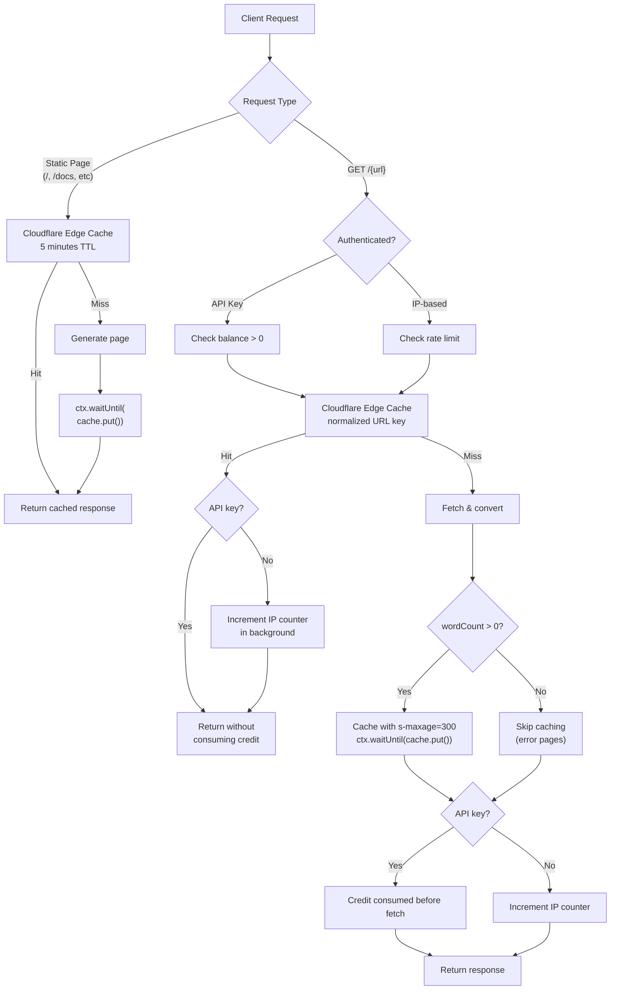
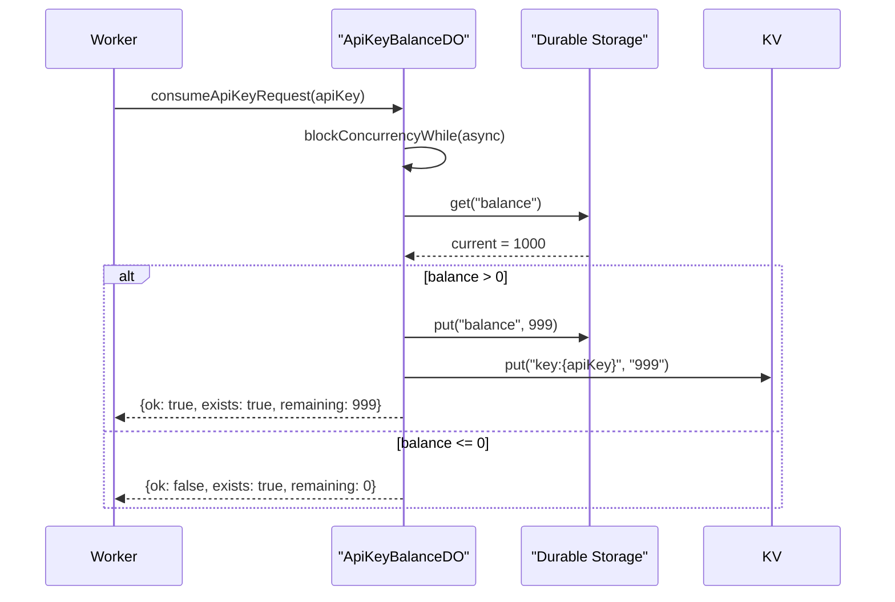

# API Endpoints

<details>
<summary>관련 소스 파일</summary>

다음 파일들이 이 위키 페이지를 생성하기 위한 컨텍스트로 사용되었습니다:

- [.gitignore](.gitignore)
- [website/src/index.ts](website/src/index.ts)
- [website/wrangler.toml](website/wrangler.toml)

</details>


이 문서는 Defuddle web service가 노출하는 모든 API endpoint에 대한 포괄적인 문서를 제공합니다. 이러한 endpoint는 Cloudflare Worker에 구현되어 있으며 content conversion, API key management, payment processing 기능을 제공합니다.

전체 web service architecture와 deployment에 대한 정보는 [Cloudflare Worker Architecture](#8.1)를 참조하세요. API key lifecycle과 Durable Objects 구현에 대한 자세한 내용은 [API Key Management](#8.4)를 참조하세요. Static website와 playground interface에 대한 정보는 [Website and Playground](#8.3)를 참조하세요.

---

## Endpoint 개요

Defuddle API는 content conversion, API key management, webhook이라는 세 가지 범주의 endpoint를 제공합니다. 모든 endpoint는 cross-origin request를 위해 CORS를 지원합니다.



**출처:** [website/src/index.ts:54-636]()

---

## Content Conversion Endpoints

### POST /api/parse

URL에서 fetch하지 않고 HTML content를 직접 markdown으로 변환합니다. 이 endpoint는 authentication이 필요 없으며 rate limit에 포함되지 않습니다.

**Request Format:**

```json
{
  "html": "<html>...</html>",
  "url": "https://example.com" // optional, used for base URL resolution
}
```

**Response Format:**

```json
{
  "content": "# Extracted Content\n\n...",
  "title": "Page Title",
  "description": "Meta description",
  "author": "Author Name",
  "wordCount": 1234,
  "parseTime": 45.6,
  "metadata": { /* additional metadata */ }
}
```

**구현 세부 사항:**

이 endpoint는 `html` field(필수)와 선택적 `url` field가 있는 JSON을 받습니다. [website/src/convert.ts]()의 `parseHtml()`을 호출하고 구조화된 `DefuddleResponse` object를 반환합니다.

| Property | Type | 설명 |
|----------|------|-------------|
| `html` | string | 필수. Parse할 HTML content |
| `url` | string | 선택. Relative link resolution을 위한 base URL |

**Error Responses:**

- `400 Bad Request`: `html` field 누락
- `500 Internal Server Error`: Parsing failure

**출처:** [website/src/index.ts:366-379]()

---

### GET /{url}

URL에서 content를 fetch하고 markdown으로 변환합니다. 이는 free(IP-rate-limited) access와 authenticated(API key) access를 모두 지원하는 주요 content conversion endpoint입니다.

**URL Format:**

```
GET /https://example.com/article
GET /example.com/article  # https:// is prepended automatically
```

**Authentication Methods:**



**Rate Limiting:**

시스템은 두 가지 별개의 rate limiting 전략을 구현합니다:

**IP-Based(Unauthenticated):**
- Limit: IP address당 calendar month 기준 5,000 requests
- Storage: `rate:{ip}:{YYYY-MM}` key format을 사용하는 KV namespace
- Counter는 successful response 이후 증가
- Cache hit도 rate limit에 포함
- Reset: 다음 달 첫날

**API Key-Based(Authenticated):**
- Limit: 구매한 credit balance
- Storage: API key별 Durable Object(atomic operation)
- Request 전에 credit 소비(fail-fast)
- Cache hit는 credit을 소비하지 않음
- 자동 reset 없음. Top-up purchase 필요

**구현 세부 사항:**

이 endpoint는 다음 처리 흐름을 따릅니다:

1. Path에서 target URL parse 및 validate [website/src/index.ts:519-536]()
2. `defuddle.md`, `defuddle.dev`, `localhost`에 대한 self-referential request 차단 [website/src/index.ts:539-541]()
3. Authentication 추출(Bearer header 또는 `?key=` query param) [website/src/index.ts:549-556]()
4. API key의 경우: format validate, cache 확인, credit atomic consume [website/src/index.ts:558-576]()
5. IP 기반의 경우: rate limit 확인, cache 확인, counter 증가 [website/src/index.ts:578-604]()
6. `convertToMarkdown()`을 사용해 content fetch 및 convert [website/src/index.ts:608]()
7. Metadata header가 포함된 markdown으로 format [website/src/index.ts:609]()
8. `wordCount > 0`이면 response를 5분 동안 cache [website/src/index.ts:615-624]()

**Response Format:**

```
---
title: Article Title
author: John Doe
url: https://example.com/article
---

# Article Title

Converted markdown content...
```

**Error Responses:**

| Code | Condition | Message |
|------|-----------|---------|
| `400` | Invalid URL format | Invalid URL. Please provide a valid web address. |
| `400` | Blocked host | Cannot convert this URL. |
| `401` | Invalid API key format | Invalid API key format. |
| `404` | API key not found | API key not found. |
| `402` | No remaining credits | API key has no remaining requests. Purchase more... |
| `429` | IP rate limit exceeded | Monthly rate limit exceeded (5,000 requests/month)... |
| `502` | Fetch or conversion failure | Exception의 error message |

**Caching Behavior:**

Response는 Cloudflare edge에서 `s-maxage=300`(5분)으로 cache됩니다. Cache key는 normalized target URL입니다. Error page를 cache하지 않도록 `wordCount > 0`인 response만 cache됩니다.

**출처:** [website/src/index.ts:511-636](), [website/src/index.ts:131-157](), [website/src/index.ts:222-234]()

---

## API Key Management Endpoints

### GET /api/keys

API key purchase에 사용할 수 있는 pricing block을 나열합니다. 이 endpoint는 pricing information과 usage instruction을 제공합니다.

**Response Format:**

```json
{
  "blocks": [
    { "id": "1000", "requests": 1000, "price": "$5.00" },
    { "id": "10000", "requests": 10000, "price": "$40.00" },
    { "id": "100000", "requests": 100000, "price": "$300.00" }
  ],
  "usage": "POST /api/keys with {\"block\":\"1000\"} to purchase."
}
```

**출처:** [website/src/index.ts:391-401](), [website/src/index.ts:19-23]()

---

### POST /api/keys

지정된 credit block으로 새 API key를 구매하기 위한 Stripe checkout session을 생성합니다.

**Request Format:**

```json
{
  "block": "1000"  // Optional, defaults to "1000"
}
```

**Processing Flow:**



**Response Format:**

```json
{
  "checkout_url": "https://checkout.stripe.com/c/pay/cs_...",
  "session_id": "a1b2c3d4..."
}
```

**Session Management:**

이 endpoint는 24시간 expiration이 있는 두 개의 KV record를 생성합니다:

1. `session:{sessionToken}` → `SessionRecord`(status, api_key, block, stripe_session_id)
2. `stripe_session:{stripeSessionId}` → `sessionToken`(reverse lookup)

이 dual mapping은 client polling과 webhook processing을 모두 가능하게 합니다.

**출처:** [website/src/index.ts:404-412](), [website/src/index.ts:280-328](), [website/src/index.ts:163-173]()

---

### GET /api/keys/sessions/{id}

Client가 payment를 완료하거나 취소한 후 checkout session status를 polling합니다. Payment가 confirm되면 API key를 가져오는 데 사용됩니다.

**Response Format (Pending):**

```json
{
  "status": "pending"
}
```

HTTP Status: `202 Accepted`

**Response Format (Completed):**

```json
{
  "status": "completed",
  "api_key": "df_a1b2c3d4...",
  "remaining": 1000
}
```

HTTP Status: `200 OK`

**Error Response:**

```json
{
  "error": "Session not found."
}
```

HTTP Status: `404 Not Found`

**구현 세부 사항:**

이 endpoint는 session token을 사용해 KV에서 `SessionRecord`를 읽습니다. Status가 `pending`이면 202를 반환합니다. Status가 `completed`이면 `ApiKeyBalanceDO`를 query해 current balance를 가져오고 API key를 반환합니다.

**출처:** [website/src/index.ts:415-436](), [website/src/index.ts:33-38]()

---

### POST /api/keys/topup

Stripe checkout session을 생성해 기존 API key에 credit을 추가합니다. Bearer token authentication이 필요합니다.

**Authentication:**

```
Authorization: Bearer df_a1b2c3d4...
```

**Request Format:**

```json
{
  "block": "10000"  // Optional, defaults to "1000"
}
```

**Response Format:**

POST /api/keys와 동일합니다(checkout session detail).

**Error Responses:**

- `401 Unauthorized`: Bearer token 누락 또는 invalid
- `404 Not Found`: API key가 존재하지 않음

**구현 세부 사항:**

이 endpoint는 checkout session을 생성하기 전에 `getApiKeyStatus()`를 호출해 API key가 존재하는지 validate합니다. Checkout metadata에는 initial purchase와 구분하기 위해 `topup: 'true'`가 포함됩니다.

**출처:** [website/src/index.ts:439-454](), [website/src/index.ts:222-234]()

---

### GET /api/keys/usage

API key의 remaining request balance를 반환합니다. Bearer token authentication이 필요합니다.

**Authentication:**

```
Authorization: Bearer df_a1b2c3d4...
```

**Response Format:**

```json
{
  "remaining": 8453
}
```

**Error Responses:**

- `401 Unauthorized`: Bearer token 누락 또는 invalid
- `404 Not Found`: API key가 존재하지 않음

**구현 세부 사항:**

이 endpoint는 `ApiKeyBalanceDO` Durable Object에서 fetch하는 `getApiKeyStatus()`를 호출합니다. DO는 fast read를 위한 KV mirroring과 함께 durable storage에 authoritative balance를 유지합니다.

**출처:** [website/src/index.ts:457-468](), [website/src/index.ts:210-212](), [website/src/index.ts:638-763]()

---

## Webhook Endpoints

### POST /api/webhooks/stripe

완료된 checkout session을 처리하기 위해 Stripe webhook event를 받습니다. 이 endpoint는 webhook signature를 verify하고 credit allocation을 trigger합니다.

**Webhook Verification:**



**구현 세부 사항:**

Webhook handler는 다음 보안 및 idempotency 조치를 구현합니다:

1. **Signature Verification** [website/src/index.ts:247-278]()
   - `Stripe-Signature` header에서 timestamp와 v1 signature parse
   - 5분 tolerance window 밖의 request reject
   - Webhook secret을 사용해 HMAC-SHA256 계산
   - Timing attack을 방지하기 위해 constant-time comparison 사용

2. **Event Processing** [website/src/index.ts:489-506]()
   - `checkout.session.completed` event만 filter
   - `stripe_session:{stripeSessionId}` KV record에서 session token 조회
   - Stripe metadata의 block ID validate

3. **Idempotent Fulfillment** [website/src/index.ts:765-822]()
   - Stripe session별 `CheckoutFulfillmentDO`에 위임
   - Durable Object가 exactly-once credit allocation 보장
   - 이미 처리된 경우에도 success 반환(idempotency)

**Response Format:**

```json
{
  "received": true
}
```

**Error Responses:**

- `400 Bad Request`: Stripe signature 누락
- `401 Unauthorized`: Invalid signature 또는 timestamp
- `500 Internal Server Error`: Fulfillment processing failure

**출처:** [website/src/index.ts:471-509](), [website/src/index.ts:247-278](), [website/src/index.ts:765-822]()

---

## Authentication Mechanisms

API는 authorization level이 서로 다른 세 가지 authentication method를 지원합니다:



**API Key Format:**

- Pattern: `^df_[0-9a-f]{48}$`
- Generation: `df_` + 24 random bytes encoded as 48 hex characters
- Example: `df_a1b2c3d4e5f6...`(prefix 뒤 48 hex digit)

**API Key Lifecycle:**

1. **Generation**: `generateApiKey()`가 cryptographically random key 생성 [website/src/index.ts:163-167]()
2. **Validation**: `isValidApiKey()`가 format 확인 [website/src/index.ts:175-177]()
3. **Storage**: KV mirroring이 포함된 key별 Durable Object
4. **Operations**: 모든 balance mutation은 Durable Object를 통해 atomic하게 수행

**출처:** [website/src/index.ts:161-177](), [website/src/index.ts:196-220](), [website/src/index.ts:638-763]()

---

## Response Formats and Error Codes

모든 API response는 cross-origin access를 위한 CORS header와 함께 JSON format을 사용합니다.

**Standard Response Headers:**

```
Content-Type: application/json; charset=utf-8
Access-Control-Allow-Origin: *
```

**Error Response Format:**

```json
{
  "error": "Descriptive error message"
}
```

**HTTP Status Code Reference:**

| Code | Meaning | Usage |
|------|---------|-------|
| `200` | Success | Successful operation |
| `202` | Accepted | Checkout session pending |
| `204` | No Content | Favicon request |
| `301` | Moved Permanently | Domain redirect (defuddle.dev → defuddle.md) |
| `400` | Bad Request | Invalid input, missing fields, blocked URL |
| `401` | Unauthorized | Invalid API key, missing auth, invalid webhook signature |
| `402` | Payment Required | API key에 남은 credit 없음 |
| `404` | Not Found | API key not found, session not found, unknown route |
| `429` | Too Many Requests | IP rate limit exceeded |
| `500` | Internal Server Error | Parsing error, unexpected exception |
| `502` | Bad Gateway | Target URL fetch 실패 |
| `503` | Service Unavailable | Required service not configured |

**CORS Preflight Handling:**

```
OPTIONS * → 200 OK
Access-Control-Allow-Origin: *
Access-Control-Allow-Methods: GET, POST, OPTIONS
Access-Control-Allow-Headers: Content-Type, Authorization
```

**출처:** [website/src/index.ts:102-129](), [website/src/index.ts:338-346]()

---

## Caching Strategy

API는 redundant processing과 API cost를 최소화하기 위해 multi-layer caching strategy를 구현합니다:



**Cache Key Construction:**

- **Static Pages**: Original request URL(`https://defuddle.md/docs`)
- **URL Conversion**: Normalized target URL(`https://example.com/article`)

**Cache Invalidation:**

- TTL-based: Static page는 5분, converted content는 5분
- Manual invalidation 없음(content가 5분 안에 갱신되는 경우가 드묾)

**Critical Cache Ordering:**

Authenticated request의 경우 cached hit에 과금하지 않기 위해 API key credit을 소비하기 **전에** cache를 확인합니다 [website/src/index.ts:564-567](). IP-based request의 경우 cache hit도 rate limit counter를 증가시킵니다 [website/src/index.ts:596-603]().

**Background Operations:**

Cache update와 rate limit increment는 response를 block하지 않기 위해 `ctx.waitUntil()`을 사용합니다:

```typescript
ctx.waitUntil(cache.put(cacheKey, response.clone()));
ctx.waitUntil(incrementRateLimit(env.RATE_LIMIT, ip));
```

**출처:** [website/src/index.ts:69-82](), [website/src/index.ts:564-567](), [website/src/index.ts:596-604](), [website/src/index.ts:615-624]()

---

## Rate Limiting Implementation

시스템은 authentication method에 따라 두 가지 별개의 rate limiting mechanism을 구현합니다.

### IP-Based Rate Limiting

**Configuration:**

- Limit: calendar month당 5,000 requests
- Storage: `rate:{ip}:{YYYY-MM}` key pattern을 사용하는 KV namespace
- Scope: `cf-connecting-ip` 또는 `x-forwarded-for` header에서 추출한 IP address별

**Implementation Functions:**

| Function | Purpose | Returns |
|----------|---------|---------|
| `getRateLimitKey(ip)` | Monthly key 구성 | `"rate:1.2.3.4:2024-01"` |
| `secondsUntilMonthEnd()` | TTL 계산 | 다음 달까지 남은 초 |
| `checkRateLimit(kv, ip)` | 현재 count 확인 | `{allowed: boolean, count: number}` |
| `incrementRateLimit(kv, ip)` | Counter 증가 | `void` |

**Monthly Reset:**

KV record는 current calendar month(UTC) 말까지 남은 초로 설정된 expiration TTL을 가집니다. 월이 끝나면 key가 만료되고 count가 0으로 reset됩니다.

**출처:** [website/src/index.ts:98-100](), [website/src/index.ts:133-157]()

### API Key Rate Limiting

**Configuration:**

- Limit: 구매한 credit balance(1,000 / 10,000 / 100,000 requests)
- Storage: Atomic operation이 포함된 API key별 Durable Object
- Mirroring: Fast read를 위한 KV namespace `key:{apiKey}`

**Atomic Operations:**

모든 balance mutation은 atomicity를 보장하기 위해 `ctx.blockConcurrencyWhile()`을 사용합니다:



**Durable Object Benefits:**

1. **Atomicity**: DO 내부의 single-threaded execution이 race-free decrement를 보장
2. **Consistency**: Storage operation은 transactional
3. **Availability**: Per-key isolation이 contention 방지
4. **Durability**: Automatic replication 및 persistence

**출처:** [website/src/index.ts:638-763](), [website/src/index.ts:713-742]()
