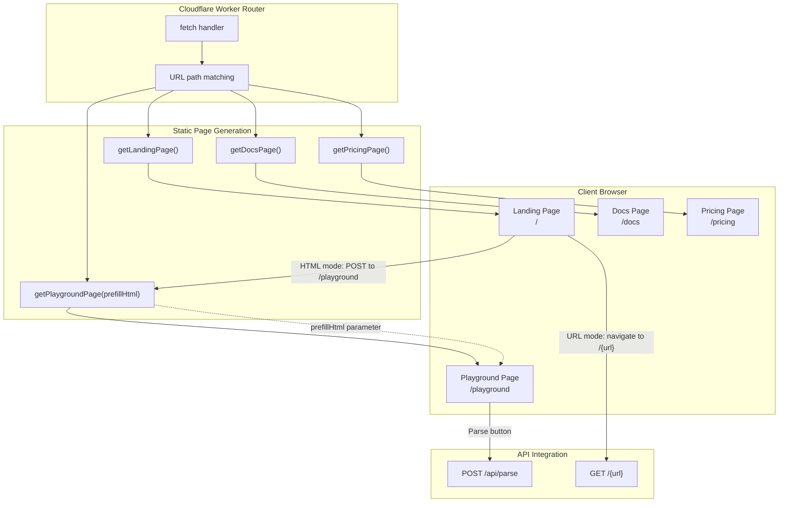
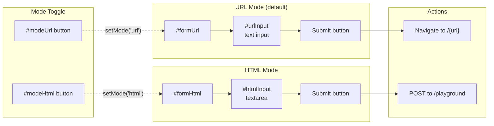
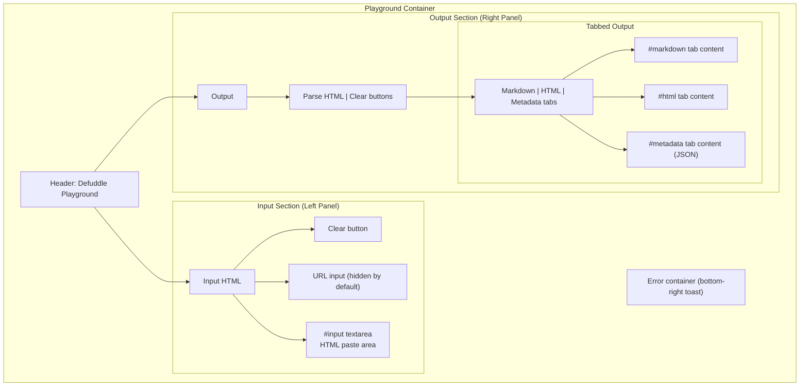
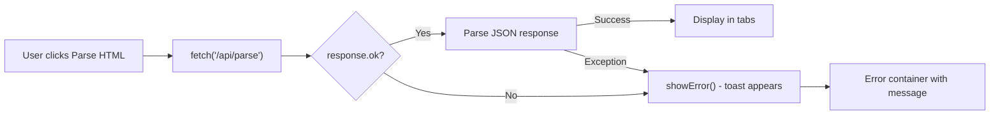
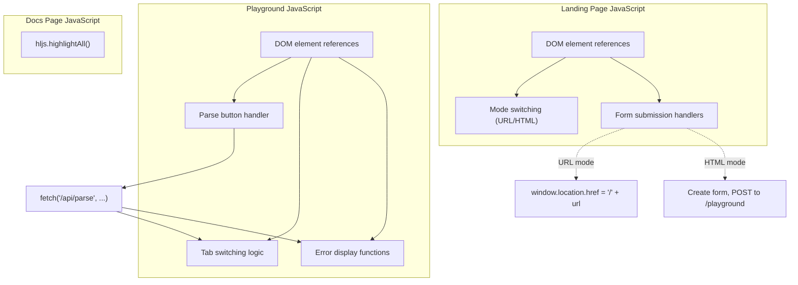

# Website and Playground

<details>
<summary>관련 소스 파일</summary>

다음 파일들이 이 위키 페이지를 생성하기 위한 컨텍스트로 사용되었습니다:

- [tests/debug.test.ts](tests/debug.test.ts)
- [website/src/docs.ts](website/src/docs.ts)
- [website/src/landing.ts](website/src/landing.ts)
- [website/src/playground.ts](website/src/playground.ts)

</details>


이 페이지는 landing page, documentation, interactive playground를 포함해 Cloudflare Worker가 제공하는 static website page를 문서화합니다. 이 page들은 Defuddle의 기능과 문서에 접근하기 위한 web interface를 제공합니다. 이 page들이 상호작용하는 API endpoint에 대한 정보는 [API Endpoints](#8.2)를 참조하세요. 전체 worker architecture와 routing에 대한 정보는 [Cloudflare Worker Architecture](#8.1)를 참조하세요.

## 개요

Defuddle web service에는 TypeScript function에서 complete HTML string으로 생성되는 네 가지 주요 static page가 포함됩니다:

| Page | Route | Function | 목적 |
|------|-------|----------|---------|
| Landing | `/` | `getLandingPage()` | URL/HTML conversion form이 있는 main entry point |
| Documentation | `/docs` | `getDocsPage()` | 완전한 API 및 usage documentation |
| Playground | `/playground` | `getPlaygroundPage()` | Interactive HTML-to-Markdown testing interface |
| Pricing | `/pricing` | `getPricingPage()` | API pricing 및 payment information |

각 page는 embedded CSS와 JavaScript가 포함된 self-contained HTML document이며, documentation page의 highlight.js를 제외하면 external dependency가 필요 없습니다.

**출처:** [website/src/landing.ts:1-291](), [website/src/docs.ts:1-575](), [website/src/playground.ts:1-400]()

## Page Architecture



**Diagram: Static page generation and routing flow**

각 page generation function은 complete HTML string을 반환합니다. Cloudflare Worker의 fetch handler는 request URL path를 match하고 적절한 function을 호출한 다음, HTML을 `Content-Type: text/html` header와 함께 반환합니다.

**출처:** [website/src/landing.ts:1-2](), [website/src/docs.ts:1-2](), [website/src/playground.ts:1-9]()

## Landing Page

`/`의 landing page는 Defuddle web service의 primary entry point 역할을 합니다. 콘텐츠를 Markdown으로 변환하기 위한 dual-mode interface를 구현합니다.

### Dual-Mode Interface

Landing page는 button으로 toggle되는 두 가지 conversion mode를 제공합니다:



**Diagram: Landing page mode switching and form submission flow**

**URL Mode**(default): 사용자가 URL을 입력하면 protocol(`https://`)을 제거하고 root path에 append합니다. 예를 들어 `https://example.com/article`을 입력하면 `/example.com/article`로 navigate되며, 이는 URL conversion API endpoint를 trigger합니다.

**HTML Mode**: 사용자가 HTML을 textarea에 직접 paste합니다. Submit 시 hidden form이 생성되고 HTML을 `html` field value로 포함해 `/playground`로 POST됩니다. 그런 다음 playground page가 이 HTML을 받아 parsed result를 표시합니다.

**출처:** [website/src/landing.ts:188-209](), [website/src/landing.ts:244-287]()

### Content Sections

Landing page는 conversion interface 아래에 여러 information section을 포함합니다:

| Section | Content | 목적 |
|---------|---------|---------|
| API Usage | `curl defuddle.md/stephango.com` | 간단한 curl API usage 표시 |
| Browser Extension | Link to Obsidian Web Clipper | Browser extension integration 홍보 |
| Bookmarklets | 드래그 가능한 bookmarklet link 두 개 | 임의 page에서 quick conversion 제공 |
| Footer | GitHub, NPM, docs 등으로 가는 link | Navigation 및 external resource |

Bookmarklet은 두 가지 behavior를 구현합니다:
1. **Defuddle**: 현재 page를 Defuddle에서 엽니다(`window.location.href = 'https://defuddle.md/'+location.href`)
2. **Copy as md**: Markdown을 fetch해 clipboard에 copy하고 title에 checkmark를 일시적으로 표시합니다

**출처:** [website/src/landing.ts:213-236]()

### Styling

Landing page는 Flexoki color palette를 사용한 dark theme를 사용합니다:

- Background: `#100F0F`
- Text: `#B7B5AC`
- Headings: `#F2F0E5`
- Accents: `#878580`
- Borders: `#343331`
- Input backgrounds: `#1C1B1A`

Interface는 responsive하며 mobile(`@media (max-width: 480px)`)에서는 submit button의 "Markdown" text를 숨깁니다.

**출처:** [website/src/landing.ts:9-181]()

## Documentation Page

`/docs`의 documentation page는 포괄적인 usage instruction과 API reference를 제공합니다. Code example을 위한 embedded syntax highlighting이 포함된 static HTML page입니다.

### Documentation Structure

Page는 다음 section을 포함합니다:

1. **Installation**: 여러 environment를 위한 npm install command
2. **Browser use**: `new Defuddle(document).parse()` example
3. **Node.js use**: linkedom 및 jsdom example
4. **CLI use**: Command-line option 및 example
5. **Options**: `DefuddleOptions` configuration table
6. **Response**: `DefuddleResponse` property table
7. **Bundles**: core, full, Node.js bundle 비교
8. **HTML standardization**: Element normalization 설명
9. **Debugging**: Debug mode 및 pipeline toggle

**출처:** [website/src/docs.ts:272-561]()

### Syntax Highlighting

Documentation page는 code example의 syntax highlighting에 [highlight.js](https://highlightjs.org/)를 사용합니다. Library는 CDN에서 load되고 page load 시 initialize됩니다:

```javascript
<script src="https://cdnjs.cloudflare.com/ajax/libs/highlight.js/11.11.1/highlight.min.js"></script>
<script>hljs.highlightAll();</script>
```

Syntax highlighting용 custom CSS는 Flexoki color scheme을 사용하며 keyword, string, comment, function 및 기타 language construct에 specific color를 적용합니다.

**출처:** [website/src/docs.ts:571-572](), [website/src/docs.ts:10-73]()

### Table of Contents

Documentation에는 internal anchor link가 있는 two-column table of contents가 포함됩니다:

- Installation
- Browser use
- Node.js use
- CLI use
- Options
- Response
- Bundles
- HTML standardization
- Debugging

TOC는 background box로 style되며 mobile device에서는 single column으로 collapse됩니다.

**출처:** [website/src/docs.ts:228-262](), [website/src/docs.ts:274-286]()

## Playground Interface

`/playground`의 playground는 Defuddle의 HTML parsing 및 conversion capability를 test하기 위한 interactive interface를 제공합니다. 왼쪽 input, 오른쪽 output의 split-panel layout을 특징으로 합니다.

### Interface Layout



**Diagram: Playground interface component hierarchy**

Interface는 two-column layout에 CSS Grid를 사용하며, mobile device(≤768px)에서는 single column으로 collapse됩니다.

**출처:** [website/src/playground.ts:76-82](), [website/src/playground.ts:241-255](), [website/src/playground.ts:264-300]()

### Output Tabs

Playground는 parsing result를 세 개의 tab으로 표시합니다:

| Tab | Content | Source |
|-----|---------|--------|
| Markdown | `result.content` | API의 main Markdown output |
| HTML | `result.contentHtml` | Markdown conversion 전 cleaned HTML |
| Metadata | JSON 형태의 모든 다른 field | content field를 제외한 `result` object |

Tab은 vanilla JavaScript로 `.active` class를 toggle하여 구현됩니다. 각 tab에는 표시/숨김 처리되는 대응 `.tab-content` element가 있습니다.

**출처:** [website/src/playground.ts:284-297](), [website/src/playground.ts:369-383]()

### API Integration

사용자가 "Parse HTML"을 click하면 playground는 `/api/parse`로 POST request를 보냅니다:

```javascript
var response = await fetch('/api/parse', {
    method: 'POST',
    headers: { 'Content-Type': 'application/json' },
    body: JSON.stringify({
        html: input.value,
        url: urlInput.value || undefined
    })
});
```

Response는 다음을 포함하는 JSON으로 예상됩니다:
- `content`: Markdown output
- `contentHtml`: Cleaned HTML
- Additional metadata fields(title, author, description 등)

Playground는 서로 다른 tab에 표시하기 위해 `content`와 `contentHtml`을 다른 metadata와 분리합니다.

**출처:** [website/src/playground.ts:334-357]()

### Landing Page에서 Pre-filling

Playground는 landing page에서 POST로 접근할 때 HTML로 pre-fill될 수 있습니다. `getPlaygroundPage(prefillHtml)` function은 optional parameter를 받습니다:

1. HTML은 textarea value attribute에 안전하게 embed되도록 escape됩니다
2. Special character가 escape됩니다: `&`, `<`, `>`, `"`, `` ` ``, `$`
3. Escaped HTML이 textarea의 text content에 삽입됩니다
4. Load 시 textarea에 content가 있으면 Parse button이 자동으로 click됩니다

이로써 seamless flow가 만들어집니다: 사용자가 landing page에 HTML paste → submit → HTML이 포함된 playground open → auto-parse → result 표시.

**출처:** [website/src/playground.ts:1-8](), [website/src/playground.ts:274](), [website/src/playground.ts:394-396]()

### Error Handling

Playground는 bottom-right corner에 toast notification으로 error handling을 포함합니다:



**Diagram: Playground error handling flow**

Error는 try-catch block에서 catch되어 fixed-position container에 표시되며 toast notification처럼 나타납니다. Error container는 red background(`#AF3029`)를 가지고 `bottom: 1rem; right: 1rem`에 위치합니다.

**출처:** [website/src/playground.ts:329-367](), [website/src/playground.ts:385-392]()

### Responsive Design

Playground는 다양한 screen size에 적응합니다:

- **Desktop**(>768px): Two-column grid layout, scrollable panel이 있는 fixed height
- **Mobile**(≤768px): Single column layout, auto height, scrollable page, section당 minimum 400px height

Layout은 각 section 내부에서 flexbox를 사용해 적절한 scrolling behavior를 보장하며, `min-height: 0`으로 flex child가 content size보다 작게 shrink될 수 있게 합니다.

**출처:** [website/src/playground.ts:241-255]()

## Client-Side JavaScript Architecture

세 main page는 모두 interactivity에 vanilla JavaScript(framework dependency 없음)를 사용합니다. Code는 일관된 pattern을 따릅니다:



**Diagram: Client-side JavaScript organization across pages**

### Variable Naming Convention

모든 JavaScript는 `var` declaration을 사용하고 script block의 상단에 DOM element reference를 저장합니다:

**Landing page:**
- `modeUrl`, `modeHtml`: Mode toggle button
- `formUrl`, `formHtml`: Form element
- `urlInput`, `htmlInput`: Input field

**Playground:**
- `input`: HTML textarea
- `markdownOutput`, `htmlOutput`, `metadataOutput`: Output display element
- `parseBtn`, `clearInputBtn`, `clearOutputBtn`: Action button
- `tabs`, `tabContents`: Tab UI element

**출처:** [website/src/landing.ts:239-242](), [website/src/playground.ts:306-316]()

### Event Listeners

Event listener는 `addEventListener()`를 사용해 attach됩니다:

**Landing page:**
- Mode toggle button: URL/HTML form 간 전환
- URL form submit: Protocol 제거 후 `/{url}`로 navigate
- HTML form submit: Hidden form 생성 후 `/playground`로 POST

**Playground:**
- Parse button: API에서 fetch하고 output tab update
- Clear button: Input/output area reset
- Tab button: Markdown/HTML/Metadata view 간 전환

모든 form submission은 default browser behavior를 override하고 custom navigation/submission logic을 구현하기 위해 `e.preventDefault()`를 사용합니다.

**출처:** [website/src/landing.ts:260-287](), [website/src/playground.ts:318-383]()

---

**출처:** [website/src/landing.ts:1-291](), [website/src/docs.ts:1-575](), [website/src/playground.ts:1-400]()
