# API Key Management

<details>
<summary>관련 소스 파일</summary>

다음 파일들이 이 위키 페이지를 생성하기 위한 컨텍스트로 사용되었습니다:

- [.gitignore](.gitignore)
- [website/src/index.ts](website/src/index.ts)
- [website/wrangler.toml](website/wrangler.toml)

</details>


API Key Management 시스템은 free IP-based tier보다 높은 rate limit으로 Defuddle web service API에 대한 paid access를 제공합니다. 사용자가 Stripe checkout을 통해 API request block(1,000 / 10,000 / 100,000)을 구매하는 credit-based system을 구현합니다. 이 시스템은 atomic credit management와 idempotent payment processing을 위해 Cloudflare Durable Objects를 사용합니다.

Credit을 소비하는 API endpoint에 대한 정보는 [API Endpoints](#8.2)를 참조하세요. 전체 web service architecture는 [Cloudflare Worker Architecture](#8.1)를 참조하세요.

## 시스템 개요

API key 시스템은 네 가지 주요 component로 구성됩니다:

| Component | 목적 | Implementation |
|-----------|---------|----------------|
| **Key Generation** | 암호학적으로 안전한 API key 생성 | `generateApiKey()` function |
| **Purchase Flow** | 새 key와 top-up을 위한 Stripe checkout 처리 | `createCheckoutFlow()` + session tracking |
| **Credit Management** | API key별 atomic balance operation | `ApiKeyBalanceDO` Durable Object |
| **Webhook Processing** | Stripe event에서 idempotent credit allocation | `CheckoutFulfillmentDO` Durable Object |

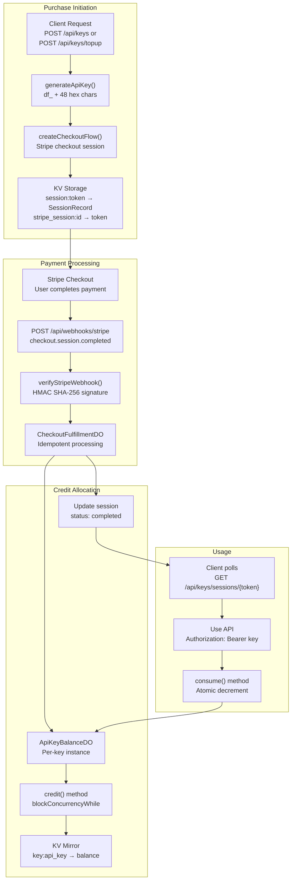

**출처:** [website/src/index.ts:19-31](), [website/src/index.ts:163-220](), [website/src/index.ts:280-328]()

## API Key 형식과 생성

API key는 validation을 가능하게 하고 typo를 방지하기 위해 특정 형식을 따릅니다. `generateApiKey()` function은 Web Crypto API를 사용해 암호학적으로 안전한 key를 생성합니다.

### Key Format

```
df_[48 hexadecimal characters]
```

예: `df_a1b2c3d4e5f6...`(총 길이: 51자)

Pattern은 `API_KEY_PATTERN` regex `/^df_[0-9a-f]{48}$/`로 강제됩니다.

### 생성 과정

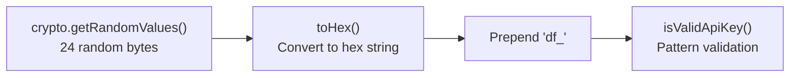

`toHex()` helper는 byte array를 hexadecimal string으로 변환합니다. 24-byte random value는 encode되면 48개의 hex character를 생성합니다.

**출처:** [website/src/index.ts:161-177](), [website/src/index.ts:94-96]()

## Purchase Blocks and Pricing

시스템은 서로 다른 credit allocation을 가진 세 가지 purchase block을 제공합니다:

| Block ID | Requests | Price (USD) | Use Case |
|----------|----------|-------------|----------|
| `1000` | 1,000 | $5.00 | Trial / small projects |
| `10000` | 10,000 | $40.00 | Regular usage |
| `100000` | 100,000 | $300.00 | High-volume applications |

Block definition은 `BLOCKS` constant에 `Record<string, { requests: number; price: number; name: string }>`로 저장됩니다.

**출처:** [website/src/index.ts:19-23]()

## Purchase Flow

### Initial Purchase(New API Key)

새 API key를 생성할 때 flow는 key와 session token을 모두 생성한 다음 Stripe checkout을 시작합니다:

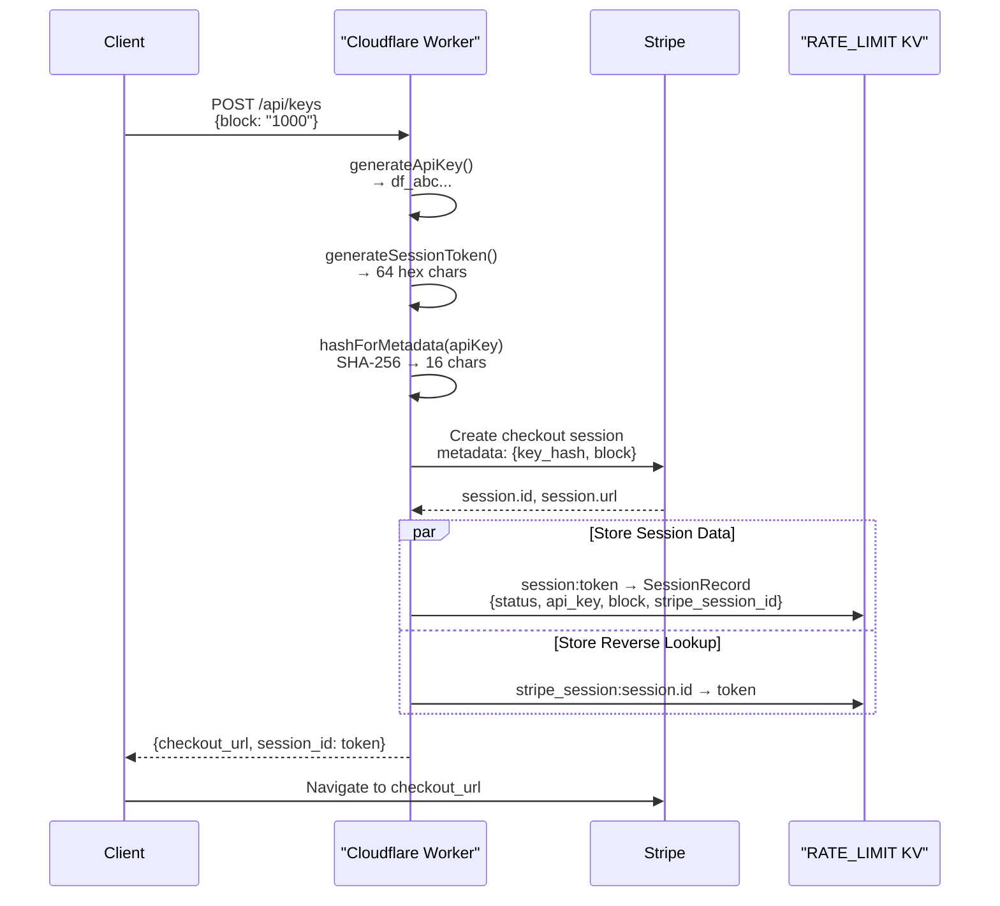

`SessionRecord` type은 checkout state를 추적합니다:

```typescript
type SessionRecord = {
    status: 'pending' | 'completed';
    api_key: string;
    block: string;
    stripe_session_id: string;
}
```

Session token은 64 hex character(32 random bytes)를 생성하는 `generateSessionToken()`을 사용합니다. 두 session record는 모두 24시간(86400초) 후 만료됩니다.

**출처:** [website/src/index.ts:404-412](), [website/src/index.ts:280-328](), [website/src/index.ts:169-173](), [website/src/index.ts:33-38]()

### Top-Up Flow(Existing API Key)

기존 key에 credit을 추가할 때 client는 Bearer authentication을 통해 API key를 제공합니다:

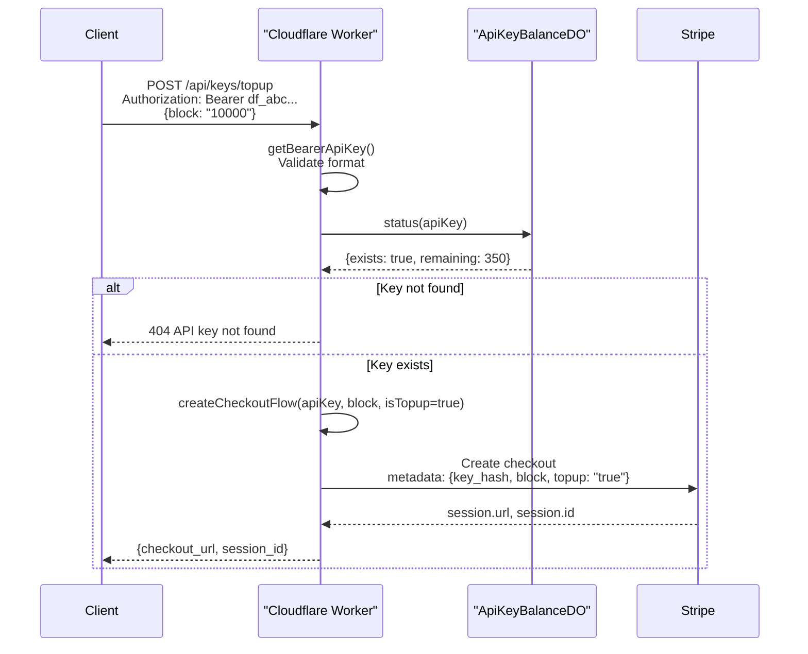

Top-up flow는 `createCheckoutFlow()`를 재사용하지만 Stripe metadata에 `isTopup: true`를 설정하고 새 key를 생성하는 대신 기존 `apiKey`를 전달합니다.

**출처:** [website/src/index.ts:439-454](), [website/src/index.ts:222-234](), [website/src/index.ts:280-328]()

## Durable Objects Architecture

시스템은 transactional guarantee를 제공하고 race condition을 방지하기 위해 두 개의 Durable Object class를 사용합니다:

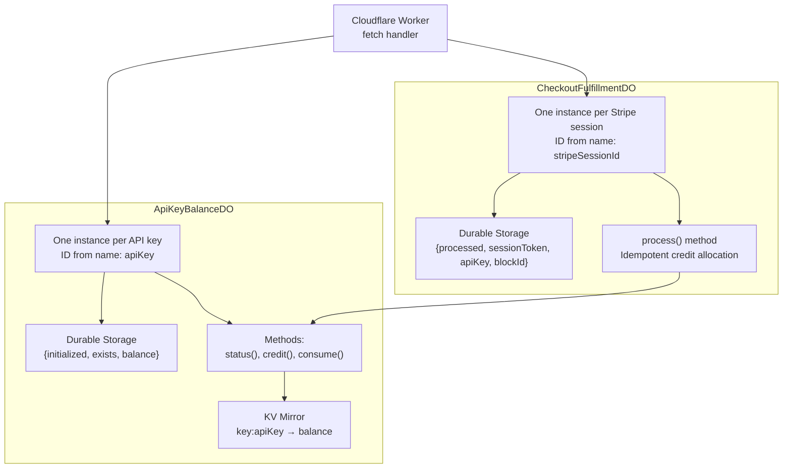

### ApiKeyBalanceDO

각 API key는 atomic balance operation을 제공하는 자체 Durable Object instance를 가집니다. Instance ID는 `idFromName(apiKey)`를 사용해 API key 자체에서 파생됩니다.

#### Storage Schema

| Key | Type | 목적 |
|-----|------|---------|
| `initialized` | `boolean` | Storage가 KV에서 seed되었는지 추적 |
| `exists` | `boolean` | 이 API key가 credit을 받은 적이 있는지 여부 |
| `balance` | `number` | 현재 남은 request count |

#### Methods

**`status(apiKey: string)`** - 수정 없이 current balance를 반환:

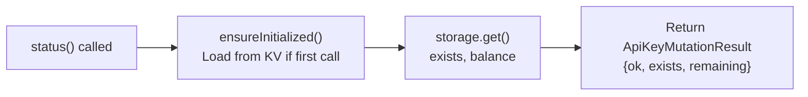

**`credit(apiKey: string, delta: number)`** - Credit을 atomic하게 추가:

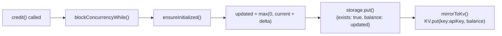

**`consume(apiKey: string)`** - Balance를 atomic하게 1 감소:

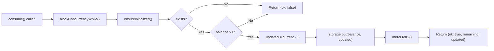

모든 method는 atomic execution을 보장하기 위해 `blockConcurrencyWhile()`을 사용합니다. `mirrorToKv()` function은 Durable Object를 호출하지 않고도 빠르게 read access할 수 있도록 current balance를 `RATE_LIMIT` KV namespace에 기록합니다.

**출처:** [website/src/index.ts:638-763](), [website/src/index.ts:188-190](), [website/src/index.ts:210-220]()

### CheckoutFulfillmentDO

각 Stripe checkout session은 idempotent payment processing을 제공하는 자체 Durable Object instance를 가집니다. Instance ID는 `idFromName(stripeSessionId)`를 사용해 Stripe session ID에서 파생됩니다.

#### Idempotency Guarantee

`process()` method는 duplicate webhook delivery가 account에 여러 번 credit을 부여하지 않도록 보장합니다:

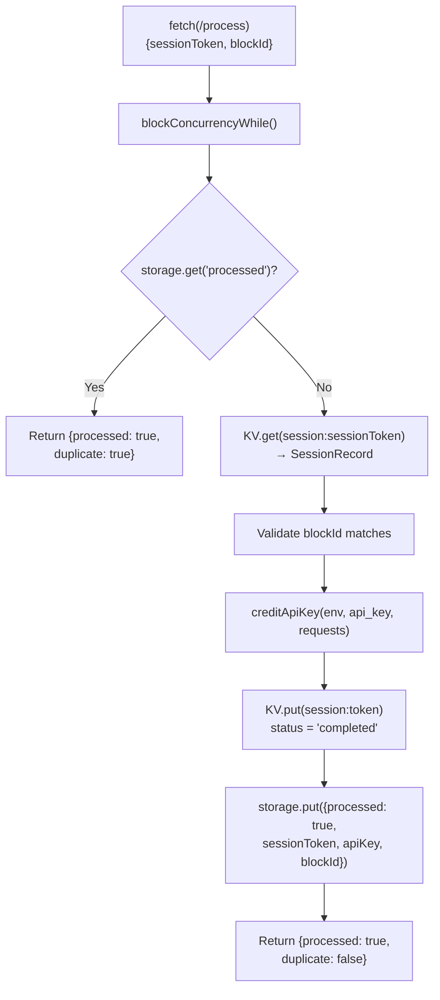

저장된 `processed` flag는 Stripe가 webhook을 여러 번 보내더라도 re-execution을 방지합니다. 한 번 설정되면 이후 호출은 즉시 `{processed: true, duplicate: true}`를 반환합니다.

**출처:** [website/src/index.ts:765-822](), [website/src/index.ts:192-194]()

## Webhook Processing

Stripe는 payment가 성공하면 `checkout.session.completed` event를 `POST /api/webhooks/stripe`로 보냅니다. 시스템은 처리 전에 HMAC-SHA256 signature를 사용해 webhook authenticity를 검증합니다.

### Signature Verification

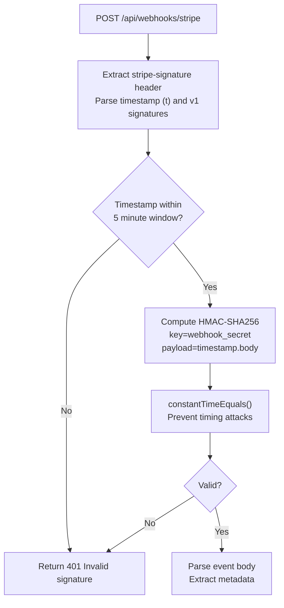

`verifyStripeWebhook()` function은 Stripe의 signature scheme을 구현합니다:

1. `stripe-signature` header에서 timestamp(`t`)와 v1 signature value 추출
2. Timestamp가 5분보다 오래되었으면 reject(replay attack 방지)
3. Signed payload 구성: `${timestamp}.${body}`
4. `STRIPE_WEBHOOK_SECRET`을 사용해 HMAC-SHA256 계산
5. Constant-time comparison을 사용해 계산된 signature를 모든 v1 value와 비교

`constantTimeEquals()` function은 문자열이 어디에서 다른지와 관계없이 comparison time이 독립적이도록 보장하여 timing-based attack을 방지합니다.

**출처:** [website/src/index.ts:247-278](), [website/src/index.ts:236-243](), [website/src/index.ts:471-509]()

### Event Processing Flow

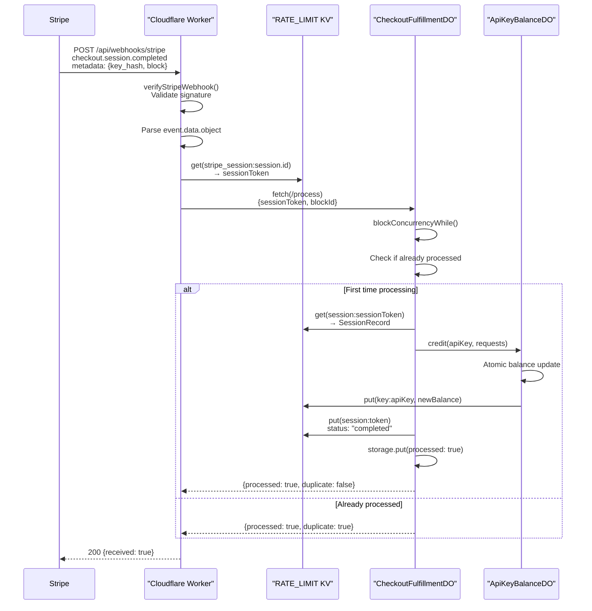

2단계 lookup(`stripe_session:id → token → SessionRecord`)을 통해 webhook은 credit을 부여할 올바른 session data와 API key를 찾을 수 있습니다.

**출처:** [website/src/index.ts:471-509](), [website/src/index.ts:765-822]()

## Authentication Methods

Content conversion endpoint에 request할 때 API key는 두 가지 방식으로 제공할 수 있습니다:

### Authorization Header(권장)

```
Authorization: Bearer df_a1b2c3d4e5f6...
```

`getBearerApiKey()` helper는 key를 추출하고 validate합니다:

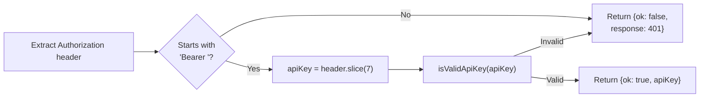

### Query Parameter

```
GET /example.com/article?key=df_a1b2c3d4e5f6...
```

Worker는 `url.searchParams.has('key')`를 확인하고 값을 추출합니다. 이 방식은 URL이 log될 수 있어 덜 안전하지만 testing에는 편리합니다.

**출처:** [website/src/index.ts:222-234](), [website/src/index.ts:549-557]()

## Credit Consumption

Request에 API key가 포함되면 시스템은 work를 수행하기 전에 atomic하게 1 credit을 소비합니다:

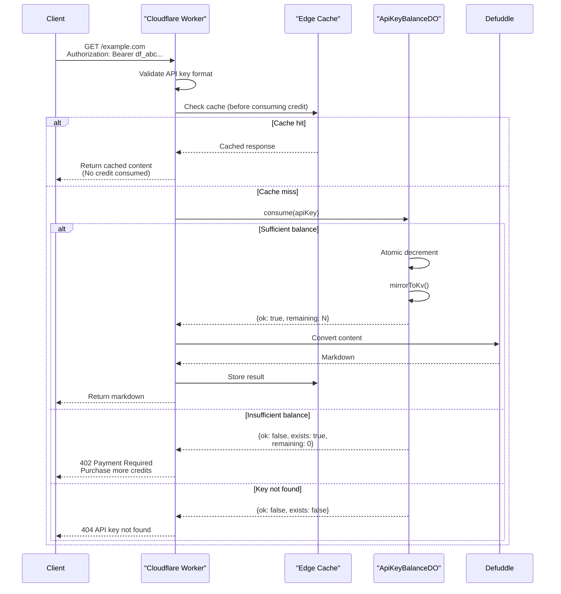

중요한 순서:
1. **소비 전 cache 확인** - Cached content에 credit이 낭비되는 것을 방지
2. **작업 전 atomic consumption** - 비용이 큰 operation 전에 credit이 reserve되도록 보장
3. **KV에 mirror** - Durable Object 호출 없이 빠른 balance check 가능

**출처:** [website/src/index.ts:564-606](), [website/src/index.ts:713-742]()

## Session Polling

Checkout을 시작한 후 client는 session token을 사용해 완료 여부를 polling합니다:

```
GET /api/keys/sessions/{sessionToken}
```

### Response States

| Status | HTTP Code | Response Body | Meaning |
|--------|-----------|---------------|---------|
| Pending | 202 | `{status: "pending"}` | Payment가 아직 완료되지 않음 |
| Completed | 200 | `{status: "completed", api_key: "df_...", remaining: N}` | Credit allocated, key ready |
| Not Found | 404 | `{error: "Session not found."}` | Invalid 또는 expired token |

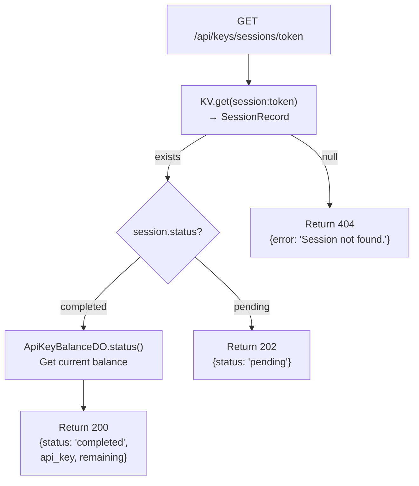

Webhook handler는 account에 credit을 성공적으로 부여한 후 `session.status`를 `'pending'`에서 `'completed'`로 update합니다. Session은 24시간 후 만료됩니다.

**출처:** [website/src/index.ts:414-436]()

## Usage Checking

Client는 언제든지 remaining balance를 확인할 수 있습니다:

```
GET /api/keys/usage
Authorization: Bearer df_abc...
```

Response:
```json
{
  "remaining": 9847
}
```

이 endpoint는 durable storage(KV mirror가 아님)에서 읽는 `ApiKeyBalanceDO.status()`를 호출하므로 KV가 stale하더라도 정확성을 보장합니다.

**출처:** [website/src/index.ts:457-468](), [website/src/index.ts:680-692]()

## Configuration

### Environment Variables

시스템은 `wrangler.toml`에 다음 binding이 필요합니다:

| Binding | Type | Purpose |
|---------|------|---------|
| `RATE_LIMIT` | KV Namespace | Session tracking, KV mirror, IP rate limit |
| `STRIPE_SECRET_KEY` | Secret | Stripe API authentication |
| `STRIPE_WEBHOOK_SECRET` | Secret | Webhook signature verification |
| `API_KEY_BALANCES` | Durable Object | `ApiKeyBalanceDO` namespace |
| `CHECKOUT_FULFILLMENTS` | Durable Object | `CheckoutFulfillmentDO` namespace |

### Durable Object Migrations

`wrangler.toml`에는 SQLite-backed Durable Objects를 initialize하기 위한 migration tag가 포함됩니다:

```toml
[[migrations]]
tag = "v1"
new_sqlite_classes = ["ApiKeyBalanceDO", "CheckoutFulfillmentDO"]
```

이를 통해 각 Durable Object instance가 persistent SQLite storage를 갖게 됩니다.

**출처:** [website/wrangler.toml:1-19](), [website/src/index.ts:25-31]()

## Error Handling

시스템은 다양한 failure mode에 대해 구체적인 error code를 반환합니다:

| Status | Condition | Message |
|--------|-----------|---------|
| 400 | Invalid block ID | `Invalid block. Options: 1000, 10000, 100000` |
| 401 | Missing/invalid Authorization header | `Missing Authorization: Bearer API key.` or `Invalid API key format.` |
| 402 | Insufficient credits | `API key has no remaining requests. Purchase more at /api/keys or top up at /api/keys/topup` |
| 404 | API key doesn't exist | `API key not found.` |
| 409 | Block mismatch in webhook | `Block mismatch.` |
| 503 | Missing environment configuration | `Payments not configured.` |

모든 error는 `{error: "message"}` JSON과 적절한 CORS header를 반환합니다.

**출처:** [website/src/index.ts:121-129](), [website/src/index.ts:571-576]()
