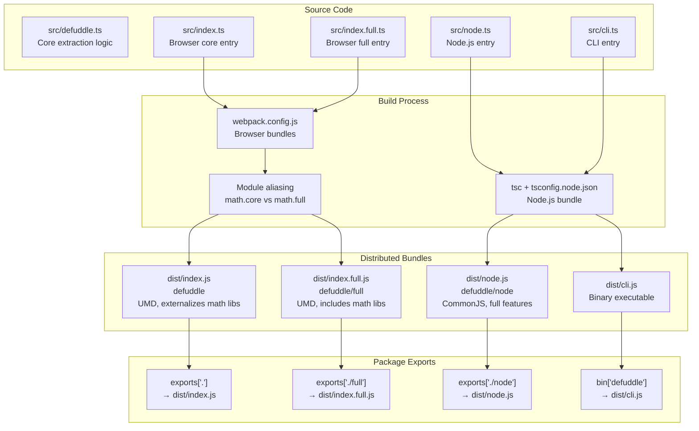
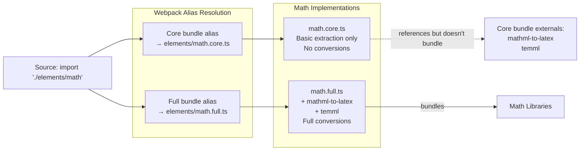
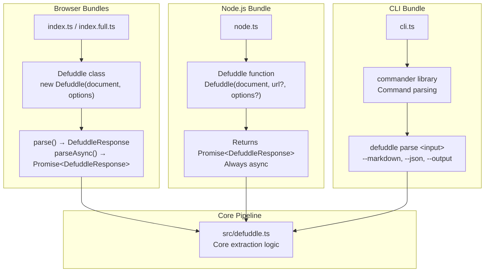

# Usage and Integration

<details>
<summary>관련 소스 파일</summary>

다음 파일들이 이 위키 페이지를 생성하기 위한 컨텍스트로 사용되었습니다:

- [README.md](README.md)
- [package-lock.json](package-lock.json)
- [package.json](package.json)
- [src/metadata.ts](src/metadata.ts)
- [src/types.ts](src/types.ts)
- [tsconfig.node.json](tsconfig.node.json)
- [webpack.config.js](webpack.config.js)

</details>


이 문서는 browser, Node.js, command line이라는 서로 다른 environment에서 Defuddle을 통합하고 사용하는 방법의 개요를 제공합니다. 세 가지 bundle variant와 그에 대응하는 integration method를 다루며, 어떤 context에서 어떤 bundle을 사용할지와 library가 서로 다른 runtime environment에 어떻게 적응하는지 설명합니다.

각 environment별 자세한 usage instruction은 [Browser Usage](#9.1), [Node.js Integration](#9.2), [Command Line Interface](#9.3)를 참조하세요. 모든 environment에서 사용할 수 있는 configuration option은 [Configuration and Options](#10)를 참조하세요.

## Integration Method 개요

Defuddle은 특정 runtime environment를 대상으로 하는 세 가지 주요 integration method를 지원합니다:

| Integration Method | Bundle Used | Primary Interface | Target Environment |
|-------------------|-------------|-------------------|-------------------|
| Browser | `defuddle` or `defuddle/full` | `new Defuddle(document)` class | Web browsers |
| Node.js | `defuddle/node` | `Defuddle(document, url, options)` function | Node.js runtime |
| CLI | Binary via `defuddle` command | Command-line arguments | Terminal/shell |

각 method는 core extraction pipeline에 대한 access를 제공하지만, runtime environment에 맞게 interface와 dependency를 조정합니다.

출처: [README.md:19-134](), [package.json:1-103]()

## Bundle Distribution Architecture

Defuddle은 서로 다른 environment와 feature requirement에 최적화된 세 가지 distinct bundle로 배포됩니다:

**Bundle Distribution Diagram**



출처: [package.json:24-39](), [webpack.config.js:1-102](), [tsconfig.node.json:1-19]()

### Bundle Comparison

| Feature | `defuddle` (Core) | `defuddle/full` | `defuddle/node` |
|---------|------------------|-----------------|-----------------|
| **Target** | Browser | Browser | Node.js |
| **Format** | UMD | UMD | CommonJS |
| **Size** | Lightweight (~40KB) | Larger (~120KB) | Medium |
| **Math Libraries** | External (user provides) | Bundled (mathml-to-latex, temml) | Bundled |
| **Markdown** | No (turndown not available) | No (turndown not available) | Yes (turndown included) |
| **DOM** | Native browser | Native browser | linkedom/jsdom required |
| **Entry Point** | [src/index.ts]() | [src/index.full.ts]() | [src/node.ts]() |
| **Math Module** | [src/elements/math.core.ts]() | [src/elements/math.full.ts]() | [src/elements/math.full.ts]() |

출처: [webpack.config.js:48-99](), [package.json:75-83](), [README.md:159-167]()

### Module Aliasing Strategy

Build system은 같은 source code에서 서로 다른 bundle을 compile하기 위해 Webpack의 module aliasing을 사용합니다. 이를 통해 core bundle은 무거운 dependency를 externalize하고 full bundle은 이를 포함할 수 있습니다.



출처: [webpack.config.js:67-73](), [webpack.config.js:92-98](), [webpack.config.js:52-55]()

## Entry Points and Interfaces

각 bundle은 target environment에 최적화된 서로 다른 interface를 노출합니다:

**Interface Architecture Diagram**



출처: [src/index.ts](), [src/index.full.ts](), [src/node.ts](), [src/cli.ts](), [package.json:6-8]()

### Browser Interface

Browser bundle은 class 기반 interface를 노출합니다:

```typescript
// From src/index.ts or src/index.full.ts
new Defuddle(document: Document, options?: DefuddleOptions)
  .parse(): DefuddleResponse
  .parseAsync(): Promise<DefuddleResponse>
```

이 interface는 DOM이 이미 사용 가능하다고 가정하며 기본적으로 synchronous parsing을 사용합니다. 자세한 예시는 [Browser Usage](#9.1)를 참조하세요.

출처: [README.md:22-34]()

### Node.js Interface

Node.js bundle은 항상 Promise를 반환하는 functional interface를 사용합니다:

```typescript
// From src/node.ts
Defuddle(
  document: Document,
  url?: string,
  options?: DefuddleOptions
): Promise<DefuddleResponse>
```

이 interface는 DOM implementation(linkedom 또는 jsdom)이 필요하며, Node.js document에는 location property가 없기 때문에 URL을 별도 parameter로 받습니다. 자세한 예시는 [Node.js Integration](#9.2)를 참조하세요.

출처: [README.md:36-64]()

### CLI Interface

CLI는 command-line argument parsing을 제공합니다:

```bash
# From bin entry point
defuddle parse <input> [options]
  --output, -o <file>      Write to file
  --markdown, -m, --md     Convert to markdown
  --json, -j               Output as JSON
  --property, -p <name>    Extract specific property
  --debug                  Enable debug mode
```

CLI는 내부적으로 linkedom과 함께 Node.js bundle을 사용합니다. 자세한 예시는 [Command Line Interface](#9.3)를 참조하세요.

출처: [README.md:68-103](), [package.json:6-8]()

## DOM Implementation Requirements

아래 표는 각 integration method의 DOM requirement를 요약합니다:

| Integration | DOM Source | Configuration |
|-------------|-----------|---------------|
| **Browser** | Native browser DOM (`window.document`) | No configuration needed |
| **Node.js** | linkedom (recommended) or jsdom | Must install separately: `npm install linkedom` |
| **CLI** | linkedom (bundled dependency) | Automatically handled |

Node.js integration의 경우 어떤 DOM implementation도 동작하지만, lightweight footprint와 speed 때문에 linkedom을 권장합니다. Functional interface는 DOM specification을 따르는 모든 `Document` object를 받습니다.

출처: [README.md:38-64](), [README.md:110-134](), [package.json:78-82]()

## Optional Dependencies

Defuddle은 core bundle을 lightweight하게 유지하기 위해 optional dependency를 사용합니다:

| Dependency | Used By | Purpose |
|-----------|---------|---------|
| `mathml-to-latex` | Full bundle, Node.js bundle | MathML을 LaTeX format으로 변환 |
| `temml` | Full bundle, Node.js bundle | LaTeX를 MathML format으로 변환 |
| `turndown` | Node.js bundle only | HTML을 Markdown으로 변환 |
| `linkedom` | Node.js bundle, CLI | Node.js용 DOM implementation |
| `commander` | CLI only | Command-line argument parsing |

Core browser bundle은 이러한 dependency를 모두 externalize하며, 필요한 경우 사용자가 math library를 제공할 것을 기대합니다. Full browser bundle은 math library를 포함하지만 turndown은 포함하지 않습니다(Markdown conversion은 browser에서 거의 필요하지 않기 때문). Node.js bundle은 모든 feature를 포함합니다.

출처: [package.json:75-83](), [webpack.config.js:52-55](), [README.md:159-167]()

## Response Format

모든 integration method는 같은 구조의 `DefuddleResponse` object를 반환합니다:

| Property | Type | Description |
|----------|------|-------------|
| `content` | string | Cleaned HTML 또는 Markdown(`markdown: true`인 경우) |
| `contentMarkdown` | string? | 별도 Markdown content(`separateMarkdown: true`인 경우) |
| `title` | string | Article title |
| `author` | string | Article author |
| `description` | string | Article description/summary |
| `domain` | string | Domain name |
| `favicon` | string | Favicon URL |
| `image` | string | Main image URL |
| `language` | string | Page language(BCP 47 format) |
| `published` | string | Publication date |
| `site` | string | Site name |
| `schemaOrgData` | object | Raw Schema.org JSON-LD data |
| `metaTags` | object | Meta tag collection |
| `wordCount` | number | 추출된 content의 word count |
| `parseTime` | number | Millisecond 단위 parse time |
| `debug` | object? | Debug information(`debug: true`인 경우) |

출처: [src/types.ts:34-41](), [README.md:136-157]()

## Installation

Installation은 integration method에 따라 다릅니다:

**Browser (via npm)**
```bash
npm install defuddle
# Core bundle: import Defuddle from 'defuddle'
# Full bundle: import Defuddle from 'defuddle/full'
```

**Node.js**
```bash
npm install defuddle
npm install linkedom  # or jsdom
```

**CLI (global)**
```bash
npm install -g defuddle
```

**CLI (npx, no install)**
```bash
npx defuddle parse <input>
```

설치 후 자세한 usage instruction은 각 environment별 page인 [Browser Usage](#9.1), [Node.js Integration](#9.2), [Command Line Interface](#9.3)를 참조하세요.

출처: [README.md:104-134]()
