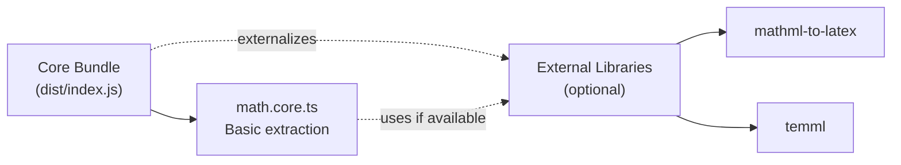
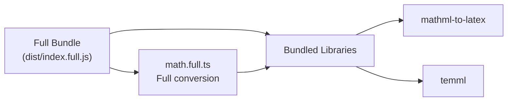
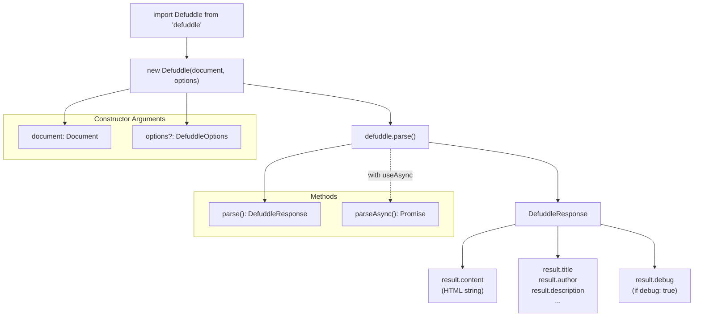
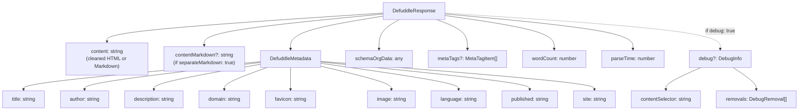
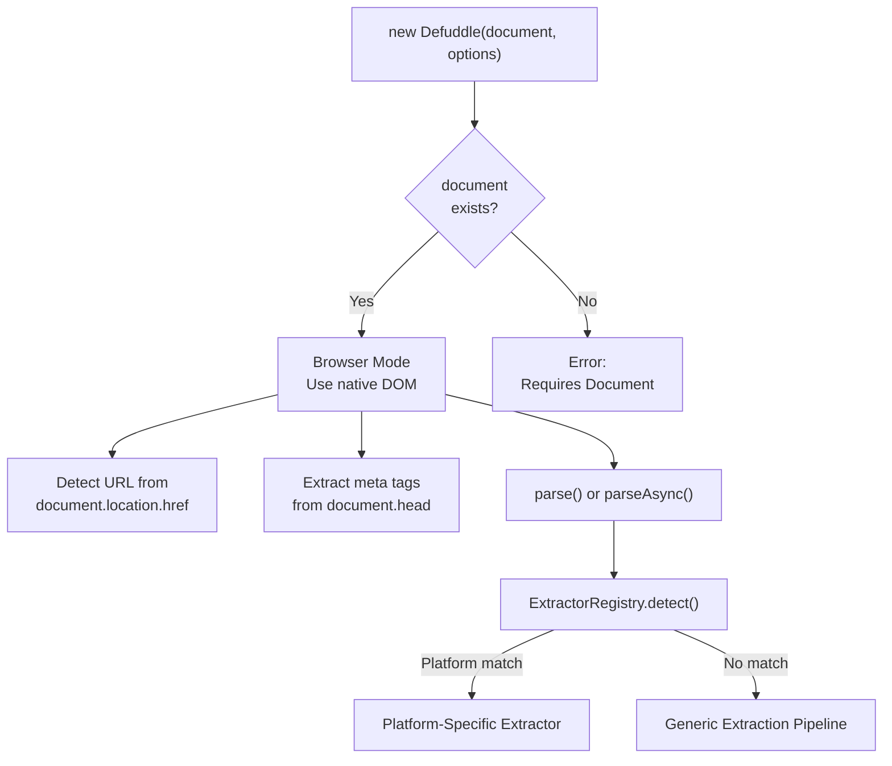

# Browser Usage

<details>
<summary>관련 소스 파일</summary>

다음 파일들이 이 위키 페이지를 생성하기 위한 컨텍스트로 사용되었습니다:

- [README.md](README.md)
- [package-lock.json](package-lock.json)
- [package.json](package.json)
- [src/metadata.ts](src/metadata.ts)
- [src/types.ts](src/types.ts)
- [tsconfig.node.json](tsconfig.node.json)
- [webpack.config.js](webpack.config.js)

</details>


이 페이지는 installation, bundle selection, basic usage pattern, configuration option을 포함해 browser environment에서 Defuddle을 사용하는 방법을 설명합니다. Node.js usage는 [Node.js Integration](#9.2)을 참조하세요. Command-line usage는 [Command Line Interface](#9.3)를 참조하세요.

## Installation

npm으로 Defuddle을 설치합니다:

```bash
npm install defuddle
```

Core bundle에는 추가 dependency가 필요 없습니다. Full bundle은 필요한 library를 모두 내부에 포함합니다.

**출처:** [package.json:1-103](), [README.md:104-108]()

## Bundle Selection

Defuddle은 서로 다른 use case에 최적화된 두 가지 browser bundle을 제공합니다:

| Bundle | Import Path | Size | Dependencies | Math Conversion | Use Case |
|--------|-------------|------|--------------|-----------------|----------|
| **Core** | `defuddle` | Lightweight | None (externals) | Basic extraction only | 일반 content extraction, 최소 bundle size |
| **Full** | `defuddle/full` | Larger | Bundled internally | Full LaTeX ↔ MathML | Math-heavy content, complete feature set |

### Core Bundle Architecture



Core bundle은 Webpack의 `externals` configuration을 사용해 math library를 제외하여 bundle size를 최소로 유지합니다. Math content는 conversion 없이 raw form(MathML/LaTeX string)으로 추출됩니다.

**출처:** [webpack.config.js:48-74](), [package.json:78-82]()

### Full Bundle Architecture



Full bundle은 module aliasing을 통해 `mathml-to-latex`와 `temml`을 포함하여 bidirectional LaTeX ↔ MathML conversion을 가능하게 합니다. [Math Content Standardization](#5.4)에 설명된 complete math standardization을 지원합니다.

**출처:** [webpack.config.js:77-99](), [package.json:78-82]()

## Basic Usage

### Importing the Library

```javascript
// Core bundle (default)
import Defuddle from 'defuddle';

// Full bundle
import Defuddle from 'defuddle/full';
```

두 bundle은 모두 CommonJS, AMD, global script usage와 호환되는 UMD module로 export됩니다:

```html
<!-- Via script tag -->
<script src="node_modules/defuddle/dist/index.js"></script>
<script>
  const defuddle = new Defuddle(document);
  const result = defuddle.parse();
</script>
```

**출처:** [README.md:22-34](), [webpack.config.js:56-64](), [webpack.config.js:82-89]()

### Synchronous Parsing

```javascript
import Defuddle from 'defuddle';

// Parse the current document
const defuddle = new Defuddle(document);
const result = defuddle.parse();

// Access extracted content and metadata
console.log(result.content);      // Cleaned HTML
console.log(result.title);        // Article title
console.log(result.author);       // Author name
console.log(result.description);  // Description/summary
console.log(result.wordCount);    // Word count
console.log(result.parseTime);    // Parse duration (ms)
```

`parse()` method는 document를 synchronous하게 처리하고 즉시 `DefuddleResponse` object를 반환합니다. Browser usage에 권장되는 접근 방식입니다.

**출처:** [README.md:23-34](), [src/types.ts:34-41]()

### Asynchronous Parsing

```javascript
import Defuddle from 'defuddle';

// Parse with async extractors enabled
const defuddle = new Defuddle(document, { useAsync: true });
const result = await defuddle.parseAsync();
```

`parseAsync()` method는 local HTML이 부족할 때 third-party API에서 추가 content를 fetch할 수 있는 platform-specific extractor를 활성화합니다. 주로 client-side rendered application에 사용됩니다. 자세한 내용은 [Platform-Specific Extractors](#6)를 참조하세요.

**출처:** [README.md:254](), [src/types.ts:85-90]()

### Browser Usage Flow



**출처:** [src/types.ts:34-41](), [src/types.ts:43-126]()

## Configuration Options

`Defuddle` constructor는 configuration option이 포함된 optional second parameter를 받습니다:

```javascript
const defuddle = new Defuddle(document, {
  debug: true,              // Enable debug mode
  markdown: true,           // Convert to Markdown
  removeImages: false,      // Keep images
  contentSelector: 'main'   // Use specific selector
});
```

### Browser-Specific Options

| Option | Type | Default | Description |
|--------|------|---------|-------------|
| `debug` | boolean | `false` | Debug logging을 활성화하고 debug info 반환 |
| `url` | string | - | Page의 URL(대개 auto-detected) |
| `markdown` | boolean | `false` | Content를 Markdown으로 변환(full bundle 또는 external turndown 필요) |
| `separateMarkdown` | boolean | `false` | HTML은 `content`에 유지하고 Markdown은 `contentMarkdown`에 추가 |
| `removeImages` | boolean | `false` | Content에서 모든 image 제거 |
| `contentSelector` | string | - | Main content용 CSS selector, auto-detection 우회 |

**출처:** [src/types.ts:43-126](), [README.md:169-184]()

### Pipeline Control Options

개별 extraction pipeline phase를 제어합니다:

| Option | Type | Default | Description |
|--------|------|---------|-------------|
| `removeExactSelectors` | boolean | `true` | Exact CSS selector로 ads, social button 제거 |
| `removePartialSelectors` | boolean | `true` | Partial class/id matching으로 element 제거 |
| `removeHiddenElements` | boolean | `true` | CSS-hidden element(`display:none` 등) 제거 |
| `removeLowScoring` | boolean | `true` | Content scoring으로 low-scoring block 제거 |
| `removeSmallImages` | boolean | `true` | Small image(icon, pixel) 제거 |
| `standardize` | boolean | `true` | HTML standardize(footnotes, code, math) |
| `useAsync` | boolean | `true` | Async API fallback 허용 |

이러한 option은 [Clutter Removal Pipeline](#4.3)과 [Content Standardization](#5) phase를 fine-grained control할 수 있게 합니다.

**출처:** [src/types.ts:67-120](), [README.md:169-184]()

### Options Usage Example

```javascript
import Defuddle from 'defuddle/full';

// Parse with custom configuration
const defuddle = new Defuddle(document, {
  debug: true,                    // Get debug information
  markdown: true,                 // Output as Markdown
  removeHiddenElements: false,    // Keep CSS sidenotes
  removeLowScoring: false,        // Disable content scoring
  contentSelector: 'article.post' // Use specific element
});

const result = defuddle.parse();

// Access debug information
console.log(result.debug.contentSelector);  // Shows chosen element
console.log(result.debug.removals);         // Lists removed elements
```

**출처:** [README.md:262-279](), [src/types.ts:29-32]()

## Response Format

`parse()`와 `parseAsync()` method는 `DefuddleResponse` object를 반환합니다:

### Response Object Structure



**출처:** [src/types.ts:34-41](), [src/types.ts:1-14](), [README.md:136-156]()

### Metadata Extraction

Metadata는 `MetadataExtractor` class를 통해 multi-source priority strategy를 사용해 추출됩니다:

1. **Schema.org** JSON-LD data(가장 높은 우선순위)
2. **Open Graph** meta tag
3. **Twitter Card** meta tag
4. **Standard meta tags**
5. **DOM elements**(fallback)

자세한 extraction logic은 [Metadata Extraction](#4.2)을 참조하세요.

**출처:** [src/metadata.ts:3-57](), [README.md:136-156]()

### Response Properties Reference

| Property | Type | Description |
|----------|------|-------------|
| `content` | string | Cleaned HTML 또는 Markdown content |
| `contentMarkdown` | string | Markdown content(`separateMarkdown: true`인 경우) |
| `title` | string | Article title(site name에서 정리됨) |
| `author` | string | Author name(s) |
| `description` | string | Article description/summary |
| `domain` | string | www prefix 없는 domain name |
| `favicon` | string | Favicon URL |
| `image` | string | Main article image URL |
| `language` | string | BCP 47 language code(예: `en-US`) |
| `published` | string | Publication date(ISO 8601) |
| `site` | string | Website/publication name |
| `schemaOrgData` | object | Raw Schema.org JSON-LD data |
| `metaTags` | MetaTagItem[] | 추출된 meta tag |
| `wordCount` | number | Content의 total word count |
| `parseTime` | number | Millisecond 단위 parse duration |
| `debug` | DebugInfo | Debug information(`debug: true`인 경우) |
| `extractorType` | string | 사용된 extractor 이름(platform-specific인 경우) |

**출처:** [src/types.ts:34-41](), [src/types.ts:1-14](), [README.md:136-156]()

## Advanced Usage

### Core Bundle에서 External Math Libraries 사용

Core bundle은 bundle size를 줄이기 위해 math conversion library를 externalize합니다. 필요한 경우 이러한 library를 외부에서 제공할 수 있습니다:

```html
<script src="https://cdn.jsdelivr.net/npm/mathml-to-latex@1.5.0/dist/mathml-to-latex.min.js"></script>
<script src="https://cdn.jsdelivr.net/npm/temml@0.13.1/dist/temml.min.js"></script>
<script src="node_modules/defuddle/dist/index.js"></script>

<script>
  // Core bundle will use globally available math libraries
  const defuddle = new Defuddle(document);
  const result = defuddle.parse();
</script>
```

External library가 없으면 core bundle은 LaTeX와 MathML format 간 conversion 없이 raw form으로 math content를 추출합니다.

**출처:** [webpack.config.js:52-55](), [README.md:160-167]()

### Debug Mode

Content extraction decision을 inspect하려면 debug mode를 활성화합니다:

```javascript
const defuddle = new Defuddle(document, { debug: true });
const result = defuddle.parse();

// Inspect chosen content element
console.log(result.debug.contentSelector);
// Example output: "article.post-content"

// Review removed elements
result.debug.removals.forEach(removal => {
  console.log(`Step: ${removal.step}`);
  console.log(`Reason: ${removal.reason}`);
  console.log(`Selector: ${removal.selector}`);
  console.log(`Text preview: ${removal.text.substring(0, 50)}...`);
});
```

Debug mode는 일반적으로 제거되는 HTML structure와 attribute를 보존하여 extraction issue를 더 쉽게 진단할 수 있게 합니다. 전체 문서는 [Debugging Features](#11.1)를 참조하세요.

**출처:** [README.md:259-295](), [src/types.ts:22-32]()

### Content Selector Override

Main content element를 지정하여 automatic content detection을 우회합니다:

```javascript
// Use specific element for content
const defuddle = new Defuddle(document, {
  contentSelector: 'article.post-content'
});

const result = defuddle.parse();
```

Selector가 어떤 element와도 match되지 않으면 Defuddle은 entry point selector와 content scoring을 사용한 automatic detection으로 fallback합니다. Auto-detection 세부 사항은 [Content Identification and Scoring](#4.1)을 참조하세요.

**출처:** [README.md:311-321](), [src/types.ts:123-125]()

### Markdown Conversion

추출된 content를 Markdown으로 변환합니다(full bundle 필요):

```javascript
import Defuddle from 'defuddle/full';

const defuddle = new Defuddle(document, {
  markdown: true
});

const result = defuddle.parse();
console.log(result.content);  // Markdown string
```

또는 HTML과 Markdown을 모두 유지합니다:

```javascript
const defuddle = new Defuddle(document, {
  separateMarkdown: true
});

const result = defuddle.parse();
console.log(result.content);         // HTML string
console.log(result.contentMarkdown); // Markdown string
```

Core bundle에는 markdown conversion이 포함되지 않습니다. Core bundle에서 markdown support가 필요하면 대신 Node.js bundle을 사용하세요. Conversion system에 대한 자세한 내용은 [Markdown Conversion](#7)을 참조하세요.

**출처:** [README.md:174-176](), [src/types.ts:56-65]()

### Pipeline Debugging

Extraction issue를 진단하기 위해 개별 pipeline step을 비활성화합니다:

```javascript
// Disable content scoring to see raw extraction
const result1 = new Defuddle(document, {
  removeLowScoring: false,
  debug: true
}).parse();

// Disable hidden element removal (useful for sidenote layouts)
const result2 = new Defuddle(document, {
  removeHiddenElements: false
}).parse();

// Disable small image removal
const result3 = new Defuddle(document, {
  removeSmallImages: false
}).parse();
```

각 pipeline step이 제거하는 내용을 inspect하려면 `debug: true`를 사용하세요. 각 phase의 자세한 내용은 [Clutter Removal Pipeline](#4.3)을 참조하세요.

**출처:** [README.md:296-309](), [src/types.ts:67-120]()

## Browser Environment Detection

Defuddle은 global `document` object를 사용해 browser environment를 자동으로 감지합니다:



Browser environment는 native DOM, CSS computed style, document metadata에 직접 access할 수 있게 합니다. 이는 DOM implementation(linkedom/jsdom)을 제공해야 하는 Node.js usage와 다릅니다. Server-side usage는 [Node.js Integration](#9.2)을 참조하세요.

**출처:** [src/metadata.ts:8-11](), [src/metadata.ts:23-29]()
