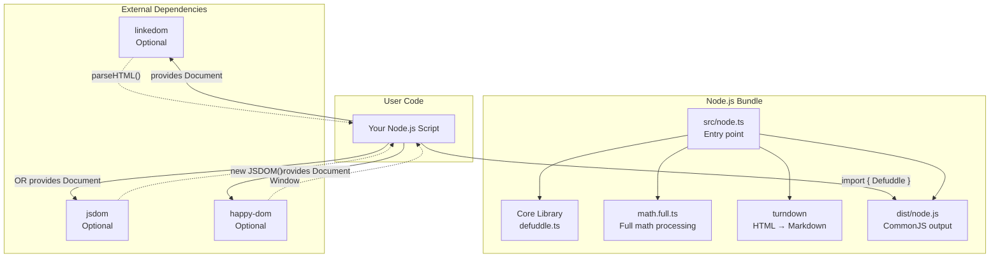
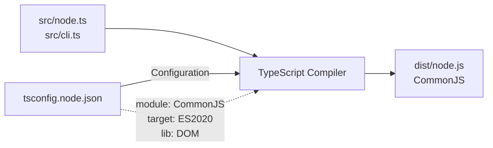
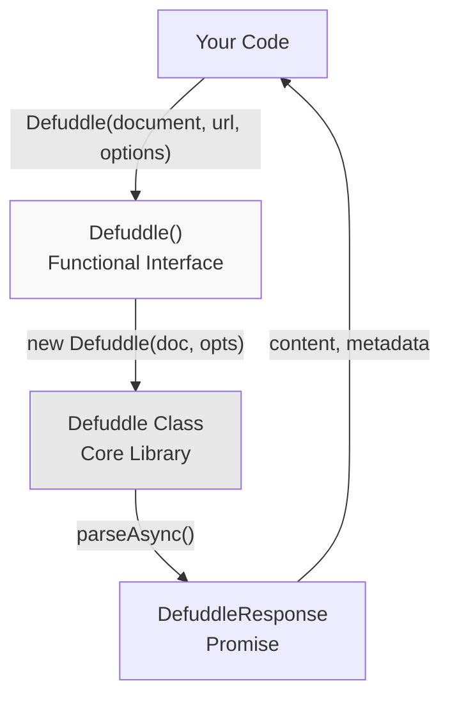
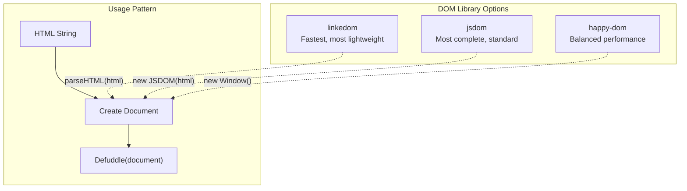
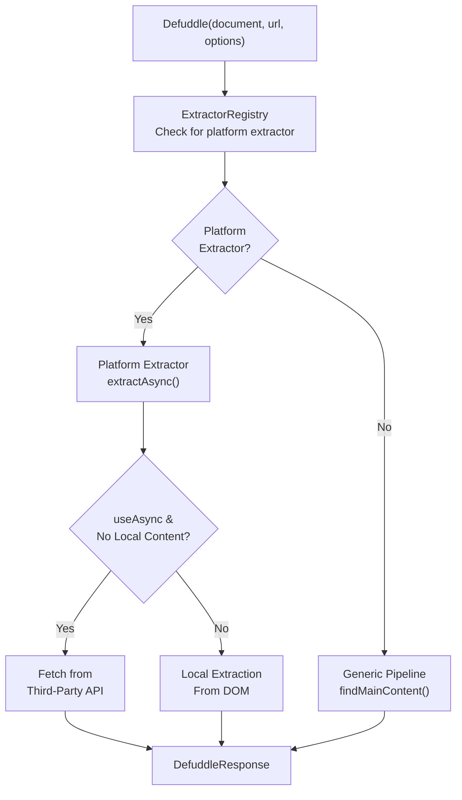
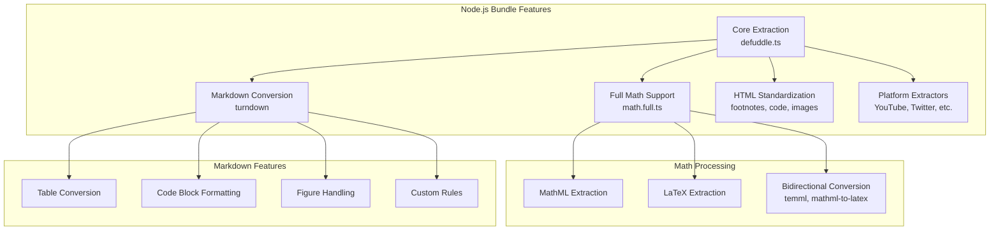
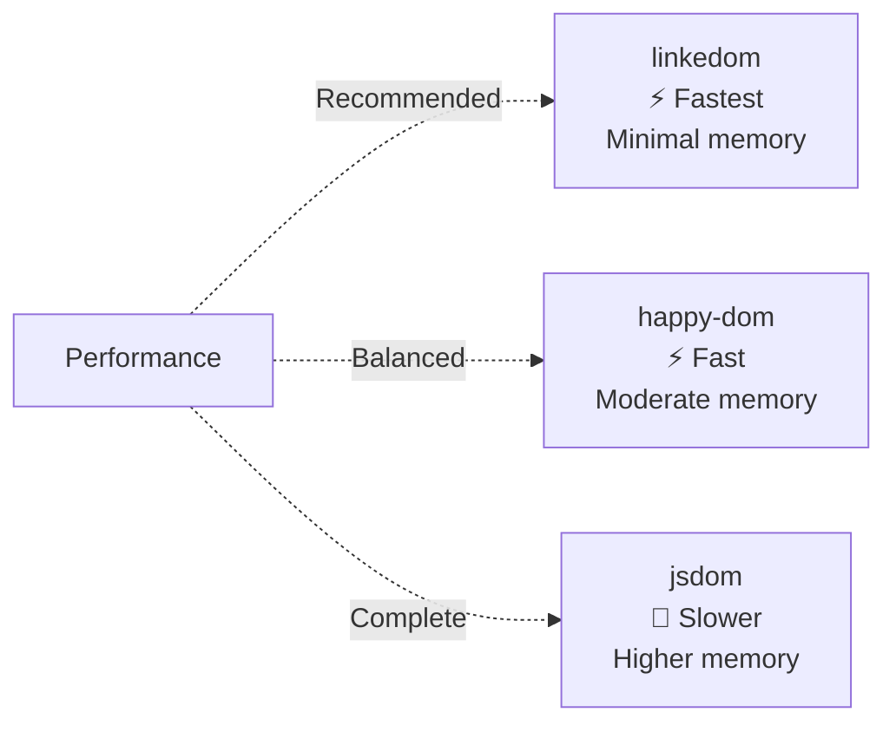

# Node.js Integration

<details>
<summary>관련 소스 파일</summary>

다음 파일들이 이 위키 페이지를 생성하기 위한 컨텍스트로 사용되었습니다:

- [README.md](README.md)
- [package-lock.json](package-lock.json)
- [package.json](package.json)
- [src/metadata.ts](src/metadata.ts)
- [src/types.ts](src/types.ts)
- [tsconfig.node.json](tsconfig.node.json)
- [webpack.config.js](webpack.config.js)

</details>


이 페이지는 Node.js environment에서 Defuddle을 사용하는 방법을 문서화합니다. Native DOM object에서 동작하는 browser usage와 달리, Node.js에는 DOM implementation library가 필요합니다. Node.js bundle은 full markdown conversion과 math processing capability를 포함한 server-side content extraction에 최적화된 functional interface를 제공합니다.

Browser 기반 usage는 [Browser Usage](#9.1)를 참조하세요. Command-line usage는 [Command Line Interface](#9.3)를 참조하세요.

---

## Bundle Architecture

Node.js bundle(`defuddle/node`)은 server-side JavaScript environment를 대상으로 하는 특수 배포판입니다. Module format, dependency, API design에서 browser bundle과 다릅니다.

### Node.js Bundle Structure



**출처:** [package.json:35-38](), [tsconfig.node.json:1-19](), [README.md:36-64]()

### Package Exports Configuration

Node.js bundle은 특정 TypeScript declaration을 가진 package export로 설정됩니다:

| Export Path | Types Path | Module Path | Format |
|-------------|------------|-------------|---------|
| `defuddle/node` | `dist/node.d.ts` | `dist/node.js` | ES Module import |

**출처:** [package.json:35-38]()

### Build Configuration



Node.js bundle은 ES2020 feature와 DOM type을 포함한 CommonJS module format을 대상으로 하는 dedicated TypeScript configuration으로 compile됩니다.

**출처:** [tsconfig.node.json:1-19](), [package.json:44]()

---

## Installation

### Base Package

```bash
npm install defuddle
```

### DOM Implementation (Required)

Node.js bundle에는 DOM implementation이 필요합니다. 하나를 선택하세요:

```bash
# Option 1: linkedom (recommended, fastest)
npm install linkedom

# Option 2: jsdom (most compatible)
npm install jsdom

# Option 3: happy-dom (lightweight)
npm install happy-dom
```

**출처:** [README.md:110-120](), [package.json:78-82]()

### Optional Dependencies

Node.js bundle은 build의 일부로 다음 feature를 포함하지만, `package.json`에는 optional dependency로 나열됩니다:

| Dependency | Purpose | Included in Bundle |
|------------|---------|-------------------|
| `turndown` | Markdown conversion | Yes |
| `mathml-to-latex` | Math equation conversion | Yes |
| `temml` | LaTeX to MathML | Yes |
| `linkedom` | DOM implementation | No (user choice) |

**출처:** [package.json:78-82]()

---

## API Interface

Node.js bundle은 browser의 class-based API와 다른 functional interface를 export합니다.

### Functional API



**출처:** [README.md:40-52]()

### Function Signature

```typescript
Defuddle(
  document: Document,
  url?: string,
  options?: DefuddleOptions
): Promise<DefuddleResponse>
```

| Parameter | Type | Required | Description |
|-----------|------|----------|-------------|
| `document` | `Document` | Yes | linkedom/jsdom 등에서 온 DOM document |
| `url` | `string` | No | Page의 URL(metadata에 사용) |
| `options` | `DefuddleOptions` | No | Configuration options |

**Returns:** content, metadata, optional markdown을 포함하는 `Promise<DefuddleResponse>`.

**출처:** [README.md:40-52]()

### Browser API Comparison

| Feature | Browser Bundle | Node.js Bundle |
|---------|---------------|----------------|
| Import | `import Defuddle from 'defuddle'` | `import { Defuddle } from 'defuddle/node'` |
| API Style | Class: `new Defuddle(document)` | Function: `Defuddle(document)` |
| Sync Method | `parse()` | Not available |
| Async Method | `parseAsync()` | Always async |
| Module Format | UMD | CommonJS/ES Module |
| DOM Source | Native browser | User-provided |

**출처:** [README.md:23-64]()

---

## DOM Implementation Support

Node.js bundle은 standard DOM API를 준수하는 모든 DOM implementation의 `Document` object를 받습니다.

### Supported DOM Libraries



**출처:** [README.md:38-62]()

### linkedom Example

linkedom은 speed와 small footprint 때문에 대부분의 use case에 권장되는 선택입니다.

```javascript
import { parseHTML } from 'linkedom';
import { Defuddle } from 'defuddle/node';

const { document } = parseHTML(html);
const result = await Defuddle(document, 'https://example.com/article', {
  markdown: true
});

console.log(result.content);
console.log(result.title);
console.log(result.author);
```

**출처:** [README.md:40-52]()

### JSDOM Example

JSDOM은 가장 complete한 DOM implementation을 제공하며, page가 advanced DOM feature를 사용할 때 유용합니다.

```javascript
import { JSDOM } from 'jsdom';
import { Defuddle } from 'defuddle/node';

const dom = new JSDOM(html, { url: 'https://example.com/article' });
const result = await Defuddle(dom.window.document, 'https://example.com/article');
```

**주요 차이:** JSDOM constructor는 `url` option을 받아 `document.location.href`를 설정합니다. 이 방식으로 제공되면 `Defuddle()`의 second parameter를 생략할 수 있습니다.

**출처:** [README.md:54-62]()

### happy-dom Example

```javascript
import { Window } from 'happy-dom';
import { Defuddle } from 'defuddle/node';

const window = new Window();
const document = window.document;
document.write(html);

const result = await Defuddle(document, 'https://example.com/article');
```

**출처:** External knowledge (pattern consistent with other examples)

---

## Async Processing

Node.js bundle은 항상 asynchronous parsing을 수행하여 platform-specific extractor가 필요할 때 추가 data를 fetch할 수 있게 합니다.

### Async Extraction Flow



**출처:** [README.md:254-257](), [src/types.ts:84-90]()

### useAsync Option

기본적으로 platform extractor는 local HTML이 usable content를 제공하지 않을 때(예: client-side rendered SPA) external API에서 content를 fetch할 수 있습니다.

```javascript
// Enable API fallbacks (default)
const result = await Defuddle(document, url, {
  useAsync: true
});

// Disable API fallbacks (local content only)
const result = await Defuddle(document, url, {
  useAsync: false
});
```

**예:** X/Twitter content의 경우 HTML에 article text가 없으면 `useAsync: true`일 때 `XOembedExtractor`가 FxTwitter API에서 fetch할 수 있습니다.

**출처:** [src/types.ts:84-90](), [README.md:254-257]()

---

## Bundle Features

Node.js bundle은 full-featured content processing capability를 포함합니다.

### Included Features



**출처:** Diagram 5 from high-level architecture, [package.json:78-82]()

### Feature Comparison with Browser Bundles

| Feature | Core Bundle | Full Bundle | Node.js Bundle |
|---------|-------------|-------------|----------------|
| Math Extraction | ✓ | ✓ | ✓ |
| MathML ↔ LaTeX | External libs required | ✓ Bundled | ✓ Bundled |
| Markdown Conversion | External lib required | External lib required | ✓ Bundled |
| Module Format | UMD | UMD | CommonJS |
| Target Environment | Browser | Browser | Node.js |
| Async API | Optional | Optional | Required |

**출처:** [README.md:159-167]()

---

## Configuration Options

`DefuddleOptions`의 모든 option은 Node.js bundle에서 지원됩니다. 포괄적인 문서는 [Configuration and Options](#10)를 참조하세요.

### Common Node.js Configurations

```javascript
// Markdown output
const result = await Defuddle(document, url, {
  markdown: true
});

// Separate HTML and Markdown
const result = await Defuddle(document, url, {
  separateMarkdown: true
});
// result.content = HTML
// result.contentMarkdown = Markdown

// Debug mode
const result = await Defuddle(document, url, {
  debug: true
});
// result.debug.contentSelector
// result.debug.removals

// Bypass auto-detection
const result = await Defuddle(document, url, {
  contentSelector: 'article.main-content'
});

// Disable external API calls
const result = await Defuddle(document, url, {
  useAsync: false
});
```

**출처:** [src/types.ts:43-126](), [README.md:169-185]()

### Node.js-Specific Considerations

| Option | Node.js Behavior | Notes |
|--------|------------------|-------|
| `markdown` | Always available | `turndown` bundled |
| `useAsync` | Controls API fallbacks | Default: `true` |
| `url` | Parameter or option | Can be second parameter or in options |
| `debug` | Preserves DOM structure | DOM implementation debugging에 유용 |

**출처:** [src/types.ts:43-126]()

---

## Module Format Requirements

Node.js bundle은 project configuration에서 ES Module syntax가 필요합니다.

### Package.json Configuration

Project의 `package.json`은 module type을 지정해야 합니다:

```json
{
  "type": "module"
}
```

이 설정이 없으면 Node.js는 `defuddle/node` import를 올바르게 resolve하지 못합니다.

**출처:** [README.md:64]()

### Import Syntax

```javascript
// ES Module syntax (required)
import { Defuddle } from 'defuddle/node';

// CommonJS syntax (not supported)
// const { Defuddle } = require('defuddle/node'); // ✗ Won't work
```

**출처:** [README.md:64](), [package.json:35-38]()

---

## Response Object

Node.js bundle은 browser bundle과 같은 `DefuddleResponse` structure를 반환합니다. Complete response schema는 [Getting Started](#2)를 참조하세요.

### Response Properties

| Property | Type | Description |
|----------|------|-------------|
| `content` | `string` | Cleaned HTML 또는 Markdown(option에 따라) |
| `contentMarkdown` | `string` | Markdown(`separateMarkdown: true`일 때) |
| `title` | `string` | Article title |
| `author` | `string` | Article author |
| `description` | `string` | Article description |
| `domain` | `string` | Domain name |
| `published` | `string` | Publication date |
| `language` | `string` | Page language(BCP 47) |
| `wordCount` | `number` | Content의 word count |
| `parseTime` | `number` | Millisecond 단위 parse duration |
| `metaTags` | `MetaTagItem[]` | 추출된 meta tag |
| `schemaOrgData` | `object` | Schema.org structured data |
| `debug` | `DebugInfo` | Debug information(`debug: true`일 때) |

**출처:** [src/types.ts:34-41](), [README.md:136-157]()

---

## Error Handling

```javascript
import { Defuddle } from 'defuddle/node';
import { parseHTML } from 'linkedom';

try {
  const { document } = parseHTML(html);
  const result = await Defuddle(document, url);
  
  if (!result.content) {
    console.warn('No content extracted');
  }
  
  console.log(result);
} catch (error) {
  console.error('Extraction failed:', error);
}
```

**Common Error Scenarios:**

| Scenario | Cause | Solution |
|----------|-------|----------|
| Import fails | Missing `"type": "module"` | package.json에 추가 |
| Document undefined | DOM lib not installed | linkedom/jsdom 설치 |
| No content extracted | Invalid HTML or selector | Debug mode 활성화 |
| Async timeout | API unreachable | `useAsync: false` 설정 |

**출처:** [README.md:36-64]()

---

## Performance Considerations

### DOM Library Performance



### Optimization Tips

1. **Batch processing에는 linkedom 사용** - 가장 빠른 DOM parsing과 가장 낮은 memory footprint
2. **사용하지 않는 feature 비활성화** - HTML normalization이 필요 없으면 `standardize: false` 설정
3. **Async operation 제한** - Trusted content를 처리할 때는 `useAsync: false` 설정
4. **DOM instance 재사용** - 필요하면 HTML을 한 번 parse하고 여러 번 extract

**출처:** [README.md:110-120]()
