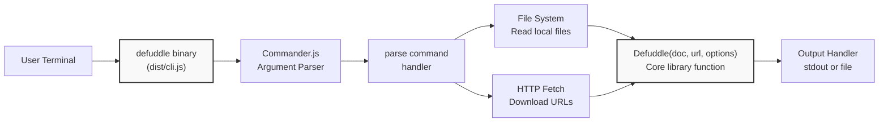
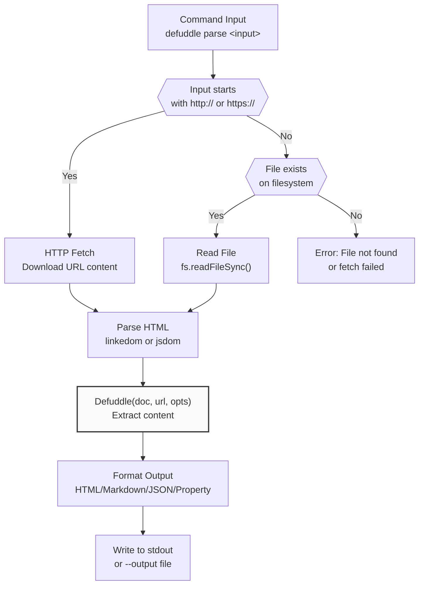
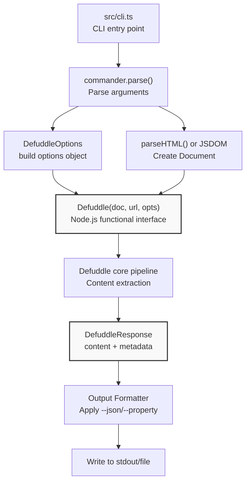

# Command Line Interface

<details>
<summary>관련 소스 파일</summary>

다음 파일들이 이 위키 페이지를 생성하기 위한 컨텍스트로 사용되었습니다:

- [README.md](README.md)
- [package-lock.json](package-lock.json)
- [package.json](package.json)
- [src/metadata.ts](src/metadata.ts)
- [src/types.ts](src/types.ts)
- [tsconfig.node.json](tsconfig.node.json)
- [webpack.config.js](webpack.config.js)

</details>


Command Line Interface(CLI)는 terminal에서 web page와 HTML file을 parsing하기 위한 standalone executable을 제공합니다. 이는 core Defuddle library를 argument parsing 및 file I/O capability로 감싸며, code를 작성하지 않고도 빠른 content extraction을 가능하게 합니다. CLI는 executable binary(`defuddle`)로 배포되며 local 또는 `npx`를 통해 사용할 수 있습니다.

Browser environment에서 Defuddle을 사용하는 방법은 [Browser Usage](#9.1)를 참조하세요. Node.js integration은 [Node.js Integration](#9.2)을 참조하세요.

---

## Installation and Execution

CLI는 두 가지 방식으로 실행할 수 있습니다. Global installation 또는 `npx`입니다.

### Global Installation

어디서나 `defuddle` command를 사용하려면 package를 globally install합니다:

```bash
npm install -g defuddle
```

Installation 후 `defuddle` command를 system-wide로 사용할 수 있습니다:

```bash
defuddle parse https://example.com/article
```

### NPX Execution

`npx`를 사용해 installation 없이 CLI를 실행합니다:

```bash
npx defuddle parse page.html
```

이 접근 방식은 CLI를 임시로 download하고 execute하므로 one-off parsing이나 CI/CD environment에 유용합니다.

**출처:** [package.json:6-8](), [README.md:68-134]()

---

## Binary Configuration

CLI는 `package.json`의 `bin` entry에 설정되며, command name을 compiled output에 mapping합니다:

| Field | Value | Description |
|-------|-------|-------------|
| Command Name | `defuddle` | CLI를 invoke할 때 사용하는 이름 |
| Entry Point | `dist/cli.js` | Command 실행 시 execute되는 compiled JavaScript file |
| Source File | `src/cli.ts` | CLI implementation용 TypeScript source file |

Build process는 `src/cli.ts`를 Node.js environment를 target으로 하는 CommonJS module인 `dist/cli.js`로 compile합니다.

**출처:** [package.json:6-8](), [tsconfig.node.json:16]()

---

## Command Structure

### CLI Command Architecture



**출처:** [package.json:6-8,76](), [tsconfig.node.json:16]()

### Parse Command

CLI는 현재 하나의 command인 `parse`를 제공합니다. 이 command는 file path 또는 URL을 argument로 받아 Defuddle의 extraction pipeline을 통해 content를 처리합니다.

```bash
defuddle parse <input>
```

`<input>`은 다음일 수 있습니다:
- **Local file path**: `page.html`, `./content/article.html`, `/tmp/page.html`
- **HTTP/HTTPS URL**: `https://example.com/article`

**출처:** [README.md:68-91]()

---

## Options Reference

CLI는 extraction behavior와 output format을 제어하기 위한 여러 option을 받습니다. Option은 long form(`--option`) 또는 사용 가능한 경우 short form(`-o`)으로 지정할 수 있습니다.

### Options Table

| Option | Alias | Type | Description |
|--------|-------|------|-------------|
| `--output <file>` | `-o` | string | stdout 대신 지정된 file에 output 작성 |
| `--markdown` | `-m` | boolean | Content를 Markdown format으로 변환 |
| `--md` | | boolean | `--markdown`의 alias |
| `--json` | `-j` | boolean | Complete response를 JSON으로 output(metadata와 content 포함) |
| `--property <name>` | `-p` | string | 특정 property만 추출하고 output(예: `title`, `author`) |
| `--debug` | | boolean | Debug mode 활성화(content selector와 removal detail 표시) |

### Option Behavior

**Output Control:**
- Default: Content는 stdout에 작성됩니다
- `--output` 사용 시: Content는 지정된 file path에 작성됩니다
- File path는 relative 또는 absolute일 수 있습니다

**Content Format:**
- Default: Cleaned HTML
- `--markdown` 또는 `--md` 사용 시: HTML이 Markdown으로 변환됩니다
- `--json` 사용 시: Complete `DefuddleResponse` object가 JSON으로 serialized됩니다

**Property Extraction:**
- `--property`는 response에서 지정된 field만 output합니다
- Valid properties: `title`, `author`, `description`, `domain`, `favicon`, `image`, `language`, `published`, `site`, `wordCount`, `parseTime`
- Scripting 및 다른 command로 piping할 때 유용합니다

**출처:** [README.md:93-102]()

---

## Usage Examples

### Basic Content Extraction

Local HTML file을 parse하고 cleaned HTML을 stdout에 output합니다:

```bash
defuddle parse article.html
```

URL을 parse합니다:

```bash
defuddle parse https://example.com/blog/post
```

### Markdown Conversion

Markdown으로 변환하고 표시합니다:

```bash
defuddle parse page.html --markdown
```

Markdown을 file에 저장합니다:

```bash
defuddle parse https://example.com/article --markdown --output article.md
```

### JSON Output

Metadata가 포함된 complete response를 JSON으로 가져옵니다:

```bash
defuddle parse page.html --json
```

`jq`로 JSON을 pretty-print합니다:

```bash
defuddle parse page.html --json | jq
```

### Property Extraction

Title만 추출합니다:

```bash
defuddle parse page.html --property title
```

Script에서 사용하기 위해 author를 추출합니다:

```bash
AUTHOR=$(defuddle parse article.html --property author)
echo "Article by: $AUTHOR"
```

### Debug Mode

Extraction detail을 봅니다:

```bash
defuddle parse page.html --debug
```

Debug output에는 어떤 element가 선택되었고 processing 중 무엇이 제거되었는지 보여주는 `debug.contentSelector`와 `debug.removals` field가 포함됩니다.

**출처:** [README.md:68-91]()

---

## Input Processing Flow

### Input Type Detection and Processing



**Implementation Details:**

1. **URL Detection**: Input에 `http://` 또는 `https://` prefix가 있는지 확인
2. **URL Fetching**: HTTP(S) request로 page content download
3. **File Reading**: Local file을 filesystem에서 synchronously read
4. **HTML Parsing**: Content를 linkedom 또는 jsdom을 사용해 DOM Document로 parse
5. **URL Context**: Metadata extraction 및 resource resolution을 위해 URL을 Defuddle에 전달
6. **Processing**: Document를 Defuddle pipeline으로 처리
7. **Output Formatting**: 지정된 option에 따라 result format

**출처:** [README.md:68-91](), [tsconfig.node.json:16]()

---

## Dependencies and Build Configuration

### CLI Dependencies

CLI는 다음 dependency를 사용합니다:

| Dependency | Purpose | Type |
|------------|---------|------|
| `commander` | Command-line argument parsing | Runtime (required) |
| `linkedom` | Node.js용 DOM implementation | Optional (or jsdom) |
| `turndown` | Markdown conversion | Optional |
| `temml` | Math rendering (LaTeX to MathML) | Optional |
| `mathml-to-latex` | Math conversion (MathML to LaTeX) | Optional |

`commander` library는 유일한 required runtime dependency입니다. Optional dependency는 full feature support(markdown conversion, math processing)를 활성화합니다.

**출처:** [package.json:75-83]()

### TypeScript Compilation

CLI는 Node.js-specific setting으로 browser bundle과 별도로 compile됩니다:

```json
{
  "module": "CommonJS",
  "target": "ES2020",
  "outDir": "dist",
  "types": ["node"]
}
```

**Configuration Details:**
- **Module System**: Node.js compatibility를 위한 CommonJS
- **Target**: ES2020 JavaScript
- **Output**: `dist/cli.js`
- **Type Definitions**: Node.js type 포함

CLI는 core library type과 interface를 공유하지만, Node.js runtime environment와의 compatibility를 보장하기 위해 Node.js-specific build configuration을 사용합니다.

**출처:** [tsconfig.node.json:1-18]()

---

## Integration with Core Library

### CLI to Core Library Flow



**Integration Details:**

CLI는 functional interface를 제공하는 Node.js bundle(`defuddle/node`)을 사용합니다:

```typescript
Defuddle(document: Document, url?: string, options?: DefuddleOptions): Promise<DefuddleResponse>
```

**Option Mapping:**
- `--markdown` → `{ markdown: true }`
- `--debug` → `{ debug: true }`
- 모든 flag는 `DefuddleOptions`의 대응 field로 mapping됩니다

**Response Processing:**
- Default: `response.content`가 output됩니다
- `--json` 사용 시: 전체 `DefuddleResponse` object가 serialized됩니다
- `--property` 사용 시: response에서 특정 field가 추출됩니다

**출처:** [src/types.ts:34-41,43-126](), [README.md:54-64]()

---

## Output Format Details

### HTML Output (Default)

Format option을 지정하지 않으면 CLI는 cleaned HTML을 output합니다:

```html
<article>
  <h2>Article Title</h2>
  <p>Article content...</p>
  <figure>
    
    <figcaption>Image caption</figcaption>
  </figure>
</article>
```

HTML은 Defuddle의 normalization rule에 따라 standardized됩니다([Content Standardization](#5) 참조).

### Markdown Output

`--markdown` 또는 `--md` 사용 시 content는 Markdown으로 변환됩니다:

```markdown
## Article Title

Article content...


*Image caption*
```

Conversion은 table, figure, code block, math element용 custom rule이 있는 Turndown을 사용합니다([Markdown Conversion](#7) 참조).

### JSON Output

`--json` 사용 시 complete response가 serialized됩니다:

```json
{
  "content": "<article>...</article>",
  "title": "Article Title",
  "author": "John Doe",
  "description": "Article summary",
  "domain": "example.com",
  "language": "en",
  "published": "2024-01-15",
  "wordCount": 1250,
  "parseTime": 45
}
```

`DefuddleResponse`의 모든 field가 포함되어 content와 metadata 모두에 programmatic access할 수 있습니다.

### Property Output

`--property <name>` 사용 시 지정된 field value만 output됩니다:

```bash
$ defuddle parse page.html --property title
Article Title

$ defuddle parse page.html --property wordCount
1250
```

이를 통해 shell script 및 pipeline과 쉽게 통합할 수 있습니다.

**출처:** [src/types.ts:34-41](), [README.md:78-91]()

---

## Debug Mode

### Debug Output Structure

`--debug`가 활성화되면 response에는 추가 diagnostic information이 포함됩니다:

```json
{
  "content": "...",
  "debug": {
    "contentSelector": "article.post-content",
    "removals": [
      {
        "step": "removeBySelector",
        "selector": ".social-share",
        "reason": "Exact selector match",
        "text": "Share on Twitter Share on Facebook..."
      },
      {
        "step": "removeLowScoring",
        "reason": "score: -15",
        "text": "Related Articles: Article 1 Article 2..."
      }
    ]
  }
}
```

### Debug Fields

| Field | Type | Description |
|-------|------|-------------|
| `debug.contentSelector` | string | Extraction algorithm이 선택한 main content element의 CSS selector path |
| `debug.removals` | array | Processing 중 제거된 element와 이유의 list |

### Removal Entry Structure

`debug.removals`의 각 entry는 다음을 포함합니다:

| Field | Type | Description |
|-------|------|-------------|
| `step` | string | Element를 제거한 pipeline step(예: `removeBySelector`, `removeLowScoring`, `removeHiddenElements`) |
| `selector` | string | Match된 CSS selector 또는 pattern(selector-based removal의 경우) |
| `reason` | string | Element가 제거된 이유(예: `score: -20`, `display:none`) |
| `text` | string | 제거된 element text content의 처음 200자 |

Debug mode는 extraction issue를 진단하고 특정 content가 포함되거나 제외된 이유를 이해하는 데 유용합니다.

**출처:** [src/types.ts:22-32](), [README.md:260-295]()

---

## Typical Workflows

### Content Archival

Archival을 위해 article을 download하고 Markdown으로 변환합니다:

```bash
# Single article
defuddle parse https://example.com/article --markdown --output archive/article.md

# Batch processing
cat urls.txt | while read url; do
  filename=$(echo "$url" | md5sum | cut -d' ' -f1).md
  defuddle parse "$url" --markdown --output "archive/$filename"
done
```

### Metadata Extraction

Cataloging을 위해 metadata를 추출합니다:

```bash
# Create CSV of article metadata
echo "URL,Title,Author,Published" > articles.csv
cat urls.txt | while read url; do
  title=$(defuddle parse "$url" --property title)
  author=$(defuddle parse "$url" --property author)
  published=$(defuddle parse "$url" --property published)
  echo "$url,$title,$author,$published" >> articles.csv
done
```

### Content Analysis

Content statistic을 분석합니다:

```bash
# Get word count for research
defuddle parse paper.html --property wordCount

# Extract title and author for citation
TITLE=$(defuddle parse article.html --property title)
AUTHOR=$(defuddle parse article.html --property author)
echo "Citation: $AUTHOR. \"$TITLE.\""
```

### CI/CD Integration

Automated test에서 documentation extraction을 validate합니다:

```bash
# Extract documentation from HTML
defuddle parse docs/page.html --markdown --output docs/page.md

# Verify extraction succeeded
if [ $? -eq 0 ]; then
  git add docs/page.md
  git commit -m "Update documentation from HTML"
fi
```

**출처:** [README.md:68-91]()
