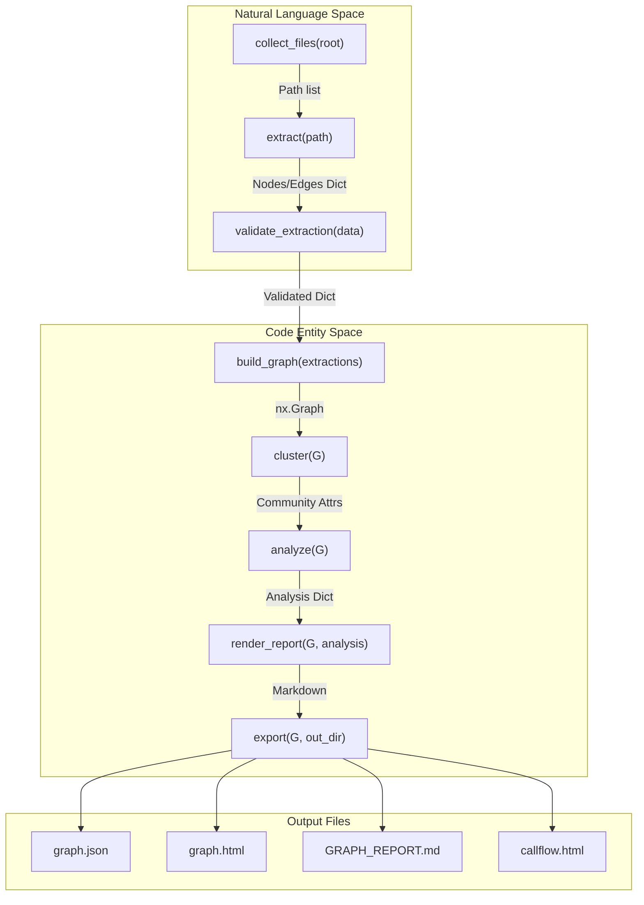
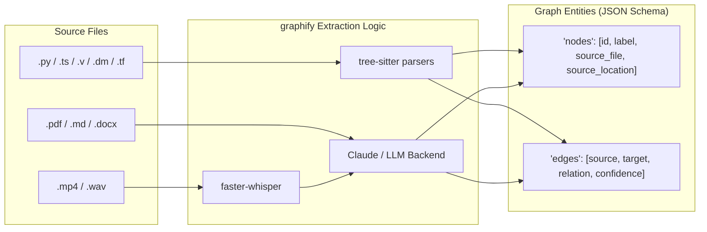

# 개요

관련 소스 파일

다음 파일들이 이 위키 페이지를 생성하기 위한 컨텍스트로 사용되었습니다.

- [ARCHITECTURE.md](ARCHITECTURE.md)
- [CHANGELOG.md](CHANGELOG.md)
- [README.md](README.md)
- [pyproject.toml](pyproject.toml)
- [worked/httpx/GRAPH_REPORT.md](worked/httpx/GRAPH_REPORT.md)
- [worked/httpx/review.md](worked/httpx/review.md)
- [worked/karpathy-repos/GRAPH_REPORT.md](worked/karpathy-repos/GRAPH_REPORT.md)
- [worked/karpathy-repos/graph.json](worked/karpathy-repos/graph.json)
- [worked/karpathy-repos/review.md](worked/karpathy-repos/review.md)
- [worked/mixed-corpus/review.md](worked/mixed-corpus/review.md)

`graphify`는 코드, 문서, 연구 논문, 이미지, 비디오가 이질적으로 섞여 있는 디렉터리를 질의 가능한 구조화 지식 그래프로 변환하도록 설계된 AI 코딩 어시스턴트 스킬이자 Python 라이브러리입니다 [README.md:23-27](). 코드에는 AST 기반 추출을, 비정형 데이터에는 LLM 기반 의미 추출을 활용하여, 원시 파일 읽기와 비교했을 때 복잡한 질의에서 상당한 토큰 감소(최대 71.5배)를 달성합니다 [README.md:27-28](), [worked/karpathy-repos/review.md:21-27]().

이 프로젝트는 대규모 멀티모달 저장소에서 발생하는 "컨텍스트 창 초과" 문제를 해결하기 위해 존재하며, 구조적 명확성과 지속적인 그래프 기반 탐색을 제공합니다 [README.md:23-28]().

### 주요 기능

*   **멀티모달 추출**: `tree-sitter`를 통해 25개 이상의 프로그래밍 언어(Dart, Verilog/SystemVerilog, PHP, BYOND DreamMaker, Terraform/HCL, .NET 프로젝트 파일 포함)를 지원하고, Claude와 Whisper를 통해 비정형 데이터(PDF, 이미지, markdown, 비디오/오디오)를 지원합니다 [README.md:25-26](), [pyproject.toml:17-43](), [CHANGELOG.md:14-15]().
*   **구조 분석**: 서로 다른 도메인 전반에서 "God Nodes"(차수가 높은 허브)와 "Surprising Connections"(예: 특정 코드 구현이 연구 논문 인용과 연결되는 경우)를 자동으로 식별합니다 [ARCHITECTURE.md:21](), [worked/httpx/GRAPH_REPORT.md:12-23]().
*   **대화형 시각화**: 검색 가능한 HTML/vis.js 그래프, Obsidian vault, D3 접이식 트리, Mermaid 기반 아키텍처 호출 흐름 다이어그램을 생성합니다 [README.md:33-46](), [ARCHITECTURE.md:23-24]().
*   **증분 업데이트**: SHA256 의미 캐시를 사용해 변경된 파일만 다시 처리되도록 보장하며, 실시간 동기화를 위한 파일 감시기를 제공합니다 [ARCHITECTURE.md:26-30]().
*   **에이전트 통합**: AI 에이전트가 그래프와 직접 상호작용할 수 있도록 MCP(Model Context Protocol) 서버를 제공하고, Claude Code, Cursor, Aider, Kiro, Gemini, Amp, Trae 같은 플랫폼을 위한 특화 스킬을 제공합니다 [README.md:104-126](), [pyproject.toml:100-101]().

### 상위 수준 파이프라인

시스템은 각 단계가 자체 모듈로 격리되고 일반 Python 딕셔너리와 NetworkX 그래프 객체를 통해 통신하는 선형 파이프라인으로 동작합니다 [ARCHITECTURE.md:7-11]().

**graphify 파이프라인 흐름**

출처: [ARCHITECTURE.md:7-31](), [README.md:33-46]()

### 하위 시스템 관계

`graphify`는 여러 특화 하위 시스템을 통해 원시 소스 파일과 구조화 그래프 데이터 사이의 간극을 연결합니다.

| 하위 시스템 | 핵심 모듈 | 책임 |
| :--- | :--- | :--- |
| **감지** | `detect.py` | 파일을 발견하고 유형(코드, 문서, 논문, 이미지, 비디오)별로 분류합니다 [ARCHITECTURE.md:17](). |
| **추출** | `extract.py` | AST 구조 추출에는 `tree-sitter`를 사용하고, 의미 관계에는 LLM/Whisper를 사용합니다 [ARCHITECTURE.md:18](), [README.md:134-142](). |
| **그래프 로직** | `build.py`, `cluster.py` | 추출 결과를 `NetworkX` 그래프로 조립하고 Leiden 커뮤니티 감지를 적용합니다 [ARCHITECTURE.md:19-20](). |
| **분석** | `analyze.py` | 노드 중심성(God Nodes)과 커뮤니티 간 "surprises"를 계산합니다 [ARCHITECTURE.md:21](). |
| **시각화** | `callflow_html.py`, `tree_html.py` | Mermaid 기반 호출 흐름과 D3 모듈 계층 트리를 생성합니다 [ARCHITECTURE.md:24](). |
| **인터페이스** | `serve.py`, `watch.py` | MCP 서버와 실시간 파일 시스템 모니터링을 제공합니다 [ARCHITECTURE.md:29-30](). |

**엔티티 매핑: 소스에서 그래프로**

출처: [ARCHITECTURE.md:33-46](), [README.md:25-27](), [pyproject.toml:17-43](), [CHANGELOG.md:14-15]()

### 시작하기 및 설치
Claude Code 스킬 등록(`graphify install`), `uv tool install graphifyy` 사용(권장), `mcp`, `neo4j`, `pdf`, `video` 같은 선택적 의존성 그룹 관리 등 자세한 설정 지침은 **[시작하기 및 설치](#1.1)**를 참조하세요.

### 변경 로그 및 버전 이력
파이프라인의 진화, `graphify affected` 명령 도입 같은 아키텍처 변화, Amp, Kiro, Devin 같은 새 플랫폼 지원을 추적하려면 **[변경 로그 및 버전 이력](#1.2)**을 참조하세요.
