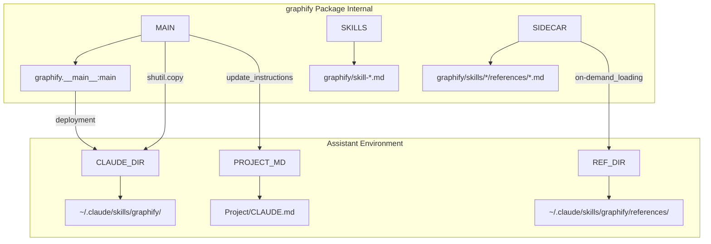
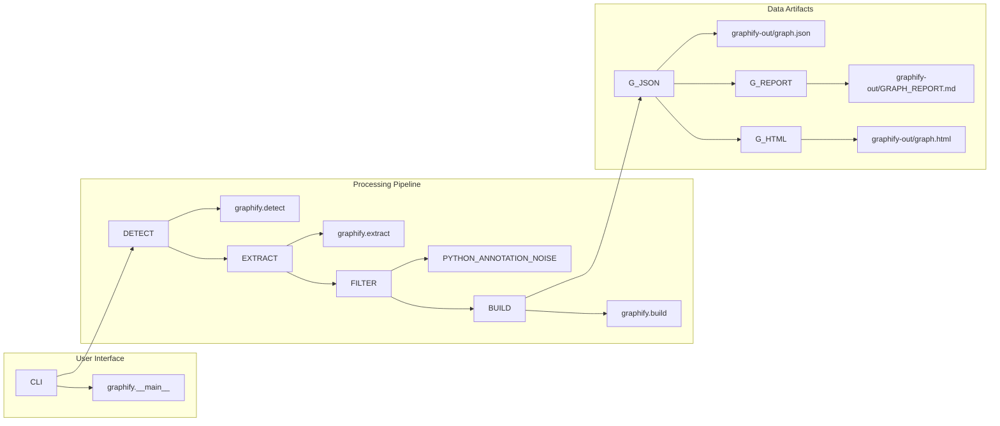

# 시작하기 및 설치

<details>
<summary>관련 소스 파일</summary>

다음 파일들은 이 위키 페이지를 생성하기 위한 컨텍스트로 사용되었습니다.

- [.github/workflows/ci.yml](.github/workflows/ci.yml)
- [CHANGELOG.md](CHANGELOG.md)
- [LICENSE](LICENSE)
- [README.md](README.md)
- [pyproject.toml](pyproject.toml)
- [tests/test_backend_extras.py](tests/test_backend_extras.py)
- [uv.lock](uv.lock)

</details>


이 페이지는 `graphify` 설치, AI 어시스턴트 스킬 등록, 설정 검증을 위한 단계별 가이드를 제공합니다. `graphify`는 코드, 문서, 논문, 이미지 또는 비디오가 포함된 디렉터리를 질의 가능한 지식 그래프로 변환합니다.

## 설치

`graphify`는 Python 패키지 `graphifyy`(y 두 개)로 배포됩니다 [README.md:80-80](). **Python 3.10 이상**이 필요합니다 [pyproject.toml:12-12]().

### 권장 설치 방식(uv)
`graphify`를 설치하는 권장 방식은 `uv`를 사용하는 것입니다. `uv`는 도구 격리와 의존성 해결을 효율적으로 처리합니다. `uv`는 `graphify` 명령이 자동으로 사용자의 `PATH`에 배치되도록 보장합니다 [README.md:85-86]().

```bash
# Install as a global tool
uv tool install graphifyy

# Run once without installing
uvx graphifyy install
```
이 프로젝트는 자체 개발과 CI에 `uv`를 사용하며, `uv.lock` [uv.lock:1-12]() 및 `.github/workflows/ci.yml` [.github/workflows/ci.yml:27-30]()을 통해 일관된 환경을 보장합니다.

### 대체 설치 방식(pip)
기본 설치에는 핵심 그래프 조립(`networkx`), 엔터티 중복 제거(`datasketch`, `rapidfuzz`), 그리고 `tree-sitter`를 통한 20개 이상 언어의 구조 추출이 포함됩니다 [pyproject.toml:13-43]().

```bash
pip install graphifyy
```

### 선택적 의존성 그룹
`graphify`는 특화 데이터 유형, infrastructure-as-code, 고급 기능을 지원하기 위해 선택적 extras를 사용합니다 [pyproject.toml:50-73]().

| 그룹 | 명령 | 목적 |
| :--- | :--- | :--- |
| `mcp` | `pip install "graphifyy[mcp]"` | Model Context Protocol 서버 지원 [pyproject.toml:51-51](). |
| `neo4j` | `pip install "graphifyy[neo4j]"` | Neo4j 데이터베이스로 직접 주입 [pyproject.toml:52-52](). |
| `pdf` | `pip install "graphifyy[pdf]"` | `pypdf`와 `markdownify`를 통한 PDF 수집 [pyproject.toml:53-53](). |
| `watch` | `pip install "graphifyy[watch]"` | `watchdog`를 통한 실시간 모니터링 [pyproject.toml:54-54](). |
| `svg` | `pip install "graphifyy[svg]"` | `matplotlib`를 통한 정적 SVG 렌더링 [pyproject.toml:55-55](). |
| `leiden` | `pip install "graphifyy[leiden]"` | 고급 Leiden 클러스터링(Python < 3.13) [pyproject.toml:56-56](). |
| `office` | `pip install "graphifyy[office]"` | Word(`.docx`) 및 Excel(`.xlsx`) 지원 [pyproject.toml:57-57](). |
| `video` | `pip install "graphifyy[video]"` | `faster-whisper`를 통한 전사 [pyproject.toml:59-59](). |
| `chinese` | `pip install "graphifyy[chinese]"` | `jieba`를 통한 중국어 토큰화 [pyproject.toml:66-66](). |
| `terraform` | `pip install "graphifyy[terraform]"` | `tree-sitter-hcl`을 통한 Terraform/HCL 추출 [pyproject.toml:72-72](). |
| `anthropic` | `pip install "graphifyy[anthropic]"` | Claude 백엔드 지원 [pyproject.toml:63-63](). |
| `all` | `pip install "graphifyy[all]"` | 위에 나열된 모든 extras를 설치합니다 [pyproject.toml:73-73](). |

**출처:** [pyproject.toml:12-73](), [uv.lock:1-12](), [CHANGELOG.md:14-14]()

---

## AI 어시스턴트 스킬 등록

설치 후에는 AI 코딩 어시스턴트에서 `/graphify` 명령을 활성화하기 위해 `graphify`를 "skill"로 등록해야 합니다.

### `graphify install` 명령
`graphify install` 명령(`graphify.__main__:main`에 매핑됨 [pyproject.toml:76-76]())은 등록을 자동화합니다. 버전 0.8.33부터 이 명령을 TTY 터미널에서 실행하면 호박색 "knowledge-graph brain" 배너가 표시됩니다 [CHANGELOG.md:7-7]().

1.  **스킬 배포**: 플랫폼별 manifest(예: `skill-codex.md`, `skill-trae.md`)를 어시스턴트의 로컬 설정 디렉터리로 복사합니다 [pyproject.toml:113-113]().
2.  **점진적 공개**: 최신 설치는 간결한 `SKILL.md` 코어(약 615줄)와 온디맨드 도구 문서를 위한 `references/` sidecar를 사용합니다 [CHANGELOG.md:35-35]().
3.  **지침 주입**: `CLAUDE.md` 같은 프로젝트 수준 파일을 업데이트하여 어시스턴트가 `/graphify` 명령을 트리거하는 방법을 알 수 있게 합니다 [README.md:93-97]().

### 설치 데이터 흐름
이 다이어그램은 `graphify install`이 Python 패키지 asset을 어시스턴트의 설정 공간에 연결하는 방식을 보여줍니다.

**제목: 스킬 등록 및 설정 흐름**

**출처:** [pyproject.toml:76-76](), [pyproject.toml:113-113](), [CHANGELOG.md:35-35](), [README.md:93-97]()

---

## 설정 검증

### 1. CLI 검증
진입점과 버전을 확인합니다.
```bash
graphify --version
graphify --help
```

### 2. 스킬 검증
스킬이 성공적으로 배포되었는지 확인합니다. 전역 home 경로 대신 현재 저장소(예: `.claude/skills/`)에 스킬을 설치하려면 `graphify install --project`를 사용할 수 있습니다 [README.md:101-105]().

### 3. CI 및 테스트
이 프로젝트는 `uv` 기반 CI 워크플로를 사용합니다 [.github/workflows/ci.yml:63-71](). 테스트 스위트를 실행하여 로컬 환경을 검증할 수 있습니다.
```bash
uv run pytest tests/ -q --tb=short
```

### 파이프라인 실행 흐름
이 다이어그램은 노이즈를 억제하는 추출 필터를 포함하여, 명령줄 인터페이스와 핵심 실행 모듈 사이의 관계를 보여줍니다.

**제목: 파이프라인 실행 및 검증**

**출처:** [CHANGELOG.md:9-9](), [README.md:34-41](), [pyproject.toml:76-76]()

---

## CI 워크플로

`graphify`는 GitHub Actions를 통해 견고한 CI 파이프라인을 유지합니다 [.github/workflows/ci.yml:1-10]().

*   **트리거**: `main` 및 버전 브랜치(`v1`-`v8`)에 대한 push와 PR에서 실행됩니다 [.github/workflows/ci.yml:4-7]().
*   **환경**: Python 3.10 및 3.12에서 matrix 테스트를 수행합니다 [.github/workflows/ci.yml:51-53]().
*   **워크플로 단계**:
    1.  **Skillgen 검사**: 생성된 스킬 artifact가 `tools/skillgen/`의 fragment와 최신 상태인지 검증합니다 [.github/workflows/ci.yml:11-48]().
    2.  **uv 설치**: `astral-sh/setup-uv`를 사용합니다 [.github/workflows/ci.yml:63-66]().
    3.  **동기화**: 재현 가능한 환경을 보장하기 위해 `uv sync --all-extras --frozen`을 실행합니다 [.github/workflows/ci.yml:70-71]().
    4.  **테스트**: `pytest`를 실행합니다 [.github/workflows/ci.yml:73-74]().
    5.  **E2E 검사**: CI 환경에서 `graphify install`이 성공하는지 검증합니다 [.github/workflows/ci.yml:76-80]().

**출처:** [.github/workflows/ci.yml:1-80](), [pyproject.toml:98-101]()
