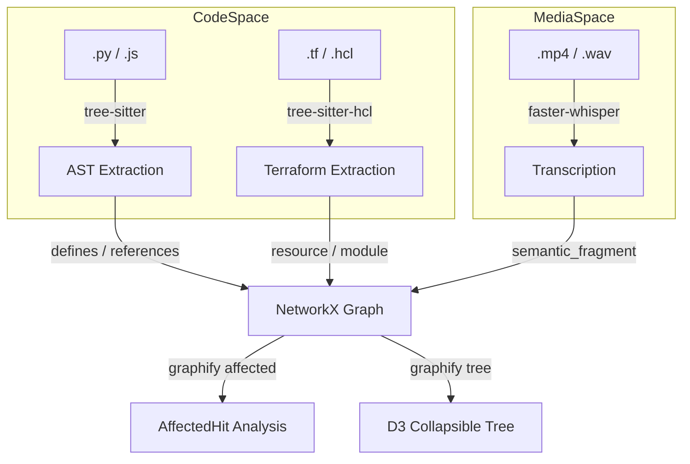
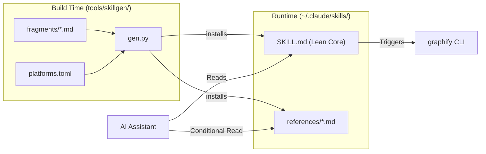

# 변경 로그 및 버전 이력

관련 소스 파일

다음 파일들은 이 위키 페이지를 생성하기 위한 컨텍스트로 사용되었습니다.

- [CHANGELOG.md](CHANGELOG.md)
- [README.md](README.md)
- [pyproject.toml](pyproject.toml)

이 페이지는 `graphify` 코드베이스의 발전 과정을 기술적으로 요약합니다. 구조적 AST 추출기에서 포괄적인 멀티모달 지식 관리 도구로 프로젝트가 전환되는 과정에서 있었던 주요 아키텍처 변화, 성능 최적화, 기능 추가를 강조합니다.

## 릴리스 이력 개요

다음 표는 최근 릴리스 전반에서 주요 기능과 수정 사항의 진행 과정을 요약하며, infrastructure-as-code 지원, 점진적 공개 방식의 스킬 제공, 정교해진 엔터티 무결성으로 확장된 흐름을 보여줍니다.

| 버전 | 날짜 | 핵심 초점 | 주요 변경 사항 |
|:---|:---|:---|:---|
| **0.8.33** | 2026-06-06 | Signal | **Python annotation noise filter**; **Install banner**; **Ghost-duplicate auto-merge**; Submodule import resolution. |
| **0.8.32** | 2026-06-05 | Infra | **Terraform/HCL support**; Offline code-only extraction; **GRAPHIFY_API_TIMEOUT** fix. |
| **0.8.31** | 2026-06-03 | Observability | **Query logging**(~/.cache/graphify-queries.log); `sys.executable` 임베딩을 통한 **Hook script hardening**. |
| **0.8.30** | 2026-06-03 | Integration | **Read/Glob tool nudge**; `anthropic` optional extra; Antigravity project-scoped install fix. |
| **0.8.29** | 2026-06-02 | Performance | **Progressive-disclosure skill files**(47% 컨텍스트 절감); 보안: **local providers opt-in**. |
| **0.8.25** | 2026-05-29 | Stability | JS/TS용 **Phantom god-node fix**; Lua `require` resolution; **uv-aware** skill interpreters. |
| **0.8.22** | 2026-05-28 | Modality | **BYOND DreamMaker** 지원(.dm, .dmi, .dmm, .dmf); LLM용 **`--mode deep`** 플래그. |
| **0.8.21** | 2026-05-27 | Integration | **MCP config extraction**; Amp platform support; **`graphify tree`** command. |

**출처:**
- [CHANGELOG.md:5-11]()
- [CHANGELOG.md:12-18]()
- [CHANGELOG.md:20-25]()
- [CHANGELOG.md:27-32]()
- [CHANGELOG.md:33-38]()
- [CHANGELOG.md:43-47]()
- [pyproject.toml:5-13]()

---

## v0.8.x: 인텔리전스 및 엔터티 무결성

`0.8.x` 브랜치는 "Graph Intelligence"로의 전환을 나타냅니다. 여기서 그래프는 단순한 시각화 용도가 아니라 능동적인 개발자 워크플로 지원과 깊은 의미 이해를 위해 사용됩니다.

### 점진적 공개 및 컨텍스트 관리
버전 `0.8.29`는 AI 어시스턴트가 `graphify`와 상호작용하는 방식에 큰 아키텍처 변화를 도입했습니다.
*   **간결한 핵심 스킬:** 중요도가 낮은 경로(exports, transcription, hooks)를 `references/` sidecar로 옮겨 호스트별 `SKILL.md`를 약 1156줄에서 약 615줄로 줄였습니다 [CHANGELOG.md:35-35]().
*   **온디맨드 로딩:** 이제 에이전트는 특정 명령(예: `graphify export`)이 트리거될 때만 reference 파일을 읽어 초기 컨텍스트 창을 약 47% 절약합니다 [CHANGELOG.md:35-35]().
*   **Skillgen 빌드 시스템:** 이제 모든 플랫폼별 스킬은 18개 이상의 지원 호스트에서 동등성을 보장하기 위해 `tools/skillgen/` 아래의 공유 fragment에서 생성됩니다 [CHANGELOG.md:35-35]().

### 신호 대 잡음 최적화
추출과 순위 지정의 개선은 "인공 god nodes"가 실제 코드 추상화를 밀어내는 일을 방지합니다.
*   **Python Annotation Filter:** 이제 `str`, `int`, `bool`, `MagicMock` 같은 내장 타입은 `_PYTHON_ANNOTATION_NOISE` 필터를 통해 억제됩니다. 이전에는 이러한 노드가 차수 수를 약 25% 부풀렸습니다 [CHANGELOG.md:9-9]().
*   **Ghost-Duplicate Merging:** 이제 `build_from_json`은 `(basename, label)` 일치를 기반으로 의미적 ghost nodes(소스 위치가 없는 노드)를 대응하는 AST 노드로 자동 병합합니다 [CHANGELOG.md:10-10]().
*   **Infrastructure Graphing:** Terraform/HCL 지원을 통해 `graphify`는 리소스, 모듈, provider를 애플리케이션 코드와 동일한 의존성 그래프에 매핑할 수 있습니다 [CHANGELOG.md:14-14]().

### 보안 및 관측 가능성
*   **Local Provider Opt-in:** SSRF 또는 자격 증명 유출을 방지하기 위해, 이제 프로젝트 로컬 `./.graphify/providers.json` 파일에는 `GRAPHIFY_ALLOW_LOCAL_PROVIDERS=1`이 필요합니다 [CHANGELOG.md:37-37]().
*   **Query Logging:** 이제 모든 그래프 질의가 JSONL 형식으로 `~/.cache/graphify-queries.log`에 기록되어 AI 상호작용에 대한 감사 추적을 제공합니다 [CHANGELOG.md:25-25]().
*   **Hook Hardening:** 이제 Git hook은 `sys.executable`을 스크립트에 직접 임베딩하여, `PATH`를 상속하지 않는 GUI git 클라이언트에서 발생하는 "command not found" 문제를 해결합니다 [CHANGELOG.md:22-22]().

**출처:**
- [CHANGELOG.md:9-10]()
- [CHANGELOG.md:14-14]()
- [CHANGELOG.md:22-22]()
- [CHANGELOG.md:25-25]()
- [CHANGELOG.md:35-35]()
- [CHANGELOG.md:37-37]()

---

## 코드 공간을 자연어 공간으로 매핑

다음 다이어그램은 `graphify`가 원시 코드 엔터티, 인프라 정의, 점진적 공개 스킬을 연결하는 방식을 보여줍니다.

### 인프라 및 미디어 수집
이 다이어그램은 전통적인 AST 추출, Terraform 인프라, 미디어 전사가 통합 그래프로 유입되는 방식을 보여줍니다.

제목: 멀티모달 및 인프라 수집

### 점진적 스킬 아키텍처
이 다이어그램은 `skillgen` 시스템이 플랫폼별 스킬을 조립하는 방식과 런타임에 해당 스킬이 파일 시스템과 상호작용하는 방식을 자세히 보여줍니다.

제목: 점진적 스킬 제공

**출처:**
- [CHANGELOG.md:14-14]()
- [CHANGELOG.md:35-35]()
- [pyproject.toml:72-72]()
- [pyproject.toml:113-113]()

---

## 성능 및 신호 최적화

### 증분 무결성
`graphify update` 경로는 `evict_sources`를 사용해 기존 그래프를 현재 디스크 상태와 조정합니다. 이를 통해 `source_file`이 더 이상 존재하지 않는 모든 노드가 제거되어, "ghost nodes"가 검색 결과에 나타나는 것을 방지합니다 [CHANGELOG.md:35-35]().

### 결정적 출력
에이전트와 CI의 일관성을 보장하기 위해, 이제 그래프 출력은 바이트 단위로 결정적입니다. `build_from_json`에서 edge는 `(source, target, relation)` 기준으로 정렬되며, hook에서는 커뮤니티 순서를 안정화하기 위해 `PYTHONHASHSEED=0`이 강제됩니다 [CHANGELOG.md:38-38]().

### 범위 인식 추출
*   **Python Annotation Noise:** `_PYTHON_ANNOTATION_NOISE` 필터는 str/int/bool/float/bytes/MagicMock이 그래프 노드가 되지 않도록 억제합니다 [CHANGELOG.md:9-9]().
*   **Submodule Resolution:** 이제 `from pkg import submod`는 하위 모듈 파일로 향하는 `imports_from` edge로 올바르게 해석되어 테스트 파일이 연결되지 않은 섬이 되는 것을 방지합니다 [CHANGELOG.md:8-8]().
*   **JS/TS Scope Guard:** "phantom god-nodes"를 방지하기 위해 arrow function 내부의 로컬 변수에 대한 노드 방출을 제한합니다 [CHANGELOG.md:7-7]().

**출처:**
- [CHANGELOG.md:7-9]()
- [CHANGELOG.md:35-35]()
- [CHANGELOG.md:38-38]()
