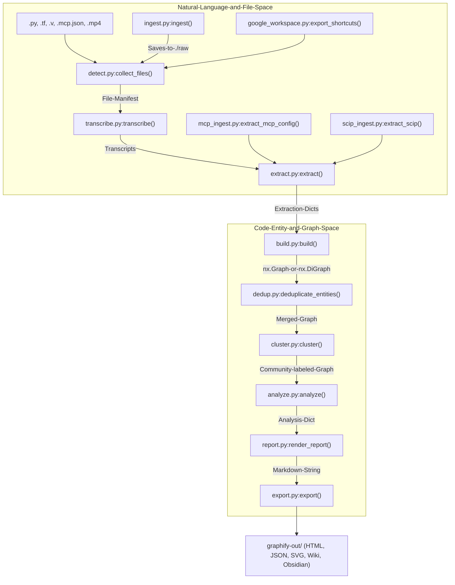
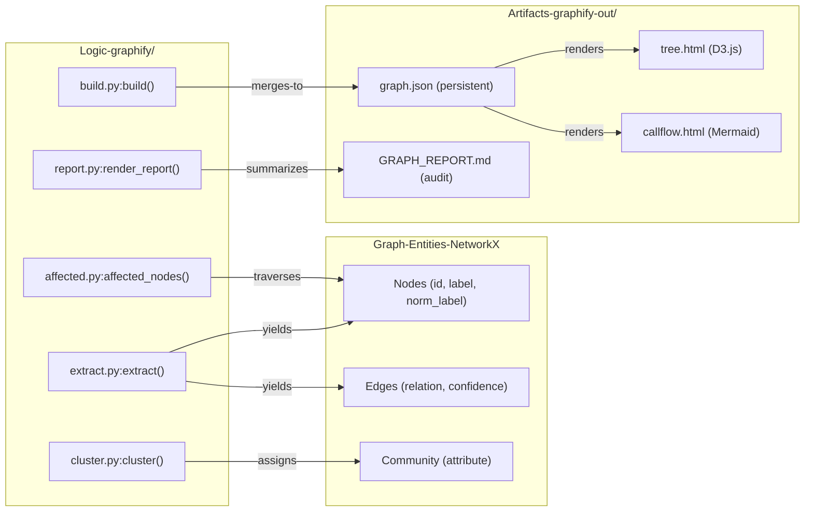

# 핵심 아키텍처

관련 소스 파일

다음 파일들은 이 위키 페이지를 생성하기 위한 컨텍스트로 사용되었습니다.

- [ARCHITECTURE.md](ARCHITECTURE.md)
- [CHANGELOG.md](CHANGELOG.md)
- [graphify/__main__.py](graphify/__main__.py)
- [pyproject.toml](pyproject.toml)
- [worked/httpx/GRAPH_REPORT.md](worked/httpx/GRAPH_REPORT.md)
- [worked/httpx/review.md](worked/httpx/review.md)
- [worked/karpathy-repos/GRAPH_REPORT.md](worked/karpathy-repos/GRAPH_REPORT.md)
- [worked/karpathy-repos/graph.json](worked/karpathy-repos/graph.json)
- [worked/karpathy-repos/review.md](worked/karpathy-repos/review.md)
- [worked/mixed-corpus/review.md](worked/mixed-corpus/review.md)

`graphify` 아키텍처는 비정형 또는 반정형 데이터(코드, 문서, 논문, 이미지, 오디오, 비디오)를 구조화되고 탐색 가능한 지식 그래프로 변환하는 선형 모듈식 파이프라인으로 설계되었습니다. 파이프라인의 각 단계는 전용 모듈에 캡슐화되어 있으며, 표준 Python 딕셔너리와 `NetworkX` 그래프 객체를 통해 통신합니다 [ARCHITECTURE.md:7-11]().

## 파이프라인 개요

시스템은 **detect → extract → build → cluster → analyze → report → export**라는 엄격한 순차 흐름을 따릅니다 [ARCHITECTURE.md:8-9](). 이러한 모듈성 덕분에 소스 파일에서 다시 추출하지 않고도 클러스터링이나 분석을 다시 실행하는 등 증분 업데이트가 가능합니다 [graphify/skill.md:19-23](). 이 파이프라인은 `faster-whisper`를 통한 비디오 전사, 외부 리소스를 위한 URL 수집, MCP 설정, SCIP JSON, Terraform/HCL 같은 infrastructure-as-code를 위한 특화 추출기를 포함한 고급 멀티모달 입력을 지원합니다 [graphify/skill.md:22,34](), [CHANGELOG.md:14, 50-51]().

### 상위 수준 데이터 흐름
다음 다이어그램은 시스템이 **자연어/파일 공간**에서 **코드 엔터티/그래프 공간**으로 전환되는 방식을 보여주며, 특정 Python 함수를 변환 단계에 매핑합니다.

**다이어그램: 파이프라인 단계 전환**

**출처:** [ARCHITECTURE.md:7-31](), [graphify/skill.md:58-132](), [CHANGELOG.md:14, 50-51](), [graphify/build.py:343-345](), [graphify/dedup.py:532-535]()

## 모듈 책임

각 모듈은 개별 변환을 수행합니다. 관심사의 분리는 AST 기반 추출(빠르고 결정적)을 그래프 조립 및 커뮤니티 감지와 분리되도록 보장합니다 [ARCHITECTURE.md:13-31]().

| 모듈 | 주요 함수 | 입력 → 출력 |
| :--- | :--- | :--- |
| `detect.py` | `collect_files()` | 디렉터리 → 필터링된 `Path` 객체 목록 [ARCHITECTURE.md:17]() |
| `extract.py` | `extract()` | 파일 경로 → 추출 딕셔너리 `{nodes, edges}` [ARCHITECTURE.md:18]() |
| `build.py` | `build()` | 추출 딕셔너리 → 병합된 엔터티가 있는 `nx.Graph` [ARCHITECTURE.md:19]() |
| `dedup.py` | `deduplicate_entities()` | 그래프 → MinHash/LSH를 사용한 중복 제거 그래프 [CHANGELOG.md:44-45]() |
| `cluster.py` | `cluster()` | 그래프 → `community` 속성이 있는 그래프 [ARCHITECTURE.md:20]() |
| `analyze.py` | `analyze()` | 그래프 → 분석 딕셔너리(god nodes, surprises, questions) [ARCHITECTURE.md:21]() |
| `report.py` | `render_report()` | 그래프 + 분석 → `GRAPH_REPORT.md` 문자열 [ARCHITECTURE.md:22]() |
| `export.py` | `export()` | 그래프 → Obsidian vault, JSON, HTML, SVG [ARCHITECTURE.md:23]() |
| `affected.py` | `affected_nodes()` | 노드 ID → 영향을 받는 downstream 노드 집합 [CHANGELOG.md:104-105]() |

**출처:** [ARCHITECTURE.md:15-31](), [graphify/build.py:343-345](), [graphify/dedup.py:532-535](), [graphify/affected.py:46-50]()

## 추출 출력 스키마

원본 파일과 그래프 조립 사이의 연결부는 표준화된 JSON 스키마입니다. 20개 이상 언어에 대한 Tree-sitter AST부터 Whisper transcript까지 모든 추출기는 `validate.py`로 검증될 수 있도록 이 스키마와 일치하는 데이터를 출력해야 합니다 [ARCHITECTURE.md:33-48]().

### 노드 및 엣지 요구 사항
*   **Nodes**: `id`, `label`, `source_file`, `source_location`을 포함해야 합니다. 구두점에 영향을 받지 않는 검색을 위해 `norm_label`도 포함하는 경우가 많습니다 [ARCHITECTURE.md:39-40](), [CHANGELOG.md:40-41]().
*   **Edges**: `source`, `target`, `relation`, `confidence`를 포함해야 합니다 [ARCHITECTURE.md:42-43]().

### 신뢰도 라벨
"정직한 감사 추적"을 유지하기 위해 모든 edge에는 신뢰도 수준이 태그됩니다 [ARCHITECTURE.md:50-56]().
*   **`EXTRACTED`**: 소스에 명시적으로 나타난 것(예: import 문, 직접 호출) [ARCHITECTURE.md:54]().
*   **`INFERRED`**: 합리적 추론(예: call-graph second pass, co-occurrence) [ARCHITECTURE.md:55]().
*   **`AMBIGUOUS`**: 사람의 검토가 필요하도록 표시된 불확실한 관계 [ARCHITECTURE.md:56]().

### 필터 및 정제
추출 프로세스에는 `_PYTHON_ANNOTATION_NOISE` 필터와 같은 노이즈 감소가 포함됩니다. 이 필터는 `str`, `int`, `MagicMock` 같은 일반 타입이 그래프를 어지럽히는 것을 방지합니다 [CHANGELOG.md:9]().

**출처:** [ARCHITECTURE.md:33-56](), [graphify/validate.py:1-28](), [CHANGELOG.md:9, 40-41]()

## 파이프라인 단계(하위 페이지)

각 단계의 자세한 기술 구현은 다음 하위 페이지를 참조하세요.

### [파일 감지 및 분류](#2.1)
`detect.py`가 파일을 발견하고, 민감한 파일 건너뛰기를 적용하며, 파일을 `code`, `document`, `video` 같은 유형으로 분류하는 방식을 다룹니다. Google Workspace shortcut export와 증분 manifest 관리도 다룹니다 [graphify/skill.md:124-132](), [CHANGELOG.md:35]().

### [추출 엔진](#2.2)
tree-sitter를 통한 AST 기반 구조 추출(Terraform/HCL, Dart, .NET 포함), `faster-whisper` 전사, 결정적 cross-file linking을 위한 `symbol_resolution.py`를 심층적으로 다룹니다 [ARCHITECTURE.md:18,25](), [CHANGELOG.md:8, 14, 50-51]().

### [그래프 조립, 중복 제거 및 클러스터링](#2.3)
`build.py`(딕셔너리 병합), `dedup.py`(MinHash/LSH + Jaro-Winkler 엔터티 중복 제거), `cluster.py`(안정적인 ID 재매핑을 포함한 Leiden 커뮤니티 감지)를 설명합니다 [ARCHITECTURE.md:19-20](), [CHANGELOG.md:44-45, 52-53]().

### [그래프 분석](#2.4)
`analyze.py`를 심층적으로 다룹니다. god nodes, surprising connections 식별과 BFS 기반 영향 분석을 위한 `affected.py`를 포함합니다 [ARCHITECTURE.md:21](), [CHANGELOG.md:104-105]().

### [보고서 생성](#2.5)
`report.py`가 커뮤니티 요약, ambiguous edges, 토큰 비용 metric으로부터 `GRAPH_REPORT.md`를 조립하는 방식을 설명합니다 [ARCHITECTURE.md:22]().

---

## 시스템 상호작용 다이어그램

이 다이어그램은 내부 Python 로직을 결과 그래프 엔터티 및 출력 artifact에 매핑합니다.

**다이어그램: 로직에서 엔터티로의 매핑**

**출처:** [ARCHITECTURE.md:7-31](), [graphify/tree_html.py:20-25](), [graphify/callflow_html.py:1-10](), [graphify/affected.py:46-50](), [CHANGELOG.md:40-41]()
