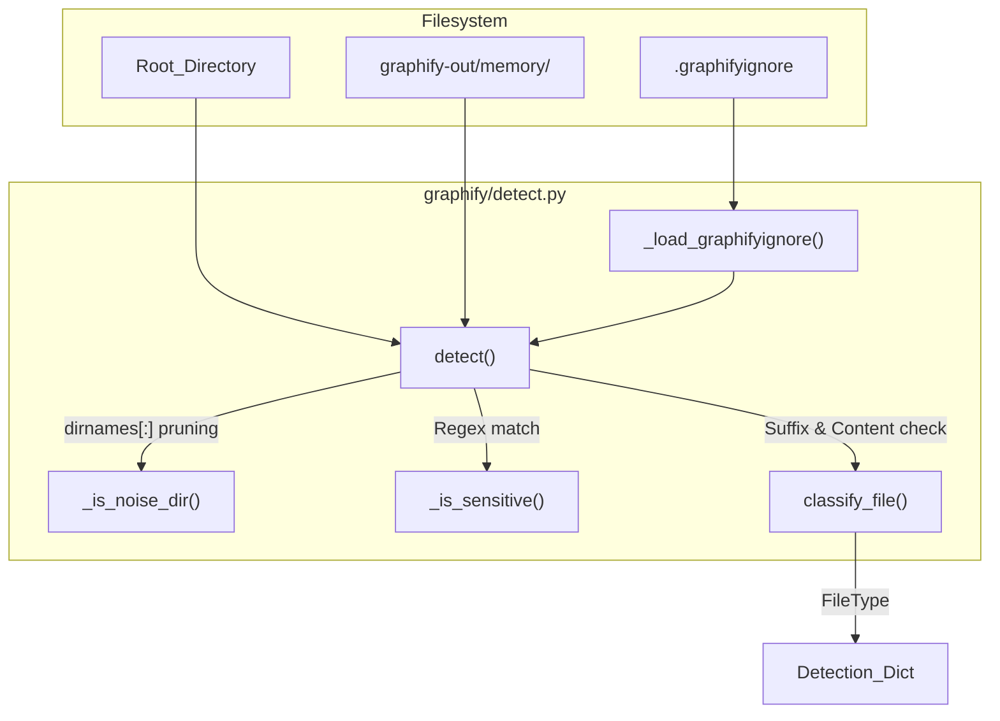
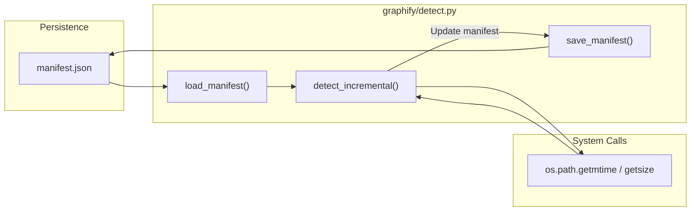

# 파일 감지 및 분류

관련 소스 파일

다음 파일들은 이 위키 페이지를 생성하기 위한 컨텍스트로 사용되었습니다.

- [docs/how-it-works.md](docs/how-it-works.md)
- [graphify/cache.py](graphify/cache.py)
- [graphify/detect.py](graphify/detect.py)
- [graphify/extract.py](graphify/extract.py)
- [graphify/google_workspace.py](graphify/google_workspace.py)
- [graphify/watch.py](graphify/watch.py)
- [tests/test_detect.py](tests/test_detect.py)
- [tests/test_google_workspace.py](tests/test_google_workspace.py)
- [tests/test_watch.py](tests/test_watch.py)

`graphify/detect.py` 모듈은 대상 디렉터리 안의 파일에 대한 초기 발견, 필터링, 분류를 담당합니다. 이 모듈은 파이프라인의 진입점 역할을 하며, 어떤 파일이 인덱싱할 가치가 있는지, 어떤 파일을 보안 또는 노이즈 이유로 무시해야 하는지, 그리고 코퍼스의 크기가 그래프 기반 분석을 정당화할 정도인지 판단합니다.

## 파일 발견 및 필터링

파일 발견은 `detect()` 함수가 처리합니다 [graphify/detect.py:155-231](). 이 함수는 `os.walk`를 사용해 루트 디렉터리를 재귀적으로 스캔하며, 노이즈, 민감한 데이터, 사용자 정의 ignore 패턴과 일치하는 파일을 무시하기 위한 특정 로직을 수행합니다.

### 노이즈 감소 및 Ignore 로직
그래프가 빌드 artifact나 의존성으로 어지럽혀지는 것을 방지하기 위해, `detect()`는 디렉터리 트리를 제자리에서 가지치기합니다 [graphify/detect.py:183-188]().
- **제외 디렉터리**: `node_modules`, `__pycache__`, `.git`, `venv`, `dist` 같은 일반 폴더는 건너뜁니다 [graphify/detect.py:134-141]().
- **프레임워크 캐시**: `.next`, `.nuxt`, `.turbo`, `.angular` 같은 특정 노이즈 디렉터리는 명시적으로 필터링됩니다 [graphify/detect.py:143-152]().
- **숨김 파일**: `.`으로 시작하는 파일(dotfiles)은 `graphify-out/memory/` 디렉터리 안에 있는 경우를 제외하고 건너뜁니다 [graphify/detect.py:201-206](). 이 우회는 `graphify remember` 명령이 실행 간에 합성 지식 노드를 지속할 수 있게 합니다.
- **.graphifyignore**: `_is_ignored()` helper [graphify/detect.py:124-131]()는 `_load_graphifyignore()` [graphify/detect.py:113-121]()를 통해 `.graphifyignore` 파일에서 로드한 패턴과 파일을 비교합니다. 이 검색은 스캔 디렉터리에서 위로 올라가며 `.git` 경계 또는 파일시스템 루트에 도달할 때까지 진행됩니다 [graphify/detect.py:117-120]().

### 보안 및 민감한 파일
`_is_sensitive()` helper [graphify/detect.py:137-146]()는 secret이 포함되었을 가능성이 있는 파일을 식별하고 건너뜁니다. 두 단계로 동작합니다.
1. **상위 디렉터리 검사**: `.ssh`, `.aws`, `secrets`, `credentials`라는 이름의 디렉터리 안에 있는 모든 파일을 건너뜁니다 [graphify/detect.py:97-99, 142-143]().
2. **파일명 패턴 일치**: `_SENSITIVE_PATTERNS`(regex 목록)를 사용해 `.env`, `.pem`, `id_rsa`와 `secret`, `token`, `passwd` 같은 키워드를 포착합니다 [graphify/detect.py:108-116, 145-146]().

**감지 데이터 흐름**
다음 다이어그램은 `detect()`가 파일시스템 및 내부 필터와 상호작용하는 방식을 보여줍니다.

Title: File Discovery Flow in detect.py

출처: [graphify/detect.py:97-116](), [graphify/detect.py:137-146](), [graphify/detect.py:113-121](), [graphify/detect.py:124-131](), [graphify/detect.py:134-152](), [graphify/detect.py:155-231]()

---

## 분류 및 휴리스틱

파일이 발견되면 `classify_file()`은 해당 파일에 `FileType` enum 값을 할당합니다 [graphify/detect.py:18-24, 116-143]().

| FileType | 확장자 | 참고 |
| :--- | :--- | :--- |
| `CODE` | `.py`, `.ts`, `.js`, `.go`, `.rs`, `.dart`, `.v`, `.sv`, `.dm`, `.csproj`, etc. | tree-sitter 추출기에서 지원합니다. shebang을 통해서도 감지합니다. [graphify/detect.py:19, 28]() |
| `DOCUMENT` | `.md`, `.mdx`, `.txt`, `.rst`, `.html`, `.yaml` | 일반 문서입니다. [graphify/detect.py:20, 29]() |
| `PAPER` | `.pdf` 또는 signal이 많은 `.md`/`.txt` | 학술 논문(ArXiv, 저널)입니다. [graphify/detect.py:21, 30, 149-152]() |
| `IMAGE` | `.png`, `.jpg`, `.jpeg`, `.gif`, `.webp`, `.svg` | 멀티모달 asset입니다. [graphify/detect.py:22, 31]() |
| `VIDEO` | `.mp4`, `.mov`, `.webm`, `.mp3`, `.wav`, etc. | 전사용 미디어 파일입니다. [graphify/detect.py:23, 33]() |

### Shebang 감지
확장자가 없는 파일의 경우 `_shebang_file_type()`은 처음 128바이트를 살펴봅니다 [graphify/detect.py:95-113](). interpreter(예: `python`, `node`, `bash`, `lua`)가 `_SHEBANG_CODE_INTERPRETERS` allowlist에 있으면 코드로 식별합니다 [graphify/detect.py:108-113]().

### 학술 논문 휴리스틱
`graphify`의 고유 기능 중 하나는 표준 문서와 학술 논문을 구분하는 능력입니다. `.md` 또는 `.txt` 파일을 만나면 `_looks_like_paper()`가 처음 3,000자를 스캔하여 학술적 신호를 찾습니다 [graphify/detect.py:149-152]().

최소 3개의 `_PAPER_SIGNALS` hit가 필요하며 [graphify/detect.py:134](), 여기에는 다음이 포함됩니다 [graphify/detect.py:119-133]().
- ArXiv ID(예: `1706.03762`)
- LaTeX 인용 패턴(`\cite{...}`)
- 번호가 매겨진 인용(`[1]`, `[23]`)
- 학술적 표현("we propose", "literature", "abstract")
- DOI 문자열 또는 journal/proceedings 언급.

### Office 및 Google Workspace 변환
`graphify`는 바이너리 또는 포인터 형식을 Markdown으로 변환하는 것을 지원합니다.
- **Office 보안**: 파싱하기 전에 `.docx` 및 `.xlsx` 파일은 zip-bomb 공격을 방지하기 위해 `_zip_within_caps()` [graphify/detect.py:57-92]()로 선별되며, 원시 바이트 상한 [graphify/detect.py:44]() 및 압축률 제한 [graphify/detect.py:46]()을 강제합니다.
- **DOCX/XLSX**: `docx_to_markdown()` 및 `xlsx_to_markdown()`은 텍스트 콘텐츠를 Markdown sidecar로 추출합니다 [graphify/detect.py:161-196, 199-226]().
- **Google Workspace**: `google_workspace_enabled()` [graphify/google_workspace.py:25-28]()를 통해 활성화된 경우, `convert_google_workspace_file()` 함수 [graphify/google_workspace.py:150-180]()는 `gws` CLI를 사용해 `.gdoc`, `.gsheet`, `.gslides` shortcut을 Markdown으로 export합니다.

출처: [graphify/detect.py:18-33](), [graphify/detect.py:44-46](), [graphify/detect.py:57-92](), [graphify/detect.py:119-134](), [graphify/detect.py:149-152](), [graphify/detect.py:161-226](), [graphify/google_workspace.py:25-28](), [graphify/google_workspace.py:150-180]()

---

## 코퍼스 상태 임계값

`graphify`는 감지 결과의 `warning` 필드를 통해 사용자 안내를 제공하기 위해 단어 수와 파일 수를 기반으로 코퍼스의 "health"를 계산합니다 [graphify/detect.py:219-230]().

- **하한(`CORPUS_WARN_THRESHOLD` = 50k words)**: 코퍼스가 이보다 작으면, `graphify`는 콘텐츠가 단일 LLM 컨텍스트 창에 들어갈 수도 있다고 경고합니다 [graphify/detect.py:35]().
- **상한(`CORPUS_UPPER_THRESHOLD` = 500k words)**: 추출 및 분석에 높은 토큰 비용이 발생할 수 있음을 경고합니다 [graphify/detect.py:36]().
- **파일 수(`FILE_COUNT_UPPER` = 500 files)**: 파일 수가 과도한 처리 시간으로 이어질 수 있으면 경고합니다 [graphify/detect.py:37]().

PDF의 단어 수는 `pypdf`를 통해 텍스트를 추출하여 추정하며 [graphify/detect.py:146-159](), 텍스트 파일은 `count_words()`의 단순 whitespace splitting으로 계산합니다 [graphify/detect.py:234-240]().

출처: [graphify/detect.py:35-37](), [graphify/detect.py:146-159](), [graphify/detect.py:219-230](), [graphify/detect.py:234-240]()

---

## 증분 감지 및 Manifest 관리

변경되지 않은 파일의 재처리를 피하기 위해 `graphify`는 manifest 기반 증분 시스템을 구현합니다. 이전 버전과의 호환성을 위해 `graphify/manifest.py`에 re-export shim이 존재합니다 [graphify/manifest.py:1-4]().

### Manifest 스키마
manifest는 `graphify-out/manifest.json`에 저장됩니다 [graphify/detect.py:26](). 파일 경로를 마지막으로 알려진 `mtime` 및 `size`에 매핑합니다.

### `detect_incremental()`
`detect_incremental()` 함수는 파일시스템의 현재 상태를 저장된 manifest와 비교합니다 [graphify/detect.py:268-295]().
1. `detect()`를 호출해 현재 파일 목록을 가져옵니다.
2. 각 파일의 `st_mtime` 및 `st_size`를 `load_manifest()` 데이터와 비교합니다.
3. `added`, `modified`, `deleted` 경로의 딕셔너리를 반환합니다.

**증분 업데이트 로직**
이 다이어그램은 `detect_incremental`이 물리 파일과 논리 manifest를 연결하는 방식을 보여줍니다.

Title: Incremental Detection Logic

출처: [graphify/detect.py:26](), [graphify/detect.py:243-265](), [graphify/detect.py:268-295](), [graphify/manifest.py:1-4]()

### 유틸리티 함수
- `save_manifest(files_list)`: 제공된 모든 경로의 현재 `mtime`과 `size`를 JSON manifest에 기록합니다 [graphify/detect.py:243-256]().
- `load_manifest()`: 디스크에서 저장된 manifest를 가져옵니다 [graphify/detect.py:259-265]().

출처: [graphify/detect.py:243-265](), [graphify/detect.py:268-295]()
